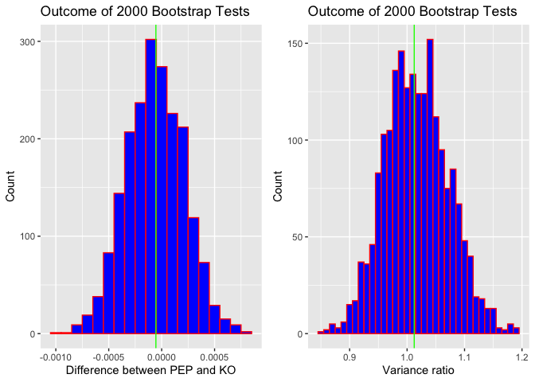
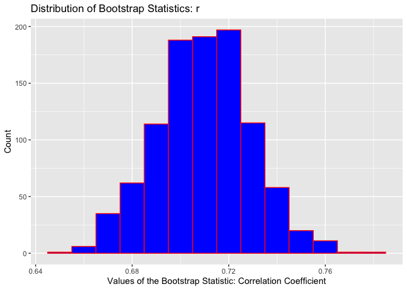

S&P500 Index Analysis
================
Andrii Voitkiv
October 18th, 2022

-   [Question 1](#question-1)
-   [Question 2](#question-2)

``` r
knitr::opts_chunk$set(fig.path='Figs/')
```

    ## Загрузка требуемого пакета: carData

    ## 
    ## Присоединяю пакет: 'dplyr'

    ## Следующие объекты скрыты от 'package:dbplyr':
    ## 
    ##     ident, sql

    ## Следующий объект скрыт от 'package:car':
    ## 
    ##     recode

    ## Следующие объекты скрыты от 'package:stats':
    ## 
    ##     filter, lag

    ## Следующие объекты скрыты от 'package:base':
    ## 
    ##     intersect, setdiff, setequal, union

    ## 
    ## Присоединяю пакет: 'EnvStats'

    ## Следующий объект скрыт от 'package:car':
    ## 
    ##     qqPlot

    ## Следующие объекты скрыты от 'package:stats':
    ## 
    ##     predict, predict.lm

    ## Следующий объект скрыт от 'package:base':
    ## 
    ##     print.default

    ## Загрузка требуемого пакета: ggplot2

    ## Загрузка требуемого пакета: ggstance

    ## 
    ## Присоединяю пакет: 'ggstance'

    ## Следующие объекты скрыты от 'package:ggplot2':
    ## 
    ##     GeomErrorbarh, geom_errorbarh

    ## Загрузка требуемого пакета: scales

    ## Загрузка требуемого пакета: ggridges

    ## 
    ## New to ggformula?  Try the tutorials: 
    ##  learnr::run_tutorial("introduction", package = "ggformula")
    ##  learnr::run_tutorial("refining", package = "ggformula")

    ## 
    ## Присоединяю пакет: 'lawstat'

    ## Следующий объект скрыт от 'package:car':
    ## 
    ##     levene.test

    ## Registered S3 method overwritten by 'mosaic':
    ##   method                           from   
    ##   fortify.SpatialPolygonsDataFrame ggplot2

    ## 
    ## The 'mosaic' package masks several functions from core packages in order to add 
    ## additional features.  The original behavior of these functions should not be affected by this.

    ## 
    ## Присоединяю пакет: 'mosaic'

    ## Следующий объект скрыт от 'package:Matrix':
    ## 
    ##     mean

    ## Следующий объект скрыт от 'package:scales':
    ## 
    ##     rescale

    ## Следующий объект скрыт от 'package:ggplot2':
    ## 
    ##     stat

    ## Следующий объект скрыт от 'package:EnvStats':
    ## 
    ##     iqr

    ## Следующие объекты скрыты от 'package:dplyr':
    ## 
    ##     count, do, tally

    ## Следующие объекты скрыты от 'package:car':
    ## 
    ##     deltaMethod, logit

    ## Следующие объекты скрыты от 'package:stats':
    ## 
    ##     IQR, binom.test, cor, cor.test, cov, fivenum, median, prop.test,
    ##     quantile, sd, t.test, var

    ## Следующие объекты скрыты от 'package:base':
    ## 
    ##     max, mean, min, prod, range, sample, sum

    ## 
    ## Присоединяю пакет: 'ggthemes'

    ## Следующий объект скрыт от 'package:mosaic':
    ## 
    ##     theme_map

    ## 
    ## Присоединяю пакет: 'olsrr'

    ## Следующий объект скрыт от 'package:datasets':
    ## 
    ##     rivers

    ## ------------------------------------------------------------------------------

    ## You have loaded plyr after dplyr - this is likely to cause problems.
    ## If you need functions from both plyr and dplyr, please load plyr first, then dplyr:
    ## library(plyr); library(dplyr)

    ## ------------------------------------------------------------------------------

    ## 
    ## Присоединяю пакет: 'plyr'

    ## Следующий объект скрыт от 'package:mosaic':
    ## 
    ##     count

    ## Следующие объекты скрыты от 'package:dplyr':
    ## 
    ##     arrange, count, desc, failwith, id, mutate, rename, summarise,
    ##     summarize

    ## 
    ## Присоединяю пакет: 'purrr'

    ## Следующий объект скрыт от 'package:plyr':
    ## 
    ##     compact

    ## Следующий объект скрыт от 'package:mosaic':
    ## 
    ##     cross

    ## Следующий объект скрыт от 'package:scales':
    ## 
    ##     discard

    ## Следующий объект скрыт от 'package:car':
    ## 
    ##     some

    ## 
    ## Присоединяю пакет: 'plotly'

    ## Следующие объекты скрыты от 'package:plyr':
    ## 
    ##     arrange, mutate, rename, summarise

    ## Следующий объект скрыт от 'package:mosaic':
    ## 
    ##     do

    ## Следующий объект скрыт от 'package:ggplot2':
    ## 
    ##     last_plot

    ## Следующий объект скрыт от 'package:stats':
    ## 
    ##     filter

    ## Следующий объект скрыт от 'package:graphics':
    ## 
    ##     layout

    ## 
    ## Присоединяю пакет: 'resampledata'

    ## Следующий объект скрыт от 'package:carData':
    ## 
    ##     Salaries

    ## Следующий объект скрыт от 'package:datasets':
    ## 
    ##     Titanic

    ## 
    ## Присоединяю пакет: 'SDaA'

    ## Следующий объект скрыт от 'package:plyr':
    ## 
    ##     ozone

    ## Следующий объект скрыт от 'package:ggplot2':
    ## 
    ##     seals

    ## 
    ## Присоединяю пакет: 'tidyr'

    ## Следующие объекты скрыты от 'package:Matrix':
    ## 
    ##     expand, pack, unpack

    ## 
    ## Присоединяю пакет: 'cowplot'

    ## Следующий объект скрыт от 'package:ggthemes':
    ## 
    ##     theme_map

    ## Следующий объект скрыт от 'package:mosaic':
    ## 
    ##     theme_map

    ## 
    ## Присоединяю пакет: 'reshape2'

    ## Следующий объект скрыт от 'package:tidyr':
    ## 
    ##     smiths

## Question 1

There are a number of reasons why to not work with the original
variables which are prices, but rather with transformations of the
variables such as logs, square roots, or other power transformations.
Many statistical methods work best when the data are normally
distributed or at least symmetrically distributed and have a constant
variance, and the transformed data will often exhibit less skewness and
a more constant variable compared to the original variables. In our
analysis we use log transformation of returns (ln(p1) - ln(p0) estimates
ln(p1/p0))

### Exploratory Data Analysis

``` r
# Read SP500 index data 
df_index <- read.csv("/Users/berg/DataspellProjects/MDSA-UofC/DATA602/00_project/data/sp500_index_602_v2.csv")
# Peek at data
print(colSums(is.na(df_index)))
```

    ##        Date       close        year       month         dom    day_name 
    ##           0           0           0           0           0           0 
    ##  month_name         dow         eom days_to_eom         wom     returns 
    ##           0           0           0           0           0           1 
    ## cum_returns    returns0 
    ##           1           1

``` r
head(df_index, 3)
```

    ##         Date   close year month dom  day_name month_name dow        eom
    ## 1 2012-09-10 1429.08 2012     9  10    Monday  September   0 2012-09-30
    ## 2 2012-09-11 1433.56 2012     9  11   Tuesday  September   1 2012-09-30
    ## 3 2012-09-12 1436.56 2012     9  12 Wednesday  September   2 2012-09-30
    ##   days_to_eom wom     returns cum_returns    returns0
    ## 1         -20   2          NA          NA          NA
    ## 2         -19   2 0.003129980 0.003129980 0.003134884
    ## 3         -18   2 0.002090506 0.005220486 0.002092692

``` r
tail(df_index, 3)
```

    ##            Date   close year month dom  day_name month_name dow        eom
    ## 2515 2022-09-07 3979.87 2022     9   7 Wednesday  September   2 2022-09-30
    ## 2516 2022-09-08 4006.18 2022     9   8  Thursday  September   3 2022-09-30
    ## 2517 2022-09-09 4067.36 2022     9   9    Friday  September   4 2022-09-30
    ##      days_to_eom wom     returns cum_returns    returns0
    ## 2515         -23   1 0.018174804    1.024218 0.018340971
    ## 2516         -22   2 0.006589013    1.030807 0.006610769
    ## 2517         -21   2 0.015155972    1.045963 0.015271406

``` r
# Drop first row with nans (returns, cumsreturns)
df_index = na.omit(df_index)
```

``` r
# Convert Date column from char to date type
df_index$Date <- as.Date(df_index$Date)
# Convert year (numeric) to char
df_index$year = as.character(df_index$year)
```

``` r
# Basic plot of timeseries prices
a = ggplot(df_index, aes(x=Date, y=close)) + 
  geom_line() + 
  #stat_smooth(size = 1, alpha = 0.5, method = "lm") +
  xlab("") + 
  ylab("Price") +
  ggtitle("S&P500 price from 2012 to 2022 years")

# Plot log returns 
b = ggplot(df_index, aes(x=Date, y=returns)) + 
  geom_line() + 
  xlab("") + 
  ylab("Log Daily Returns") + 
  ggtitle("")

plot_grid(a, b, align="v", ncol = 1, nrow = 2)
```

<!-- -->

``` r
ggsave(file="sp500price.png", width=7, height=7, dpi=300)
```

``` r
favstats(~returns, data = df_index)
```

    ##         min           Q1       median          Q3        max         mean
    ##  -0.1276521 -0.003507972 0.0006677019 0.005270995 0.08968316 0.0004157247
    ##         sd    n missing
    ##  0.0108538 2516       0

Despite the large random fluctuations in SP500 index returns, we can see
that series appears stationary, meaning that the nature of its random
variation is constant over time. In particular, the series fluctuates
about means that are constant, or nearly so.

``` r
df_index_sorted <- df_index[order(df_index$returns),]
head(df_index_sorted, 3)
```

    ##            Date   close year month dom day_name month_name dow        eom
    ## 1890 2020-03-16 2386.13 2020     3  16   Monday      March   0 2020-03-31
    ## 1888 2020-03-12 2480.64 2020     3  12 Thursday      March   3 2020-03-31
    ## 1885 2020-03-09 2746.56 2020     3   9   Monday      March   0 2020-03-31
    ##      days_to_eom wom     returns cum_returns    returns0
    ## 1890         -15   3 -0.12765214   0.5126419 -0.11984050
    ## 1888         -19   2 -0.09994485   0.5514857 -0.09511268
    ## 1885         -22   2 -0.07901039   0.6533183 -0.07596968

``` r
tail(df_index_sorted, 3)
```

    ##            Date   close year month dom day_name month_name dow        eom
    ## 1905 2020-04-06 2663.68 2020     4   6   Monday      April   0 2020-04-30
    ## 1889 2020-03-13 2711.02 2020     3  13   Friday      March   4 2020-03-31
    ## 1896 2020-03-24 2447.33 2020     3  24  Tuesday      March   1 2020-03-31
    ##      days_to_eom wom    returns cum_returns   returns0
    ## 1905         -24   1 0.06796823   0.6226777 0.07033130
    ## 1889         -18   2 0.08880836   0.6402941 0.09287119
    ## 1896          -7   4 0.08968316   0.5379668 0.09382766

``` r
# Boxplot returns: by Month 
month_names = c('January', 'February', 'March', 'April', 'May', 'June', 'July', 'August', 'September', 'October', 'November', 'December')
c = ggplot(data=df_index, aes(factor(x=month_name, levels = month_names), y=returns, color = month_name)) + 
  #geom_violin(fill='blue') + 
  geom_boxplot(width=0.2) + 
  ylab("") +
  xlab("") +
  ggtitle("S&P500 log daily returns: by month") + 
  coord_flip()

# Boxplot returns: by Day 
day_names = c('Monday', 'Tuesday', 'Wednesday', 'Thursday', 'Friday')
d = ggplot(data=df_index, aes(factor(x=day_name, levels = day_names), y=returns, color = day_name)) + 
  geom_violin(fill='blue') + 
  geom_boxplot(width=0.2) + 
  ylab("") +
  xlab("") +
  ggtitle("S&P500 log daily returns: by day") + 
  coord_flip()

plot_grid(c, d, align="v", ncol = 1, nrow = 2)
```

<!-- -->

``` r
ggsave(file="boxplots_seasonality.png", width=7, height=7, dpi=300)
```

``` r
# Heatmap 
ggplot(df_index, aes(year, month_name, fill= returns)) + 
  geom_tile()
```

<!-- --> \#\#\# Normality tests When
viewing a normal probability plot, it is often difficult to judge
whether any deviation from linearity is systematic or instead merely due
to sampling variation, so a statistical test of normality is useful. The
null hypothesis is that the sample comes from a normal distribution and
the alternative is that the sample is from a non-normal distribution.

The Shapiro–Wilk test uses the normal probability plot to test these
hypotheses. Specifically, the Shapiro–Wilk test is based on the
correlation between i/n quantiles of the sample and of the standard
normal distribution, respectively. Under normality, the correlation
should be close to 1 and the null hypothesis of normality is rejected
for small values of the correlation coefficient. In R, the Shapiro–Wilk
test can be implemented using the shapiro.test function.

``` r
shapiro.test(df_index$returns)
```

    ## 
    ##  Shapiro-Wilk normality test
    ## 
    ## data:  df_index$returns
    ## W = 0.85991, p-value < 0.00000000000000022

The null hypothesis of these tests is that “sample distribution is
normal”. If the test is significant, the distribution is non-normal.
From the output, the p-value &lt; 0.01 implying that the distribution of
the data is significantly different from normal distribution. In other
words, we can not assume the normality.

Finally, we want to know if the average of the returns is different from
zero (statistically). Thus, we perform a “t-test” as follows:

``` r
t.test(df_index$returns) 
```

    ## 
    ##  One Sample t-test
    ## 
    ## data:  df_index$returns
    ## t = 1.9212, df = 2515, p-value = 0.05482
    ## alternative hypothesis: true mean is not equal to 0
    ## 95 percent confidence interval:
    ##  -0.000008585553  0.000840034886
    ## sample estimates:
    ##    mean of x 
    ## 0.0004157247

In this case, we can not reject the null hypothesis (zero mean), as
P-value is 0.055 (&gt; 5%).

### Kernel density estimates of the daily log returns on the S&P 500 index

``` r
e = ggplot(df_index, aes(x=returns)) + 
  geom_histogram(binwidth=0.005) +
  ggtitle("Histogram")  

f = ggplot(df_index, aes(x=returns)) + 
  geom_density(color ="black", fill="steelblue", linetype = "dashed") +
  ggtitle("Density plot") 

plot_grid(e, f, align="v", ncol = 2, nrow = 1)
```

<!-- -->

``` r
ggsave(file="sp500densityhist.png", width=10, height=7, dpi=300)
```

``` r
g = ggplot(df_index, aes(x = returns, y = year, fill=year)) +
  geom_density_ridges() +
  ggtitle("S&P500 returns density plot: by year")

plot_grid(g, align="v", ncol = 1, nrow = 1)
```

    ## Picking joint bandwidth of 0.00225

<!-- -->

``` r
ggsave(file="densitybyyear.png", width=7, height=7, dpi=300)
```

### \# Normal curve over histogram of returns

``` r
h = ggplot(df_index, aes(x =returns)) + 
  geom_histogram(aes(y =..density..), colour = "black", fill = "white", binwidth = 0.005) +
  stat_function(fun = dnorm, args = list(mean = mean(df_index$returns), sd = sd(df_index$returns))) + # Normal curve
  ggtitle("Normal curve over histogram of S&P500 returns")

plot_grid(h, ncol = 1, nrow = 1)
```

<!-- -->

``` r
ggsave(file="normalcurve.png", width=7, height=7, dpi=300)
```

### QQ-plots

Many statistical models assume that a random sample comes from a normal
distribution. Normal probability plots are used to check this
assumption, and, if the normality assumption seems false, to investigate
how the distribution of the data differs from a normal distribution.
Systematic deviation of the plot from a straight line is evidence of
nonnor- mality.

``` r
i = ggplot(df_index, aes(sample=returns)) + 
  stat_qq(col="blue", distribution = qnorm) + 
  stat_qqline(col="red", distribution = qnorm) + 
  ggtitle("Normal Probability Plot of Log Daily Returns: SP500 Index")

plot_grid(i, ncol = 1, nrow = 1)
```

<!-- -->

``` r
ggsave(file="sp500qqplot.png", width=7, height=7, dpi=300)
```

The curve is concave on the left and convex on the right. QQ-plot
indicates, respectively, left skewness, right skewness, heavy tails
(compared to the normal distribution). By the tails of a distribution is
meant the regions far from the center.

The distribution is outlier-prone, meaning that the extreme observations
on both the left and right sides are significantly more extreme than
they would be for a normal distribution. It is a general property of the
t-distribution that the tails become heavier as the degrees-of-freedom
parameter decreases and the distribution approaches the normal
distribution as the degrees of freedom approaches infinity. Heavy-tailed
distributions with little or no skewness are common in finance and, the
*t-distribution is a reasonable model* for index returns.

``` r
j =ggplot(df_index, aes(sample=returns)) + 
  stat_qq(col="blue", distribution = qt, dparams = 2) + 
  stat_qqline(col="red", distribution = qt, dparams = 2) + 
  ggtitle("df = 2")

k= ggplot(df_index, aes(sample=returns)) + 
  stat_qq(col="blue", distribution = qt, dparams = 3) + 
  stat_qqline(col="red", distribution = qt, dparams = 3) + 
  ggtitle("df = 3")

l =ggplot(df_index, aes(sample=returns)) + 
  stat_qq(col="blue", distribution = qt, dparams = 5) + 
  stat_qqline(col="red", distribution = qt, dparams = 5) + 
  ggtitle("df = 5")

plot_grid(j, k, l, ncol = 3, nrow = 1)
```

<!-- -->

``` r
ggsave(file="tplots.png", width=10, height=7, dpi=300)
```

It is worthwhile to keep in mind that the historical data have more
extreme outliers than a t-distribution. There are two reasons why the
t-model does not give a credible probability of a negative return as
extreme as in March 2020. First, the t-model is symmetric, but the
return distribution appears to have some skewness in the extreme left
tail, which makes extreme negative returns more likely than under the
t-model. Second, the t-model assumes constant conditional volatility,
but volatility was usually high in March 2020 (see plot returns).

##################################################################################################################################################### 

## Question 2

``` r
# Read SP500 index data 
df_stock_returns <- read.csv("/Users/berg/DataspellProjects/MDSA-UofC/DATA602/00_project/data/sp500_stocks_returns_602.csv")
df_stock_cum_returns <- read.csv("/Users/berg/DataspellProjects/MDSA-UofC/DATA602/00_project/data/sp500_stocks_cumreturns_602.csv")
```

``` r
# Convert Date column from char to date type
df_stock_returns$Date <- as.Date(df_stock_returns$Date)
df_stock_cum_returns$Date <- as.Date(df_stock_cum_returns$Date)
```

``` r
symbols = c("PEP", "KO", "XOM", "CVX", "MSFT", "AAPL", "V", "MA")
df_stock_cum_returns_sub = df_stock_cum_returns[,c("Date", symbols)]

#melt data frame into long format
df_stock_cum_returns_melt <- melt(df_stock_cum_returns_sub ,  id.vars = 'Date', variable.name = 'series')
```

``` r
# Plot series
m = ggplot(df_stock_cum_returns_melt, aes(Date, value), na.rm=TRUE) +
  geom_line(aes(colour = series)) +
  ylab("Cummulative returns") + 
  xlab("")

plot_grid(m, ncol = 1, nrow = 1)
```

    ## Warning: Removed 16 row(s) containing missing values (geom_path).

<!-- -->

``` r
ggsave(file="stocksts.png", width=10, height=7, dpi=300)
```

This time, we want to see how correlated these returns are on a daily
basis.

``` r
cor_matrix = cor(na.omit(df_stock_returns[, symbols]))
cor_matrix
```

    ##            PEP        KO       XOM       CVX      MSFT      AAPL         V
    ## PEP  1.0000000 0.7102439 0.3923810 0.3951931 0.4889682 0.3992099 0.4451504
    ## KO   0.7102439 1.0000000 0.4555481 0.4601172 0.4266665 0.3500878 0.4490066
    ## XOM  0.3923810 0.4555481 1.0000000 0.8337852 0.3770320 0.3310620 0.4420956
    ## CVX  0.3951931 0.4601172 0.8337852 1.0000000 0.4185843 0.3568863 0.4673546
    ## MSFT 0.4889682 0.4266665 0.3770320 0.4185843 1.0000000 0.5883075 0.5583753
    ## AAPL 0.3992099 0.3500878 0.3310620 0.3568863 0.5883075 1.0000000 0.4838209
    ## V    0.4451504 0.4490066 0.4420956 0.4673546 0.5583753 0.4838209 1.0000000
    ## MA   0.4485192 0.4686299 0.4636053 0.4819508 0.5702065 0.5170416 0.8486198
    ##             MA
    ## PEP  0.4485192
    ## KO   0.4686299
    ## XOM  0.4636053
    ## CVX  0.4819508
    ## MSFT 0.5702065
    ## AAPL 0.5170416
    ## V    0.8486198
    ## MA   1.0000000

The result is a matrix that lists all the possible pairwise
correlations. It is comforting to see that the PEP returns are
correlated with themselves. The PEP and KO returns appear to be
positively correlated. How confident are we that the correlation between
PEP and KO is indeed 0.71?

``` r
# Melt
melted_cor_matrix = melt(cor_matrix)
# Plot
n = ggplot(data = melted_cor_matrix, aes(x=Var1, y=Var2, fill=value)) + 
  geom_tile() +
  scale_fill_gradient2(low = "blue", high = "red", mid = "white", midpoint = 0.5, limit = c(0,1), # ATTENTION! only positive correlations
                       space = "Lab", name="Pearson\nCorrelation") +
  theme_minimal() +
  coord_fixed() +
  xlab("") +
  ylab("")

plot_grid(n, ncol = 1, nrow = 1)
```

<!-- -->

``` r
ggsave(file="cor.png", width=7, height=7, dpi=300)
```

### PEPSI VS COCA-COLA: linear regression

``` r
symbol1 = "KO"
symbol2 = "PEP"

pepsicola = na.omit(df_stock_returns[,c("Date", symbol1, symbol2)])
```

``` r
df_stock_cum_returns_pepco = df_stock_cum_returns[,c("Date", c(symbol1, symbol2))]
#melt data frame into long format
df_stock_cum_returns_pepco_melt <- melt(df_stock_cum_returns_pepco ,  id.vars = 'Date', variable.name = 'symbols')
# Plot series
o = ggplot(df_stock_cum_returns_pepco_melt, aes(Date, value), na.rm=TRUE) +
  geom_line(aes(colour = symbols)) +
  ylab("Cummulative returns") + 
  xlab("")
#------------------------------------
# long fatagrame
df_stock_returns_melt = melt(df_stock_returns[, c("Date",symbol1, symbol2)] ,  id.vars = 'Date', variable.name = 'symbols')
# Plot boxplots
p = ggplot(df_stock_returns_melt, aes(x = symbols, y = value)) +            
  geom_boxplot() +
  ylab("returns")

plot_grid(o, p, ncol = 2, nrow = 1)
```

    ## Warning: Removed 4 row(s) containing missing values (geom_path).

    ## Warning: Removed 24 rows containing non-finite values (stat_boxplot).

<!-- -->

``` r
ggsave(file="pepco.png", width=10, height=5, dpi=300)
```

### Tests if there is difference between two populations

``` r
diff_obs = mean(pepsicola[,symbol1]) - mean(pepsicola[,symbol2])
diff_obs
```

    ## [1] -0.00005449945

``` r
ntimes = 2000
means_pep = numeric(ntimes)
means_ko = numeric(ntimes)
diff_mean = numeric(ntimes)
division_sd = numeric(ntimes)
for(i in 1:ntimes){  
      means_pep[i] = mean(sample(pepsicola[, symbol1], nrow(pepsicola), replace=TRUE))
      means_ko[i] = mean(sample(pepsicola[, symbol2], nrow(pepsicola), replace=TRUE))
      diff_mean[i] = means_pep[i] - means_ko[i]
      division_sd[i] = sd(sample(pepsicola[, symbol1], nrow(pepsicola), replace=TRUE)) / sd(sample(pepsicola[, symbol2], nrow(pepsicola), replace=TRUE))
}

boot_df = data.frame(means_pep, means_ko, diff_mean, division_sd)
```

95% boot conf interval of difference of means of two populations

``` r
qdata(~diff_mean, c(0.025, 0.975), data=boot_df)
```

    ##          2.5%         97.5% 
    ## -0.0005951095  0.0004592381

t-test

``` r
t.test(pepsicola[, symbol1], pepsicola[, symbol2], conf.level = 0.95)$conf
```

    ## [1] -0.0005957798  0.0004867809
    ## attr(,"conf.level")
    ## [1] 0.95

Plot distribution of difference of means of two populations

``` r
q = ggplot(boot_df, aes(x = diff_mean)) + 
  geom_histogram(col="red", fill="blue", binwidth=0.0001) + 
  xlab("Difference between PEP and KO") + 
  ylab("Count") + 
  ggtitle("Outcome of 2000 Bootstrap Tests") + 
  geom_vline(xintercept = diff_obs, col="green")

r = ggplot(boot_df, aes(x = division_sd)) + 
  geom_histogram(col="red", fill="blue", binwidth=0.01) + 
  xlab("Variance ratio") + 
  ylab("Count") + 
  ggtitle("Outcome of 2000 Bootstrap Tests") + 
  geom_vline(xintercept = sd(pepsicola[, symbol1]) / sd(pepsicola[, symbol2]), col="green")

plot_grid(q,r, ncol = 2, nrow = 1)
```

<!-- -->

``` r
ggsave(file="bootmeans.png", width=7, height=7, dpi=300)
```

95% boot conf interval of difference of means of two populations

``` r
qdata(~division_sd, c(0.025, 0.975), data=boot_df)
```

    ##      2.5%     97.5% 
    ## 0.9154703 1.1281138

### Linear regression

``` r
s = ggplot(data=pepsicola, aes(x = PEP, y = KO)) + 
  geom_point(size=2, position="jitter", color="blue") + 
  geom_smooth(method="lm", col="red") +
  xlab("PEP returns") + 
  ylab("KO returns") + 
  ggtitle("")

plot_grid(s, ncol = 1, nrow = 1)
```

    ## `geom_smooth()` using formula 'y ~ x'

<!-- -->

``` r
ggsave(file="lr.png", width=7, height=7, dpi=300)
```

From this scatterplot we can see a pattern that runs from lower-left to
upper-right, meaning positive relationship. The form appears to be as a
cloud of points stretched out in a generally consistent, straight form,
although some points stray away from it. Regarding the strength of the
relationship, the points cluster somewhat tightly, occasioanlly vague.
Also, there are some outliers standing away from the overall pattern.

``` r
qqplot(pepsicola$KO, pepsicola$PEP)
```

<!-- --> QQ plot comparing the returns
from these two companies.

``` r
predict_stock = lm(KO ~ PEP, data=pepsicola)
predict_stock$coefficients
```

    ##   (Intercept)           PEP 
    ## 0.00006837328 0.71906802557

Expected(KO Return) = 0.00006837328 + 0.71906802557 \* PEP Return

A positive coefficient beta (slope) that is approx equal to 0.72
indicates that as the return of the Pepsi increases let’s say 1%, the
mean return of KO also tends to increase by 0.72%.

Using this **Analysis Of Variance** approach, the value of FObs serves
as the test statistic to test H0: slope = 0, Ha: slope not equal to 0

``` r
summary(aov(predict_stock))
```

    ##               Df Sum Sq Mean Sq F value              Pr(>F)    
    ## PEP            1 0.1978 0.19779    3243 <0.0000000000000002 ***
    ## Residuals   3186 0.1943 0.00006                                
    ## ---
    ## Signif. codes:  0 '***' 0.001 '**' 0.01 '*' 0.05 '.' 0.1 ' ' 1

There are **two conditions** upon which the model building that we have
began are built upon.

1.  The y-variable, or commonly known as the response variable, is
    Normally distributed with a mean mu and standard deviation of
    sigma - *normality of the residuals*

2.  For each distinct value of the x-variable (the predictor variable),
    the y variable has the same standard deviation sigma -
    *homoscedasticity*

``` r
# Check normality of residuals
model_predicted = predict_stock$fitted.values #place the predicted values of KO returns for each observed PEP return
model_residuals = predict_stock$residuals
assumptions_df = data.frame(model_predicted, model_residuals)

# qq plot
t = ggplot(assumptions_df, aes(sample = model_residuals)) +  
  stat_qq(col='blue') + 
  stat_qqline(col='red') + 
  ggtitle("Normal Probability Plot of Residuals")

# Check homoscedasticity
u = ggplot(assumptions_df, aes(x = model_predicted, y = model_residuals)) +  
  geom_point(size=2, col='blue', position="jitter") + 
  xlab("Predicted % return of KO") + 
  ylab("Residuals") + 
  ggtitle("Plot of Fits to Residuals") + 
  geom_hline(yintercept=0, color="red", linetype="dashed")

plot_grid(t, u, ncol = 1, nrow = 2)
```

<!-- -->

``` r
ggsave(file="norrmalitytests.png", width=7, height=10, dpi=300)
```

From qq-plot the points appear in a strainght line and follow the
diagonal line. This suggests normality.

The scatterplot of residuals doesn’t appear to have any shape, pattern
or direction. The points appear fairly uniformly scattered about the
flat dotted line (zero line). This suggests homoscedasticity.

The null hypothesis about the slope (beta) is that it equals to 0. It
means that KO stock returns doesn’t tend to change linearly when PEP
changes - there is no linear association between the two variables. Ha:
there is a linear association.

``` r
coef(summary(predict_stock))
```

    ##                  Estimate   Std. Error    t value  Pr(>|t|)
    ## (Intercept) 0.00006837328 0.0001384206  0.4939531 0.6213733
    ## PEP         0.71906802557 0.0126265543 56.9488719 0.0000000

Nearly 57 standard errors from the hypothesyzed value (beta = 0)
certainly seems big. The P-value 0 confirms that t-ratio this large
would be unlikely to occur if the true slope were zero. Reject null
hypothesis and conclude that there a positive linear relationship
between stocks.

``` r
confint(predict_stock, conf.level=0.95)
```

    ##                     2.5 %       97.5 %
    ## (Intercept) -0.0002030292 0.0003397757
    ## PEP          0.6943110287 0.7438250225

As beta (slope) may vary for another sample of data, so we are 95%
confident to say that the true slope varies somewhere between 0.6943 to
0.7438. That suggests if PEP will increase 1%, we expect KO stock to
increase somewhere between 0.69% to 0.74%.

``` r
nsims = 1000 
cor = numeric(nsims) 
nsize = nrow(pepsicola)
for(i in 1:nsims)
{   
    index = sample(nsize, replace=TRUE)  
    sample = pepsicola[index, ] #accesses the i-th row of the pepsicola data frame
    cor[i] = cor(~KO, ~PEP, data=sample) # correlation for bootstrap sample
}

boot_df = data.frame(cor)
```

Plot distribution of bootstrap statistics r (correlation)

``` r
v = ggplot(boot_df, aes(x = cor)) + 
  geom_histogram(col="red", fill="blue", binwidth=0.01) + 
  xlab("Values of the Bootstrap Statistic: Correlation Coefficient") + 
  ylab("Count") + 
  ggtitle("Distribution of Bootstrap Statistics: r")

plot_grid(v, ncol = 1, nrow = 1)
```

<!-- -->

``` r
ggsave(file="bootcor.png", width=7, height=7, dpi=300)
```

``` r
qdata(~cor, c(0.025, 0.975), data=boot_df)
```

    ##      2.5%     97.5% 
    ## 0.6705853 0.7478281

From this data, we are 95% confident, that the true value of correlation
is between 0.67 and 0.74.

### Calculate the spread

``` r
slope = as.numeric(predict_stock$coefficients[2])
pepsicola$spread = pepsicola$KO - slope * pepsicola$PEP  
pepsicola$cumspread = cumsum(pepsicola$spread)
```

Plot spread

``` r
w = ggplot(pepsicola, aes(Date, cumspread), na.rm=TRUE) +
  geom_line() +
  ylab("Spread") + 
  xlab("") +
  ggtitle("Spread = KO - slope * PEP")

plot_grid(w, ncol = 1, nrow = 1)
```

<!-- -->

``` r
ggsave(file="spread.png", width=10, height=7, dpi=300)
```

New unseen by model data

``` r
pepco_test <- na.omit(read.csv("/Users/berg/DataspellProjects/MDSA-UofC/DATA602/00_project/data/pepco_returns.csv"))
```

``` r
pepco_model = function(pepreturns){
  ko_returns = 0.00006837328 + 0.71906802557 * pepreturns
  return(ko_returns)}

KO_predicted = pepco_model(pepco_test$PEP) # apply model
pepco_test = data.frame(pepco_test, KO_predicted) # add to df
```

How good is our model

``` r
# Mean Square Error
pepco_test$diff = pepco_test$KO - pepco_test$KO_predicted 
pepco_test$diff_square = pepco_test$diff **2

# MSE
mse = sum(pepco_test$diff_square) / nrow(pepco_test)

# R-squared
r_squared = cor(pepco_test$KO, pepco_test$KO_predicted)^2

cat("R-squared:", r_squared, "\n")
```

    ## R-squared: 0.807193

``` r
cat("MSE:", mse, "\n")
```

    ## MSE: 0.00005320894

R-squared is a regression error metric that justifies the performance of
the model. It represents the value of how much the independent variables
are able to describe the value for the response/target variable. In our
case it is approx 81% - very high.

``` r
pepco_melt = melt(pepco_test[, c("ix","KO_predicted", "KO")] ,  id.vars = 'ix', variable.name = 'series')

x = ggplot(data=pepco_melt, aes(x = ix, y = value, color=series)) + 
  geom_point(size=2) + 
  xlab("") + 
  ylab("Returns") + 
  ggtitle("How good is our model?")

plot_grid(x, ncol = 1, nrow = 1)
```

<!-- -->

``` r
ggsave(file="goodfit.png", width=7, height=7, dpi=300)
```

------------------------------------------------------------------------

Quantile–quantile plots are useful not only for comparing a sample with
a theoretical model, as above, but also for comparing two samples. If
the two samples have the same sizes, then one need only plot their order
statistics against each other. Otherwise, one computes the same sets of
sample quantiles for each and plots them. This is done automatically
with the R command qqplot.

a sample is a good representative of the population, and we can simulate
sampling from the population by sampling from the sample, which is
called resampling. Why with replacement? The reason is that only
sampling with replacement gives independent observations, and we want
the resamples to be i.i.d. just as the original sample. In fact, if the
resamples were drawn without replacement, then every resample would be
exactly the same as the original sample, so the resamples would show no
random variation. This would not be very satisfactory, of course.

Suppose one wants to test the null hypothesis that the two populations
have the same means against a two-sided alternative. The transformed
data satisfy the assumptions of the t-test that the two populations are
normally distributed with the same variance, but of course the original
data do not meet these assumptions. Two-sided independent-samples
t-tests have p-values of 0.105 and 0.00467 using the original data and
the log-transformed data, respectively. These two p-values lead to
rather different conclusions, for the first test that the means are not
significantly different and for the second test that the difference is
highly significant. The first test reaches an incorrect conclusion
because its assumptions are not met.

The previous example illustrates some general principles to keep in
mind. All statistical estimators and tests make certain assumptions
about the dis- tribution of the data. One should check these
assumptions, and graphical methods are often the most convenient way to
diagnose problems. If the as- sumptions are not met, then one needs to
know how sensitive the estimator or test is to violations of the
assumptions. If the estimator or test is likely to be seriously degraded
by violations of the assumption, which is called nonro- bustness, then
there are two recourses. The first is to find a new estimator or test
that is suitable for the data. The second is to transform the data so
that the transformed data satisfy the assumptions of the original test
or estimator.
