Assignment 1
================

-   [Problem 1](#problem-1)
-   [Problem 2](#problem-2)
-   [Problem 3](#problem-3)
-   [Problem 4](#problem-4)
-   [Problem 5](#problem-5)
-   [Problem 6](#problem-6)
-   [Problem 7](#problem-7)
-   [Problem 8](#problem-8)
-   [Problem 9](#problem-9)
-   [Problem 10](#problem-10)
-   [Problem 11](#problem-11)

``` r
knitr::opts_chunk$set(fig.path='Figs/')
```

## Problem 1

A recent study1 of college graduates in the United states discovered
that approximately 60% of degree holders would “change their majors if
they could go back to school” and re-do their undergraduate degree.
Let’s presume this proportion also holds for Canadian undergraduate
university degree holders.

One randomly selects two Canadians who hold an undergraduate degree.

``` r
p = 0.6
q = 1 - p
```

### A

both would change their undergraduate major (if they had the ability for
a re-do).

**Answer**

Selecting randomly two Canadians are two *independent events* - the
occurrence of one event (pick up first Canadian) does not affect the
occurrence of the other event (pick up second Canadian)

``` r
p * p
```

    ## [1] 0.36

### B

neither would change their undergraduate major (if they had the ability
for a re-do).

``` r
q * q
```

    ## [1] 0.16

### C

at least one of the two would change their undergraduate major (if they
had the ability for a re-do).

**Answer**

“at least one of the two would change…” means:

1.  first can change (p), second don’t change (q) *or*

2.  first don’t change (q), second change (p)

``` r
p * q + q * p
```

    ## [1] 0.48

### D

Suppose you are to randomly pick n-Canadians with undergraduate degrees
in such a way that the probability of at least one of them would change
their undergraduate degree is 0.95. Compute the minimum number of
Canadians with undergraduate degrees you would have to randomly select.
In other words, compute the sample size n. (Hint: ln(ab)=b∗ln(a)…)

**Answer**:

1.  “probability of at least one of them…” means the probability of one,
    two, three etc.

2.  Complement event is *no one* of them. P(at lest one of them) = 1 -
    P(no one of them).

3.  Probability (not changing degree) = q = 1 - p. 

4.  1 - q^n = 0.95 –&gt; n = ln(0.05)/ln(q)

5.  Round up to the next whole Canadian (to cross the threshold)

``` r
ceiling(log(0.05)/log(q))
```

    ## [1] 4

## Problem 2

### Step 1,2

``` r
nsims = 1000  
outcome = numeric(nsims)
for(i in 1:nsims){ 
    outcome[i] = sample(c(1,2,3,4,5,6), 1, replace=FALSE) 
}  
simresult = data.frame(outcome) 
head(simresult,2) 
```

    ##   outcome
    ## 1       5
    ## 2       2

### Step 3

Below you will create histogram that displays the result of your 1000
simulated tosses of the fair die. After you create this data
visuaulization, take particular notice of the distribution of the
outcome of each number 1 through 6.

**Answer**:

Theoretically, the chance of each side of the dice is equal. But due to
randomness, we observe that number of occurrences slightly differs.

``` r
library(ggplot2)
ggplot(data=simresult, aes(x = outcome)) + 
  geom_histogram(binwidth=1, col="red", fill='blue') + 
  ggtitle("Frequency Histogram of 1000 simulated Coin Tosses")
```

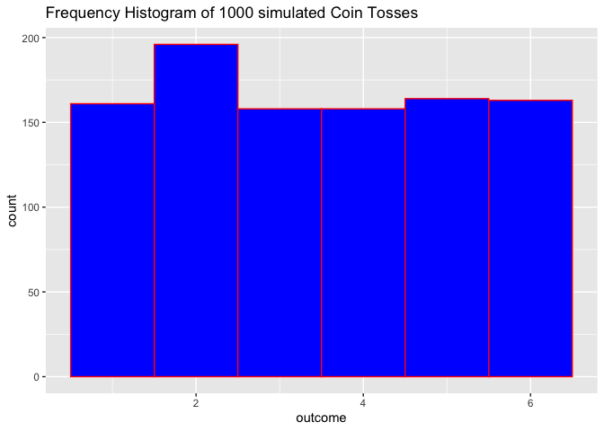<!-- -->

### Step 4

``` r
nsims = 3000
outcome = numeric(nsims)
fivesix = numeric(nsims)

for(i in 1:nsims){ 
    outcome[i] = sample(c(1,2,3,4,5,6), 1, replace=FALSE)
    fivesix[i] = if (outcome[i] == 5 || outcome[i] == 6) 1 else 0
}  
simresult = data.frame(outcome) 
# head(simresult,2) 
```

### Question for Problem 2

Rather than a single trial result from the outcome of a simulated die
toss, suppose a trial consisted of the three die tosses. An element in
the sample space oi=(toss1,toss2,toss3). Moreover, on each trial you
wish to observe if the sum of the three tosses is 14 or more. For
example, a (5,6,3) outcome sums to 14 and satisifed the condition
sum≥14. You wish to estimate the probability of observing a sum of 14 or
more when three fair die are tossed. Run 3000 simulations.

``` r
nsims = 3000
outcome = numeric(nsims)
sum14 = numeric(nsims)

for(i in 1:nsims){ 
    outcome[i] = list(sample(c(1,2,3,4,5,6), 3, replace=TRUE)) # sample three with replacement equivalent to three independent die tosses
}  
simresult = as.data.frame(t(data.frame(outcome))) # after transpose it's matrix, change to data.frame
rownames(simresult) = 1:nrow(simresult) # change index names of rows

simresult$total = rowSums(simresult[,c(1,2,3)]) # create sum of outcomes column
p_sum14 = dim(simresult[simresult$total >= 14, ])[1] / dim(simresult)[1] # calculate probability by dividing nrows that satisfy condition by total nrows
p_sum14
```

    ## [1] 0.157

## Problem 3

### A

Compute the probability your hand will consist of a 10, Jack, Queen,
King, and Ace of the same suit.

**Answer**

1.  Choose one suit out of four (),

2.  than choose five different values from possible five values (only
    one way to do this).

3.  Divide by all combinations of five cards out of twenty to find out
    probability

``` r
choose(4, 1) * choose(5, 5) / choose(20, 5)
```

    ## [1] 0.0002579979

### B

Compute the probability that you get a three-of-a-kind.

**Answer**

1.  Choose the value of the three of a kind (one value out of five
    possible),

2.  Choose three out of four for this value,

3.  Choose the two cards that left to complete the “hand” out of 16
    possible (20 cards - 4 for the first value)

``` r
choose(5, 1) * choose(4, 3) * choose(16, 2) / choose(20, 5) 
```

    ## [1] 0.1547988

### C

Compute probability that one observes two Aces and two ♢’s **Answer**

To observe two diamonds and two aces there are two possible ways:

1.  an *ace is a diamond* and a random card is a diamond:

-   Choose Ace diamond - one way to do this

-   Choose another random ace out of three that left

-   Choose one more diamond out of four that left (5 diamond cards - 1
    ace diamond)

-   Choose two more cards out of 12 that left (20 cards - 4 aces (we
    don’t want to observe any more aces ) - 5 diamonds + 1 ace diamond
    that is an intersection)

1.  there is *no ace diamond among two aces* (then there shold be two
    diamonds for random cards)

-   Choose two aces out of three (exclude ace diamond in this
    configuration)

-   Choose two diamond cards out of four diamonds (5 diamonds - 1 ace
    diamond)

-   Choose one more card out of 12 that left to complete the hand

``` r
ace_is_diamond = 1 * choose(3, 1) * choose(4, 1) * choose(12, 2)
ace_is_not_diamond = choose(3, 2) * choose(4, 2) * choose(12, 1)
p = (ace_is_diamond + ace_is_not_diamond) / choose(20, 5) 
p
```

    ## [1] 0.06501548

## Problem 4

**Answer**

Used *conditional probability *

``` r
p_AA = 0.15
p_UA = (1 - p_AA) / 4
p_D = 3 * p_UA
print(paste("Test: Total prob is", p_AA + p_UA + p_D))
```

    ## [1] "Test: Total prob is 1"

``` r
p_AA_miss = 0.15
p_UA_miss = 0.3
p_D_miss = 0.1
p_UA_cond_miss = p_UA * p_UA_miss / (p_UA * p_UA_miss + p_AA * p_AA_miss + p_D * p_D_miss)
p_UA_cond_miss
```

    ## [1] 0.425

## Problem 5

A random variable X has the following probability distribution function

``` r
xvalues = c(0:15)
f = function(x){2/(3^{x+1})}
px = f(xvalues)
```

### A

Using R Studio, create a display that shows the probability distribution
of this particular random variable X.For values of x, use xvalues =
0:15.

``` r
plot(xvalues, px, type="h", col="blue")
```

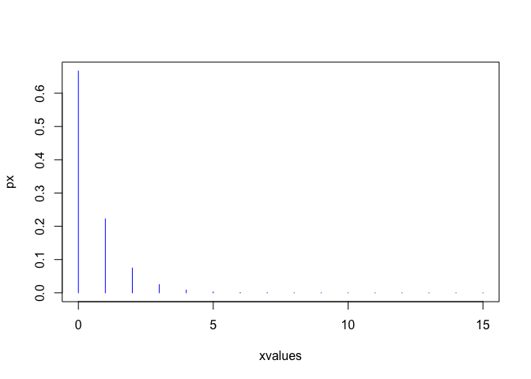<!-- -->

### B

How likely is it to observe values beyond 3? Compute.

**Answer**

1.  Beyond 3 means more than 3 - start with 4 (including)

2.  4th value is indexed 5th as values start from 0 and indexes from 1

``` r
print(sum(px[5:16])) # more than 3, sum from 4 inclusive (indexed from 0)
```

    ## [1] 0.01234566

### C

Compute the mean or expected value of X, E(X) or μX. (Hint: In computing
E(X), change the upper limit on xvalues from 15 to 100…)

``` r
xvalues = c(0:100)
px = f(xvalues)
ex = sum(xvalues * px) # expected value or mean is weighted sum
ex
```

    ## [1] 0.5

### D

Compute the standard deviation of X, SD(X) or σX. (use the same values
of x as you did in part (c))

``` r
moment2 = sum(xvalues^{2}*px)
var = moment2 - ex^{2}
std = sqrt(var)
std
```

    ## [1] 0.8660254

### E

Consider the interval (μX−σX,μX+σX). Compute P(μX−σX&lt;X&lt;μX+σX).

``` r
lower = ex - std
upper = ex + std
print(lower)
```

    ## [1] -0.3660254

``` r
print(upper)
```

    ## [1] 1.366025

``` r
sum(px[1:2]) # find sum of 0 and 1 xvlaues
```

    ## [1] 0.8888889

## Problem 6

### A

How likely is this outcome? Compute.

**Answer**: The 35 successes out of 50 with this probability of our
population 40% is *negligible*

``` r
p = 0.4
n = 50
m = 35
x = c(0:n)
px = dbinom(x, n, p)
dbinom(35, n, p) # probability of 35 successes 
```

    ## [1] 1.249428e-05

``` r
# plot(x, px, type="h", col="blue")
```

### B

From your computation in part (a), what do you think of the “40%
statistic” quoted above is accurate? Ensure you use probability theory
in your explanation.

**Answer**

1.  Probability of seeing 35 “successes” and more is negligible

2.  Num of successes from this sample should be somewhere around 20 -
    the expected value of distribution with 40% statistic

3.  Our sample result is 30 standard deviations away from what was
    expected

4.  *Conclusion*: statistic of 40% looks not adequate and should be
    higher

``` r
p35 = 1 - pbinom(34, n, p) # prob of 35 and more
mean = n * p
std = sqrt(p*(1-p))
z = (m - mean) / std
print(p35)
```

    ## [1] 1.708994e-05

``` r
print(mean)
```

    ## [1] 20

``` r
print(std)
```

    ## [1] 0.4898979

``` r
print(z)
```

    ## [1] 30.61862

### C

Suppose you are to randomly inspect n-Canadians aged 18 to 34 on this
issue until you find the 10th to say “no sympathies” for people involved
in the trucker conveys/protests. Compute the probability that n=30.

**Answer**

1.  The process of choosing Canadians is a random experiment.

2.  Series of n-independent trials is the Binomial experiment.

3.  Out of 30 Canadians chosen, 10th should say no - success in our
    case. It means that out of 29 Canadians 9 already said no.

4.  Find probability of this series of independent events (event - pick
    up Canadiann randomly)

5.  Find all combinations of this configuration: 29/9/20

6.  And don’t forget about 30th Canadian which is success with
    probability `p`

``` r
choose(29, 9)*p^{9}*(1-p)^{29-9} * p
```

    ## [1] 0.03839513

## Problem 7

It has taken 10 rounds to observe “odd person out”, or X=10. Did it take
more trials than expected to observe “odd person out” or less? Ensure
you incorporate course content in your explanation.

**Answer**

1.  We have discrete distribution because values are integers - number
    of rounds

2.  Create vector of as many values, so the probabilities sum up to 1
    (dont restrict with 10)

3.  Compute expectancy of this game to be able to compare this
    particular outcome (10 rounds to observe “odd person out”) with
    something that is *expected* from this game.

4.  Compute probability of seeing 10 rounds

5.  *Conclusion*: 10 is much more than expected value 3.2. But what
    means “much more”. Probability of to get observed outcome in 10
    trials is approximately 1%.

``` r
x = c(1:100)
f = function(x){0.3125*0.6875^{x-1}}
px = f(x)
print(sum(px))
```

    ## [1] 1

``` r
ev = sum(x * px)

px[10]
```

    ## [1] 0.0107227

``` r
ev
```

    ## [1] 3.2

## Problem 8

In a certain beverage manufacturer’s factory, an automated soft-drink
filling machine is to fill 2-litre bottles with product, the amount of
soft-drink slightly varying from one 2-litre bottle to the next in
according with a Normal probability model with a mean of μ=1.89 litres
and a standard deviation of σ=0.05 litres.

``` r
mean = 1.89
std = 0.05 
```

### A

You are to randomly pick a 2-litre bottle off the production line and
measure its contents. Compute the probability that the amount of
soft-drink dispensed into this bottle is between 1.83 and 1.91 litres.

``` r
pnorm(1.91, mean, std) - pnorm(1.83, mean, std) 
```

    ## [1] 0.5403521

### B

Find the 90th-percentile and interpret is meaning in the context of
these data.

**Answer**

1.  90th quantile is 1.954078 litres

2.  It means that probability that amount of soft-drink filled by
    automated machine is less than 1.95 litres. 90% of all bottles
    filled has less than 1.95 litres of soft-drink.

``` r
qnorm(0.90, mean, std)
```

    ## [1] 1.954078

### C

What proportion of all 2-litre bottles will be filled to overflow?

``` r
1 - pnorm(2, mean, std)
```

    ## [1] 0.01390345

### D

You are to randomly pick 50 2-litre bottles for inspection, measuring
the amount of product dispensed into each of the bottles. Compute the
probability that between 5 and 10 of these bottles will have less than
1.85 litres of soft-drink.

**Answer** 1. “randomly pick 50 2-litre bottles” - binomial experiment -
series of Bernoulli trials. Randomly means independent events.

1.  “will have less than 1.85 litres of soft-drink” - our random
    variable/event. Let it be `p`

2.  How do we know `p`? From normal distribution calculate prob of “less
    than 1.85”

``` r
p = pnorm(1.85, mean, std) # probability of bottle be less or equal than 1.85
print(p)
```

    ## [1] 0.2118554

``` r
nsample = 50
x = c(1:nsample)
px = dbinom(x, nsample, p) # create binomial distribution 
sum(px[1:10]) - sum(px[1:4])
```

    ## [1] 0.4892489

## Problem 9

### Load data

``` r
gss = read.csv("http://people.ucalgary.ca/~jbstall/DataFiles/GSS2002.csv")
head(gss, 4)
```

    ##   ID        Region Gender  Race Education   Marital                Religion
    ## 1  1 South Central Female White        HS  Divorced Inter-nondenominational
    ## 2  2 South Central   Male White Bachelors   Married              Protestant
    ## 3  3 South Central Female White        HS Separated              Protestant
    ## 4  4 South Central Female White   Left HS  Divorced              Protestant
    ##          Happy      Income      PolParty     Politics Marijuana DeathPenalty
    ## 1 Pretty happy 30000-34999    Strong Rep Conservative      <NA>        Favor
    ## 2 Pretty happy 75000-89999   Not Str Rep Conservative Not legal        Favor
    ## 3         <NA> 35000-39999    Strong Rep         <NA>      <NA>         <NA>
    ## 4         <NA> 50000-59999 Ind, Near Dem         <NA>      <NA>         <NA>
    ##   OwnGun GunLaw SpendMilitary  SpendEduc    SpendEnv    SpendSci Pres00
    ## 1     No  Favor    Too little Too little About right About right   Bush
    ## 2    Yes Oppose   About right Too little About right About right   Bush
    ## 3   <NA>   <NA>          <NA>       <NA>        <NA>        <NA>   Bush
    ## 4   <NA>   <NA>   About right Too little  Too little  Too little   <NA>
    ##   Postlife
    ## 1      Yes
    ## 2      Yes
    ## 3     <NA>
    ## 4     <NA>

``` r
names(gss) 
```

    ##  [1] "ID"            "Region"        "Gender"        "Race"         
    ##  [5] "Education"     "Marital"       "Religion"      "Happy"        
    ##  [9] "Income"        "PolParty"      "Politics"      "Marijuana"    
    ## [13] "DeathPenalty"  "OwnGun"        "GunLaw"        "SpendMilitary"
    ## [17] "SpendEduc"     "SpendEnv"      "SpendSci"      "Pres00"       
    ## [21] "Postlife"

``` r
unique(gss$Race) 
```

    ## [1] "White" "Other" "Black"

### A Brief Tutorial on Bar Graphs

``` r
ggplot(data=gss, aes(x = Religion, fill=Religion)) + 
  geom_bar(position="dodge", na.rm=TRUE) + 
  theme(axis.title.x=element_blank(),
        axis.text.x=element_blank(),
        axis.ticks.x=element_blank())
```

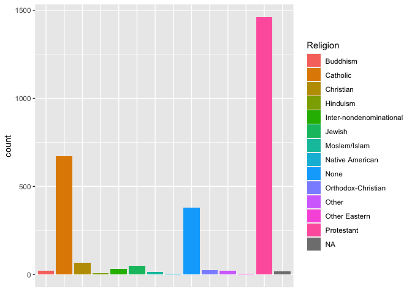<!-- -->

``` r
counts = as.data.frame(sort(table(gss$Religion)))
head(counts, 20)
```

    ##                       Var1 Freq
    ## 1            Other Eastern    2
    ## 2          Native American    4
    ## 3                 Hinduism    6
    ## 4             Moslem/Islam   13
    ## 5                 Buddhism   21
    ## 6                    Other   22
    ## 7       Orthodox-Christian   23
    ## 8  Inter-nondenominational   30
    ## 9                   Jewish   48
    ## 10               Christian   65
    ## 11                    None  379
    ## 12                Catholic  673
    ## 13              Protestant 1460

``` r
ggplot(data=counts, aes(x=Var1, y=Freq, fill=Var1)) + 
  geom_bar(stat="identity") + 
  theme(axis.title.x=element_blank(),
        axis.text.x=element_blank(),
        axis.ticks.x=element_blank())
```

<!-- -->

``` r
reliprop = counts$Freq/sum(counts$Freq) #converts counts to proportions
counts1 = data.frame(counts, reliprop) #create a new data frame adding reliprob variable to counts
# head(counts1, 4)

ggplot(data=counts1, aes(x=Var1, y=reliprop, fill=Var1)) + 
  geom_bar(stat="identity") + 
  ylab("Proportion") + 
  theme(axis.title.x=element_blank(),
        axis.text.x=element_blank(),
        axis.ticks.x=element_blank())
```

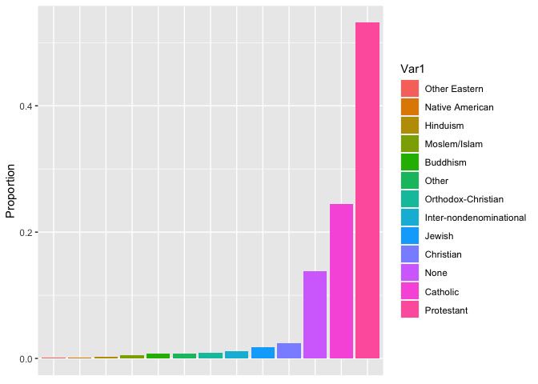<!-- -->

### A

Create a bar graph that demonstrates the distribution of race within
each level of education. What can you infer from this bar graph?

``` r
sub_gss_A = na.omit(gss[,c("Education","Race")])

ggplot(data=sub_gss_A, aes(x = Education, fill=Race)) + 
  geom_bar(position = "dodge", na.rm=TRUE) 
```

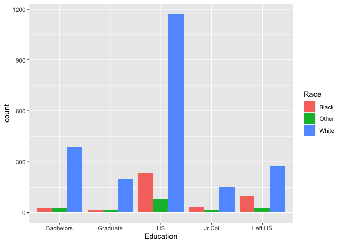<!-- -->

From this visualization (straightforward approach) it is not clear.

``` r
sub_gss_A = na.omit(gss[,c("Education","Race")]) # select columns and remove NAs 
counts = table(sub_gss_A$Education, sub_gss_A$Race) 

rowTot = rowSums(counts) # sum in Education category
colTot = colSums(counts)

reliprop_col = t(t(counts)/colTot) # calc proportions
reliprop_row = counts/rowTot

ggplot(data.frame(reliprop_col), 
       aes(fill=factor(Var1, levels=c("Left HS","HS", "Jr Col", "Bachelors", "Graduate")), 
           y=Freq, 
           x=factor(Var2, 
                    levels = c("Black", "White", "Other")))) + 
    geom_bar(position="dodge", stat="identity") + 
    xlab("Race") + 
    ylab("Proportion")
```

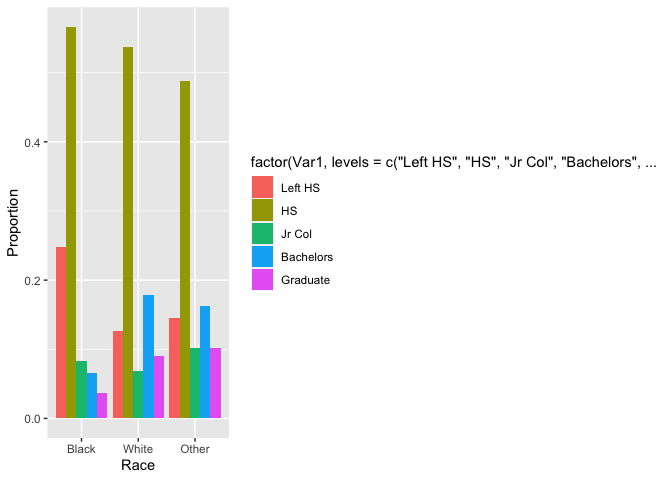<!-- -->

``` r
ggplot(data.frame(reliprop_row), 
       aes(fill=Var2, 
           y=Freq, 
           x=factor(Var1, 
                    levels = c("Left HS","HS", "Jr Col", "Bachelors", "Graduate")))) + 
    geom_bar(position="dodge", stat="identity") + 
    xlab("Education") + 
    ylab("Proportion")
```

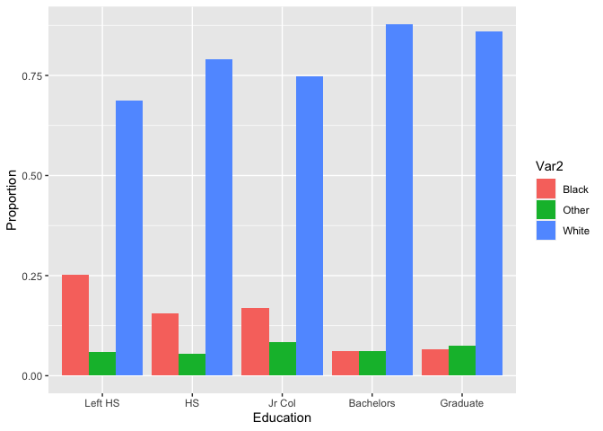<!-- -->

**Answer**

From this bar plot it is much more clear. 1. Regarding the black race,
*a quarter* of them leave High School, and *slightly more than half*
manage to finish High School. After that, the *trend goes down* for
higher education, ending with less than 5% of graduate students.

1.  For white people, almost *one-third* of them get higher education
    (bachelor’s + graduate). And the percentage of *dropping from
    school* is the *lowest.*

### B

Create a data visualization that can be used to demonstrate if there is
a relationship between one’s marital status (Marital) and their
education level.

``` r
sub_gss_A = na.omit(gss[,c("Marital","Education")])
counts = table(sub_gss_A$Marital, sub_gss_A$Education)
rowTot <- rowSums(counts)
reliprop_row = counts/rowTot

ggplot(data.frame(reliprop_row), 
       aes(fill=Var2, 
           y=Freq, 
           x=Var1)) + 
    geom_bar(position="dodge", stat="identity") + 
    xlab("Marital status") + 
    ylab("Proportion")
```

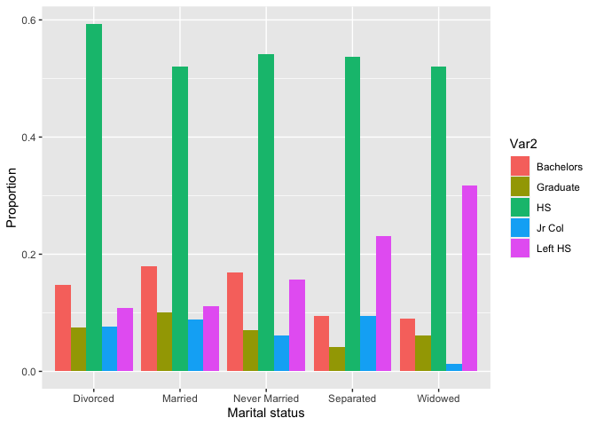<!-- -->

**Answer**

1.  Among those with marital status Widowed, they *rarely get higher
    education* (bachelor + graduate). Approximately *half of them finish
    High School*. A *third of them leave high school* - the highest
    proportion among other marital statuses.

2.  Never Married or Married get their higher education *more often*
    than Separated and Divorced.

### C

Create a data visualization that can be used to demonstrate if there is
a relationship between one’s Gender and their Politics.

``` r
sub_gss_A = na.omit(gss[,c("Gender","Politics")])
counts = table(sub_gss_A$Gender, sub_gss_A$Politics)

rowTot <- rowSums(counts)
colTot <- colSums(counts)

reliprop_col = t(t(counts)/colTot)
reliprop_row = counts/rowTot

ggplot(data.frame(reliprop_row), 
       aes(fill=Var2, 
           y=Freq, 
           x=Var1)) + 
    geom_bar(position="dodge", stat="identity") + 
    xlab("Gender") + 
    ylab("Proportion")
```

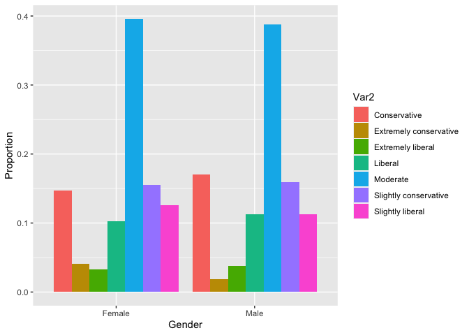<!-- -->

``` r
ggplot(data.frame(reliprop_col), 
       aes(fill=Var1, 
           y=Freq, 
           x=Var2)) + 
    geom_bar(position="dodge", stat="identity") + 
    xlab("Politics") + 
    ylab("Proportion") + coord_flip()
```

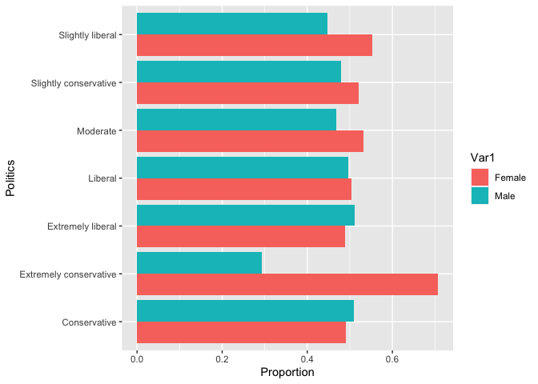<!-- -->

**Answer**

There are *no distinguishable differences* between Males and Females
respective to Political views, *except Extremely Conservative*, where
the difference is the most significant (second plot - horizontal bars).
Among the followers of Extremely Conservative views there are many more
(40% more) Females than Males.

## Problem 10

``` r
library(ISLR)
head(Default, 4)
```

    ##   default student   balance   income
    ## 1      No      No  729.5265 44361.63
    ## 2      No     Yes  817.1804 12106.13
    ## 3      No      No 1073.5492 31767.14
    ## 4      No      No  529.2506 35704.49

### A

Create a scatterplot that demonstrates the relationship between a
person’s income and their monthly balance they carry on their credit
cards. Place the “income” variable as the y-axis and the “balance”
variable as the x-axis. Within this visualization, differentiate between
those who are students and those who are not.

``` r
subset = na.omit(Default[,c("student", "balance", "income")])

ggplot(data=subset, 
       aes(x = income, y = balance, color=student)) + 
geom_point(size=2, position="jitter") + 
xlab("Monthly Balance") + 
ylab("Income") + 
facet_wrap(~ student) +  
ggtitle("Scatterplot of Monthly Balance and Income  - by status of being a student or not") + 
geom_smooth(method="lm")
```

    ## `geom_smooth()` using formula 'y ~ x'

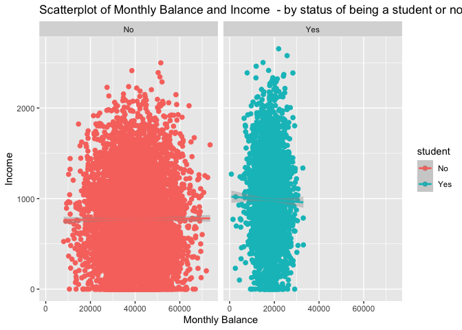<!-- -->

### B

Create side-by-side boxplots that will compare the distributions of
balance owing between students and non-students.

``` r
ggplot(data=subset, aes(x = student, y=balance)) + 
geom_boxplot(fill='red', na.rm=TRUE) + 
ylab("Balance") + 
ggtitle("Boxplots of distributions of balance owing between students and non-students")  
```

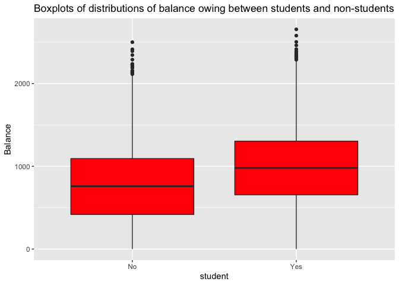<!-- --> \#\#\# C Compute the means,
medians, standard deviations, x5, x95 (the 5th and 95th percentiles,
respectively) for the data you visually summarized in part (b).

**Answer**

Student = “No”

mean = 771.7704

median = 759.1891

std = 469.6749

x5 = 0.4246597

x95 = 1665.9625812

------------------------------------------------------------------------

Student = “Yes”

mean = 987.8182

median = 979.9894

std = 482.9097

x5 = 0.4246597

x95 = 1665.9625812

``` r
library(mosaic)
```

    ## Registered S3 method overwritten by 'mosaic':
    ##   method                           from   
    ##   fortify.SpatialPolygonsDataFrame ggplot2

    ## 
    ## The 'mosaic' package masks several functions from core packages in order to add 
    ## additional features.  The original behavior of these functions should not be affected by this.

    ## 
    ## Присоединяю пакет: 'mosaic'

    ## Следующие объекты скрыты от 'package:dplyr':
    ## 
    ##     count, do, tally

    ## Следующий объект скрыт от 'package:Matrix':
    ## 
    ##     mean

    ## Следующий объект скрыт от 'package:ggplot2':
    ## 
    ##     stat

    ## Следующие объекты скрыты от 'package:stats':
    ## 
    ##     IQR, binom.test, cor, cor.test, cov, fivenum, median, prop.test,
    ##     quantile, sd, t.test, var

    ## Следующие объекты скрыты от 'package:base':
    ## 
    ##     max, mean, min, prod, range, sample, sum

``` r
favstats(~balance, data=filter(subset, student=="No"))
```

    ##  min       Q1   median       Q3      max     mean       sd    n missing
    ##    0 418.1566 759.1891 1093.263 2499.017 771.7704 469.6749 7056       0

``` r
quantile(subset$balance, c(0.05, 0.95), na.rm = TRUE)
```

    ##           5%          95% 
    ##    0.4246597 1665.9625812

``` r
favstats(~balance, data=filter(subset, student=="Yes"))
```

    ##  min       Q1   median       Q3      max     mean       sd    n missing
    ##    0 655.5859 979.9894 1303.906 2654.323 987.8182 482.9097 2944       0

``` r
quantile(subset$balance, c(0.05, 0.95), na.rm = TRUE)
```

    ##           5%          95% 
    ##    0.4246597 1665.9625812

## Problem 11

### A

Read the data in this file into a data frame. Create a violin plot of
these data.

``` r
prob10 = read.csv("http://people.ucalgary.ca/~jbstall/DataFiles/Data602Assignment1Question11.csv")

ggplot(data = prob10, aes(x='var', y=Delivery_time)) + 
geom_violin(col="red", fill="blue") + 
xlab("") + 
ylab("") + 
ggtitle("")
```

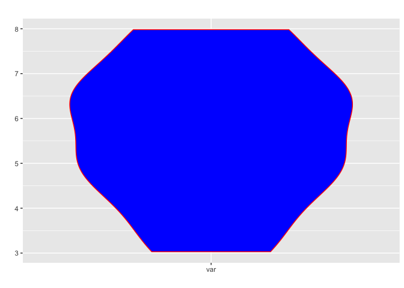<!-- -->

### B

From this data, compute the sample mean, the sample median, the sample
standard deviation, the first and third quartiles, and the 99th
percentile.

**Answer**

mean = 5.6875

median = 5.775

std = 1.580369

x1 = 3.0883

x99 = 7.9778

``` r
favstats(~Delivery_time, data=prob10)
```

    ##   min   Q1 median    Q3  max   mean       sd  n missing
    ##  3.03 4.75  5.775 6.565 7.98 5.6875 1.580369 12       0

``` r
quantile(prob10$Delivery_time, c(0.01, 0.99), na.rm = TRUE)
```

    ##     1%    99% 
    ## 3.0883 7.9778

### C

Suppose you were part of a marketing campaign to promote the efficiency
of delivery times, as a part of the campaign there was a promise of
delivery within a certain number of hours, beyond which there would be a
refund for 1% of all deliveries. Provide the point of refund.

**Answer**

1.  " a refund for 1% of all deliveries" means the delivery was late -
    right tail of distribution

2.  1% of all deliveries are beyond *6 hours* threshold

``` r
mean = 5
std = 1.5
sample_size = 12

std_sampple = std/sqrt(sample_size)
qnorm(0.99, mean, std_sampple)
```

    ## [1] 6.007338
