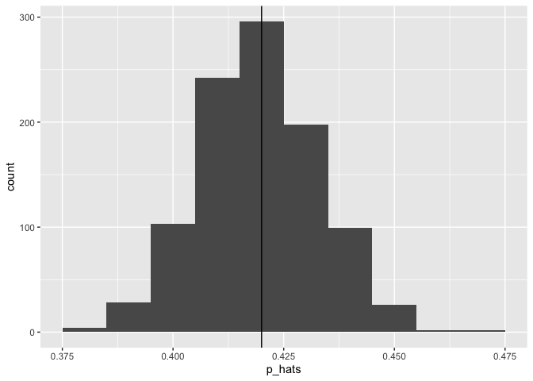
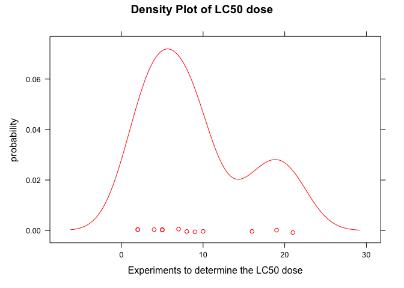
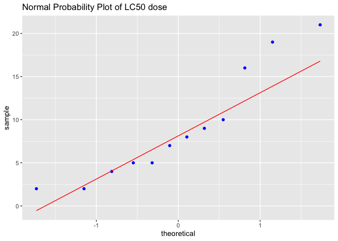
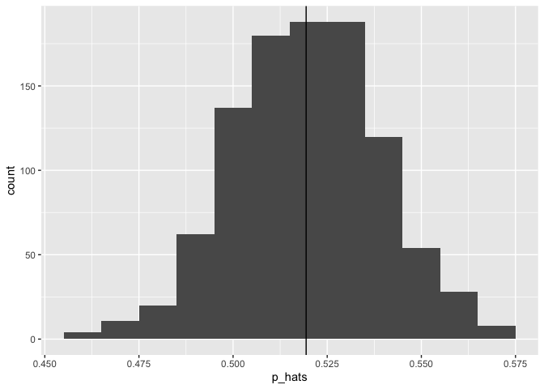
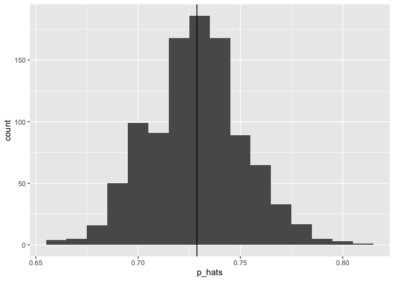

Assignment 2
================
Andrii Voitkiv
September 23, 2022

-   [Tools](#tools)
-   [Problem 1](#problem-1)
-   [Problem 2](#problem-2)
-   [Problem 3](#problem-3)
-   [Problem 4](#problem-4)
-   [Problem 5](#problem-5)
-   [Problem 6](#problem-6)
-   [Problem 7](#problem-7)
-   [Problem 8](#problem-8)

``` r
knitr::opts_chunk$set(fig.path='Figs/')
```

## Tools

``` r
bootstrap_func = function(data, ntimes) {
  means = numeric(ntimes)
  medians = numeric(ntimes)
  stds = numeric(ntimes)
  for(i in 1:ntimes){  
      data_sample = sample(data, length(data), replace=TRUE)
      means[i] = mean(data_sample)
      medians[i] = median(data_sample)
      stds[i] = sd(data_sample)
      }
  return (data.frame(means, medians, stds))
}

bootstrap_binom_func = function(ntimes, sample_size, prob) {
  p_hats = numeric(ntimes)
  for (i in 1:ntimes) {
      outcome = numeric(sample_size)
      for (j in 1:sample_size) {
          outcome[j] = rbinom(1, 1, prob)
          }
      p_hats[i] = sum(outcome) / sample_size
    
  }
  return(data.frame(p_hats))
}


bootstrap_binom_func_v2 = function(ntimes, sample_size, prob) {
  outcome = c(rep(1, prob * sample_size), rep(0, (1 - prob) * sample_size))
  p_hats <- numeric(ntimes)
  for(i in 1:1000){
     sample_data <- sample(outcome, replace = TRUE) # resample with replacement
     p_hats[i] <- mean(sample_data)
  }
  return(data.frame(p_hats)) # data frame with column names: p_hats, medians
}
```

    ## Registered S3 method overwritten by 'mosaic':
    ##   method                           from   
    ##   fortify.SpatialPolygonsDataFrame ggplot2

    ## 
    ## The 'mosaic' package masks several functions from core packages in order to add 
    ## additional features.  The original behavior of these functions should not be affected by this.

    ## 
    ## Присоединяю пакет: 'mosaic'

    ## Следующие объекты скрыты от 'package:dplyr':
    ## 
    ##     count, do, tally

    ## Следующий объект скрыт от 'package:Matrix':
    ## 
    ##     mean

    ## Следующий объект скрыт от 'package:ggplot2':
    ## 
    ##     stat

    ## Следующие объекты скрыты от 'package:stats':
    ## 
    ##     IQR, binom.test, cor, cor.test, cov, fivenum, median, prop.test,
    ##     quantile, sd, t.test, var

    ## Следующие объекты скрыты от 'package:base':
    ## 
    ##     max, mean, min, prod, range, sample, sum

## Problem 1

### A

``` r
data = read.csv("http://people.ucalgary.ca/~jbstall/DataFiles/Data602Assignment1Question11.csv")

mean = 5
std = 1.5
sample_size = 12

mean_sample = mean(data$Delivery_time) # mean of the sample
z = (mean_sample - mean) / (std/sqrt(sample_size)) # calculate z-score
1 - pnorm(z) # at least means more or equal than - right tail
```

    ## [1] 0.0561756

### B

``` r
p_lower = (sample_size - 1) * 0.5^{2} / std^{2}
p_upper = (sample_size - 1) * 1^{2} / std^{2}
pchisq(p_upper, sample_size - 1) - pchisq(p_lower, sample_size - 1) 
```

    ## [1] 0.06343368

## Problem 2

### B

``` r
m = 541
n = 1426
p = 0.42
q = 1 - p
mean_sample = m/n 
sd_sample = sqrt(p * q / n)
pnorm(mean_sample, mean=p, sd=sd_sample)
```

    ## [1] 0.0009429508

### C

``` r
sim_df = bootstrap_binom_func_v2(ntimes = 1000, sample_size = n, prob = p)
```

``` r
ggplot(sim_df, aes(x=p_hats)) + 
  geom_histogram(binwidth = 0.01) + 
  geom_vline(xintercept=p)
```

<!-- -->

``` r
# determine the proportion of your p_hats that are less than or equal to 0.3794
nrow(subset(sim_df, p_hats <= 0.3794)) / nrow(sim_df)
```

    ## [1] 0.001

### A

The distribution of p\_hats is *symmetrical* with `mean` at 0.42 and
`standard deviation` around 0.013. Also, it is approximately *normal*.

``` r
mean(sim_df$p_hats)
```

    ## [1] 0.4195747

``` r
sd(sim_df$p_hats)
```

    ## [1] 0.01331716

## Problem 3

``` r
f = function(x) {choose(6, x) * choose(43, 6-x) / choose(49, 6)}
xvalues = c(0,1,2,3,4,5,6)
px = f(xvalues) 
ex = 36/49 # expectancy of the lottery game played many times (for example, 52 weeks) 
sd = 0.76

# The distribution of the mean/average number of matching numbers 
# will be *approximately* Normal, by the Central Limit theorem:
z_score = (1 - ex) / (sd / sqrt(length(xvalues))) # how far number 1 is away from Ex
1 - pnorm(z_score) # at least one matching number
```

    ## [1] 0.177848

The probability of having one matching number or more if this lottery is
played many times is approximately 18%, which doesn’t confirm Billy’s
claim.

## Problem 4

### A

``` r
boot_df = bootstrap_func(c(16,5,21,19,10,5,8,2,7,2,4,9), 2000)
```

### B

``` r
qdata(~means, c(0.025, 0.975), data=boot_df)
```

    ##     2.5%    97.5% 
    ##  5.75000 12.75208

We are 95% confident that LC50 dose between 5.83 and 12.58 lethal
concentration dose killing 50% of the test species

### C

``` r
data_prob4 = c(16,5,21,19,10,5,8,2,7,2,4,9)
data_prob4_df = data.frame(data_prob4)
t.test(~data_prob4, data=data_prob4_df , conf.level=0.95)$conf
```

    ## [1]  4.91814 13.08186
    ## attr(,"conf.level")
    ## [1] 0.95

### D

1.  The t-test gives us *wider* range compare to bootstraped confidence
    level (\[4.92-13.08\] vs \[5.83-12.58\]). And we prefer narrower one
    for higher *precision*.

2.  The t-test was performed on one *small sample (n=12)*. That means
    that *variability can be high* - standard error.

3.  Also, as can be seen from a density plot below of our sample data,
    it doesn’t seem to be normal - two humps (one is bigger and the
    other is smaller), skewed to the right. Eventually, it is hard to
    make a statement about the mean based on t-test because the
    *distribution is skewed*.

4.  In contrary, the bootstraped confidence level was derived from 2000
    simulations where sample means distributed approximately normal.

*Summarizing all that stated above, I would report bootsraped confidence
level*.

### E

The distribution of the sample data doesn’t seem to be normal - two
humps (one is bigger and the other is smaller), skewed to the right.
Eventually, it is hard to make a statement about the mean based on
t-test because the *distribution is skewed*. Normal probability plot
confirms that - the upper right part tells us about right tail, when the
dots (the data) deviate from the line (normal). Even though in the
middle the data is approximately normal.

``` r
densityplot(data_prob4, xlab="Experiments to determine the LC50 dose", ylab="probability", col='red', main="Density Plot of LC50 dose")
```

<!-- -->

``` r
ggplot(data=data_prob4_df, aes(sample=data_prob4)) + 
  stat_qq(col='blue') + stat_qqline(col='red') + 
  ggtitle("Normal Probability Plot of LC50 dose") 
```

<!-- -->

## Problem 5

### A

``` r
pr = 571/1866 
lower = pr - 1.96 * sqrt(pr * (1 - pr) / 1866)
upper = pr + 1.96 * sqrt(pr * (1 - pr) / 1866)
print(lower)
```

    ## [1] 0.2850927

``` r
print(upper)
```

    ## [1] 0.3269115

### B

``` r
set.seed(2)
sims_problem5 = bootstrap_binom_func_v2(ntimes = 1000, sample_size = 1866, prob = 571/1866)
```

### C

``` r
qdata(~p_hats, c(0.025, 0.975), data=sims_problem5)
```

    ##      2.5%     97.5% 
    ## 0.2856243 0.3274518

### D

``` r
lower_count = 0
upper_count = 0
lb = 0.2850927 # 0.2856243 - bootstrap lower
ub = 0.3269115 # 0.3274518 - bootstrap upper
sim_len = length(sims_problem5$p_hats)
v = sims_problem5$p_hats

for (i in 1:sim_len){
  if (v[i] <= lb)
    lower_count = lower_count + 1
  else
    if (v[i] >= ub)
      upper_count = upper_count + 1
}

print(lower_count/sim_len)
```

    ## [1] 0.021

``` r
print(upper_count/sim_len)
```

    ## [1] 0.027

1.  After the scan of all the values of bootstrap p\_hats I found that
    2.1% of data are less than 0.2850927 (conf level lower bound from
    `part a`) and 2.7% of data are beyond 0.3269115 (upper bound).
    Should be 2.5% both sides in case it is perfectly normal, but it is
    not. So the interval is not accurate.

2.  If I do the same analysis for interval from `part c` I will get 2.5%
    and 2.7% respectivly. Which is not accurate as well but better that
    in the first case.

3.  Conclusion, I would report the second interval. Which in this case
    means that we can be 95% confident that the true proportion of
    Candaians homeowners who are willing to downsize is between
    28.56243% and 32.74518%.

## Problem 6

### A

``` r
sims_hs = bootstrap_binom_func_v2(ntimes = 1000, sample_size = 670, prob = 348/670)
ggplot(sims_hs, aes(x=p_hats)) + 
  geom_histogram(binwidth = 0.01) + 
  geom_vline(xintercept=348/670)
```

<!-- -->

### B

``` r
sims_uni = bootstrap_binom_func_v2(ntimes = 1000, sample_size = 376, prob = 274/376)
ggplot(sims_uni, aes(x=p_hats)) + 
  geom_histogram(binwidth = 0.01) + 
  geom_vline(xintercept=274/376)
```

<!-- -->

### C

``` r
outcome_hs = c(rep(1, (348/670) * 670), rep(0, (1 - 348/670) * 670))
outcome_uni = c(rep(1, (274/376) * 376), rep(0, (1 - 274/376) * 376))
p_diff <- numeric(1000)

for(i in 1:1000){
   p_diff[i] <- mean(sample(outcome_uni, replace = TRUE)) - mean(sample(outcome_hs, replace = TRUE))
}

p_diff_df = data.frame(p_diff)
```

### D

``` r
qdata(~p_diff, c(0.025, 0.975), data=p_diff_df)
```

    ##      2.5%     97.5% 
    ## 0.1522662 0.2692714

*Statistically, there is a difference between two populations because
zero wasn’t captured by confidence interval (of difference of simulated
p\_hats).*

## Problem 7

### A

``` r
sims_prob7_df = bootstrap_func(data = c(16,5,21,19,10,5,8,2,7,2,4,9), ntimes = 2000)
qdata(~medians, c(0.005, 0.995), data=sims_prob7_df)
```

    ##    0.5%   99.5% 
    ##  3.0000 16.0075

We are 99% confident that LC50 dose between 4 and 16 lethal
concentration dose killing 50% of the test species

### B

``` r
qdata(~stds, c(0.025, 0.975), data=sims_prob7_df)
```

    ##     2.5%    97.5% 
    ## 3.048627 7.872132

We can be 95% confident that standard deviation of the population of
LC50 doses is in between 2.98% and 7.9%

## Problem 8

### A

``` r
pr_ndp = 352/858 
lower_ndp = pr_ndp - 1.96 * sqrt(pr_ndp * (1 - pr_ndp) / 858)
upper_ndp = pr_ndp + 1.96 * sqrt(pr_ndp * (1 - pr_ndp) / 858)
print(lower_ndp)
```

    ## [1] 0.3773431

``` r
print(upper_ndp)
```

    ## [1] 0.4431697

### B

``` r
p_plus2plus4 = (352 + 2) / (858 + 4) # plus2plus4
sim_ndp_plu4 = bootstrap_binom_func_v2(ntimes = 1000, sample_size = 858 + 4, prob = p_plus2plus4)
```

### C

``` r
qdata(~p_hats, c(0.025, 0.975), data=sim_ndp_plu4)
```

    ##      2.5%     97.5% 
    ## 0.3793503 0.4408353

``` r
#binom.test(352, 858, ci.method="Plus4")$conf
```

### D

We are 95% confident that the proportion of Alberta voters who would
vote for their NDP MLA-candidate if a provincial election were held
“tomorrow” is between 37.7% and 44.4%.
