Assignment 3
================
Andrii Voitkiv
October 9, 2022

-   [Tools](#tools)
-   [Problem 1](#problem-1)
-   [Problem 2](#problem-2)
-   [Problem 3](#problem-3)
-   [Problem 4](#problem-4)
-   [Problem 5](#problem-5)
-   [Problem 6](#problem-6)
-   [Problem 7](#problem-7)
-   [Problem 8](#problem-8)
-   [Problem 9](#problem-9)
-   [Problem 10](#problem-10)
-   [Problem 11](#problem-11)

``` r
knitr::opts_chunk$set(fig.path='Figs/')
```

## Tools

``` r
one_sample_proportion_func = function(p, n){
  sd = sqrt(p0 * (1 - p0) / n)
  z = (p1 - p0) / sd 
  return_values = list("sd"=sd, "z"=z)
  return (return_values)
}

two_samples_proportion_func = function(x1, x2, n1, n2) {
  p1 = x1/n1
  p2 = x2/n2
  p_pooled = (x1 + x2) / (n1 + n2)
  se = sqrt((p_pooled * (1 - p_pooled) / n1) + ((p_pooled * (1 - p_pooled) / n2)))
  z = ((p2 - p1) - 0) / se
  
  return_values = list("p1"=p1, "p2"=p2, "z"=z, "se"=se)
  return(return_values)
}

bootstrap_binom_func_v2 = function(ntimes, sample_size, prob) {
  outcome = c(rep(1, prob * sample_size), rep(0, (1 - prob) * sample_size))
  p_hats <- numeric(ntimes)
  for(i in 1:1000){
     sample_data <- sample(outcome, replace = TRUE) # resample with replacement
     p_hats[i] <- mean(sample_data)
     
  }
  df = data.frame(p_hats)
  colnames(df) <- paste0("p_", prob)
  return(df) # data frame with column names: p_hats, medians
}
```

## Problem 1

``` r
library(resampledata)
head(NCBirths2004, 2)
```

    ##   ID MothersAge Tobacco Alcohol Gender Weight Gestation Smoker
    ## 1  1      30-34      No      No   Male   3827        40     No
    ## 2  2      30-34      No      No   Male   3629        38     No

``` r
non_smoke = filter(NCBirths2004, Tobacco=="No")
smoke = filter(NCBirths2004, Tobacco=="Yes")
```

### A

``` r
ntimes = 2000
means_smoke = numeric(ntimes)
means_non_smoke = numeric(ntimes)
diff_mean = numeric(ntimes)
division_sd = numeric(ntimes)
for(i in 1:ntimes){  
      means_smoke[i] = mean(sample(smoke$Weight, nrow(smoke), replace=TRUE))
      means_non_smoke[i] = mean(sample(non_smoke$Weight, nrow(non_smoke), replace=TRUE))
      diff_mean[i] = means_non_smoke[i] - means_smoke[i]
      division_sd[i] = sd(sample(smoke$Weight, nrow(smoke), replace=TRUE)) / sd(sample(non_smoke$Weight, nrow(non_smoke), replace=TRUE))
}

boot_df_prob1 = data.frame(means_non_smoke, means_smoke, diff_mean, division_sd)
head(boot_df_prob1, 2)
```

    ##   means_non_smoke means_smoke diff_mean division_sd
    ## 1        3491.683    3264.306  227.3763    1.145861
    ## 2        3467.111    3281.189  185.9222    1.171592

### B

``` r
qdata(~diff_mean, c(0.025, 0.975), data=boot_df_prob1)
```

    ##     2.5%    97.5% 
    ## 117.1478 317.0517

### C

``` r
t.test(non_smoke$Weight, smoke$Weight, conf.level = 0.95)$conf
```

    ## [1] 112.3161 317.6881
    ## attr(,"conf.level")
    ## [1] 0.95

### D

From this calculations, I can conclude that children born to birth
mother who did not smoke during pregnancy weigh more on average than
babies born to birth mothers who did smoke during pregnancy. There is a
statistical difference between two populations because *zero is not in
the mean difference’s confidence interval*.

## Problem 2

### A

I did this in problem 1A.

### B

The ratio of the sample standard deviations appear to follow a Normal
distribution. For *large enough samples*, each of our standard
deviations has an approximately Normal sampling distribution. The same
is true for their ratio.

``` r
ggplot(boot_df_prob1, aes(x=division_sd)) + 
  geom_histogram(binwidth = 0.01) 
```

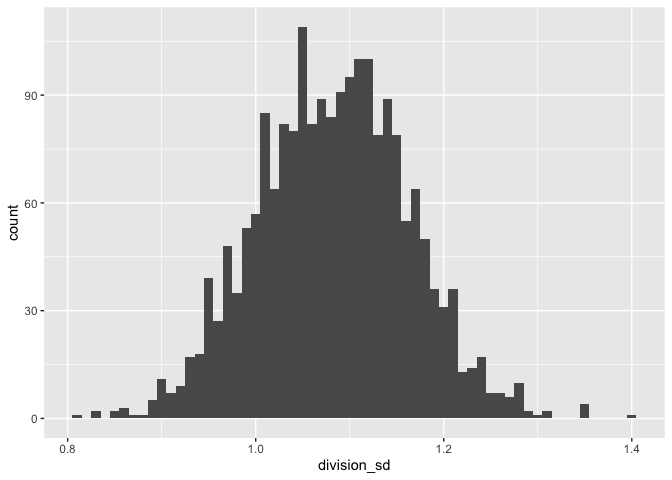<!-- -->

### C

``` r
qdata(~division_sd, c(0.025, 0.975), data=boot_df_prob1)
```

    ##      2.5%     97.5% 
    ## 0.9307148 1.2368928

### D

Consider the result you obtained in part (c). Explain the practical
meaning of this result with respect to the variable **Weight**.

*The weights of newborn babies for mothers who smoke and for mothers
that don’t smoke vary approximately equal, as the confidence interval of
the std’s ratio captures 1 (from 0.92 to 1.235). The spreads of the
weight are not wildly different. The good consequence of this finding is
that we can use pooled-t method, as it has assumtion of Equal
Variances.*

## Problem 3

### A

H0: mercury level is lower or equal than 1, no action is needed from
Health Canada Ha: mercury level is higher than 1. The biologist
hypothesis that walleye fish harvested from the Athabaska Rive exceed
Health Canada’s action level; therefore, it should place a moritorium on
commercial walleye fishing on the Athabaska River downstream of
Whitecourt

### B

**Type I Error** occurs when biologist force Health Canada to action
when it is unnecessary. **Type II Error** occurs if biologists fail to
recognize the threat to walleye fish; consequently, Health Canada
doesn’t take any action to save the species.

### C

``` r
mercury_lvl = c(1.2, 1.1, 1.0, 1.0, 1.1, 1.0, 1.0, 1.0, 0.9, 1.1, 1.1, 1.2, 1.0, 1.1, 1.0, 
               1.1, 1.0, 0.9, 1.0, 1.0, 1.1, 1.0, 1.0, 1.1, 1.2, 1.0, 1.1, 1.0, 1.0, 1.2, 1.1) 
df_prob3 = data.frame(mercury_lvl)

ggplot(data=df_prob3) + 
  geom_violin(mapping = aes(x = "var", y = mercury_lvl), fill= 'blue') + 
  geom_boxplot(mapping = aes(x = "var", y = mercury_lvl), width=0.15, fill="orange") +
  xlab("") + 
  ylab("") + 
  ggtitle("")
```

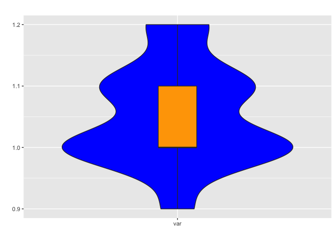<!-- -->

``` r
densityplot(mercury_lvl, xlab="", ylab="probability", col='red', main="Density Plot of ")
```

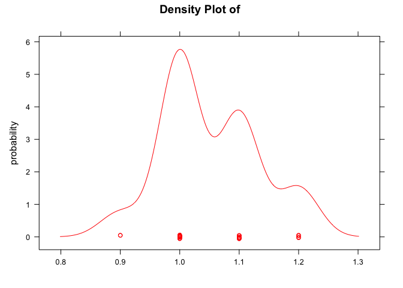<!-- --> **Comment on plots**:

1.  Data points are clustered at four distinct values (0.9, 1.0, 1.1,
    1.2).

2.  From boxplot the IQR contains the 50% middle of the values of
    distribution between 1 and 1.1 including.

3.  No outliers.

4.  From density plot and violin plot three peaks can be seen -
    multimodal distribution. But peaks are not equal (height is
    different), so we can say that there is one major peak.

5.  By saying that, we can conclude that data comes from approximately
    Normal distribution/population (this is an important assumption for
    a t-test).

### D

1.  Do these data suggest that Health Canada should place a moritorium
    on commercial walleye fishing on the Athabaska River downstream of
    Whitecourt? *This test of the null hypothesis is a one-tailed test,
    because the alternative hypothesis is expressed directionaly:
    mercury level is higher than 1. The data suggest that Health Canada
    should place a moritorium on commercial walleye fishing on the
    Athabaska River downstream of Whitecourt.*
2.  Interpret the meaning of the P-value you have computed. *P-value is
    a conditional probability. In this case, it tells us the probability
    of getting this data (mean of this sample of 31 fishes is 1.051613)
    given that null-hypothesis is true. In other words, the probability
    to see this sample of fishes is negligible (0.066%) given that
    hypothesized mean is 1. We can be confident in declaring that we
    doubt the null is true. But what we really want to say is that if
    the mean is 1 then there is 0.066% chance to see such sample.*
3.  IF you reject the null hypothesis, provide a 95% confidence interval
    for the mean mercury (in ppm) of walleye found downstream from
    Whitecourt. *The true mean is somewhere above 1.021857.*

``` r
t.test(~ mercury_lvl, mu=1, alternative="greater", data=df_prob3)
```

    ## 
    ##  One Sample t-test
    ## 
    ## data:  mercury_lvl
    ## t = 3.5425, df = 30, p-value = 0.0006595
    ## alternative hypothesis: true mean is greater than 1
    ## 95 percent confidence interval:
    ##  1.026884      Inf
    ## sample estimates:
    ## mean of x 
    ##  1.051613

## Problem 4

H0: proportion of certified coffee growers in Southern Mexico who are
either certified or in the process of being certified, is less than or
equal to 60% Ha: proportion is more than 60%

``` r
n = 845
m = 475 + 75
p0 = 0.6

p1 = m/n
sd = sqrt(p0 * (1 - p0) / n) # standard deviation of the sampling model, use hypothesized proportion
z = (p1 - p0) / sd # assumption of Normal model as conditions are satisfied: 1) independence 2) 10% condition 3) success/failure condition

margin_error = 1.96 * sd # 1.96 * st dev is 95% in normal distribution
# now work with observed proportion for conf interval
# we can not work with proportion from null H because we rejected it
lb = p1 - margin_error
up = p1 + margin_error

cat("Proportion of our sample is", p1, "with standard deviation ", sd, "\n")
```

    ## Proportion of our sample is 0.6508876 with standard deviation  0.016853

``` r
cat("If we hypothesize that true proportion is", p0, "and our hypothetical distribution is approximately Normal \n")
```

    ## If we hypothesize that true proportion is 0.6 and our hypothetical distribution is approximately Normal

``` r
cat("And in this case we can do that, because we have Binomial process which we can approximate with Normal distribution \n")
```

    ## And in this case we can do that, because we have Binomial process which we can approximate with Normal distribution

``` r
cat("Then our sample proportion is", z, "standard deviations away from hypothesized population proportion. \n")
```

    ## Then our sample proportion is 3.019496 standard deviations away from hypothesized population proportion.

``` r
cat("The probability then (p-value)", 1 - pnorm(z), "\n")
```

    ## The probability then (p-value) 0.001265978

``` r
cat("If the underlying hypothesized distribution is Binomial with hypothesized proportion mean, \n")
```

    ## If the underlying hypothesized distribution is Binomial with hypothesized proportion mean,

``` r
cat("than the probability to get sample proportion at least", p1, "is", 1 - pbinom(m, n, p0))
```

    ## than the probability to get sample proportion at least 0.6508876 is 0.001045019

``` r
cat("Both methods give approximately the same p_value and inference")
```

    ## Both methods give approximately the same p_value and inference

The chance to get this sample of coffee growers in Southern Mexico with
proportion equal to 65% given that 60% of all coffee growers are
organically certified is approximately 0.1%. We could be extremely
unlucky to get this sample while the null hypothesis is still true.
Therefore, we got strong evidence that the proportion is higher than
60%.

## Problem 5

``` r
x_uni = 274
n_uni = 376
x_hs = 348
n_hs = 670

# proportions
p_hs = x_hs/n_hs
p_uni = x_uni/n_uni

# METHOD 1
# we can use standard dev of proportion differences because independence assumptions are met (two groups are independent of each other)
# and these groups are big enough - sample size condition
# For large enough samples, each of our proportions has approximately Normal sampling distribution
# The same is true for their difference
se = sqrt((p_uni * (1-p_uni)/n_uni) + (p_hs * (1-p_hs)/n_hs)) # standard error for proportions difference
# calculate 95% confidence interval assuming the underlying distribution is Normal 
lb = (p_uni - p_hs) - 1.96 * se
ub = (p_uni - p_hs) + 1.96 * se
cat("Confidence interval:", lb, ub, "\n")
```

    ## Confidence interval: 0.1505749 0.2680659

``` r
# METHOD 2
# the plus-1/plus-2 confidence interval
cat("Confidence interval Plus-1 plus-4 method:", prop.test(c(x_uni + 1, x_hs + 1), c(n_uni + 2, n_hs + 2), conf.level=0.95, correct=FALSE)$conf, "\n") 
```

    ## Confidence interval Plus-1 plus-4 method: 0.149503 0.266833

``` r
# METHOD 3
# Pooled proportion
# H0: p1 - p2 = 0 - two groups are equal and there is no difference
# HA: p1 - p2 <> 0 - they are different
# This is a two-tailed test
# If H0 is true, then we can calculate one proportion which is common for both groups
p_pooled = (x_uni + x_hs) / (n_uni + n_hs)
se_pooled = sqrt((p_pooled * (1 - p_pooled) / n_hs) + ((p_pooled * (1 - p_pooled) / n_hs)))
z_pooled = ((p_uni - p_hs) - 0) / se_pooled
p_pooled = 2 * (1 - pnorm(z_pooled)) # Because this is a two-tailed test, we must double the probability we find in the right tail
lb_pooled = (p_uni - p_hs) - 1.96 * se_pooled
ub_pooled = (p_uni - p_hs) + 1.96 * se_pooled
cat("Confidence interval Pool method:", lb_pooled, ub_pooled, "\n")
```

    ## Confidence interval Pool method: 0.1567453 0.2618955

*The difference between two groups’ means is statistically different as
confidence interval of mean differences doesn’t capture 0 (0.15 - 0.27).
Zero difference means there is no difference between two groups.*

## Problem 6

“there is enough statistical evidence to support the “minimum of 45%”
means that with the results from our sample we still want to support
claim that the candidate will run the office. So, this will be our null
hypothesis.

H0: p &gt;= 45% - they receive more or equal than 45% Ha: p &lt; 45% -
they receive less 45%

Also, it is worth mentioning that the null model is a Normal sampling
distribution - if we take many samples like this we will get normal
sampling distribution.

``` r
pbinom(19, 50, 0.45)
```

    ## [1] 0.1973679

### B

Since we are using Normal model we will use z-score to finZd how far our
sample proportion is from population/hypothetical proportion.

``` r
successes = 20
n = 50
p0 = 0.45 # hypothetical proportion 

p1 = successes / n # sample proportion
sd = sqrt(p0 * (1 - p0) / n) # the standard deviation of sampling model  
z_score = (p1 - p0) / sd # how far is sample proportion from hypothetical. We will use this as threshold to accept null H. 
# since we are working with left tail find the probability (p-value)
pnorm(z_score)
```

    ## [1] 0.2386447

alpha = 23.86%

``` r
ntimes = 10000
sample_size = 10000000
prob = 0.45
outcome = c(rep(1, prob * sample_size), rep(0, (1 - prob) * sample_size))
p_hats <- numeric(ntimes)
for(i in 1:ntimes){
   sample_data <- sample(outcome, 50, replace = TRUE) # take samples 
   p_hats[i] <- mean(sample_data)
}

boot_df  = data.frame(p_hats)
```

``` r
ggplot(boot_df, aes(x = p_hats)) + 
  geom_histogram(col="red", fill="blue", binwidth=0.02) + 
  geom_vline(xintercept = 0.4, col="orange") +
  geom_vline(xintercept = 0.45, col="orange") 
```

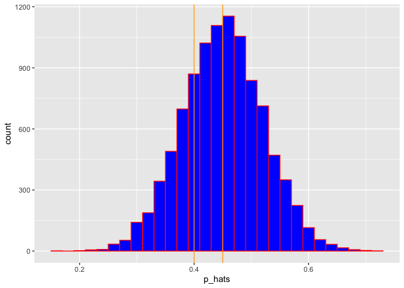<!-- -->

``` r
(sum(boot_df$p_hats <= 0.4)) / ntimes 
```

    ## [1] 0.2834

### C

``` r
p0 = 0.42

# repeat steps from part A
sd = sqrt(p0 * (1 - p0) / n)   
z_score = (p1 - p0) / sd  

# this time we want to calculate prob that the candidate will win (to the right side from threshold/alpha)
1 - pnorm(z_score)
```

    ## [1] 0.6127655

### D

``` r
p_value_func = function(p) {
  sd = sqrt(p * (1 - p) / n)
  z = (p1 - p) / sd
  p_value = pnorm(z)
  
  return(p_value)
} 

p_h0 = c(0.41, 0.40, 0.39, 0.38, 0.35, 0.3)

p_values = p_value_func(p_h0)

df_prob6 = data.frame(p_h0, p_values)

ggplot(df_prob6, aes(x=p_h0, y=p_values)) +
  geom_point(size=2, shape=23)
```

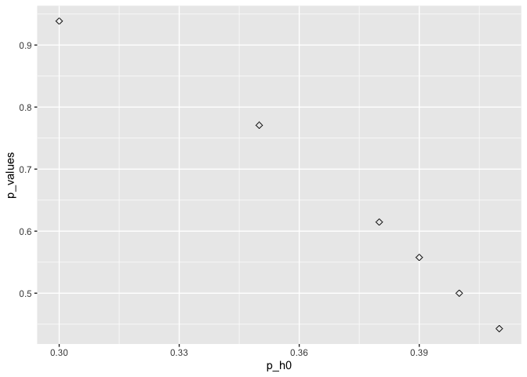<!-- -->

### E

1.  The chart tells me that my confidence (p\_value) rises up given
    threshold of the votes needed goes down - inverse relationship. So,
    having this sample I am more and more confident given the changing
    minimum vote value.
2.  How can you improve your test? Provide some suggestion(s), reasoning
    why each would make your statistical test better. I can increase my
    sample size to improve my test. That will decrease my standard
    deviation by sqrt(n). Even though my improvements will grow slower,
    that still can make my distribution looks tighter and margin error
    smaller (confidence intervals narrower). Unfortunately, bigger
    samples cost more money and more effort.To cut the standard error in
    half, we must quadruple the sample size (because of square root
    of n)

## Problem 7

``` r
books_prices = read.csv("http://people.ucalgary.ca/~jbstall/DataFiles/bookprices.csv") 
head(books_prices, 2)
```

    ##   UsedBkStore UsedAmazon
    ## 1      160.46     128.95
    ## 2       82.05      34.40

``` r
books_prices$diff = books_prices$UsedBkStore - books_prices$UsedAmazon
head(books_prices, 2)
```

    ##   UsedBkStore UsedAmazon  diff
    ## 1      160.46     128.95 31.51
    ## 2       82.05      34.40 47.65

### A

H0: mean1 - mean2 = 0 - no statistical difference between two
populations of books Ha: mean1 - mean2 &lt;&gt; 0 - true mean is not
equal to 0

``` r
t.test(~ diff, mu=0, alternative="two.sided", data=books_prices)
```

    ## 
    ##  One Sample t-test
    ## 
    ## data:  diff
    ## t = 3.0357, df = 14, p-value = 0.008898
    ## alternative hypothesis: true mean is not equal to 0
    ## 95 percent confidence interval:
    ##   7.474595 43.461405
    ## sample estimates:
    ## mean of x 
    ##    25.468

### B

``` r
# Boxplot + violin
ggplot(data=books_prices) + 
  geom_violin(mapping = aes(x = "var", y = diff), fill= 'blue') + 
  geom_boxplot(mapping = aes(x = "var", y = diff), width=0.15, fill="orange") +
  xlab("") + 
  ylab("") + 
  ggtitle("") + 
  coord_flip()
```

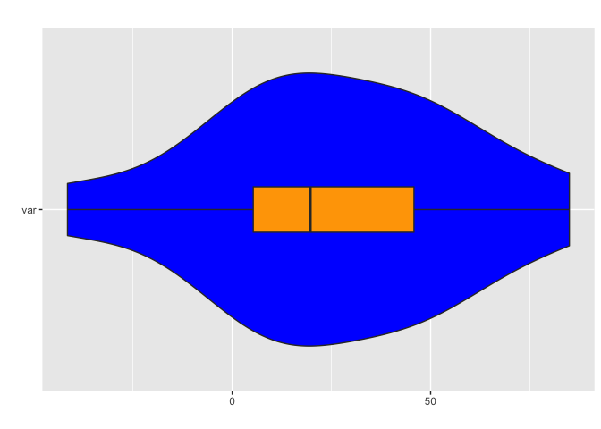<!-- -->

``` r
# Histogram
ggplot(data=books_prices, mapping=aes(x=diff)) +
  geom_histogram(col="red", fill='blue', binwidth=20) 
```

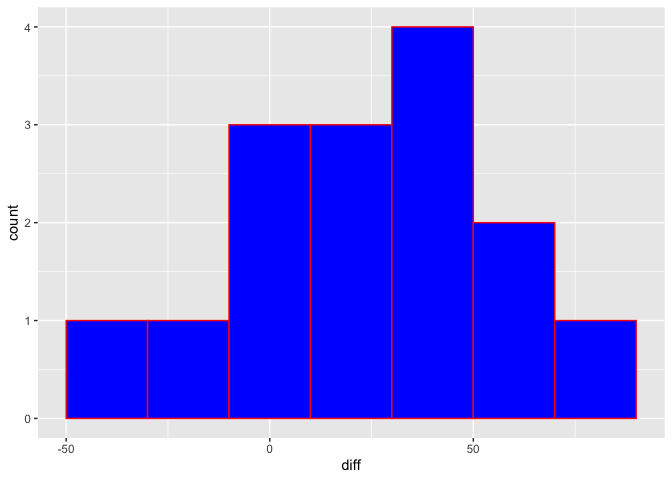<!-- -->

``` r
# QQ-plot
ggplot(data=books_prices, aes(sample=diff)) + stat_qq(col="blue") + stat_qqline(col="red") 
```

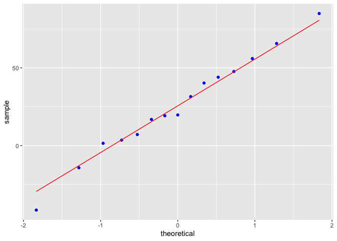<!-- -->

The t-confidence interval estimate for the population mean when the data
is small (n&lt;=25) - in our case n=15. We have paired data, as we
estimated prices for used books in the bookstore and on Amazon - each
book’s price in the bookstore has a pair (the same book) on Amazon. It
means that two samples are not independent, we can not use the
two-sample `t` methods. Because it is the differences we care about,
we’ll treat them as if they were the data, ignoring the original two
columns. A paired t-test is just a one-sample t-test for the means of
their pairwise differences.

And for the one-sample t-test we have Normal Population Assumption. We
need to assume that the population of differences follows a Normal
model. We don’t need to check the individual groups. This condition can
be checked with a histogram or Normal probability plot.

From plots above we get the confirmation of normality. Unimodal
histogram, qq-plot (dots closely follow the line), no outliers to skew
our data.

## Problem 8

H0: p = 0.62 - 62% of Alberta residents between the ages of 25 - 64 had
completed some level of post-secondary education; Ha: p &lt;&gt; 0.62 -
this proportion of residents (aged 25 - 64) of a certain municipality is
different than the provincial proportion.

``` r
p0 = 0.62
x = 145
n = 250

p1 = x / n # sample proportion is 0.58

sd = sqrt(p0 * (1 - p0) / n) # standard deviation of the sampling model, use hypothesized proportion
z = (p1 - p0) / sd # z=-1.3

# Because this is a two-tail test, the P-value is the probability of observing an outcome ... 
# ... less than -1.3 std from the mean of a Normal model in either direction. We must therefore double the probability we find in the left tail
2 * pnorm(z)
```

    ## [1] 0.1925769

We failed to reject the null hypothesis as the p-value is high (at least
higher than 5%).The mean proportion of 62% of Alberta residents between
the ages of 25 - 64 had completed some level of post-secondary education
still holds. The p-value 19% means the probability to see the sample
with sample proportion 0.58 (the one professor collected) *given* that
the hypothesized proportion is 62%.

## Problem 9

### A

H0: proportion 2019 - proportion 2012 = 0 - no statistical difference
between two populations Ha: proportion 2019 - proportion 2012 &lt;&gt; 0
- true mean is not equal to 0

``` r
statistics = two_samples_proportion_func(x1=601, x2=561, n1=1010, n2=1000)
p_2012 = statistics$p1
p_2019 = statistics$p2

p_diff = p_2019 - p_2012
cat("### B \n\n")
```

    ## ### B

``` r
cat("Observed difference of two proportions is", p_diff, "\n")
```

    ## Observed difference of two proportions is -0.0340495

``` r
z_score = statistics$z
cat("The observed difference is", z_score, "standard deviations away from 0 (no difference) \n")
```

    ## The observed difference is -1.545498 standard deviations away from 0 (no difference)

``` r
# Because this is a two-tail test, the P-value is the probability of observing an outcome ... 
# ... less than -1.54 std from the mean of a Normal model in either direction. We must therefore double the probability we find in the left tail
p_value = 2 * pnorm(z_score)
cat("The probability to see that difference of two sample proportions given that there is no difference between them is", p_value, "\n")
```

    ## The probability to see that difference of two sample proportions given that there is no difference between them is 0.1222258

``` r
cat("The difference is not statistically significant as p_value is higher than alpha (significance level) 5%.\n")
```

    ## The difference is not statistically significant as p_value is higher than alpha (significance level) 5%.

``` r
cat("We failed to reject the null hypothesis that two populations are the same. We need to accept H0\n")
```

    ## We failed to reject the null hypothesis that two populations are the same. We need to accept H0

## Problem 10

### A

``` r
cereals_weights = c(497.2, 499.9, 495.8, 490.0, 498.3, 495.1, 486.7, 514.2) # 514.2 - outlier
df_prob10 = data.frame(cereals_weights)

mean_data = mean(cereals_weights)
sd_data = sd(cereals_weights)
n_data = length(cereals_weights)
cat("The mean of data is", mean_data, "with standard deviation", sd_data, "\n")
```

    ## The mean of data is 497.15 with standard deviation 8.158606

``` r
# Boxplot + violin
ggplot(data=df_prob10) + 
  geom_violin(mapping = aes(x = "var", y = cereals_weights), fill= 'blue') + 
  geom_boxplot(mapping = aes(x = "var", y = cereals_weights), width=0.1, fill="orange") +
  xlab("") + 
  ylab("") + 
  ggtitle("") + 
  coord_flip()
```

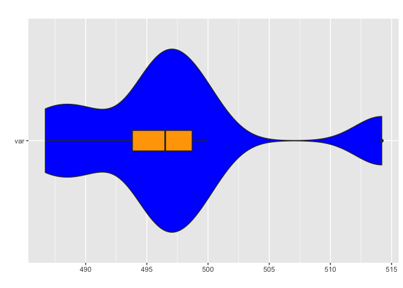<!-- -->

``` r
# Histogram
ggplot(data=df_prob10, mapping=aes(x=cereals_weights)) +
  geom_histogram(col="red", fill='blue', binwidth=5) 
```

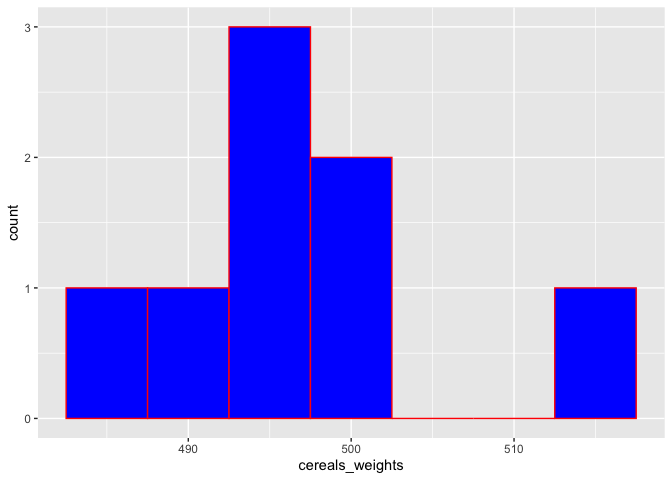<!-- -->

``` r
# QQ-plot
ggplot(data=df_prob10, aes(sample=cereals_weights)) + stat_qq(col="blue") + stat_qqline(col="red") 
```

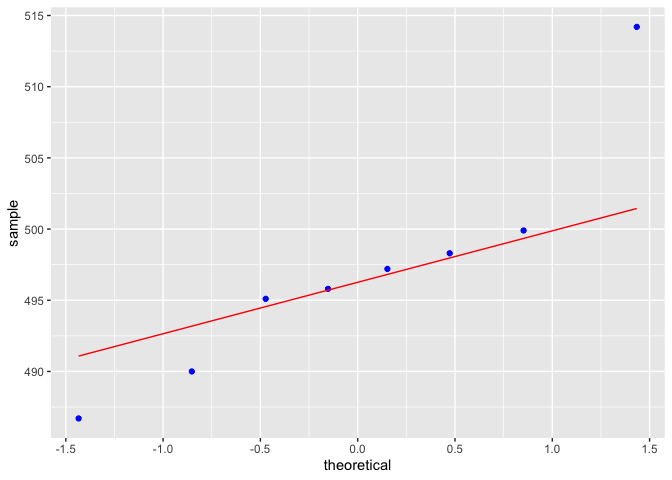<!-- -->

For the one-sample t-test we have Normal Population Assumption. We need
to assume that the population of cereal boxes follows a Normal model.
This condition can be checked with a histogram or Normal probability
plot.

Also, the data should be independent and this condition is satisfied as
Usman randomly picks one box from each of eight different
supermarkets/grocery stores.

From plots above we get the confirmation of normality. But something to
notice is one outlier in the right tail - we can easily spot that from
all plots. This outlier can skew our data. The good idea will be to
remove the outlier and analyze the data with the notice of that one
particular outlier. One outlier can distort conclusions.

From the problem it is not clear what claim Usman wants to prove. Is it
rather that the weight is not equal to what is stated on the box. In
this case we need two-tail test. Or it is that the producer of cereal
claims that the weight is at least 500g, then it is a left-tail test.

H0: weight of the box &gt;= 500; H1: weight of the box &lt; 500g. Use a
0.05 level of significance to test the company’s claim.

``` r
t.test(~cereals_weights, mu=500, alternative='less', data=df_prob10)
```

    ## 
    ##  One Sample t-test
    ## 
    ## data:  cereals_weights
    ## t = -0.98804, df = 7, p-value = 0.178
    ## alternative hypothesis: true mean is less than 500
    ## 95 percent confidence interval:
    ##      -Inf 502.6149
    ## sample estimates:
    ## mean of x 
    ##    497.15

``` r
cat("With a 95% level of confidence, we find the t-multiplier equal to", (mean_data - 500)/(sd_data/sqrt(n_data)), "\n")
```

    ## With a 95% level of confidence, we find the t-multiplier equal to -0.9880385

``` r
cat("The p-value is 17.8% which is more than 5%. We failed to reject the null Hypothesis \n")
```

    ## The p-value is 17.8% which is more than 5%. We failed to reject the null Hypothesis

It is worth mentioning that if we do the same procedure but **remove the
outlier** weight (5.14) we will get following:

The mean of data is 494.7143 vs 497.15 with standard deviation 4.720674
vs 8.158606.

`t = -2.9624` vs -0.98804,

`p-value = 0.0126` vs 0.178,

`upper-bound confidence interval is 498.1814` vs 502.6149.

We *reject the null hypothesis* that box weight is more than 500. So,
came to completely opposite conclusion and I feel like it is the right
way to do this (remove outlier) because we haven’t violated the
normality assumption. Maybe we need to take another sample or consider
that outlier where it came from. But I prefer to work with data without
an outlier for further analysis.

``` r
cereals_weights_no_outlier = c(497.2, 499.9, 495.8, 490.0, 498.3, 495.1, 486.7) # removed outlier
df_prob10_no_outlier = data.frame(cereals_weights_no_outlier)

mean_data_no_outlier = mean(cereals_weights_no_outlier)
sd_data_no_outlier = sd(cereals_weights_no_outlier)
n_data_no_outlier = length(cereals_weights_no_outlier)
cat("The mean of data is", mean_data_no_outlier, "with standard deviation", sd_data_no_outlier, "\n")
```

    ## The mean of data is 494.7143 with standard deviation 4.720674

``` r
t.test(~cereals_weights_no_outlier, mu=500, alternative='less', data=df_prob10_no_outlier)
```

    ## 
    ##  One Sample t-test
    ## 
    ## data:  cereals_weights_no_outlier
    ## t = -2.9624, df = 6, p-value = 0.0126
    ## alternative hypothesis: true mean is less than 500
    ## 95 percent confidence interval:
    ##      -Inf 498.1814
    ## sample estimates:
    ## mean of x 
    ##  494.7143

### B

``` r
# Bootstrap simulation
ntimes = 1000
t_boot = numeric(ntimes)
mean_boot = numeric(ntimes)
for(i in 1:ntimes){  
      sample_data = sample(cereals_weights_no_outlier, nrow(df_prob10_no_outlier), replace=TRUE)
      mean_sample = mean(sample_data)
      sd_sample = sd(sample_data)
      t_boot[i] = (mean_sample - 500) / (sd_sample/sqrt(n_data_no_outlier))
      mean_boot[i] = mean_sample
      
}
      

boot_df_prob10 = data.frame(t_boot, mean_boot)
t5 = quantile(boot_df_prob10$t_boot, 0.05)
print(t5)
```

    ##        5% 
    ## -5.404101

``` r
quantile(boot_df_prob10$mean_boot, c(0.025, 0.975))
```

    ##     2.5%    97.5% 
    ## 491.0554 497.6443

After taking 1000 generated random samples from our initial sample,
bootstrap sample means should be a good estimate of the population
distribution (a 95% confidence interval of that distribution). How does
that compare to the confidence interval based on t-multiplier.

``` r
ggplot(boot_df_prob10, aes(x=mean_boot)) + 
  geom_histogram(binwidth = 1) + 
  geom_vline(xintercept=c(500, mean_data_no_outlier))
```

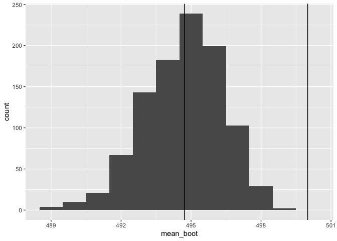<!-- -->

``` r
ggplot(boot_df_prob10, aes(x=t_boot)) + 
  geom_histogram(binwidth = 0.1) 
```

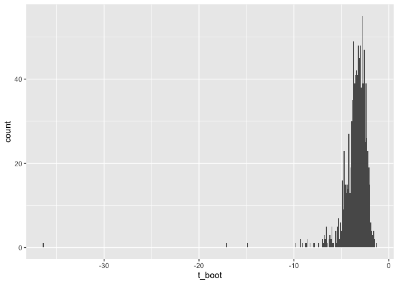<!-- --> The bootstrap 95% confidence
level is 491.3843 - 497.5729.

In addition, the distribution of t-multipliers looks unimodal and skewed
to the left on data without the outlier. But on data with outlier it
looks bimodal.

``` r
500 + (t5 * sd_data_no_outlier / sqrt(n_data_no_outlier))
```

    ##       5% 
    ## 490.3577

### C

From t-test on sample data with outlier upper bound is 498.1814, which
is very close to simulated.  
From the formula above the lower bound is 490.5648 which is again very
close to simulated.

Both simulated and one-sample t-test help us to reject the null
hypothesis that the weight of the cereal box is 500 grams or higher.

## Problem 11

``` r
data_prob11 = c(2.95, 2.21, 2.43, 2.11, 2.77, 3.12)
beta = 2
x_min = 2.018
n = length(data_prob11)

x_values = seq(from=beta, to=3, length.out= 100)

# density functions
f1 = function(x) {exp(-(x - beta))}

f_min = function(x) {n * exp(-n * (x - 2))}
```

### A

We want to find an alpha for Xmin &lt; 2.018. For this we need to
integrate the density function from where Xmin values come from to get
cummulative distribution func. And we are interested in the area to the
left.

``` r
1 - integrate(f_min, lower=2.018, upper= Inf)$value
```

    ## [1] 0.1023724

So, the alpha significance level is 10.24%.

### B

``` r
print(min(data_prob11) < 2.018)
```

    ## [1] FALSE

``` r
print(min(data_prob11))
```

    ## [1] 2.11

According to the test established, our min sample value is higher that
threshold 2.018. We failed to reject null hypothesis that beta equals 2.

### C

In part c) we want to change H0 that beta equals 2 to H0: beta equals
1.8. So, we need to make some changes to our prob density function. And
calculate the probability of concluding that beta = 2, meaning the right
tail of cumulative prob func.

``` r
f_min = function(x, beta) {n * exp(-n * (x - 1.8))} # H0: beta = 1.8
integrate(f_min, lower=2, upper= Inf)$value # the probability of concluding that beta = 2
```

    ## [1] 0.3011942

### D

``` r
f_min = function(x, beta) {n * exp(-n * (x - 2))} # change to initial H0: beta = 2
1 - integrate(f_min, lower=2.0372, upper= Inf)$value # I found this value with the help of binary search (no code)
```

    ## [1] 0.2000452
