Assignment 4
================
Andrii Voitkiv
October 15th, 2022

-   [Problem 1](#problem-1)
-   [Problem 2](#problem-2)
-   [Problem 3](#problem-3)
-   [Problem 4](#problem-4)
-   [Problem 5](#problem-5)
-   [Problem 6](#problem-6)
-   [Problem 7](#problem-7)
-   [Problem 8](#problem-8)
-   [Problem 9](#problem-9)
-   [Problem 10](#problem-10)

``` r
knitr::opts_chunk$set(fig.path='Figs/')
```
## Problem 1

### A

H0: recovery time of a group who takes *vitamin* minus recovery time of
a group who takes placebo is *more or equal than zero* Ha: recovery time
is faster with vitamin

``` r
vitamin = c(6, 7, 7, 7, 8, 7, 7, 8, 7, 8, 10, 6, 8, 5, 6)
placebo = c(10, 12, 8, 6, 9, 8, 11, 9, 11, 8, 12, 11, 9, 8, 10, 9)

#length
vitamin_len = length(vitamin)
placebo_len = length(placebo)
total_len = vitamin_len + placebo_len

# make a df
all_data = c(vitamin, placebo)
treat = c(rep("vitamin", vitamin_len), rep("placebo", placebo_len))
df_prob1 = data.frame(treat, all_data)

# observed difference
diff_obs_prob1 = mean(~all_data, data=filter(df_prob1, treat=="vitamin")) - mean(~all_data, data=filter(df_prob1, treat=="placebo"))
```

``` r
# permutation test
nsims <- 2000
mean_diff <- numeric(nsims)
mean_vitamin <- numeric(nsims)
mean_placebo <- numeric(nsims)
for(i in 1:nsims){
  index <- sample(1:total_len, vitamin_len, replace=FALSE)
  mean_vitamin[i] <- mean(df_prob1$all_data[index])
  mean_placebo[i] <- mean(df_prob1$all_data[-index])
  mean_diff[i] <- mean_vitamin[i] - mean_placebo[i]}
```

``` r
# data frame
perm_test_prob1 <- data.frame(mean_vitamin, mean_placebo, mean_diff)
```

Visualisation to show where observed data lies on distribution.

``` r
ggplot(perm_test_prob1, aes(x = mean_diff)) + 
  geom_histogram(col="red", fill="blue", binwidth=0.5) + 
  xlab("Difference between vitamin - placebo") + 
  ylab("Count") + 
  ggtitle("Outcome of 2000 Permutation Tests") + 
  geom_vline(xintercept = diff_obs_prob1, col="orange")
```

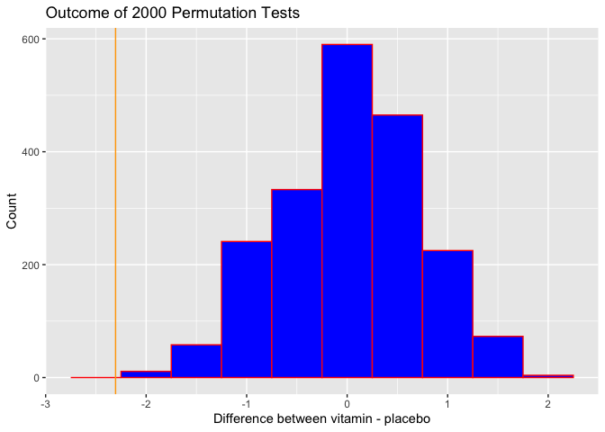<!-- -->

``` r
# empirical p-value
(sum(perm_test_prob1$mean_diff <= diff_obs_prob1)) / nsims # left-tail test
```

    ## [1] 0

*Inference: observed mean difference is something unusual to see given
that the two sample means are the result of randomness (or the null H is
true). The histogram with the observed difference (approx 2.30 hours
faster recovery with vitamin) and the empirical p-value (zero) suggest
that we can reject H0. And the vitamin actually has an effect and
patients recover faster.*

### B

As the samples’ size are small, we need to ensure that data comes from
Normal distribution to be able to perform t-test.

``` r
# QQ-plot
ggplot(filter(df_prob1, treat=="placebo"), aes(sample=all_data)) + 
  stat_qq(col="blue") + 
  stat_qqline(col="red") + 
  ggtitle("Normal Probability Plot of time recovery: placebo")
```

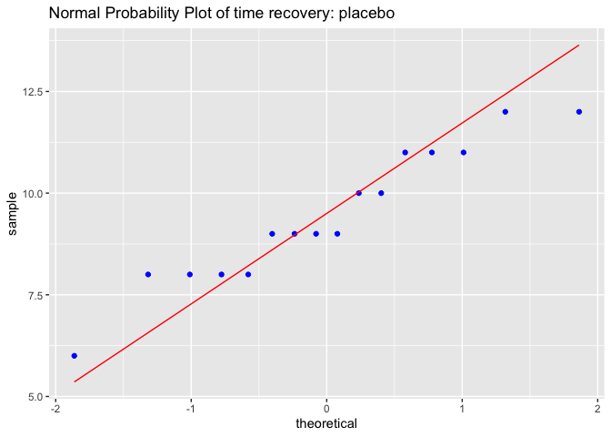<!-- -->

``` r
ggplot(filter(df_prob1, treat=="vitamin"), aes(sample=all_data)) + 
  stat_qq(col="blue") + 
  stat_qqline(col="red") + 
  ggtitle("Normal Probability Plot of time recovery: vitamin")
```

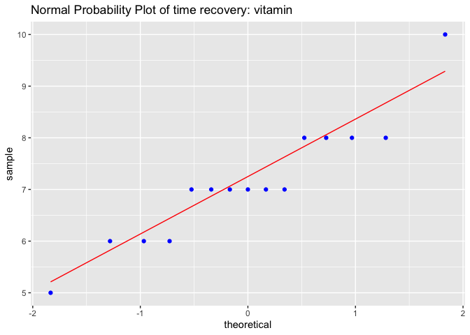<!-- --> The dots (data) for both samples
follow the line, so the data comes from approx Normal Distribution.

T-test

``` r
# Method 1
t_obs = (diff_obs_prob1 - 0) / sqrt((sd(vitamin)**2/vitamin_len) + (sd(placebo)**2/placebo_len))
deg_f =  (sd(vitamin)**2/vitamin_len + sd(placebo)**2/placebo_len)**2 / 
  ((1/(vitamin_len-1))*(sd(vitamin)**2/vitamin_len)**2 + (1/(placebo_len-1))*(sd(placebo)**2/placebo_len)**2)
p_value = pt(t_obs, deg_f)

cat("T observed is", t_obs, "with degrees of freedom", deg_f, "and p-value", p_value)
```

    ## T observed is -4.44502 with degrees of freedom 27.08007 and p-value 6.722629e-05

``` r
# Method 2
t.test(vitamin, placebo, mu=0, alternative="less")
```

    ## 
    ##  Welch Two Sample t-test
    ## 
    ## data:  vitamin and placebo
    ## t = -4.445, df = 27.08, p-value = 6.723e-05
    ## alternative hypothesis: true difference in means is less than 0
    ## 95 percent confidence interval:
    ##       -Inf -1.421325
    ## sample estimates:
    ## mean of x mean of y 
    ##  7.133333  9.437500

Both methods gave the same results with negligible P-value. It means
that it’s almost impossible to see the data (samples) like this given
that the null hypothesis is true. We can reject the null hypothesis and
say that there is strong evidence that vitamin intakes can make the
recovery time faster.

## Problem 2

### A

``` r
race = c(rep("Caucasian", 45+85), rep("African-American", 14+218))
sentenced = c(rep("death", 45), rep("no death", 85), rep("death", 14), rep("no death", 218))
df_prob2 = data.frame(race, sentenced)
```

``` r
# if we want to examine if the race effects the sentence than I will plot race as independent x-variable
ggplot(data=df_prob2) + geom_bar(aes(x = race, fill = sentenced), position = "fill")
```

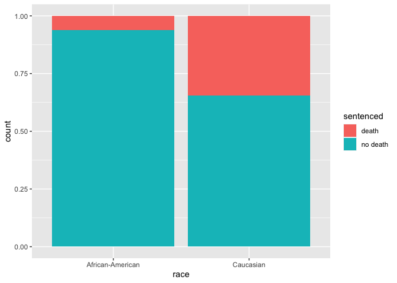<!-- -->

``` r
ggplot(data=df_prob2) + geom_bar(aes(x = race, fill = sentenced), position = "dodge")
```

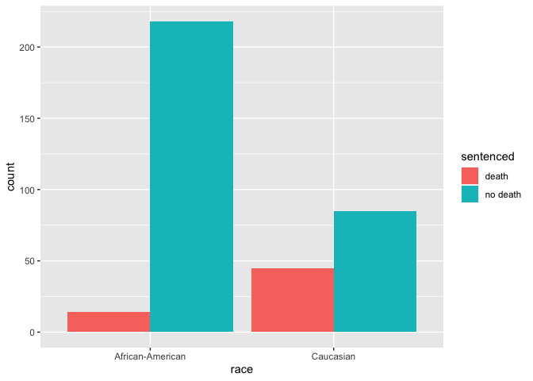<!-- --> We can see from the bar graphs
that approx 9 out of 10 who were not sentenced to death were
African-American race. And among Caucasians there were more deadly
sentences. But we don’t know if there is a relationship between race and
sentence or the data we observe is due to randomness.

### B

H0: the race of the victim DOES NOT appear to affect whether an
African-American convicted of murder in Georgia will receive a death
sentence Ha: the race of the victim DOES appear to affect whether an
African-American convicted of murder in Georgia will receive a death
sentence

Test the claim that the proportion of all convicted murders sentenced to
Death whose victim was Caucasian is greater than the proportion of those
sentenced to Death whose victim was African-American.

If sentence to death on not sentence to death dependent on race. For
independent events p(A) must equal p(A given B).A chi-square test for
independence.

``` r
# Rearranging data in different format
death = c(45, 14)
no_death = c(85, 218)
race = c("Caucasian", "African-American")
df_prob2 = data.frame(death, no_death)
rowTot = rowSums(df_prob2) 
```

``` r
# METHOD 1
prop.test(death, rowTot, alternative="greater", correct=TRUE)
```

    ## 
    ##  2-sample test for equality of proportions with continuity correction
    ## 
    ## data:  death out of rowTot
    ## X-squared = 47.815, df = 1, p-value = 2.342e-12
    ## alternative hypothesis: greater
    ## 95 percent confidence interval:
    ##  0.2065162 1.0000000
    ## sample estimates:
    ##     prop 1     prop 2 
    ## 0.34615385 0.06034483

``` r
# METHOD 2
chisq.test(df_prob2)
```

    ## 
    ##  Pearson's Chi-squared test with Yates' continuity correction
    ## 
    ## data:  df_prob2
    ## X-squared = 47.815, df = 1, p-value = 4.684e-12

Because the p-value is so low, we reject H0. This data is a strong
evidence to reject the null hypothesis that sentence happened
independently of race. From this data, we are 95% confident that the
true proportin should be somewhere between 0.21 and 1.

## Problem 3

### A

*carry out the appropriate statistical method that will investigate if,
on average, cloud seeding does have an effect on rainfall. Should you
find an effect, provide a 95% interval that will capture the amount of
this effect. Ensure that your choice of statistical method is
justified.*

``` r
df_prob3 = read.csv("http://people.ucalgary.ca/~jbstall/DataFiles/CloudSeedingData.csv")

seeded = filter(df_prob3, TREATMENT=="SEEDED")
unseeded = filter(df_prob3, TREATMENT=="UNSEEDED")
```

QQ-plot to unsure the sample data comes from Normal distribution.

``` r
ggplot(filter(df_prob3, TREATMENT=="SEEDED"), aes(sample=RAINFALL)) + 
  stat_qq(col="blue") + 
  stat_qqline(col="red") + 
  ggtitle("Normal Probability Plot of Rainfall: Seeded")
```

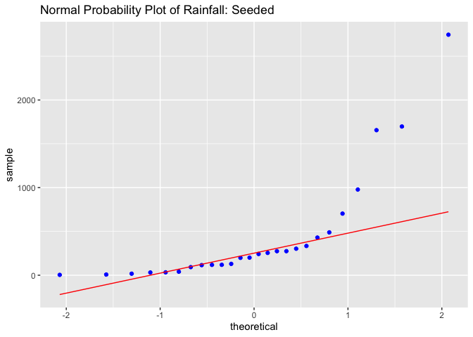<!-- -->

``` r
ggplot(filter(df_prob3, TREATMENT=="UNSEEDED"), aes(sample=RAINFALL)) + 
  stat_qq(col="blue") + 
  stat_qqline(col="red") + 
  ggtitle("Normal Probability Plot of Rainfall: Unseeded")
```

<!-- --> The qq-plot shows that we have
big deviations at the right tail (much bigger than normally expected).
Except that the data seems to come from approx Normal distribution.

H0: cloud seeding have NO effect on rainfall Ha: cloud seeding has an
effect on rainfall

``` r
t.test(seeded$RAINFALL, unseeded$RAINFALL, mu=0, alternate='two.sided', conf.level = 0.95)
```

    ## 
    ##  Welch Two Sample t-test
    ## 
    ## data:  seeded$RAINFALL and unseeded$RAINFALL
    ## t = 1.9982, df = 33.855, p-value = 0.05377
    ## alternative hypothesis: true difference in means is not equal to 0
    ## 95 percent confidence interval:
    ##   -4.764295 559.556603
    ## sample estimates:
    ## mean of x mean of y 
    ##  441.9846  164.5885

95 percent confidence interval: from -4.764295 to 559.556603. As zero
falls into the interval, we cannot reject H0. Probability to this data
is 5.38% given that H0 (in-dependable variables) is true. If our alpha
(level of significance) is 5% than we should accept that variables are
independent but still worth considering the p-value.

### B

H0: the standard deviation in the rainfall amounts between clouds that
are seeded and unseeded is same HA: the standard deviation in the
rainfall amounts between clouds that are seeded and unseeded is NOT the
same

``` r
ntimes = 2000
mean_seeded = numeric(ntimes)
mean_unseeded = numeric(ntimes)
diff_mean = numeric(ntimes)
division_sd = numeric(ntimes)
for(i in 1:ntimes){  
  index = sample(1:nrow(df_prob3), nrow(seeded), replace=FALSE)
  mean_seeded[i] = mean(df_prob3$RAINFALL[index])
  mean_unseeded[i] = mean(df_prob3$RAINFALL[-index])
  sd_seeded = sd(df_prob3$RAINFALL[index])
  sd_unseeded = sd(df_prob3$RAINFALL[-index])
  diff_mean[i] = mean_seeded[i] - mean_unseeded[i]
  division_sd[i] = sd_seeded / sd_unseeded
}

perm_test_prob3 = data.frame(mean_seeded, mean_unseeded, diff_mean, division_sd)
```

``` r
# 95% conf interval
qdata(~division_sd, c(0.025, 0.975), data=perm_test_prob3)
```

    ##      2.5%     97.5% 
    ## 0.3123809 3.1922414

``` r
div_sd_obs = sd(~RAINFALL, data=filter(df_prob3, TREATMENT=="SEEDED")) / sd(~RAINFALL, data=filter(df_prob3, TREATMENT=="UNSEEDED"))
print(div_sd_obs)
```

    ## [1] 2.337376

``` r
(sum(division_sd >= div_sd_obs) + sum(division_sd <= (-1*div_sd_obs)))/(ntimes)
```

    ## [1] 0.081

The standard deviation in the rainfall amounts between clouds that are
seeded and unseeded is approximately the same because 1 falls into the
interval from 0.3124351 to 3.1834084 with 95% of confidence. Even though
sd(seeded)/sd(unseeded) = 1 falls into the interval, as the range is
wide enough we have to be somewhat cautious with our statement.

The probability to see 2.33 times higher std for data seeded is 7.85%
given that the H0 is true (std are equal). We cannot reject H0 and have
to accept that they are equal.

### C

``` r
# Log transform
df_prob3$log_rainfall = log(df_prob3$RAINFALL, exp(1))
```

Check for normality.

``` r
ggplot(filter(df_prob3, TREATMENT=="SEEDED"), aes(sample=log_rainfall)) + 
  stat_qq(col="blue") + 
  stat_qqline(col="red") + 
  ggtitle("Normal Probability Plot of Rainfall: Seeded")
```

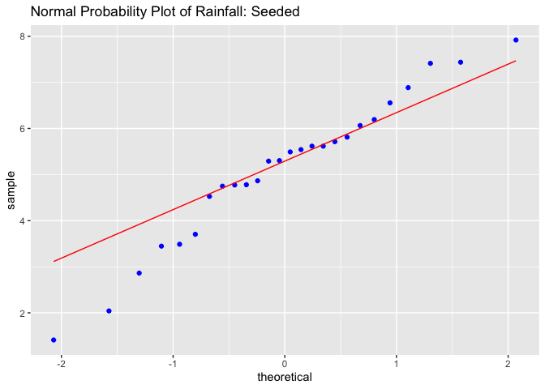<!-- -->

``` r
ggplot(filter(df_prob3, TREATMENT=="UNSEEDED"), aes(sample=log_rainfall)) + 
  stat_qq(col="blue") + 
  stat_qqline(col="red") + 
  ggtitle("Normal Probability Plot of Rainfall: Unseeded")
```

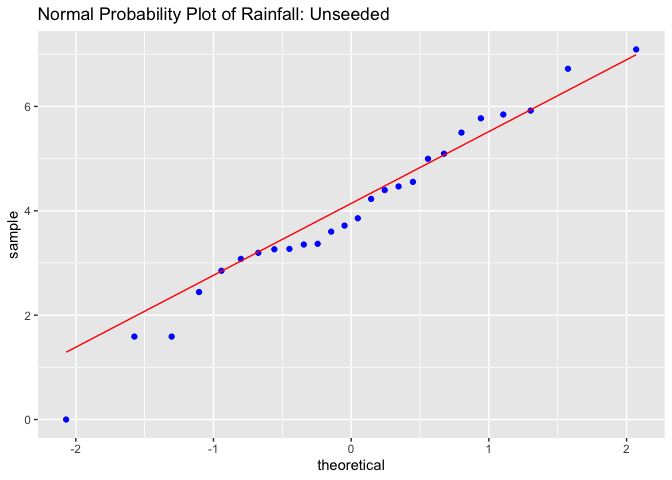<!-- -->

``` r
# observed mean difference
log_mean_diff = mean(~log_rainfall, data=filter(df_prob3, TREATMENT=="SEEDED")) - mean(~log_rainfall, data=filter(df_prob3, TREATMENT=="UNSEEDED"))
cat(exp(log_mean_diff), "many more times the median rainfall from seeded cloudsis larger as the median rainfall from unseeded clouds.")
```

    ## 3.138614 many more times the median rainfall from seeded cloudsis larger as the median rainfall from unseeded clouds.

## Problem 4

H0: hair growth and treatment are independent variables Ha: minoxidil is
effective in treating male pattern baldness

``` r
remedy = rbind(c(211, 99), c(247,62))
rownames(remedy) = c("remedy", "placebo")
colnames(remedy) = c("bold", "hair")

# chisq test
chisq.test(remedy, correct=FALSE)
```

    ## 
    ##  Pearson's Chi-squared test
    ## 
    ## data:  remedy
    ## X-squared = 11.331, df = 1, p-value = 0.0007622

``` r
#prop.test(c(99+1, 62+1), c(310+2,309+2), correct=FALSE)
```

P-value is 0.0007622 says that if the hair growth was not associated
with minoxidi treatment, an observed chi-square value of 11.33 or higher
would occur about 0.076% of the time. This certainly is unusual, so I
reject the null hypothesis, and conclude that this data shows evidence
of effect of treatment on hair growth.

## Problem 5

``` r
df_prob5 = read.csv("http://people.ucalgary.ca/~jbstall/DataFiles/chocnochocratings.csv")
```

### A

*Pertaining to Question 9: Do these data suggest there is a treatment
effect? Test the existance of a treatment effect using a permutation
test. If a treatment effect is discovered, explain its meaning in the
context of these data.*

Treatment is the combination of specific levels from all the factors
that participants of the experiment receive. Treatment effect in this
case is students who received chocolate evaluated instructor higher.
Let’s state the hypothesis. H0: there is no difference between means of
two groups.

``` r
choc = filter(df_prob5, GroupName=="Chocolate")
nochoc = filter(df_prob5, GroupName=="NOChoc")
# observed mean difference
diff_obs_prob5 = mean(~Q9, data=filter(df_prob5, GroupName=="Chocolate"))  - mean(~Q9, data=filter(df_prob5, GroupName=="NOChoc")) 
# permutation test
ntimes = 2000
mean_choc = numeric(ntimes)
mean_nochoc = numeric(ntimes)
diff_mean = numeric(ntimes)
for(i in 1:ntimes){  
  index = sample(1:nrow(df_prob5), nrow(choc), replace=FALSE)
  mean_choc[i] = mean(df_prob5$Q9[index])
  mean_nochoc[i] = mean(df_prob5$Q9[-index])
  diff_mean[i] = mean_choc[i] - mean_nochoc[i]
}

perm_test_prob5 = data.frame(mean_choc, mean_nochoc, diff_mean)
```

``` r
ggplot(perm_test_prob5, aes(x = diff_mean)) + 
  geom_histogram(col="red", fill="blue", binwidth=0.1) + 
  xlab("Difference in Q9 score between those who received chocolate and those who don't") + 
  ylab("Count") + 
  ggtitle("Outcome of 2000 Permutation Tests") + 
  geom_vline(xintercept = diff_obs_prob5, col="green")
```

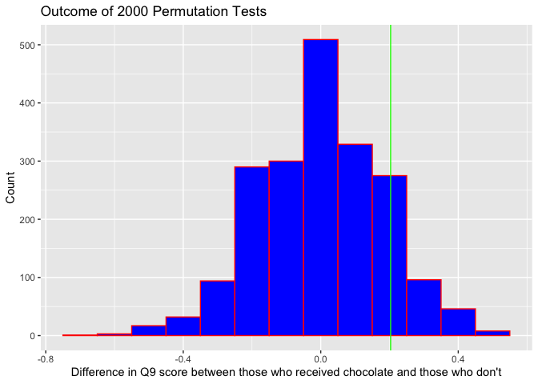<!-- -->

``` r
# empirical p-value - two-tailed test
(sum(diff_mean >= diff_obs_prob5) + sum(diff_mean <= (-1*diff_obs_prob5)))/(ntimes)
```

    ## [1] 0.317

Even though the observed difference higher than zero (mean Q9 score
chocolate - mean Q9 score no chocolate) and is equal to 0.20, meaning
from this data the professor got higher score on Q9 from students who
received chocolate, the permutation test shows us that it is not
statistically significant, as empirical p-value is much higher than 5%
(it is approx 32.55%), and the observed positive difference is due to
randomness. So, we failed to reject the null hypothesis. And to
conclude, the data doesn’t suggest there is a treatment effect. Also,
histogram plot confirms that observed difference between the sample
means occurs in the distribution of differences of sample means, we can
see that it is a likely outcome, implying that chocolate didn’t effect
how students evaluated professor.

### B

Check length condition

``` r
cat("Length of sample 1 is", nrow(choc), "and satisfies sample size condition:", nrow(choc) > 25, "\n")
```

    ## Length of sample 1 is 50 and satisfies sample size condition: TRUE

``` r
cat("Length of sample 2 is", nrow(nochoc), "and satisfies sample size condition:", nrow(nochoc) > 25, "\n")
```

    ## Length of sample 2 is 48 and satisfies sample size condition: TRUE

Check for normality.

``` r
ggplot(choc, aes(sample=Overall)) + 
  stat_qq(col="blue") + 
  stat_qqline(col="red") + 
  ggtitle("Normal Probability Plot of Overall score: Chocolate")
```

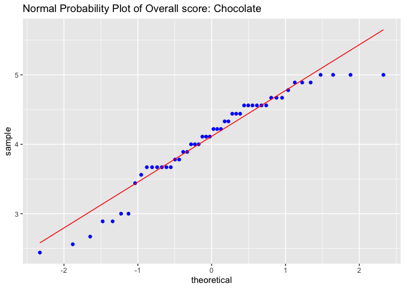<!-- -->

``` r
ggplot(nochoc, aes(sample=Overall)) + 
  stat_qq(col="blue") + 
  stat_qqline(col="red") + 
  ggtitle("Normal Probability Plot of Overall score: NOChoc")
```

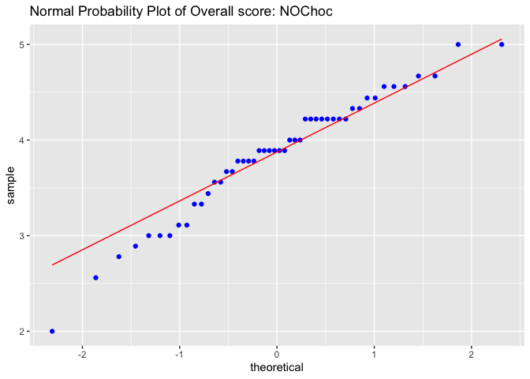<!-- -->

That is a two-tail test.

``` r
t.test(choc$Overall, nochoc$Overall, mu=0, alternative="two.sided", conf.level = 0.95)
```

    ## 
    ##  Welch Two Sample t-test
    ## 
    ## data:  choc$Overall and nochoc$Overall
    ## t = 1.6616, df = 95.93, p-value = 0.09986
    ## alternative hypothesis: true difference in means is not equal to 0
    ## 95 percent confidence interval:
    ##  -0.04324976  0.48766643
    ## sample estimates:
    ## mean of x mean of y 
    ##  4.072000  3.849792

The t-test produced t = 1.66 with 95.93 and p-value approx 10%.
Probability to get this data from the experiment is not high (10%) but
not something unusual. We failed to reject the null hypothesis and
conclude that there is no effect of treatment (chocolate) on evaluation
process. The zero difference between two samples still falls in 95%
confidence interval which is from 0.04324976 to 0.48766643.

### C

Permutation test assumes nothing about the data. We don’t have to
hypothesize about the mean difference of two populations. On contrary,
the parametric test has few assumptions, such as: independence
assumption, normal population assumption and independent groups
assumption. The normality assumption matters most when sample sizes are
small. In our case, samples are medium sized, they are not really small
as they satisfy condition (&gt;25). Both groups are bigger than 45, the
CLT starts to kick in no matter how the data are distributed. QQ-plots
also don’t show any skewness or significant outliers. The issues can be
when there are few modes. As the score varies between discrete values 1
and 5 we can see some score clustering per question. That is not good
for the t-test.

## Problem 6

### A

H0: the proportion of Alberta residents who support the Alberta’s
adoption of a sales tax hasn’t changed since 2018 (the same or
decreased) Ha: the proportion of Alberta residents who support the
Alberta’s adoption of a sales tax INCREASED since 2018

``` r
n20 = 900
x20 = 358
n18 = 900
x18 = 225
# proportions
p20 = x20 / n20
p18 = x18 / n18
# observed proportion diff
prop_diff = p20 - p18

outcome = c(c(rep(1, p20 * n20), rep(0, (1 - p20) * n20)), c(rep(1, p18 * n18), rep(0, (1 - p18) * n18))) # combine two samples
```

``` r
# permutation test
ntimes = 2000
diff_mean = numeric(ntimes)
for(i in 1:ntimes){  
  index = sample(1:length(outcome), 900, replace=FALSE)
  diff_mean[i] = mean(outcome[index]) - mean(outcome[-index])
}

perm_test_prob6 = data.frame(diff_mean)
```

``` r
ggplot(perm_test_prob6, aes(x = diff_mean)) + 
  geom_histogram(col="red", fill="blue", binwidth=0.01) + 
  xlab("Difference in proportions of Albertans who agreed in 2020 and 2018 years") + 
  ylab("Count") + 
  ggtitle("Outcome of 2000 Permutation Tests") + 
  geom_vline(xintercept = prop_diff, col="green")
```

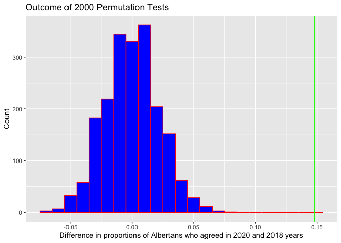<!-- --> If the observed positive
difference between two proportions (two years: p2021 - p2018) was due to
randomness, than it would occur somewhere on the distribution of the
proportion mean differences. But in fact, the observed difference if far
to the right beyond the right tail meaning the two sample proportions
are not equal - reject H0. By accepting alternative hypothesis, we can
say that with this data we observed strong evidence that there was an
increase in proportion of Albertans who support the adoption of sales
tax in year 2020 compare to year 2018.

### B

``` r
prop.test(c(358, 225), c(900,900), alternative = "greater", correct=FALSE)
```

    ## 
    ##  2-sample test for equality of proportions without continuity correction
    ## 
    ## data:  c out of c358 out of 900225 out of 900
    ## X-squared = 44.876, df = 1, p-value = 1.049e-11
    ## alternative hypothesis: greater
    ## 95 percent confidence interval:
    ##  0.1119479 1.0000000
    ## sample estimates:
    ##    prop 1    prop 2 
    ## 0.3977778 0.2500000

``` r
z_score = sqrt(44.876) # since the diff between two proportions is positive assign "+" sign before square root
cat("z-score is", z_score)
```

    ## z-score is 6.698955

The p-value or probability to observe this data given that there is no
difference between two sample proportions is negligible. The z-score
calculated as square root of X-squared statistic is 6.7 that is much
higher than 3 standard deviations in Normal distribution. Regarding the
P-value and the z-score, I reject the null hypothesis and conclude there
is strong evidence that there was an increase in proportion of Albertans
who support the adoption of sales tax in year 2020 compare to year 2018.

### C

``` r
# 95% conf interval from permutation test
sd = sd(perm_test_prob6$diff_mean) # standard dev of mean differences
margin_error = 1.96 * sd # 1.96 * st dev is 95% in normal distribution
# lower/upper bound
lb = prop_diff - margin_error
ub = prop_diff + margin_error
cat("95 confidence interval is from", lb, "to", ub)
```

    ## 95 confidence interval is from 0.1045577 to 0.1909978

From this data, the true difference between two proportions is somewhere
between 0.10 and 0.19.

## Problem 7

``` r
capmdata = read.csv("http://people.ucalgary.ca/~jbstall/DataFiles/capm.csv")
```

### A

``` r
ggplot(capmdata, aes(x = TSE.Index, y = Suncor)) + 
  geom_point(col="blue", size = 2) +
  geom_smooth(method="lm")
```

    ## `geom_smooth()` using formula 'y ~ x'

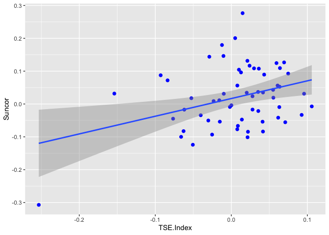<!-- -->

From this scatterplot we can see a pattern that runs from lower-left to
upper-right, meaning positive relationship. The form appears to be as a
cloud of points stretched out in a generally consistent, straight form,
although some points stray away from it. Regarding the strength of the
relationship, the points don’t cluster tightly, and kind of vague. Also,
there is one outlier standing away from the overall pattern.

### B

``` r
predict_stock = lm(Suncor ~ TSE.Index, data=capmdata) 
predict_stock$coefficients
```

    ## (Intercept)   TSE.Index 
    ##  0.01664794  0.53869099

PredictedSuncorReturn = 0.01664794 + 0.53869099 \* TSE.IndexReturn

### C

A positive coefficient beta1 that is equal to 0.5387 indicates that as
the return of the TSE.Index increases let’s say 1%, the mean return of
Suncor also tends to increase by 0.53%. In context it means that Suncor
stock is not a relatively risky asset because volatility is roughly hald
of index volatility (which usually acts like a benchmark). The risk-free
premium is 0.017%. In terms of stock there is a dividend-yield but this
is not related to beta0 in our case. So, it is just the part of the
model.

### D

``` r
predict(predict_stock, data.frame(TSE.Index=4)) 
```

    ##        1 
    ## 2.171412

If the TSE Index will increase by 4%, the expected Suncor growth will be
2.17%

### E

There are two conditions, or foundations, upon which the model building
that we have began are built upon.

1.  The y-variable, or commonly known as the response variable, is
    Normally distributed with a mean mu and standard deviation of
    sigma - normality of the residuals

2.  For each distinct value of the x-variable (the predictor variable),
    the y variable has the same standard deviation sigma -
    homoscedasticity

``` r
# Check normality of residuals
model_predicted = predict_stock$fitted.values #place the predicted values of Suncor returns for each observed TSE index return
model_residuals = predict_stock$residuals
assumptions_df = data.frame(model_predicted, model_residuals)

# qq plot
ggplot(assumptions_df, aes(sample = model_residuals)) +  
  stat_qq(col='blue') + 
  stat_qqline(col='red') + 
  ggtitle("Normal Probability Plot of Residuals")
```

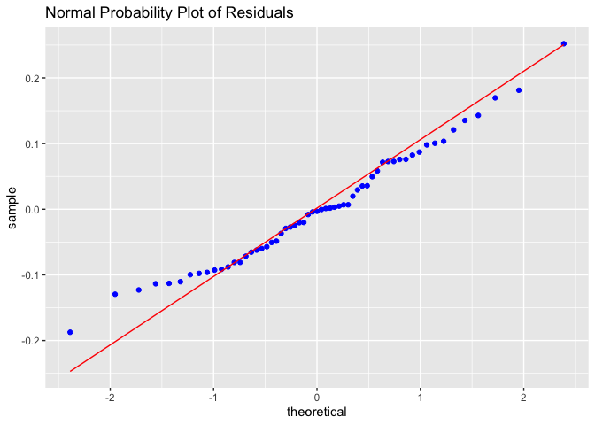<!-- -->

``` r
# Check homoscedasticity
ggplot(assumptions_df, aes(x = model_predicted, y = model_residuals)) +  
  geom_point(size=2, col='blue', position="jitter") + 
  xlab("Predicted % return of Suncor") + 
  ylab("Residuals") + 
  ggtitle("Plot of Fits to Residuals") + 
  geom_hline(yintercept=0, color="red", linetype="dashed")
```

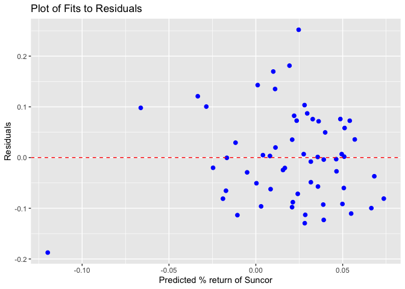<!-- -->

From qq-plot the points appear in a strainght line and follow the
diagonal line. This suggests normality. The scatterplot of residuals
doesn’t appear to have any shape, pattern or direction. The points
appear fairly uniformly scattered about the flat dotted line (zero
line). This suggests homoscedasticity.

### F

The null hypothesis about the slope (beta1) is that it equals to 0. It
means that Suncor stock returns doesn’t tend to change linearly when TSE
Index changes - there is no linear association between the two
variables. Ha: there is linear association.

``` r
coef(summary(predict_stock))
```

    ##               Estimate Std. Error  t value    Pr(>|t|)
    ## (Intercept) 0.01664794 0.01177393 1.413966 0.162810655
    ## TSE.Index   0.53869099 0.19177963 2.808906 0.006797419

``` r
t_beta1 = (0.53869099-0)/0.19177963
print(t_beta1)
```

    ## [1] 2.808906

Nearly 2.8 standard errors from the hypothesyzed value (beta1 = 0)
certainly seems big. The P-value 0.68% (&lt;5%) confirms that t-ratio
this large would be unlikely to occur if the true slope were zero.
Reject null hypothesis and conclude that there a positive linear
relationship between index and stock.

### G

``` r
# method 1
t = qt(0.975, nrow(capmdata)-2)
lb_b1 = 0.53869099 - t * 0.19177963
ub_b1 = 0.53869099 + t * 0.19177963
cat(lb_b1, ub_b1, "\n")
```

    ## 0.1546589 0.9227231

``` r
# method 2
confint(predict_stock, conf.level=0.95)
```

    ##                    2.5 %     97.5 %
    ## (Intercept) -0.006928949 0.04022482
    ## TSE.Index    0.154658904 0.92272309

As beta1 (slope) may vary for another sample of data, so we are 95%
confident to say that the true slope varies somewhere between 0.155 to
0.923. That suggests if TSE Index will increase 1%, we expect Suncore
stock to increase somewhere between 0.15% to 0.92%.

### H

``` r
predict(predict_stock, newdata=data.frame(TSE.Index = 3), interval="conf") # use interval="conf" for **mean** monthly rate
```

    ##        fit       lwr      upr
    ## 1 1.632721 0.4828228 2.782619

We are 95% conf when TSE Index changes by 3% the Suncor changes from
0.4828228% to 2.782619%

### I

``` r
predict(predict_stock, newdata=data.frame(TSE.Index = 1.16), interval="predict") # use interval="predict" for individual monthly rate
```

    ##         fit       lwr      upr
    ## 1 0.6415295 0.1626974 1.120362

TWe are 95% conf when TSE Index is 1.16% in a month of September we
expect Suncor changes from 0.1626974% to 1.120362%

### J

``` r
nsims = 1000 
cor = numeric(nsims) 
nsize = nrow(capmdata)
for(i in 1:nsims)
{   
    index = sample(nsize, replace=TRUE)  
    sample = capmdata[index, ] #accesses the i-th row of the capmdata data frame
    cor[i] = cor(~Suncor, ~TSE.Index, data=sample) # correlation for bootstrap sample
}

boot_df_prob7 = data.frame(cor)
```

Plot distribution of bootstrap statistics r (correlation)

``` r
ggplot(boot_df_prob7, aes(x = cor)) + 
  geom_histogram(col="red", fill="blue", binwidth=0.025) + 
  xlab("Values of the Bootstrap Statistic: Correlation Coefficient") + 
  ylab("Count") + 
  ggtitle("Distribution of Bootstrap Statistics: r")
```

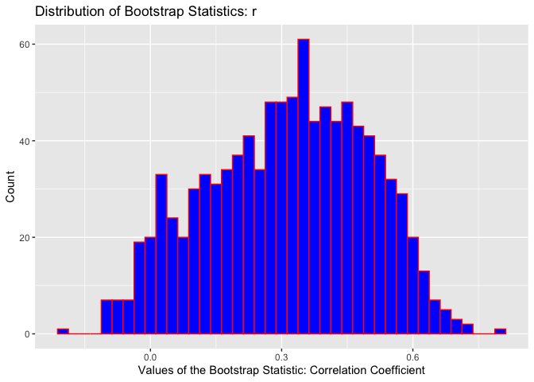<!-- -->

``` r
qdata(~cor, c(0.025, 0.975), data=boot_df_prob7)
```

    ##        2.5%       97.5% 
    ## -0.03082932  0.62122145

From this data, we are 95% confident, that the true value of correlation
is between -0.01344798 and 0.62667264

## Problem 8

``` r
gss = read.csv("http://people.ucalgary.ca/~jbstall/DataFiles/GSS2002.csv")
```

### A

H0: there is NO a relationship between one’s support for gun laws and
their opinion about current government spending on Science. Ha: there is
a relationship between one’s support for gun laws and their opinion
about current government spending on Science.

``` r
sub_gss_A = na.omit(gss[,c("GunLaw","SpendSci")]) # select columns and remove NAs 
counts_A = table(sub_gss_A$GunLaw, sub_gss_A$SpendSci) 
counts_A
```

    ##         
    ##          About right Too little Too much
    ##   Favor          166        117       42
    ##   Oppose          35         37       12

### B

``` r
chisq.test(counts_A)
```

    ## 
    ##  Pearson's Chi-squared test
    ## 
    ## data:  counts_A
    ## X-squared = 2.4447, df = 2, p-value = 0.2945

### C

The chisq test produces following statistics: chi-squared is equal to
2.4447 with two degrees of freedom and the p-value 0.2945. Probability
to see this data give that null hypothesis is true equals to 29.5%. That
is not something unusual. Consequentially, we failed to reject the null
hypothesis and don’t have a strong evidence that there is a relationship
between one’s support for gun laws and their opinion about current
government spending on Science.

### D

``` r
ggplot(data=gss) + geom_bar(aes(x = Education, fill = Race), position = "fill", na.rm=TRUE)
```

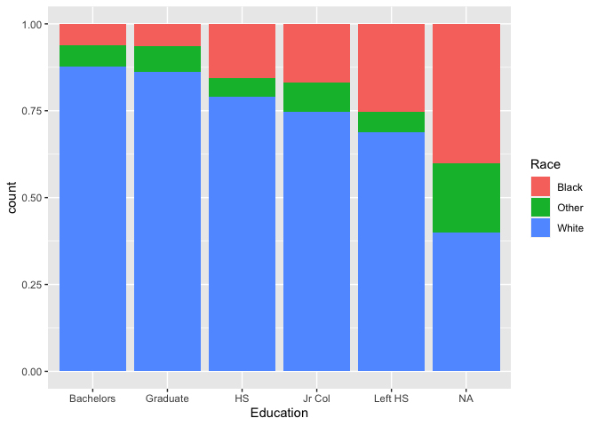<!-- -->

``` r
ggplot(data=gss) + geom_bar(aes(x = Education, fill=Race), position = "dodge", na.rm=TRUE)
```

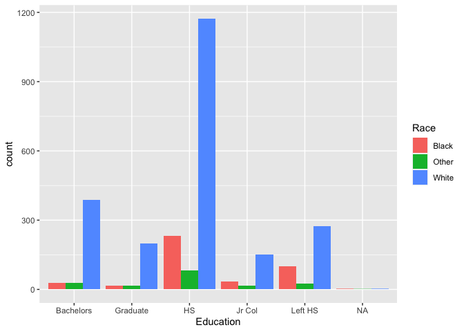<!-- --> From bar graphs we can see that
proportion Black and Other races is not significant among Bachelors and
Graduates. But it grows when we observe HighSchool, JuniorCollege and
those who LeftSchool. The graph has ladder shape and hints that there is
a relationship between race and education.

``` r
sub_gss_D = na.omit(gss[,c("Education","Race")]) # select columns and remove NAs 
counts_D = table(sub_gss_D$Education, sub_gss_D$Race) 
counts_D
```

    ##            
    ##             Black Other White
    ##   Bachelors    27    27   389
    ##   Graduate     15    17   198
    ##   HS          231    81  1173
    ##   Jr Col       34    17   151
    ##   Left HS     101    24   275

``` r
chisq.test(counts_D)
```

    ## 
    ##  Pearson's Chi-squared test
    ## 
    ## data:  counts_D
    ## X-squared = 79.05, df = 8, p-value = 7.59e-14

The chi-square test produces following statistics: chi-squared is equal
to 79 - definitely a big number on a chi-square distribution with 8
degrees of freedom. The p-value is negligible and tells us the
probability to see this data given there is no relationship between
variables. So we have strong eveidence to reject null hypothesis and
conclude that there is an association between race and education. That
confirms our inference from the bar graph above.

## Problem 9

H0: there is no an association between the type of treatment received
and a patient’s response Ha: there exists an association between the
type of treatment received and a patient’s response

``` r
df_prob9 = rbind(c(15,7,3,15), c(22,7,3,11))
rownames(df_prob9) = c("Fluvoxamine", "Placebo")
colnames(df_prob9) = c("No Response", "Moderate Response", "Marked Response", "Remission")

xchisq.test(df_prob9, simulate.p.value = TRUE)
```

    ## 
    ##  Pearson's Chi-squared test with simulated p-value (based on 2000
    ##  replicates)
    ## 
    ## data:  x
    ## X-squared = 1.8337, df = NA, p-value = 0.6277
    ## 
    ##  15.00     7.00     3.00    15.00  
    ## (17.83)  ( 6.75)  ( 2.89)  (12.53) 
    ## [0.4496] [0.0095] [0.0041] [0.4869]
    ## <-0.670> < 0.097> < 0.064> < 0.698>
    ##        
    ##  22.00     7.00     3.00    11.00  
    ## (19.17)  ( 7.25)  ( 3.11)  (13.47) 
    ## [0.4182] [0.0088] [0.0038] [0.4529]
    ## < 0.647> <-0.094> <-0.062> <-0.673>
    ##        
    ## key:
    ##  observed
    ##  (expected)
    ##  [contribution to X-squared]
    ##  <Pearson residual>

chi-square test has condition that expected cell counts should be more
or equal than 5. That’s why I used option simulate.p.value with flag
TRUE to direct R to carry out a simulation. This test produces
chi-squared 1.838 and p-value 0.63. With this high p-value we failed to
reject null hypothesis given that data. To conclude, there is no
evidence of an association between the type of treatment received and a
patient’s response.

## Problem 10

``` r
Ass4ques10data = read.csv("http://people.ucalgary.ca/~jbstall/DataFiles/bondsdata.csv")
print(head(Ass4ques10data, 3))
```

    ##   season     hrat
    ## 1   1987 0.045372
    ## 2   1988 0.044610
    ## 3   1989 0.032759

``` r
print(tail(Ass4ques10data, 3))
```

    ##    season     hrat
    ## 13   1999 0.095775
    ## 14   2000 0.102083
    ## 15   2001 0.153400

Remove row season==2001

``` r
 test_df = subset(Ass4ques10data, season!=2001)
```

State hypothesis:

H0: the number of home runs divided by the number of at bats doesn’t
change over time. The slope that tells us about the linear relationship
is zero. Ha: there was change of hrat over time and slope (beta) is not
equal to zero.

``` r
ggplot(test_df, aes(x = season, y = hrat)) + 
  geom_point(col="blue", size = 2) +
  geom_smooth(method="lm")
```

    ## `geom_smooth()` using formula 'y ~ x'

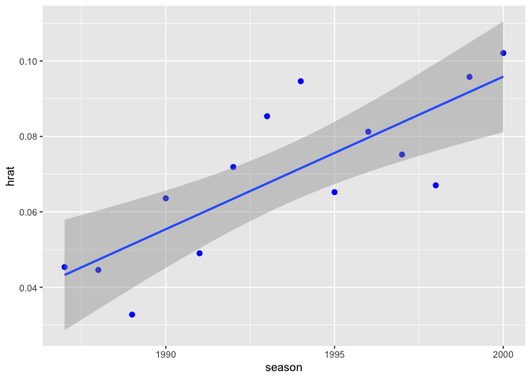<!-- --> These data are a time series,
which raises my suspicions that they may not be independent. I see a
hint that the data oscillate up and down, which suggests some failure of
independence, but not so strongly that I can’t proceed with the
analysis. In addition, from this scatterplot we can see a pattern that
runs from lower-left to upper-right, meaning positive relationship. The
form appears to be as a cloud of points stretched out in a generally
consistent, straight form. Regarding the strength of the relationship,
the points cluster close around the line from both sides. No outliers.

Estimate the linear model.

``` r
predict_hrat = lm(hrat ~ season, data=test_df) 
predict_hrat$coefficients
```

    ##  (Intercept)       season 
    ## -7.992499290  0.004044169

Expected hrat = -7.99 + 0.004 \* year

hrat is been changing (increasing) on average by 0.004 per year.

Check conditions:

``` r
# Check normality of residuals
model_predicted = predict_hrat$fitted.values #place the predicted values of Suncor returns for each observed TSE index return
model_residuals = predict_hrat$residuals
assumptions_df = data.frame(model_predicted, model_residuals)

# qq plot
ggplot(assumptions_df, aes(sample = model_residuals)) +  
  stat_qq(col='blue') + 
  stat_qqline(col='red') + 
  ggtitle("Normal Probability Plot of Residuals")
```

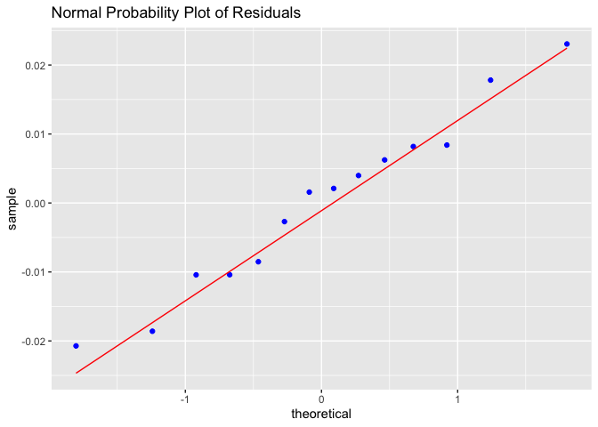<!-- -->

``` r
# Check homoscedasticity
ggplot(assumptions_df, aes(x = model_predicted, y = model_residuals)) +  
  geom_point(size=2, col='blue', position="jitter") + 
  xlab("Predicted % return of Suncor") + 
  ylab("Residuals") + 
  ggtitle("Plot of Fits to Residuals") + 
  geom_hline(yintercept=0, color="red", linetype="dashed")
```

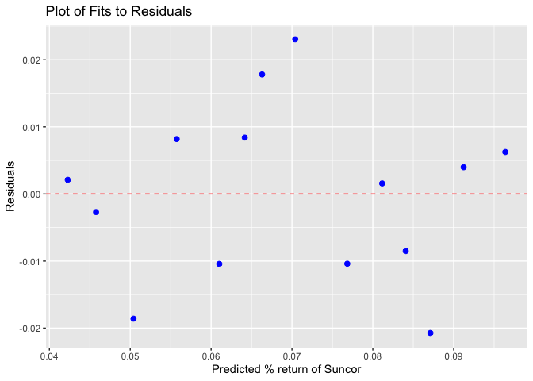<!-- --> From qq-plot the points appear
in a strainght line and follow the diagonal line. This suggests
normality. The scatterplot of residuals doesn’t appear to have any
shape, pattern or direction. The points appear fairly uniformly
scattered about the flat dotted line (zero line). This suggests
homoscedasticity.

``` r
coef(summary(predict_hrat))
```

    ##                 Estimate   Std. Error   t value     Pr(>|t|)
    ## (Intercept) -7.992499290 1.7566775240 -4.549782 0.0006664296
    ## season       0.004044169 0.0008812009  4.589384 0.0006222474

P-values both for intercept and slope are low (&lt;0.0007). This
confirms that t-ratio this large (+- 4.5) would be unlikely to occur if
the true slope and interecept were zero. Reject null hypothesis and
conclude that there is a positive linear relationship between year and
hrat - hrat changes over time.

``` r
confint(predict_hrat, conf.level=0.95)
```

    ##                     2.5 %       97.5 %
    ## (Intercept) -11.819970817 -4.165027763
    ## season        0.002124197  0.005964141

``` r
predict(predict_hrat, newdata=data.frame(season = 2001), interval="predict") #  use interval="predict" for an individual point - wider interval, less precision
```

    ##          fit        lwr       upr
    ## 1 0.09988334 0.06662845 0.1331382

The expected/predicted hrat for the year 2001 from the linear model
above is approx 0.10. From this data with 95% conf we can suggest that
the hrat will fall in the interval from 0.06662845 to 0.1331382 Compare
predicted and real result (0.1534) our model doesn’t contain the real
result. Our interval doesn’t take care of all uncertainty and is only as
good as the model.

Overall, we can reject the null hypothesis and conclude that hrat was
increasing over time. And the p-values show that the association we see
in the data is unlikely to have occurred by chance.
