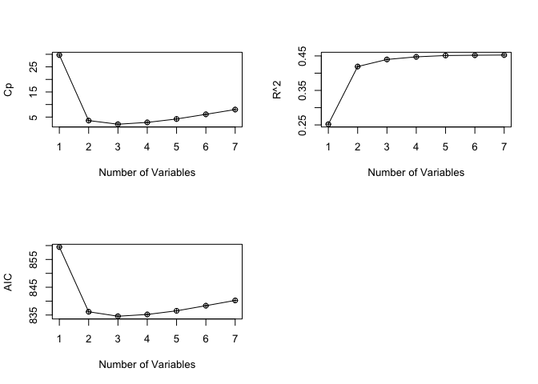

Assignment 2
================
Andrii Voitkiv
November 28, 2022

-   [Problem 1](#problem-1)
-   [Problem 2](#problem-2)
-   [Problem 3](#problem-3)
-   [Problem 4](#problem-4)

``` r
knitr::opts_chunk$set(fig.path='Figs/')
```

## Problem 1

``` r
tires = read.csv("/Users/berg/DataspellProjects/MDSA-UofC/DATA603/data/tires.csv")
```

### Part A

``` r
tires_full_model = lm(wear~factor(type)+ave, data = tires)
summary(tires_full_model)
```

    ## 
    ## Call:
    ## lm(formula = wear ~ factor(type) + ave, data = tires)
    ## 
    ## Residuals:
    ##       Min        1Q    Median        3Q       Max 
    ## -0.092858 -0.033451 -0.000953  0.039404  0.116668 
    ## 
    ## Coefficients:
    ##                 Estimate Std. Error t value Pr(>|t|)    
    ## (Intercept)   -0.6445083  0.0525675  -12.26   <2e-16 ***
    ## factor(type)B  0.1725006  0.0093544   18.44   <2e-16 ***
    ## ave            0.0113094  0.0005155   21.94   <2e-16 ***
    ## ---
    ## Signif. codes:  0 '***' 0.001 '**' 0.01 '*' 0.05 '.' 0.1 ' ' 1
    ## 
    ## Residual standard error: 0.05384 on 137 degrees of freedom
    ## Multiple R-squared:  0.8861, Adjusted R-squared:  0.8844 
    ## F-statistic: 532.8 on 2 and 137 DF,  p-value: < 2.2e-16

From the output above, both predictors are statistically significant.
Therefore, the base model has following sub-equations:

    Wear_hat =  -0.64450834 + 0.17250064 * type + 0.01130937 * ave

    Wear_hat =  -0.64450834 + 0.01130937 * ave, 0 when type is A
    Wear_hat =  -0.4720077  + 0.01130937 * ave, 1 when type is B

### Part B

`Type` is a dummy variable - qualitative predictor (factor) with two
levels. The values of the dummy variable: factor(type) = 0 when type is
A; factor(type) = 1 when type is B.

### Part C

Interpretation of coefficients: beta0 - the average beta1 - the average
difference between type A and type B tires, type estimated to carry more
tread wear by 0.173%; beta2 - the average percentage change of tread
thickness per 160 km increases by 0.0113% when speed rises by 1 km/hour,
others held constant.

### Part D

``` r
tires_interaction_model = lm(wear~factor(type)+ave+factor(type)*ave, data = tires)
summary(tires_interaction_model)
```

    ## 
    ## Call:
    ## lm(formula = wear ~ factor(type) + ave + factor(type) * ave, 
    ##     data = tires)
    ## 
    ## Residuals:
    ##       Min        1Q    Median        3Q       Max 
    ## -0.070158 -0.016493 -0.003643  0.024086  0.063703 
    ## 
    ## Coefficients:
    ##                     Estimate Std. Error t value Pr(>|t|)    
    ## (Intercept)       -0.3888744  0.0347705  -11.18   <2e-16 ***
    ## factor(type)B     -1.0800050  0.0779442  -13.86   <2e-16 ***
    ## ave                0.0087833  0.0003415   25.72   <2e-16 ***
    ## factor(type)B:ave  0.0119840  0.0007439   16.11   <2e-16 ***
    ## ---
    ## Signif. codes:  0 '***' 0.001 '**' 0.01 '*' 0.05 '.' 0.1 ' ' 1
    ## 
    ## Residual standard error: 0.03169 on 136 degrees of freedom
    ## Multiple R-squared:  0.9608, Adjusted R-squared:   0.96 
    ## F-statistic:  1112 on 3 and 136 DF,  p-value: < 2.2e-16

From the individual coefficients test (t-test), the output shows that
all variables are statistically significant including introduced
interaction term with t-values far beyond the significance level at 5%.
And respectively p-values are too small to accept the null-hypothesis
(beta is 0), so can confidently reject it and therefore accept
alternative that their beta for the interaction term is not equal to
zero.

After including the interaction term, the new estimated first order
model becomes:

    General equation:
    Wear_hat =  -0.388874431 - 1.080004985 * factor(type) + 0.008783344 * ave + 0.011984013 * factor(type) * ave
    Sub-models:
    Wear_hat =  -0.388874431 + 0.008783344 * ave, 0 when type is A
    Wear_hat =  -1.468879 + 0.02076736 * ave , 1 when type is B

Recommendations for predicting model:

``` r
cat("The base model has adjusted r-squared =",
    summary(tires_full_model)$adj.r.squared,
    "\n",
    "On the other hand, the model with the interaction term has adjusted r-squared =",
    summary(tires_interaction_model)$adj.r.squared,
    "\n\n")
```

    ## The base model has adjusted r-squared = 0.8844236 
    ##  On the other hand, the model with the interaction term has adjusted r-squared = 0.9599663

``` r
cat("The base model has RMSE =",
    sigma(tires_full_model),
    "\n",
    "On the other hand, the model with the interaction term has RMSE =",
    sigma(tires_interaction_model))
```

    ## The base model has RMSE = 0.05383824 
    ##  On the other hand, the model with the interaction term has RMSE = 0.03168614

Based on this output, I’d recommend the model with the interaction term,
as the adjusted r-square is approx 6% higher than the base model’s one
(obviously, RMSE is lower).

### Part E

``` r
summary(tires_interaction_model)$adj.r.squared
```

    ## [1] 0.9599663

96% of the variation of the response variable which is water tread wear
is explained by the model.

### Part F

This is the equation (from part D) for tire type A:

    Wear_hat =  -0.388874431 + 0.008783344 * ave

``` r
wear_predicted = -0.388874431 + 0.008783344 * 100
cat("The average tread wear per 160 km is", wear_predicted,  "in the percentage of tread thickness for a car with type A with the average speed of 100 km/hour")
```

    ## The average tread wear per 160 km is 0.48946 in the percentage of tread thickness for a car with type A with the average speed of 100 km/hour

## Problem 2

``` r
health = read.csv("/Users/berg/DataspellProjects/MDSA-UofC/DATA603/data/MentalHealth.csv")
```

### Part A

Dependent/response variable is `EFFECT`. It is the result of the medical
experiment where other factors are manipulated.

### Part B

Independent variables are `AGE` and `METHOD`.

### Part C

``` r
health_base_model = lm(EFFECT~AGE+factor(METHOD),data=health)
summary(health_base_model)
```

    ## 
    ## Call:
    ## lm(formula = EFFECT ~ AGE + factor(METHOD), data = health)
    ## 
    ## Residuals:
    ##      Min       1Q   Median       3Q      Max 
    ## -12.5732  -3.3922   0.9829   3.9613   9.5062 
    ## 
    ## Coefficients:
    ##                  Estimate Std. Error t value Pr(>|t|)    
    ## (Intercept)      32.54335    3.58105   9.088 2.23e-10 ***
    ## AGE               0.66446    0.06978   9.522 7.42e-11 ***
    ## factor(METHOD)B  -9.80758    2.46471  -3.979 0.000371 ***
    ## factor(METHOD)C -10.25276    2.46542  -4.159 0.000224 ***
    ## ---
    ## Signif. codes:  0 '***' 0.001 '**' 0.01 '*' 0.05 '.' 0.1 ' ' 1
    ## 
    ## Residual standard error: 6.035 on 32 degrees of freedom
    ## Multiple R-squared:  0.784,  Adjusted R-squared:  0.7637 
    ## F-statistic: 38.71 on 3 and 32 DF,  p-value: 9.287e-11

    General model's equation:
    EFFECT = 32.5433481 + 0.6644606 * AGE - 9.8075777 * factor(METHOD)B - 10.2527575 * factor(METHOD)C

    Sub-equations:
    1) when METHOD is A, then factor(METHOD)B = 0, factor(METHOD)C = 0
    step1:  EFFECT = 32.5433481 + 0.6644606 * AGE - 9.8075777 * 0 - 10.2527575 * 0
    result: EFFECT = 32.5433481 + 0.6644606 * AGE
    2) when METHOD is B, then factor(METHOD)B = 1, factor(METHOD)C = 0
    step1:  EFFECT = 32.5433481 + 0.6644606 * AGE - 9.8075777 * 1 - 10.2527575 * 0
    step2:  EFFECT = 32.5433481 - 9.8075777 + 0.6644606 * AGE
    result: EFFECT = 22.73577 + 0.6644606 * AGE
    2) when METHOD is C, then factor(METHOD)B = 0, factor(METHOD)C = 1
    step1:  EFFECT = 32.5433481 + 0.6644606 * AGE - 9.8075777 * 0 - 10.2527575 * 1
    step2:  EFFECT = 32.5433481 - 10.2527575 + 0.6644606 * AGE
    result: EFFECT = 22.29059 + 0.6644606 * AGE

``` r
effect_A = function (x){32.5433481 + 0.6644606 * x}
effect_B = function (x){22.73577 + 0.6644606 * x}
effect_C = function (x){22.29059 + 0.6644606 * x}

ggplot(data=health,mapping= aes(x=AGE,y=EFFECT,colour=METHOD)) +
  geom_point() +
  stat_function(fun=effect_A,geom="line",color='red') +
  stat_function(fun=effect_B,geom="line",color='green') +
  stat_function(fun=effect_C,geom="line",color='blue')
```

<!-- -->

From the plot above, noticed that this amounts to fitting three parallel
lines to the data, one for method A, one for method B and one for method
C. The lines for treatment A,B and C have different intercepts, but the
same slope. The fact that the lines are parallel means that the average
effect on EFFECT of a one year increase in AGE does not depend on what
kind of treatment the individual is taking.

### Part D

H0: the interaction term between AGE and METHOD doesn’t exist, meaning
beta of the interaction term is zero; Ha: there is the interaction
between AGE and METHOD.

``` r
health_interaction_model = lm(EFFECT~AGE+factor(METHOD)+AGE*factor(METHOD),data=health)
summary(health_interaction_model)
```

    ## 
    ## Call:
    ## lm(formula = EFFECT ~ AGE + factor(METHOD) + AGE * factor(METHOD), 
    ##     data = health)
    ## 
    ## Residuals:
    ##     Min      1Q  Median      3Q     Max 
    ## -6.4366 -2.7637  0.1887  2.9075  6.5634 
    ## 
    ## Coefficients:
    ##                      Estimate Std. Error t value Pr(>|t|)    
    ## (Intercept)          47.51559    3.82523  12.422 2.34e-13 ***
    ## AGE                   0.33051    0.08149   4.056 0.000328 ***
    ## factor(METHOD)B     -18.59739    5.41573  -3.434 0.001759 ** 
    ## factor(METHOD)C     -41.30421    5.08453  -8.124 4.56e-09 ***
    ## AGE:factor(METHOD)B   0.19318    0.11660   1.657 0.108001    
    ## AGE:factor(METHOD)C   0.70288    0.10896   6.451 3.98e-07 ***
    ## ---
    ## Signif. codes:  0 '***' 0.001 '**' 0.01 '*' 0.05 '.' 0.1 ' ' 1
    ## 
    ## Residual standard error: 3.925 on 30 degrees of freedom
    ## Multiple R-squared:  0.9143, Adjusted R-squared:  0.9001 
    ## F-statistic: 64.04 on 5 and 30 DF,  p-value: 4.264e-15

Only one of two interaction terms which is AGE\*factor(METHOD)C is
statistically significant with t-value 6.451 far beyond the
t-distribution (given that beta(i)=0). But another term is not
statistically significant. The sneek peak into residuals plot suggests
that there is pattern in residuals and the interaction term improves it.
So, I decided to include the interaction term into my model. Also, the
p-value of the insignificant one is 10% which is close to our
significance level 5%.

Also, we can confirm inclusion of the interaction term with partial
Anova test. Partial F-test to confirm that the interaction variable
should be out of the model at significance level 0.05. H0:
beta(interaction) = 0 Ha: beta(interaction) is not equal to 0

``` r
anova(health_base_model, health_interaction_model)
```

    ## Analysis of Variance Table
    ## 
    ## Model 1: EFFECT ~ AGE + factor(METHOD)
    ## Model 2: EFFECT ~ AGE + factor(METHOD) + AGE * factor(METHOD)
    ##   Res.Df     RSS Df Sum of Sq      F   Pr(>F)    
    ## 1     32 1165.57                                 
    ## 2     30  462.15  2    703.43 22.831 9.41e-07 ***
    ## ---
    ## Signif. codes:  0 '***' 0.001 '**' 0.01 '*' 0.05 '.' 0.1 ' ' 1

Partial ANOVA clearly shows that we should include interaction term, as
p-value is too low (0% &lt; alpha = 5%) to accept H0. So, reject null
and accept that beta(interaction term) is not zero.

### Part E

    The final model:
    EFFECT = 47.5155913 + 0.3305073 * AGE - 18.5973852 * factor(METHOD)B - 41.3042101 * factor(METHOD)C + 0.1931769 * AGE * factor(METHOD)B + 0.7028836 * AGE * factor(METHOD)C

    Sub-equations:
    1) when METHOD is A, then factor(METHOD)B = 0, factor(METHOD)C = 0
    step1:  EFFECT = 47.5155913 + 0.3305073 * AGE - 18.5973852 * 0 - 41.3042101 * 0 + 0.1931769 * AGE * 0 + 0.7028836 * AGE * 0
    result: EFFECT = 47.5155913 + 0.3305073 * AGE
    2) when METHOD is B, then factor(METHOD)B = 1, factor(METHOD)C = 0
    step1:  EFFECT = 47.5155913 + 0.3305073 * AGE - 18.5973852 * 1 - 41.3042101 * 0 + 0.1931769 * AGE * 1 + 0.7028836 * AGE * 0
    step2:  EFFECT = (47.5155913 - 18.5973852) + AGE * (0.3305073 + 0.1931769)
    result: EFFECT = 28.91821 + 0.5236842 * AGE
    3) when METHOD is C, then factor(METHOD)B = 0, factor(METHOD)C = 1
    step1:  EFFECT = 47.5155913 + 0.3305073 * AGE - 18.5973852 * 0 - 41.3042101 * 1 + 0.1931769 * AGE * 0 + 0.7028836 * AGE * 1
    step2:  EFFECT = 47.5155913 + 0.3305073 * AGE - 41.3042101 + 0.7028836 * AGE
    step3:  EFFECT = (47.5155913 - 41.3042101) + (0.3305073  + 0.7028836) * AGE
    result: EFFECT = 6.211381 + 1.033391 * AGE

    Sub-equations (CLEAN):
    1) when METHOD is A
    EFFECT = 47.5155913 + 0.3305073 * AGE
    2) when METHOD is B
    EFFECT = 28.91821 + 0.5236842 * AGE
    3) when METHOD is C
    EFFECT = 6.211381 + 1.033391 * AGE

### Part F

treatment\_c sub-model: For every 1 age increase, the average EFFECT for
patient taking treatment\_c will increase 1.03339. treatment\_b
sub-model: For every 1 age increase, the average EFFECT for patient
taking treatment\_b will increase 0.52369. treatment\_a sub-model: For
every 1 age increase, the average EFFECT for patient taking treatment\_a
will increase 0.33051

### Part G

``` r
effect_inter_A = function (x){47.5155913 + 0.3305073 * x}
effect_inter_B = function (x){28.91821 + 0.5236842 * x}
effect_inter_C = function (x){6.211381 + 1.033391 * x}

ggplot(data=health,mapping= aes(x=AGE,y=EFFECT,colour=METHOD)) +
  geom_point() +
  stat_function(fun=effect_inter_A,geom="line",color='red') +
  stat_function(fun=effect_inter_B,geom="line",color='green') +
  stat_function(fun=effect_inter_C,geom="line",color='blue')
```

<!-- -->

But now those regression lines have different intercepts, beta(METHOD)C
versus beta(METHOD)A and beta(METHOD)B, as well as different slopes,
beta(METHOD)C versus beta(METHOD)A and beta(METHOD)B. This allows for
the possibility that changes in AGE may affect the EFFECT of patients
treated by different METHOD. We note that the largest EFFECT increase is
for treatment C compare to A and B.

## Problem 3

``` r
flag = read.delim("/Users/berg/Projects/DATA/603/data/FLAG2.txt")
colnames = colnames(flag)
```

### Part A

``` r
library("olsrr")
```

    ## 
    ## Присоединяю пакет: 'olsrr'

    ## Следующий объект скрыт от 'package:datasets':
    ## 
    ##     rivers

``` r
base_model = lm(LOWBID~DOTEST+factor(STATUS)+factor(DISTRICT)+NUMIDS+DAYSEST+RDLNGTH+PCTASPH+PCTBASE+PCTEXCAV+PCTMOBIL+PCTSTRUC+PCTTRAF, data = flag)

stepmodel = ols_step_both_p(base_model,pent = 0.05, prem = 0.1, details=FALSE)
summary(stepmodel$model)
```

    ## 
    ## Call:
    ## lm(formula = paste(response, "~", paste(preds, collapse = " + ")), 
    ##     data = l)
    ## 
    ## Residuals:
    ##      Min       1Q   Median       3Q      Max 
    ## -2127947   -62934    -7025    59043  1665603 
    ## 
    ## Coefficients:
    ##                   Estimate Std. Error t value Pr(>|t|)    
    ## (Intercept)      5.711e+04  4.582e+04   1.246   0.2137    
    ## DOTEST           9.374e-01  9.280e-03 101.011   <2e-16 ***
    ## factor(STATUS)1  9.525e+04  4.196e+04   2.270   0.0240 *  
    ## NUMIDS          -1.535e+04  7.530e+03  -2.039   0.0424 *  
    ## ---
    ## Signif. codes:  0 '***' 0.001 '**' 0.01 '*' 0.05 '.' 0.1 ' ' 1
    ## 
    ## Residual standard error: 281700 on 275 degrees of freedom
    ## Multiple R-squared:  0.9764, Adjusted R-squared:  0.9761 
    ## F-statistic:  3792 on 3 and 275 DF,  p-value: < 2.2e-16

The valid model is:

    LOWBID_hat = 5.710597e+04 + 9.374269e-01 * DOTEST + 9.525239e+04 * factor(STATUS)1 - 1.535382e+04 * NUMIDS

### Part B

``` r
forward_model = ols_step_forward_p(base_model, penter = 0.05, details = FALSE)
summary(forward_model$model)
```

    ## 
    ## Call:
    ## lm(formula = paste(response, "~", paste(preds, collapse = " + ")), 
    ##     data = l)
    ## 
    ## Residuals:
    ##      Min       1Q   Median       3Q      Max 
    ## -2127947   -62934    -7025    59043  1665603 
    ## 
    ## Coefficients:
    ##                   Estimate Std. Error t value Pr(>|t|)    
    ## (Intercept)      5.711e+04  4.582e+04   1.246   0.2137    
    ## DOTEST           9.374e-01  9.280e-03 101.011   <2e-16 ***
    ## factor(STATUS)1  9.525e+04  4.196e+04   2.270   0.0240 *  
    ## NUMIDS          -1.535e+04  7.530e+03  -2.039   0.0424 *  
    ## ---
    ## Signif. codes:  0 '***' 0.001 '**' 0.01 '*' 0.05 '.' 0.1 ' ' 1
    ## 
    ## Residual standard error: 281700 on 275 degrees of freedom
    ## Multiple R-squared:  0.9764, Adjusted R-squared:  0.9761 
    ## F-statistic:  3792 on 3 and 275 DF,  p-value: < 2.2e-16

The valid model is:

    LOWBID_hat = 5.710597e+04 + 9.374269e-01 * DOTEST + 9.525239e+04 * factor(STATUS)1 - 1.535382e+04 * NUMIDS

### Part C

``` r
backward_model = ols_step_backward_p(base_model, prem = 0.05, details = FALSE)
summary(backward_model$model)
```

    ## 
    ## Call:
    ## lm(formula = paste(response, "~", paste(preds, collapse = " + ")), 
    ##     data = l)
    ## 
    ## Residuals:
    ##      Min       1Q   Median       3Q      Max 
    ## -2127947   -62934    -7025    59043  1665603 
    ## 
    ## Coefficients:
    ##                   Estimate Std. Error t value Pr(>|t|)    
    ## (Intercept)      5.711e+04  4.582e+04   1.246   0.2137    
    ## DOTEST           9.374e-01  9.280e-03 101.011   <2e-16 ***
    ## factor(STATUS)1  9.525e+04  4.196e+04   2.270   0.0240 *  
    ## NUMIDS          -1.535e+04  7.530e+03  -2.039   0.0424 *  
    ## ---
    ## Signif. codes:  0 '***' 0.001 '**' 0.01 '*' 0.05 '.' 0.1 ' ' 1
    ## 
    ## Residual standard error: 281700 on 275 degrees of freedom
    ## Multiple R-squared:  0.9764, Adjusted R-squared:  0.9761 
    ## F-statistic:  3792 on 3 and 275 DF,  p-value: < 2.2e-16

The valid model is:

    LOWBID_hat = 5.711e+04  + 9.374e-01 * DOTEST + 9.525e+04 * factor(STATUS)1 - 1.535e+04 * NUMIDS

### Part D

``` r
summary(base_model)
```

    ## 
    ## Call:
    ## lm(formula = LOWBID ~ DOTEST + factor(STATUS) + factor(DISTRICT) + 
    ##     NUMIDS + DAYSEST + RDLNGTH + PCTASPH + PCTBASE + PCTEXCAV + 
    ##     PCTMOBIL + PCTSTRUC + PCTTRAF, data = flag)
    ## 
    ## Residuals:
    ##      Min       1Q   Median       3Q      Max 
    ## -2061552   -76832     3703    68246  1592629 
    ## 
    ## Coefficients:
    ##                     Estimate Std. Error t value Pr(>|t|)    
    ## (Intercept)        7.623e+04  6.916e+04   1.102   0.2714    
    ## DOTEST             9.362e-01  1.687e-02  55.494   <2e-16 ***
    ## factor(STATUS)1    1.089e+05  4.263e+04   2.554   0.0112 *  
    ## factor(DISTRICT)2  7.773e+04  6.388e+04   1.217   0.2248    
    ## factor(DISTRICT)3  2.960e+04  2.042e+05   0.145   0.8849    
    ## factor(DISTRICT)4 -2.729e+05  1.377e+05  -1.982   0.0485 *  
    ## factor(DISTRICT)5 -2.420e+04  3.799e+04  -0.637   0.5248    
    ## NUMIDS            -2.243e+04  8.797e+03  -2.550   0.0114 *  
    ## DAYSEST            8.030e+01  1.848e+02   0.434   0.6643    
    ## RDLNGTH            5.669e+03  4.926e+03   1.151   0.2509    
    ## PCTASPH           -1.022e+05  7.985e+04  -1.281   0.2015    
    ## PCTBASE            2.516e+05  1.840e+05   1.367   0.1727    
    ## PCTEXCAV          -2.824e+05  1.610e+05  -1.754   0.0805 .  
    ## PCTMOBIL           3.322e+05  2.765e+05   1.201   0.2308    
    ## PCTSTRUC           1.459e+05  1.621e+05   0.900   0.3690    
    ## PCTTRAF           -1.002e+05  1.416e+05  -0.707   0.4800    
    ## ---
    ## Signif. codes:  0 '***' 0.001 '**' 0.01 '*' 0.05 '.' 0.1 ' ' 1
    ## 
    ## Residual standard error: 278000 on 263 degrees of freedom
    ## Multiple R-squared:  0.978,  Adjusted R-squared:  0.9768 
    ## F-statistic: 780.2 on 15 and 263 DF,  p-value: < 2.2e-16

The individual t-test output above suggests that predictors DOTEST,
STATUS and NUMIDS are statistically significant at significance level 5%
and should be kept in the model. Also, one out of four levels of
DISTRICT variable is significant. So, I’m using partial ANOVA test to
decide if I’d keep it or not. The null H is that beta(DISTRICT) is zero,
Ha that it is not.

``` r
anova(base_model, lm(LOWBID~DOTEST+factor(STATUS)+NUMIDS+DAYSEST+RDLNGTH+PCTASPH+PCTBASE+PCTEXCAV+PCTMOBIL+PCTSTRUC+PCTTRAF, data = flag))
```

    ## Analysis of Variance Table
    ## 
    ## Model 1: LOWBID ~ DOTEST + factor(STATUS) + factor(DISTRICT) + NUMIDS + 
    ##     DAYSEST + RDLNGTH + PCTASPH + PCTBASE + PCTEXCAV + PCTMOBIL + 
    ##     PCTSTRUC + PCTTRAF
    ## Model 2: LOWBID ~ DOTEST + factor(STATUS) + NUMIDS + DAYSEST + RDLNGTH + 
    ##     PCTASPH + PCTBASE + PCTEXCAV + PCTMOBIL + PCTSTRUC + PCTTRAF
    ##   Res.Df        RSS Df   Sum of Sq      F Pr(>F)
    ## 1    263 2.0321e+13                             
    ## 2    267 2.0865e+13 -4 -5.4447e+11 1.7617 0.1369

As I failed to reject the null that beta(DISTRICT) is zero, I’m not
including it in the model.

With valid predictors:

``` r
model_part_d = lm(LOWBID~DOTEST+factor(STATUS)+NUMIDS, data = flag)
summary(model_part_d)
```

    ## 
    ## Call:
    ## lm(formula = LOWBID ~ DOTEST + factor(STATUS) + NUMIDS, data = flag)
    ## 
    ## Residuals:
    ##      Min       1Q   Median       3Q      Max 
    ## -2127947   -62934    -7025    59043  1665603 
    ## 
    ## Coefficients:
    ##                   Estimate Std. Error t value Pr(>|t|)    
    ## (Intercept)      5.711e+04  4.582e+04   1.246   0.2137    
    ## DOTEST           9.374e-01  9.280e-03 101.011   <2e-16 ***
    ## factor(STATUS)1  9.525e+04  4.196e+04   2.270   0.0240 *  
    ## NUMIDS          -1.535e+04  7.530e+03  -2.039   0.0424 *  
    ## ---
    ## Signif. codes:  0 '***' 0.001 '**' 0.01 '*' 0.05 '.' 0.1 ' ' 1
    ## 
    ## Residual standard error: 281700 on 275 degrees of freedom
    ## Multiple R-squared:  0.9764, Adjusted R-squared:  0.9761 
    ## F-statistic:  3792 on 3 and 275 DF,  p-value: < 2.2e-16

So the valid model from this step is:

    LOWBID_hat = 5.711e+04  + 9.374e-01 * DOTEST + 9.525e+04 * factor(STATUS)1 - 1.535e+04 * NUMIDS

### Part E

List of all models from step a-d:

Stepwise: LOWBID\_hat = 5.710597e+04 + 9.374269e-01 \* DOTEST +
9.525239e+04 \* factor(STATUS)1 - 1.535382e+04 \* NUMIDS

Forward: LOWBID\_hat = 5.710597e+04 + 9.374269e-01 \* DOTEST +
9.525239e+04 \* factor(STATUS)1 - 1.535382e+04 \* NUMIDS

Backward: LOWBID\_hat = 5.711e+04 + 9.374e-01 \* DOTEST + 9.525e+04 \*
factor(STATUS)1 - 1.535e+04 \* NUMIDS

Individual: LOWBID\_hat = 5.711e+04 + 9.374e-01 \* DOTEST + 9.525e+04 \*
factor(STATUS)1 - 1.535e+04 \* NUMIDS

DOTEST, STATUS and NUMIDS appear in all four models. Actually, they are
identical.

**The model I propose (and the only one I have) is:** LOWBID\_hat =
5.710597e+04 + 9.374269e-01 \* DOTEST + 9.525239e+04 \* factor(STATUS)1
- 1.535382e+04 \* NUMIDS

### Part F

``` r
model_part_f = lm(LOWBID~DOTEST+factor(STATUS)+factor(DISTRICT)+NUMIDS, data = flag)
summary(model_part_f, data = flag)
```

    ## 
    ## Call:
    ## lm(formula = LOWBID ~ DOTEST + factor(STATUS) + factor(DISTRICT) + 
    ##     NUMIDS, data = flag)
    ## 
    ## Residuals:
    ##      Min       1Q   Median       3Q      Max 
    ## -2160166   -66952    -6042    55358  1625579 
    ## 
    ## Coefficients:
    ##                     Estimate Std. Error t value Pr(>|t|)    
    ## (Intercept)        6.050e+04  5.197e+04   1.164   0.2454    
    ## DOTEST             9.447e-01  1.002e-02  94.258   <2e-16 ***
    ## factor(STATUS)1    9.991e+04  4.189e+04   2.385   0.0178 *  
    ## factor(DISTRICT)2  7.100e+04  6.316e+04   1.124   0.2619    
    ## factor(DISTRICT)3  1.156e+04  2.038e+05   0.057   0.9548    
    ## factor(DISTRICT)4 -3.165e+05  1.336e+05  -2.370   0.0185 *  
    ## factor(DISTRICT)5 -1.415e+04  3.733e+04  -0.379   0.7049    
    ## NUMIDS            -1.736e+04  8.255e+03  -2.103   0.0364 *  
    ## ---
    ## Signif. codes:  0 '***' 0.001 '**' 0.01 '*' 0.05 '.' 0.1 ' ' 1
    ## 
    ## Residual standard error: 279700 on 271 degrees of freedom
    ## Multiple R-squared:  0.9771, Adjusted R-squared:  0.9765 
    ## F-statistic:  1650 on 7 and 271 DF,  p-value: < 2.2e-16

The model from f) is:

    LOWBID = 6.049836e+04 + 9.447389e-01 * DOTEST + 9.990889e+04 * factor(STATUS)1 + 7.099736e+04 * factor(DISTRICT)2 + 1.156379e+04 * factor(DISTRICT)3 - 3.165056e+05 * factor(DISTRICT)4 - 1.415127e+04 * factor(DISTRICT)5
    - 1.736130e+04 * NUMIDS

When DISTRICT is 1 then all factor(DISTRICT)i = 0. Also, When DISTRICT
is 4 then factor(DISTRICT)4 = 1, else 0.

Let’s use this property to find the difference in average contact bid
price (by the lowest bidder) between District 1 and 4,when other
predictors are held as a constant.

    Difference_1_minus_4 = 0 - (- 3.165056e+05 * 1) = 316505.6

the difference in average contact bid price (by the lowest bidder)
between District 1 and 4,when other predictors are held as a constant is
316505.6 dollars.

### Part G

The model from f) is:

    LOWBID = 6.049836e+04 + 9.447389e-01 * DOTEST + 9.990889e+04 * factor(STATUS)1 + 7.099736e+04 * factor(DISTRICT)2 + 1.156379e+04 * factor(DISTRICT)3 - 3.165056e+05 * factor(DISTRICT)4 - 1.415127e+04 * factor(DISTRICT)5
    - 1.736130e+04 * NUMIDS

When DISTRICT is 2 then factor(DISTRICT)2 = 1. Also, When DISTRICT is 5
then factor(DISTRICT)5 = 1.

Let’s use this property to find the difference in average contact bid
price (by the lowest bidder) between District 2 and 5,when other
predictors are held as a constant.

    Step 1:
    Difference_5_minus_2 = 6.049836e+04 + 9.447389e-01 * DOTEST + 9.990889e+04 * 0 + 7.099736e+04 * 0 + 1.156379e+04 * 0 - 3.165056e+05 * 0 - 1.415127e+04 * 1
    - 1.736130e+04 * NUMIDS -
    (6.049836e+04 + 9.447389e-01 * DOTEST + 9.990889e+04 * 0 + 7.099736e+04 * 1 + 1.156379e+04 * 0 - 3.165056e+05 * 0 - 1.415127e+04 * 0 - 1.736130e+04 * 0)

    Step 2:
    Difference_5_minus_2 =  - 1.415127e+04 - 7.099736e+04 = -85148.63

the difference in average contact bid price (by the lowest bidder)
between District 2 and 5,when other predictors are held as a constant is
85148.63 dollars.

### Part H

``` r
interaction_model = lm(LOWBID~(DOTEST+factor(STATUS)+factor(DISTRICT)+NUMIDS)^2, data = flag)
summary(interaction_model)
```

    ## 
    ## Call:
    ## lm(formula = LOWBID ~ (DOTEST + factor(STATUS) + factor(DISTRICT) + 
    ##     NUMIDS)^2, data = flag)
    ## 
    ## Residuals:
    ##      Min       1Q   Median       3Q      Max 
    ## -1486446   -52732     9513    46452  1477972 
    ## 
    ## Coefficients: (4 not defined because of singularities)
    ##                                     Estimate Std. Error t value Pr(>|t|)    
    ## (Intercept)                       -3.353e+04  7.480e+04  -0.448  0.65434    
    ## DOTEST                             1.097e+00  2.969e-02  36.955  < 2e-16 ***
    ## factor(STATUS)1                   -1.199e+04  1.102e+05  -0.109  0.91342    
    ## factor(DISTRICT)2                 -1.215e+04  1.653e+05  -0.073  0.94147    
    ## factor(DISTRICT)3                  9.037e+04  3.802e+05   0.238  0.81229    
    ## factor(DISTRICT)4                 -1.532e+06  6.568e+05  -2.332  0.02046 *  
    ## factor(DISTRICT)5                 -4.438e+04  9.666e+04  -0.459  0.64655    
    ## NUMIDS                            -4.697e+03  1.273e+04  -0.369  0.71248    
    ## DOTEST:factor(STATUS)1             9.451e-02  3.673e-02   2.573  0.01063 *  
    ## DOTEST:factor(DISTRICT)2           3.988e-02  5.577e-02   0.715  0.47518    
    ## DOTEST:factor(DISTRICT)3          -1.655e-01  5.168e-01  -0.320  0.74904    
    ## DOTEST:factor(DISTRICT)4          -2.533e-02  6.268e-02  -0.404  0.68653    
    ## DOTEST:factor(DISTRICT)5          -1.330e-01  2.870e-02  -4.636 5.64e-06 ***
    ## DOTEST:NUMIDS                     -1.934e-02  3.603e-03  -5.367 1.77e-07 ***
    ## factor(STATUS)1:factor(DISTRICT)2         NA         NA      NA       NA    
    ## factor(STATUS)1:factor(DISTRICT)3         NA         NA      NA       NA    
    ## factor(STATUS)1:factor(DISTRICT)4         NA         NA      NA       NA    
    ## factor(STATUS)1:factor(DISTRICT)5  7.549e+04  7.891e+04   0.957  0.33964    
    ## factor(STATUS)1:NUMIDS             1.043e+04  3.188e+04   0.327  0.74370    
    ## factor(DISTRICT)2:NUMIDS           6.114e+03  2.166e+04   0.282  0.77793    
    ## factor(DISTRICT)3:NUMIDS                  NA         NA      NA       NA    
    ## factor(DISTRICT)4:NUMIDS           1.519e+05  4.661e+04   3.260  0.00126 ** 
    ## factor(DISTRICT)5:NUMIDS           2.525e+04  1.798e+04   1.404  0.16148    
    ## ---
    ## Signif. codes:  0 '***' 0.001 '**' 0.01 '*' 0.05 '.' 0.1 ' ' 1
    ## 
    ## Residual standard error: 251800 on 260 degrees of freedom
    ## Multiple R-squared:  0.9822, Adjusted R-squared:  0.9809 
    ## F-statistic: 795.6 on 18 and 260 DF,  p-value: < 2.2e-16

``` r
# interaction_model = lm(LOWBID~DOTEST+factor(STATUS)+factor(DISTRICT)+NUMIDS+
#   DOTEST*factor(STATUS)+
#   DOTEST+factor(DISTRICT)+
#   DOTEST*NUMIDS+
#   factor(STATUS)*NUMIDS+
#   factor(DISTRICT)*NUMIDS
#                        , data = flag)
# summary(interaction_model)
```

factor(DISTRICT) \* factor(STATUS) - doesn’t make sense - (exclude);
DOTEST - is significant (include); NUMIDS - is not significant, but is
part of a significant interaction DOTEST*NUMIDS - (include); STATUS - is
not significant, but is part of a significant interaction
DOTEST*factor(STATUS)1 - (include); DISTRICT - only one level out of
four is significant, interactions are also weak - (exclude)
DOTEST*NUMIDS, DOTEST*factor(STATUS)1 - significant interactions -
(include)

``` r
interaction_model_refined = lm(LOWBID~DOTEST+factor(STATUS)+NUMIDS+DOTEST*NUMIDS+DOTEST*factor(STATUS), data = flag)
summary(interaction_model_refined)
```

    ## 
    ## Call:
    ## lm(formula = LOWBID ~ DOTEST + factor(STATUS) + NUMIDS + DOTEST * 
    ##     NUMIDS + DOTEST * factor(STATUS), data = flag)
    ## 
    ## Residuals:
    ##      Min       1Q   Median       3Q      Max 
    ## -1677680   -36672     6590    38551  1496732 
    ## 
    ## Coefficients:
    ##                          Estimate Std. Error t value Pr(>|t|)    
    ## (Intercept)            -3.245e+04  5.014e+04  -0.647 0.518009    
    ## DOTEST                  1.017e+00  2.527e-02  40.237  < 2e-16 ***
    ## factor(STATUS)1         3.743e+04  4.765e+04   0.785 0.432900    
    ## NUMIDS                  1.593e+03  8.171e+03   0.195 0.845535    
    ## DOTEST:NUMIDS          -1.206e-02  3.142e-03  -3.839 0.000154 ***
    ## DOTEST:factor(STATUS)1  1.106e-01  3.639e-02   3.038 0.002612 ** 
    ## ---
    ## Signif. codes:  0 '***' 0.001 '**' 0.01 '*' 0.05 '.' 0.1 ' ' 1
    ## 
    ## Residual standard error: 264800 on 273 degrees of freedom
    ## Multiple R-squared:  0.9793, Adjusted R-squared:  0.9789 
    ## F-statistic:  2583 on 5 and 273 DF,  p-value: < 2.2e-16

The best fit valid model with interactions:

    LOWBID = -3.245094e+04 + 1.01689 * DOTEST + 3.742610e+04 * factor(STATUS) + 1.593291e+03 * NUMIDS - 1.206275e-02 * DOTEST * NUMIDS + 1.105697e-01 * DOTEST * factor(STATUS)

### Part i

``` r
cat("The model from part d) has RMSE =",
    sigma(model_part_d),
    "\n",
    "On the other hand, the model with the interaction term has RMSE =",
    sigma(interaction_model_refined))
```

    ## The model from part d) has RMSE = 281686.7 
    ##  On the other hand, the model with the interaction term has RMSE = 264767

The RMSE is lower for model with the interaction terms from the output
above. The RMSE that is 264767 dollars measures the standard deviation
of the unexplained variance of the bid price. In other words, it tells
us the average distance between the predicted price from the model and
the actual price in the dataset.

### Part j

``` r
cat("The model with the interaction term has adjusted r-squared =",
    summary(interaction_model_refined)$adj.r.squared,
    "\n\n")
```

    ## The model with the interaction term has adjusted r-squared = 0.9789205

That is the proportion 97.9% of the total variation in response variable
`LOWBID` that can be explained by the regression model.

## Problem 4

``` r
kbi = read.csv("/Users/berg/DataspellProjects/MDSA-UofC/DATA603/data/KBI.csv")
colnames(kbi)
```

    ## [1] "CGAGE"    "CGINCOME" "CGDUR"    "ADL"      "MEM"      "COG"      "SOCIALSU"
    ## [8] "BURDEN"

### Part A

``` r
kbi_base_model = lm(BURDEN~CGAGE+CGINCOME+CGDUR+ADL+MEM+COG+SOCIALSU, data=kbi)
```

Stepwise model:

``` r
kbi_stepmodel = ols_step_both_p(kbi_base_model, pent = 0.1, prem = 0.3, details=FALSE)
summary(kbi_stepmodel$model)
```

    ## 
    ## Call:
    ## lm(formula = paste(response, "~", paste(preds, collapse = " + ")), 
    ##     data = l)
    ## 
    ## Residuals:
    ##     Min      1Q  Median      3Q     Max 
    ## -32.672  -9.977   0.367   7.774  31.523 
    ## 
    ## Coefficients:
    ##              Estimate Std. Error t value Pr(>|t|)    
    ## (Intercept) 115.53922   12.36816   9.342 3.86e-15 ***
    ## MEM           0.56612    0.10232   5.533 2.73e-07 ***
    ## SOCIALSU     -0.49237    0.08930  -5.514 2.96e-07 ***
    ## CGDUR         0.12168    0.06486   1.876   0.0637 .  
    ## ---
    ## Signif. codes:  0 '***' 0.001 '**' 0.01 '*' 0.05 '.' 0.1 ' ' 1
    ## 
    ## Residual standard error: 15.25 on 96 degrees of freedom
    ## Multiple R-squared:  0.4397, Adjusted R-squared:  0.4222 
    ## F-statistic: 25.12 on 3 and 96 DF,  p-value: 4.433e-12

The valid model from the output above is: BURDEN = 115.5392230 +
0.5661203 \* MEM - 0.4923699 \* SOCIALSU

### Part B

``` r
kbi_subset = ols_step_best_subset(kbi_base_model, details=TRUE)
kbi_subset
```

    ##                 Best Subsets Regression                 
    ## --------------------------------------------------------
    ## Model Index    Predictors
    ## --------------------------------------------------------
    ##      1         MEM                                       
    ##      2         MEM SOCIALSU                              
    ##      3         CGDUR MEM SOCIALSU                        
    ##      4         CGDUR ADL MEM SOCIALSU                    
    ##      5         CGAGE CGDUR ADL MEM SOCIALSU              
    ##      6         CGAGE CGINCOME CGDUR ADL MEM SOCIALSU     
    ##      7         CGAGE CGINCOME CGDUR ADL MEM COG SOCIALSU 
    ## --------------------------------------------------------
    ## 
    ##                                                       Subsets Regression Summary                                                      
    ## --------------------------------------------------------------------------------------------------------------------------------------
    ##                        Adj.        Pred                                                                                                
    ## Model    R-Square    R-Square    R-Square     C(p)        AIC         SBIC        SBC          MSEP         FPE        HSP       APC  
    ## --------------------------------------------------------------------------------------------------------------------------------------
    ##   1        0.2520      0.2444      0.2244    29.7076    859.4694    574.7800    867.2849    30399.8652    310.0773    3.1340    0.7785 
    ##   2        0.4192      0.4072        0.38     3.6101    836.1716    552.5296    846.5923    23850.9307    245.6375    2.4842    0.6167 
    ##   3        0.4397      0.4222      0.3865     2.1575    834.5703    551.2713    847.5962    23249.4660    241.7415    2.4468    0.6070 
    ##   4        0.4473      0.4241      0.3831     2.8795    835.2038    552.1710    850.8348    23177.8870    243.2876    2.4649    0.6108 
    ##   5        0.4511      0.4220      0.3782     4.2386    836.5114    553.7192    854.7476    23265.4605    246.5047    2.5006    0.6189 
    ##   6        0.4520      0.4166      0.3129     6.0981    838.3589    555.7577    859.2003    23482.5186    251.1226    2.5510    0.6305 
    ##   7        0.4526      0.4109      0.2989     8.0000    840.2523    557.8408    863.6989    23715.2744    255.9517    2.6043    0.6426 
    ## --------------------------------------------------------------------------------------------------------------------------------------
    ## AIC: Akaike Information Criteria 
    ##  SBIC: Sawa's Bayesian Information Criteria 
    ##  SBC: Schwarz Bayesian Criteria 
    ##  MSEP: Estimated error of prediction, assuming multivariate normality 
    ##  FPE: Final Prediction Error 
    ##  HSP: Hocking's Sp 
    ##  APC: Amemiya Prediction Criteria

``` r
par(mfrow=c(2,2)) # split the plotting panel into a 2 x 2 grid
plot(kbi_subset$cp,type = "o",pch=10, xlab="Number of Variables",ylab= "Cp")
plot(kbi_subset$rsq,type = "o",pch=10, xlab="Number of Variables",ylab= "R^2")
plot(kbi_subset$aic,type = "o",pch=10, xlab="Number of Variables",ylab= "AIC")
```

<!-- -->

``` r
library("leaps")

best.subset<-regsubsets(BURDEN~CGAGE+CGINCOME+CGDUR+ADL+MEM+COG+SOCIALSU, data= kbi, nv=10 )
#by default, regsubsets() only reports results up to the best 8-variable model
#Model selection by exhaustive search, forward or backward stepwise, or sequential replacement
#The summary() command outputs the best set of variables for each model size using RMSE.
summary(best.subset)
```

    ## Subset selection object
    ## Call: regsubsets.formula(BURDEN ~ CGAGE + CGINCOME + CGDUR + ADL + 
    ##     MEM + COG + SOCIALSU, data = kbi, nv = 10)
    ## 7 Variables  (and intercept)
    ##          Forced in Forced out
    ## CGAGE        FALSE      FALSE
    ## CGINCOME     FALSE      FALSE
    ## CGDUR        FALSE      FALSE
    ## ADL          FALSE      FALSE
    ## MEM          FALSE      FALSE
    ## COG          FALSE      FALSE
    ## SOCIALSU     FALSE      FALSE
    ## 1 subsets of each size up to 7
    ## Selection Algorithm: exhaustive
    ##          CGAGE CGINCOME CGDUR ADL MEM COG SOCIALSU
    ## 1  ( 1 ) " "   " "      " "   " " "*" " " " "     
    ## 2  ( 1 ) " "   " "      " "   " " "*" " " "*"     
    ## 3  ( 1 ) " "   " "      "*"   " " "*" " " "*"     
    ## 4  ( 1 ) " "   " "      "*"   "*" "*" " " "*"     
    ## 5  ( 1 ) "*"   " "      "*"   "*" "*" " " "*"     
    ## 6  ( 1 ) "*"   "*"      "*"   "*" "*" " " "*"     
    ## 7  ( 1 ) "*"   "*"      "*"   "*" "*" "*" "*"

``` r
reg.summary = summary(best.subset)

# for the output interpretation
rsquare = c(reg.summary$rsq)
cp = c(reg.summary$cp)
AdjustedR = c(reg.summary$adjr2)
RMSE = c(reg.summary$rss)
BIC = c(reg.summary$bic)
cbind(rsquare,cp,BIC,RMSE,AdjustedR)
```

    ##        rsquare        cp       BIC     RMSE AdjustedR
    ## [1,] 0.2519944 29.707640 -19.82415 29791.75 0.2443617
    ## [2,] 0.4191848  3.610120 -40.51675 23132.85 0.4072092
    ## [3,] 0.4397292  2.157489 -39.51282 22314.60 0.4222207
    ## [4,] 0.4473335  2.879523 -36.27420 22011.73 0.4240633
    ## [5,] 0.4511470  4.238638 -32.36144 21859.85 0.4219527
    ## [6,] 0.4519831  6.098124 -27.90873 21826.55 0.4166272
    ## [7,] 0.4525670  8.000000 -23.41016 21803.29 0.4109145

``` r
par(mfrow=c(3,2)) # split the plotting panel into a 3 x 2 grid
plot(reg.summary$cp,type = "o",pch=10, xlab="Number of Variables",ylab= "Cp")
plot(reg.summary$bic,type = "o",pch=10, xlab="Number of Variables",ylab= "BIC")
plot(reg.summary$adjr2,type = "o",pch=10, xlab="Number of Variables",ylab= "Adjusted R^2")
plot(reg.summary$rss,type = "o",pch=10, xlab="Number of Variables",ylab= "RMSE")
```

<!-- --> From the output above: For
model 3: Cp is the lowest; Adj R-squared is second best; AIC is the
lowest; RMSE not the best.

Model 3 predictors: CGDUR, MEM, SOCIALSU

### Part C

By comparing all the methods we got MEM, SOCIALSU from stepwise method.
They appeared significant at 5% significanse level in stepwise model
from part a). And from metrics such as adj R-squared, Bc, AIC I decided
to use CGDUR, MEM, SOCIALSU. We have MEM, SOCIALSU in common.

Interaction model: H0: beta coefs of interaction terms are zero, there
is no interaction between variables. Ha: beta coefs of interaction terms
are not zero, there is an interaction between variables.

``` r
kbi_interaction_model = lm(BURDEN~(CGDUR+MEM+SOCIALSU)^2, data = kbi)
summary(kbi_interaction_model)
```

    ## 
    ## Call:
    ## lm(formula = BURDEN ~ (CGDUR + MEM + SOCIALSU)^2, data = kbi)
    ## 
    ## Residuals:
    ##     Min      1Q  Median      3Q     Max 
    ## -32.256  -9.544   0.419   7.832  35.226 
    ## 
    ## Coefficients:
    ##                 Estimate Std. Error t value Pr(>|t|)    
    ## (Intercept)    98.094196  27.929492   3.512 0.000688 ***
    ## CGDUR           0.350722   0.525520   0.667 0.506181    
    ## MEM             0.869719   0.790027   1.101 0.273793    
    ## SOCIALSU       -0.341339   0.210830  -1.619 0.108828    
    ## CGDUR:MEM       0.003782   0.004228   0.894 0.373411    
    ## CGDUR:SOCIALSU -0.002564   0.004042  -0.634 0.527485    
    ## MEM:SOCIALSU   -0.002998   0.006087  -0.492 0.623553    
    ## ---
    ## Signif. codes:  0 '***' 0.001 '**' 0.01 '*' 0.05 '.' 0.1 ' ' 1
    ## 
    ## Residual standard error: 15.4 on 93 degrees of freedom
    ## Multiple R-squared:  0.4459, Adjusted R-squared:  0.4102 
    ## F-statistic: 12.47 on 6 and 93 DF,  p-value: 2.879e-10

From the output above, there are no statistically significant
interaction terms (at alpha=5%). We have failed to reject the null,
meaning there are no interaction across main predictors.

Let’s go back to:

``` r
summary(lm(BURDEN~MEM+SOCIALSU+CGDUR , data = kbi))
```

    ## 
    ## Call:
    ## lm(formula = BURDEN ~ MEM + SOCIALSU + CGDUR, data = kbi)
    ## 
    ## Residuals:
    ##     Min      1Q  Median      3Q     Max 
    ## -32.672  -9.977   0.367   7.774  31.523 
    ## 
    ## Coefficients:
    ##              Estimate Std. Error t value Pr(>|t|)    
    ## (Intercept) 115.53922   12.36816   9.342 3.86e-15 ***
    ## MEM           0.56612    0.10232   5.533 2.73e-07 ***
    ## SOCIALSU     -0.49237    0.08930  -5.514 2.96e-07 ***
    ## CGDUR         0.12168    0.06486   1.876   0.0637 .  
    ## ---
    ## Signif. codes:  0 '***' 0.001 '**' 0.01 '*' 0.05 '.' 0.1 ' ' 1
    ## 
    ## Residual standard error: 15.25 on 96 degrees of freedom
    ## Multiple R-squared:  0.4397, Adjusted R-squared:  0.4222 
    ## F-statistic: 25.12 on 3 and 96 DF,  p-value: 4.433e-12

CGDUR appears in grey zone. As this predictor adds less than 2% to adj
r-squared, I’ve decided to remove it from the model.

The final model:

``` r
summary(lm(BURDEN~MEM+SOCIALSU+CGDUR , data = kbi))
```

    ## 
    ## Call:
    ## lm(formula = BURDEN ~ MEM + SOCIALSU + CGDUR, data = kbi)
    ## 
    ## Residuals:
    ##     Min      1Q  Median      3Q     Max 
    ## -32.672  -9.977   0.367   7.774  31.523 
    ## 
    ## Coefficients:
    ##              Estimate Std. Error t value Pr(>|t|)    
    ## (Intercept) 115.53922   12.36816   9.342 3.86e-15 ***
    ## MEM           0.56612    0.10232   5.533 2.73e-07 ***
    ## SOCIALSU     -0.49237    0.08930  -5.514 2.96e-07 ***
    ## CGDUR         0.12168    0.06486   1.876   0.0637 .  
    ## ---
    ## Signif. codes:  0 '***' 0.001 '**' 0.01 '*' 0.05 '.' 0.1 ' ' 1
    ## 
    ## Residual standard error: 15.25 on 96 degrees of freedom
    ## Multiple R-squared:  0.4397, Adjusted R-squared:  0.4222 
    ## F-statistic: 25.12 on 3 and 96 DF,  p-value: 4.433e-12

BURDEN = 116.07291 + 0.59941 \* MEM - 0.47552 \* SOCIALSU.
