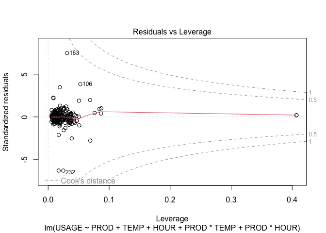

Assignment 3
================
Andrii Voitkiv
December 9, 2022

-   [Problem 1](#problem-1)
-   [Problem 2](#problem-2)
-   [Problem 3](#problem-3)
-   [Problem 4](#problem-4)

## Problem 1

``` r
water = read.csv("water.csv")
water_interaction_model = lm(USAGE~PROD+TEMP+HOUR+PROD*TEMP+PROD*HOUR, data=water)
```

### A

``` r
library(ggplot2)
library(GGally)
```

    ## Registered S3 method overwritten by 'GGally':
    ##   method from   
    ##   +.gg   ggplot2

``` r
ggpairs(water,lower = list(continuous = "smooth_loess", combo = "facethist", discrete = "facetbar", na = "na"))
```

<!-- -->

``` r
water_firstordermodel = lm(USAGE~PROD+TEMP+HOUR, data=water)
library("mctest") # for VIF
imcdiag(water_firstordermodel, method="VIF")
```

    ## 
    ## Call:
    ## imcdiag(mod = water_firstordermodel, method = "VIF")
    ## 
    ## 
    ##  VIF Multicollinearity Diagnostics
    ## 
    ##         VIF detection
    ## PROD 1.6452         0
    ## TEMP 1.1738         0
    ## HOUR 1.8548         0
    ## 
    ## NOTE:  VIF Method Failed to detect multicollinearity
    ## 
    ## 
    ## 0 --> COLLINEARITY is not detected by the test
    ## 
    ## ===================================

From the output above, collinearity is not detected as VIF is less than 5.

### B

``` r
plot(water_interaction_model, which = 3)
```

<!-- --> From the residual plot,
residuals seemed to be spread around zero with constant variance and
without clear pattern.

H0: heteroscedasticity is not present (homoscedasticity) Ha:
heteroscedasticity is present

``` r
library("lmtest")
```

``` r
bptest(water_interaction_model)
```

    ## 
    ##  studentized Breusch-Pagan test
    ## 
    ## data:  water_interaction_model
    ## BP = 2.0057, df = 5, p-value = 0.8484

The output displays the Breusch-Pagan test that results from the
interaction model. The p-value = 0.8484 &gt; 0.05, indicating that we
accept the null hypothesis. Therefore, the test provides evidence to
suggest that heteroscedasticity is not present - constant variance
(homoscedasticity).

### C

H0: the sample data are significantly normally distributed Ha: the
sample data are not significantly normally distributed

``` r
shapiro.test(residuals(water_interaction_model))
```

    ## 
    ##  Shapiro-Wilk normality test
    ## 
    ## data:  residuals(water_interaction_model)
    ## W = 0.67655, p-value < 2.2e-16

The p-value(2.2e-16) is much lower than 0.05, which confirms that the
residuals are not normally distributed (reject null hypothesis).

``` r
par(mfrow=c(1,2))
hist(residuals(water_interaction_model), breaks = 24)
plot(water_interaction_model, which=2) #a Normal plot
```

<!-- --> Histogram shows leptokurtic
distribution compared to normal distribution with fat tails. QQplot
confirms fat tails - deviation from line on both sides. This tells us
that residuals are non-normal.

### D

``` r
ggplot(water_interaction_model, aes(x=.fitted, y=.resid)) +
  geom_point() + geom_smooth()+
  geom_hline(yintercept = 0)
```

    ## `geom_smooth()` using method = 'loess' and formula 'y ~ x'

<!-- -->

### E

``` r
plot(water_interaction_model,which=c(5))
```

<!-- --> No influential outliers.

### F

One of assumptions, which is homoscedasticity doesn’t hold. So, to fix
this we can perform Box-Cox transformation. If that doesn’t help we can
introduce polynomial terms of the most correlated variable with
response.

``` r
library("MASS")
bc = boxcox(water_interaction_model,lambda=seq(-10,10))
```

<!-- -->

``` r
bestlambda = bc$x[which(bc$y==max(bc$y))]

water_bcmodel = lm((((USAGE^bestlambda)-1)/bestlambda) ~ PROD+TEMP+HOUR+PROD*TEMP+PROD*HOUR, data=water)
```

``` r
cat("The model after Box-Cox transformation has Breusch-Pagan test p-value =",
    bptest(water_bcmodel)$p.value,
    "\n",
    "On the other hand, the reduced model has Breusch-Pagan test p-value =",
    bptest(water_interaction_model)$p.value,
    "\n\n")
```

    ## The model after Box-Cox transformation has Breusch-Pagan test p-value = 0.9155836 
    ##  On the other hand, the reduced model has Breusch-Pagan test p-value = 0.8483625

``` r
cat("The model after Box-Cox transformation has Shapiro-Wilk p-value =",
    shapiro.test(residuals(water_bcmodel))$p.value,
    "\n",
    "On the other hand, the reduced model has Shapiro-Wilk p-value =",
    shapiro.test(residuals(water_interaction_model))$p.value)
```

    ## The model after Box-Cox transformation has Shapiro-Wilk p-value = 1.027677e-19 
    ##  On the other hand, the reduced model has Shapiro-Wilk p-value = 1.490894e-21

## Problem 2

``` r
KBI = read.csv("KBI.csv")
kbi_firstordermodel=lm(BURDEN~(CGDUR+ MEM +SOCIALSU) , data=KBI)
summary(kbi_firstordermodel)
```

    ## 
    ## Call:
    ## lm(formula = BURDEN ~ (CGDUR + MEM + SOCIALSU), data = KBI)
    ## 
    ## Residuals:
    ##     Min      1Q  Median      3Q     Max 
    ## -32.672  -9.977   0.367   7.774  31.523 
    ## 
    ## Coefficients:
    ##              Estimate Std. Error t value Pr(>|t|)    
    ## (Intercept) 115.53922   12.36816   9.342 3.86e-15 ***
    ## CGDUR         0.12168    0.06486   1.876   0.0637 .  
    ## MEM           0.56612    0.10232   5.533 2.73e-07 ***
    ## SOCIALSU     -0.49237    0.08930  -5.514 2.96e-07 ***
    ## ---
    ## Signif. codes:  0 '***' 0.001 '**' 0.01 '*' 0.05 '.' 0.1 ' ' 1
    ## 
    ## Residual standard error: 15.25 on 96 degrees of freedom
    ## Multiple R-squared:  0.4397, Adjusted R-squared:  0.4222 
    ## F-statistic: 25.12 on 3 and 96 DF,  p-value: 4.433e-12

### A

**Check Normality**

``` r
par(mfrow=c(1,2))
hist(residuals(kbi_firstordermodel), breaks = 12)
plot(kbi_firstordermodel, which=2) #a Normal plot
```

<!-- -->

A histogram is unimodal, symmetrical, no skewness is observed - the
sample seems to come from Normal distribution. The qq-plot confirms that
dots (residuals) are closely following the line, no significant
deviations in both tails.

**Shapiro-Wilk normality test** H0: the sample data are significantly
normally distributed Ha: the sample data are not significantly normally
distributed

``` r
shapiro.test(residuals(kbi_firstordermodel))
```

    ## 
    ##  Shapiro-Wilk normality test
    ## 
    ## data:  residuals(kbi_firstordermodel)
    ## W = 0.98407, p-value = 0.2716

Shapiro-Wilk normality test also confirms that the residuals are
normally distributed as the p-value=0.2716 &gt;0.05 (accept null
hypothesis)

**Check Homoscedasticity**

``` r
plot(kbi_firstordermodel, which = 3)
```

<!-- -->

From the Spread-Location plot, there appears to be no systematic change
in the spread of the residuals over the range of measured values. I can
see almost horizontal line with equally (randomly) spread points

**Breusch-Pagan test** H0: heteroscedasticity is not present
(homoscedasticity) Ha: heteroscedasticity is present

``` r
bptest(kbi_firstordermodel)
```

    ## 
    ##  studentized Breusch-Pagan test
    ## 
    ## data:  kbi_firstordermodel
    ## BP = 2.0208, df = 3, p-value = 0.5681

The output displays the Breusch-Pagan test that results from the
first-order model. The p-value = 0.5681 &gt; 0.05, indicating that we
accept the null hypothesis. Therefore, the test provides evidence to
suggest that heteroscedasticity is not present - constant variance
(homoscedasticity).

**Check Linearity**

``` r
ggplot(kbi_firstordermodel, aes(x=.fitted, y=.resid)) +
  geom_point() + geom_smooth()+
  geom_hline(yintercept = 0)
```

    ## `geom_smooth()` using method = 'loess' and formula 'y ~ x'

<!-- --> From the residuals plot, there
appears to be no pattern in residuals model at all for the firstorder
regresssion, no trend detected.

### B

**Detecting influential points with Cook’s distance**

``` r
# #find Cook's distance for each observation in the dataset
# cooksD <- cooks.distance(kbi_firstordermodel)
#
# # Plot Cook's Distance with a horizontal line at 4/n to see which observations
# #exceed this thresdhold
# n <- nrow(KBI)
# plot(cooksD, main = "Cooks Distance for Influential Obs")
# abline(h = 4/n, lty = 2, col = "steelblue") # add cutoff line

#identify influential points
# influential_obs <- as.numeric(names(cooksD)[(cooksD > (8/n))])

#define new data frame with influential points removed
# KBI_outliers_removed <- KBI[-influential_obs, ]
```

Identify outliers with leverage method

``` r
n = nrow(KBI)
p = length(coef(kbi_firstordermodel))
lev=hatvalues(kbi_firstordermodel)
outlier3p = lev[lev>(3*p/n)]
print(outlier3p)
```

    ##        58        71 
    ## 0.1527990 0.2352185

``` r
plot(rownames(KBI), lev, main = "Leverage in KBI Dataset", xlab = "observation", ylab = "Leverage value")
abline(h = 3*p/n)
```

<!-- -->

``` r
# remove outliers calculated in previous step
KBI_outliers_removed = KBI[-c(58, 71), ]
```

### C

``` r
kbi_no_utliers_model=lm(BURDEN~(CGDUR+ MEM +SOCIALSU) , data=KBI_outliers_removed)
```

**Comparing two models**

``` r
cat("The model from Assignment 2 Problem 4(c) has adjusted r-squared =",
    summary(kbi_firstordermodel)$adj.r.squared,
    "\n",
    "On the other hand, the model with outliers removed has adjusted r-squared =",
    summary(kbi_no_utliers_model)$adj.r.squared,
    "\n\n")
```

    ## The model from Assignment 2 Problem 4(c) has adjusted r-squared = 0.4222207 
    ##  On the other hand, the model with outliers removed has adjusted r-squared = 0.4299905

``` r
cat("The model from Assignment 2 Problem 4(c) has RMSE =",
    sigma(kbi_firstordermodel),
    "\n",
    "On the other hand, the model with outliers removed has RMSE =",
    sigma(kbi_no_utliers_model))
```

    ## The model from Assignment 2 Problem 4(c) has RMSE = 15.24611 
    ##  On the other hand, the model with outliers removed has RMSE = 15.19434

The same model on the dataset with outliers removed has higher r-squared
adjusted (0.43 vs 0.422) and lower RMSE. Removing only two influential
points had positive effect on the fit of the linear model.

## Problem 3

``` r
butterfat = read.csv("/Users/berg/DataspellProjects/MDSA-UofC/DATA603/data/butterfat.csv")
```

### A

``` r
library("cowplot")
p = ggplot(data=butterfat, aes(x=Breed, y=Butterfat, color = Breed)) +
        geom_boxplot(width=0.2) +
        ggtitle("Butterfat: by breed")

q = ggplot(data=butterfat, aes(x=Age, y=Butterfat, color = Age)) +
        geom_boxplot(width=0.2) +
        ggtitle("Butterfat: by age")

plot_grid(p, q, ncol = 2, nrow = 1)
```

<!-- --> From the boxplots above, the
butterfat variability is low across Ages and the medians are very close.
In contrast, the IQR across Breed factor varies much more. From the
visual inspection, Holstein-Fresiann has the smallest IQR, while Jersey
has the greatest. Also, medians seem distant from each other.

``` r
butterfat_firstordermodel = lm(Butterfat~factor(Age)+factor(Breed), data = butterfat)
summary(butterfat_firstordermodel)
```

    ## 
    ## Call:
    ## lm(formula = Butterfat ~ factor(Age) + factor(Breed), data = butterfat)
    ## 
    ## Residuals:
    ##     Min      1Q  Median      3Q     Max 
    ## -1.0202 -0.2373 -0.0640  0.2617  1.2098 
    ## 
    ## Coefficients:
    ##                               Estimate Std. Error t value Pr(>|t|)    
    ## (Intercept)                    4.00770    0.10135  39.541  < 2e-16 ***
    ## factor(Age)Mature              0.10460    0.08276   1.264  0.20937    
    ## factor(Breed)Canadian          0.37850    0.13085   2.893  0.00475 ** 
    ## factor(Breed)Guernsey          0.89000    0.13085   6.802 9.48e-10 ***
    ## factor(Breed)Holstein-Fresian -0.39050    0.13085  -2.984  0.00362 ** 
    ## factor(Breed)Jersey            1.23250    0.13085   9.419 3.16e-15 ***
    ## ---
    ## Signif. codes:  0 '***' 0.001 '**' 0.01 '*' 0.05 '.' 0.1 ' ' 1
    ## 
    ## Residual standard error: 0.4138 on 94 degrees of freedom
    ## Multiple R-squared:  0.6825, Adjusted R-squared:  0.6656 
    ## F-statistic: 40.41 on 5 and 94 DF,  p-value: < 2.2e-16

From the summary of first-order model, the Age factor is not
statistically significant with p-value 0.21 (&gt;alpha=0.05). Therefore,
only breed variable should be kept in our model.

``` r
butterfat_reducedmodel = lm(Butterfat~factor(Breed), data = butterfat)
```

### C

**Check Normality**

``` r
par(mfrow=c(1,2))
hist(residuals(butterfat_reducedmodel), breaks = 12)
plot(butterfat_reducedmodel, which=2) #a Normal plot
```

<!-- -->

The data doesn’t seem to come from Normal distribution, as the histogram
is not symmetric with the right skew. The QQ-plot confirms that with
dots (residuals) deviating from the line in the middle.

**Shapiro-Wilk normality test** H0: the sample data are significantly
normally distributed Ha: the sample data are not significantly normally
distributed

``` r
shapiro.test(residuals(butterfat_reducedmodel))
```

    ## 
    ##  Shapiro-Wilk normality test
    ## 
    ## data:  residuals(butterfat_reducedmodel)
    ## W = 0.96805, p-value = 0.01571

The p-value 0.01571 is lower than 0.05, which confirms that the
residuals are not normally distributed (reject null hypothesis).

**Check Homoscedasticity**

``` r
plot(butterfat_reducedmodel, which = 3)
```

<!-- --> From the Spread-Location plot,
there appears to be small systematic change in the spread of the
residuals over the range of measured values - the red line is trending
upwards.

**Breusch-Pagan test** H0: heteroscedasticity is not present
(homoscedasticity) Ha: heteroscedasticity is present

``` r
bptest(butterfat_reducedmodel)
```

    ## 
    ##  studentized Breusch-Pagan test
    ## 
    ## data:  butterfat_reducedmodel
    ## BP = 13.389, df = 4, p-value = 0.009525

From BP-test with p-value 0.0095 &lt; 0.05, we can reject the null
hypothesis and accept alternative - heteroscedasticity is present.

From diagnostic analysis above, we can say that our linear model doesn’t
hold assumptions. The residuals are not normally distributed with not
constant variance.

### D

``` r
library("MASS")
bc = boxcox(butterfat_reducedmodel,lambda=seq(-10,10))
```

<!-- -->

``` r
bestlambda = bc$x[which(bc$y==max(bc$y))]
```

``` r
butterfat_bcmodel = lm((((Butterfat^bestlambda)-1)/bestlambda) ~ factor(Breed), data = butterfat)
```

**Compare**

``` r
cat("The model after Box-Cox transformation has adjusted r-squared =",
    summary(butterfat_bcmodel)$adj.r.squared,
    "\n",
    "On the other hand, the model with the interaction term has adjusted r-squared =",
    summary(butterfat_reducedmodel)$adj.r.squared,
    "\n\n")
```

    ## The model after Box-Cox transformation has adjusted r-squared = 0.7167454 
    ##  On the other hand, the model with the interaction term has adjusted r-squared = 0.6635023

``` r
cat("The model after Box-Cox transformation has RMSE =",
    sigma(butterfat_bcmodel),
    "\n",
    "On the other hand, the reduced model has RMSE =",
    sigma(butterfat_reducedmodel))
```

    ## The model after Box-Cox transformation has RMSE = 0.008731683 
    ##  On the other hand, the reduced model has RMSE = 0.415078

### E

**Check Normality**

``` r
par(mfrow=c(1,2))
hist(residuals(butterfat_bcmodel), breaks = 12)
plot(butterfat_bcmodel, which=2) #a Normal plot
```

<!-- -->

**Check Homoscedasticity**

``` r
plot(butterfat_bcmodel, which = 3)
```

<!-- -->

``` r
cat("The model after Box-Cox transformation has Breusch-Pagan test p-value =",
    bptest(butterfat_bcmodel)$p.value,
    "\n",
    "On the other hand, the reduced model has Breusch-Pagan test p-value =",
    bptest(butterfat_reducedmodel)$p.value,
    "\n\n")
```

    ## The model after Box-Cox transformation has Breusch-Pagan test p-value = 0.9729943 
    ##  On the other hand, the reduced model has Breusch-Pagan test p-value = 0.009524592

``` r
cat("The model after Box-Cox transformation has Shapiro-Wilk p-value =",
    shapiro.test(residuals(butterfat_bcmodel))$p.value,
    "\n",
    "On the other hand, the reduced model has Shapiro-Wilk p-value =",
    shapiro.test(residuals(butterfat_reducedmodel))$p.value)
```

    ## The model after Box-Cox transformation has Shapiro-Wilk p-value = 0.9643055 
    ##  On the other hand, the reduced model has Shapiro-Wilk p-value = 0.01570535

After the Box-Cox transformation, the histogram of residuals looks
symmetric and residuals are closely following theoretical line on
qq-plot. Additinally, Shapiro-Wilk normality test also confirms that the
residuals are normally distributed as the p-value=0.96&gt;0.05.

From Scale-Location plot, the red line is horizontal and there is no
pattern in variance. The Breusch-Pagan test p-value = 0.973&gt;0.05,
indicating that we do not reject the null hypothesis and conclude that
heteroscedasticity is not present. Therefore, the test provide evidence
to suggest that homoscedasticity does exist.

So Box-Cox Tranformation is helpful for these cases.

## Problem 4

``` r
vibration = read.csv("/Users/berg/DataspellProjects/MDSA-UofC/DATA603/data/vibration.csv")
```

### A

The response variable is the amount of motor vibration (measured in
microns). The experimental unit is motor.

### B

The treatment is the brand of bearing (five brands - five treatments).

### C

H0: equality of treatment means or testing that the effect of brand of
bearing on motor vibration are zero Ha: at least one affect is not zero

### D

``` r
anova(lm(vibration~brand, data=vibration))
```

    ## Analysis of Variance Table
    ## 
    ## Response: vibration
    ##           Df Sum Sq Mean Sq F value    Pr(>F)    
    ## brand      4 30.855  7.7138   8.444 0.0001871 ***
    ## Residuals 25 22.838  0.9135                      
    ## ---
    ## Signif. codes:  0 '***' 0.001 '**' 0.01 '*' 0.05 '.' 0.1 ' ' 1

To complete the anova table: Total dfs: 29 SST: 53.693

Interpretation: From the Anova table, it can be seen that the Fcal=8.44
with the p-value =0.0001871 &lt; alpha=0.05, so we reject the null
hypothesis. Therefore, there is sufficient evidence to indicate that the
average motor vibration between brands of bearing are different at
alpha=0.05.

### E

``` r
ggplot(data=vibration, aes(x=brand, y=vibration, color = brand)) +
  geom_boxplot(width=0.2) +
  ggtitle("Mototr vibration: by brand")
```

<!-- -->

From the plot above, that variability between groups of different brands
is greater than within groups. Regarding outliers, there are two
outliers for brand 3 and one outlier for brand 1, but they don’t seem to
distort the whole picture. Outliers increase variance within the group.
But variance between groups is greater, so I conclude that these
outliers are not influential.

### F

``` r
mean(vibration$vibration[vibration$brand=="brand1"])
```

    ## [1] 13.68333

``` r
mean(vibration$vibration[vibration$brand=="brand2"])
```

    ## [1] 15.95

``` r
mean(vibration$vibration[vibration$brand=="brand3"])
```

    ## [1] 13.66667

``` r
mean(vibration$vibration[vibration$brand=="brand4"])
```

    ## [1] 14.73333

``` r
mean(vibration$vibration[vibration$brand=="brand5"])
```

    ## [1] 13.08333

Unadjusted paired t-tests

``` r
pairwise.t.test(vibration$vibration, vibration$brand, p.adj = "none")
```

    ## 
    ##  Pairwise comparisons using t tests with pooled SD 
    ## 
    ## data:  vibration$vibration and vibration$brand 
    ## 
    ##        brand1  brand2  brand3  brand4 
    ## brand2 0.00038 -       -       -      
    ## brand3 0.97615 0.00035 -       -      
    ## brand4 0.06865 0.03689 0.06464 -      
    ## brand5 0.28728 2.3e-05 0.30058 0.00618
    ## 
    ## P value adjustment method: none

Conclusion: brands (5,3,1), (3,1,4), (2). There are 3 groups based on
the output above. We can say that 5,3 and 1 are indifferent. Same holds
for 3,1 and 4. But we cannot say that 5 and 4 are indifferent (p-value
&lt; 0.05).

``` r
pairwise.t.test(vibration$vibration, vibration$brand, p.adj = "bonferroni")
```

    ## 
    ##  Pairwise comparisons using t tests with pooled SD 
    ## 
    ## data:  vibration$vibration and vibration$brand 
    ## 
    ##        brand1  brand2  brand3  brand4 
    ## brand2 0.00376 -       -       -      
    ## brand3 1.00000 0.00348 -       -      
    ## brand4 0.68648 0.36891 0.64642 -      
    ## brand5 1.00000 0.00023 1.00000 0.06184
    ## 
    ## P value adjustment method: bonferroni

``` r
library("agricolae")
scheffe.test(aov(vibration~brand, data = vibration),"brand", group=TRUE,console=TRUE)
```

    ## 
    ## Study: aov(vibration ~ brand, data = vibration) ~ "brand"
    ## 
    ## Scheffe Test for vibration 
    ## 
    ## Mean Square Error  : 0.9135333 
    ## 
    ## brand,  means
    ## 
    ##        vibration       std r  Min  Max
    ## brand1  13.68333 1.1940128 6 11.6 15.0
    ## brand2  15.95000 1.1674759 6 14.4 17.2
    ## brand3  13.66667 0.8164966 6 12.4 14.9
    ## brand4  14.73333 0.9395034 6 13.7 16.0
    ## brand5  13.08333 0.4792355 6 12.3 13.5
    ## 
    ## Alpha: 0.05 ; DF Error: 25 
    ## Critical Value of F: 2.75871 
    ## 
    ## Minimum Significant Difference: 1.833094 
    ## 
    ## Means with the same letter are not significantly different.
    ## 
    ##        vibration groups
    ## brand2  15.95000      a
    ## brand4  14.73333     ab
    ## brand1  13.68333      b
    ## brand3  13.66667      b
    ## brand5  13.08333      b

``` r
library("agricolae")
CRD = aov(vibration~brand, data = vibration)
tvalue = qt(0.025, CRD$df.residual, lower.tail = F)
MSE = sum((CRD$residuals)^2/CRD$df.residual)
r = length(vibration$vibration[vibration$brand=="brand1"])
LSD = tvalue*sqrt(2*MSE/r)
LS = LSD.test(CRD, trt="brand")
LS
```

    ## $statistics
    ##     MSerror Df     Mean       CV  t.value      LSD
    ##   0.9135333 25 14.22333 6.719869 2.059539 1.136505
    ## 
    ## $parameters
    ##         test p.ajusted name.t ntr alpha
    ##   Fisher-LSD      none  brand   5  0.05
    ## 
    ## $means
    ##        vibration       std r      LCL      UCL  Min  Max    Q25   Q50    Q75
    ## brand1  13.68333 1.1940128 6 12.87970 14.48696 11.6 15.0 13.325 14.00 14.300
    ## brand2  15.95000 1.1674759 6 15.14637 16.75363 14.4 17.2 15.100 16.00 16.975
    ## brand3  13.66667 0.8164966 6 12.86304 14.47030 12.4 14.9 13.400 13.75 13.875
    ## brand4  14.73333 0.9395034 6 13.92970 15.53696 13.7 16.0 14.025 14.55 15.450
    ## brand5  13.08333 0.4792355 6 12.27970 13.88696 12.3 13.5 12.825 13.30 13.400
    ## 
    ## $comparison
    ## NULL
    ## 
    ## $groups
    ##        vibration groups
    ## brand2  15.95000      a
    ## brand4  14.73333      b
    ## brand1  13.68333     bc
    ## brand3  13.66667     bc
    ## brand5  13.08333      c
    ## 
    ## attr(,"class")
    ## [1] "group"

``` r
pairwise.t.test(vibration$vibration, vibration$brand, p.adj = "holm")
```

    ## 
    ##  Pairwise comparisons using t tests with pooled SD 
    ## 
    ## data:  vibration$vibration and vibration$brand 
    ## 
    ##        brand1  brand2  brand3  brand4 
    ## brand2 0.00313 -       -       -      
    ## brand3 0.97615 0.00313 -       -      
    ## brand4 0.32321 0.22134 0.32321 -      
    ## brand5 0.86183 0.00023 0.86183 0.04329
    ## 
    ## P value adjustment method: holm

``` r
TukeyHSD(aov(vibration~brand, data = vibration), conf.level = 0.95)
```

    ##   Tukey multiple comparisons of means
    ##     95% family-wise confidence level
    ## 
    ## Fit: aov(formula = vibration ~ brand, data = vibration)
    ## 
    ## $brand
    ##                      diff        lwr        upr     p adj
    ## brand2-brand1  2.26666667  0.6460270  3.8873064 0.0031588
    ## brand3-brand1 -0.01666667 -1.6373064  1.6039730 0.9999998
    ## brand4-brand1  1.05000000 -0.5706397  2.6706397 0.3418272
    ## brand5-brand1 -0.60000000 -2.2206397  1.0206397 0.8112981
    ## brand3-brand2 -2.28333333 -3.9039730 -0.6626936 0.0029299
    ## brand4-brand2 -1.21666667 -2.8373064  0.4039730 0.2106883
    ## brand5-brand2 -2.86666667 -4.4873064 -1.2460270 0.0002024
    ## brand4-brand3  1.06666667 -0.5539730  2.6873064 0.3268245
    ## brand5-brand3 -0.58333333 -2.2039730  1.0373064 0.8262091
    ## brand5-brand4 -1.65000000 -3.2706397 -0.0293603 0.0445279

After all pairwise t-tests, here is summary: Scheffe, Bonferroni: (5, 3,
1, 4), (4, 2) Newman-Keuls, Fisher, Unadjusted paired t-tests: (5, 3,
1), (3, 1, 4), (2) Tukey, Holm: (5, 3, 1), (3, 1, 4), (4, 2)

### G

``` r
par(mfrow=c(2,2))
plot(CRD)
```

<!-- -->

**Homogenity of data** H0: heteroscedasticity is not present
(homoscedasticity) Ha: heteroscedasticity is present

``` r
bptest(CRD)
```

    ## 
    ##  studentized Breusch-Pagan test
    ## 
    ## data:  CRD
    ## BP = 4.5697, df = 4, p-value = 0.3344

``` r
bartlett.test(vibration~brand, data=vibration)
```

    ## 
    ##  Bartlett test of homogeneity of variances
    ## 
    ## data:  vibration by brand
    ## Bartlett's K-squared = 4.0967, df = 4, p-value = 0.3931

From tests above, we can accept H0 - heteroscedasticity is not present.

**Normality** H0: the sample data are significantly normally distributed
Ha: the sample data are not significantly normally distributed

``` r
shapiro.test(residuals(CRD))
```

    ## 
    ##  Shapiro-Wilk normality test
    ## 
    ## data:  residuals(CRD)
    ## W = 0.95996, p-value = 0.3091

Accept H0 at alpha=0.05 - the sample data are significantly normally
distributed.

**A test for equality of treatment means**

``` r
kruskal.test(vibration~brand, data=vibration)
```

    ## 
    ##  Kruskal-Wallis rank sum test
    ## 
    ## data:  vibration by brand
    ## Kruskal-Wallis chi-squared = 16.967, df = 4, p-value = 0.001961

If the Kruskal-Wallis test is significant, a post-hoc analysis can be
performed to determine which levels of the independent variable differ
from each other level. The most popular test for this is the Dunn test.

``` r
library("FSA")
```

    ## ## FSA v0.9.3. See citation('FSA') if used in publication.
    ## ## Run fishR() for related website and fishR('IFAR') for related book.

``` r
DT = dunnTest(vibration~brand,data=vibration,method="none")
```

    ## Warning: brand was coerced to a factor.

``` r
DT
```

    ## Dunn (1964) Kruskal-Wallis multiple comparison

    ##   with no adjustment for p-values.

    ##         Comparison          Z      P.unadj        P.adj
    ## 1  brand1 - brand2 -2.3638672 0.0180852958 0.0180852958
    ## 2  brand1 - brand3  0.3447306 0.7302968900 0.7302968900
    ## 3  brand2 - brand3  2.7085978 0.0067568196 0.0067568196
    ## 4  brand1 - brand4 -1.1983493 0.2307810509 0.2307810509
    ## 5  brand2 - brand4  1.1655178 0.2438094438 0.2438094438
    ## 6  brand3 - brand4 -1.5430800 0.1228113776 0.1228113776
    ## 7  brand1 - brand5  1.4117540 0.1580224068 0.1580224068
    ## 8  brand2 - brand5  3.7756212 0.0001596094 0.0001596094
    ## 9  brand3 - brand5  1.0670234 0.2859612815 0.2859612815
    ## 10 brand4 - brand5  2.6101033 0.0090514878 0.0090514878

Conclusion: we met all three assumptions (normality, constant variance
and independence). Then ANOVA F-statistics tells us to reject H0 that
means of groups are the same or the treatments effects of different
brand bearings are zero.
