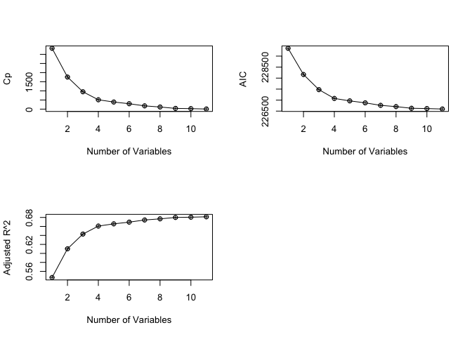
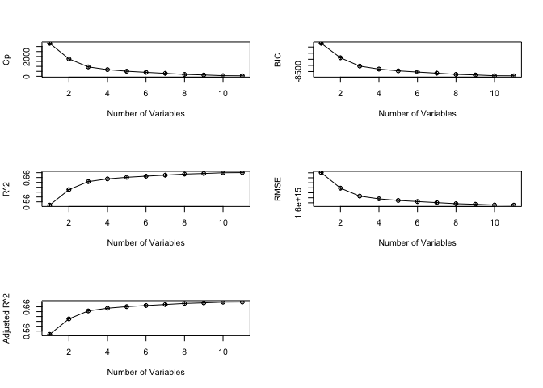
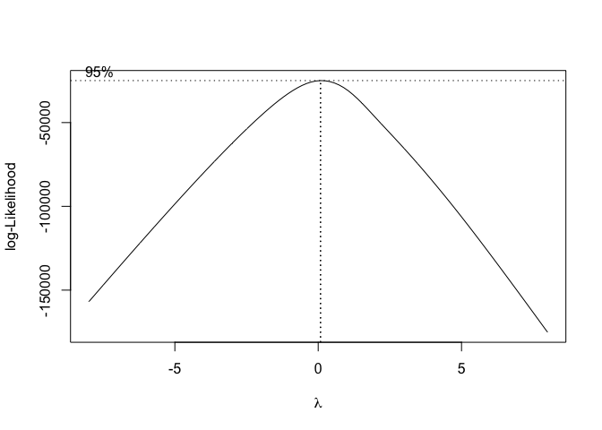
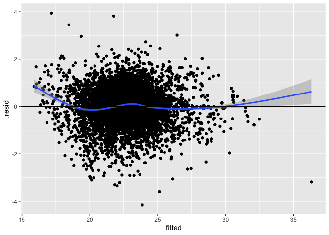
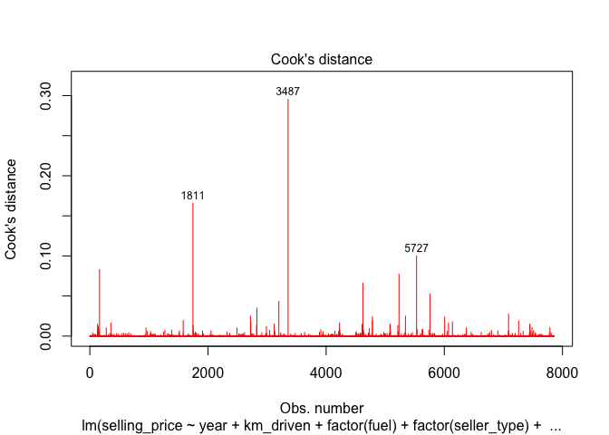
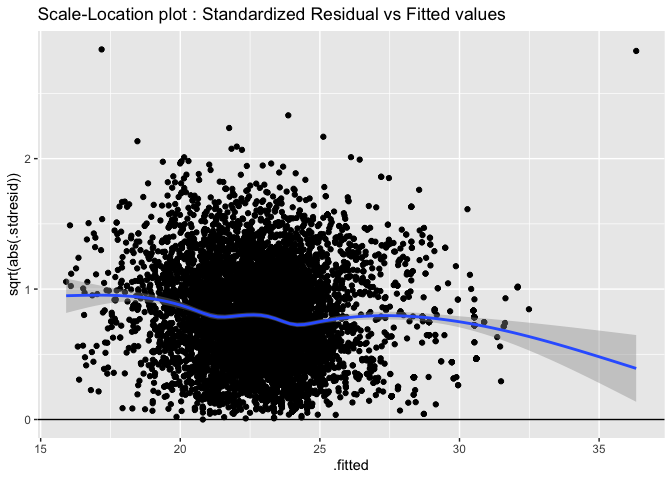
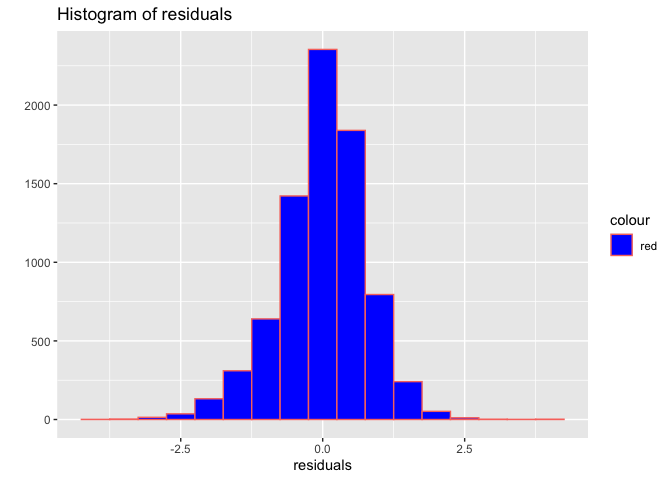
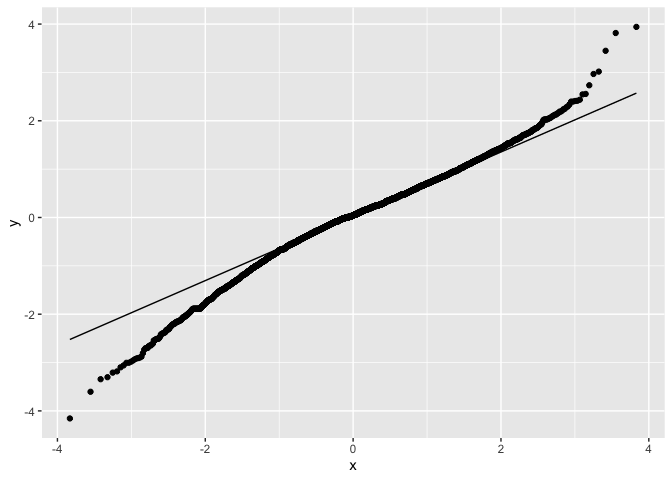

Used cars price prediction
================
Andrii Voitkiv, Ibtassam Rasheed, Imad Ahmad, Yip Chi Man
December 13, 2022

-   [Cleaning](#cleaning)
-   [Testing for colinearity](#testing-for-colinearity)
-   [Individual t-tests](#individual-t-tests)
-   [Stepwise](#stepwise)
-   [Best Subset](#best-subset)
-   [Interaction models](#interaction-models)
-   [Partial F-test on interaction
    model](#partial-f-test-on-interaction-model)
-   [Higher order](#higher-order)
-   [Assumptions](#assumptions)
    -   [Linearality](#linearality)

``` r
knitr::opts_chunk$set(fig.path='Figs/')
```

# Cleaning

``` r
car_dataset <- read.csv('Car details.csv')

#Remove rows with NA (221 rows)
car_dataset <- car_dataset[complete.cases(car_dataset), ]
```

``` r
#Remove the 'kmpl' / 'km per kg' for the mileage column
car_dataset$mileage = as.numeric(gsub("[^0-9.<>]", "", car_dataset$mileage))
#Remove Zero value mileage rows (17 rows)
car_dataset = car_dataset[car_dataset$mileage!=0, ]
```

``` r
#Remove the 'CC' for the engine column
car_dataset$engine = as.numeric(gsub("[^0-9.<>]", "", car_dataset$engine))
```

``` r
#Remove the 'bhp' for the max_power column
car_dataset$max_power = as.numeric(gsub("[^0-9.<>]", "", car_dataset$max_power))
```

``` r
#break the torque column into torque_nm and torque_rpm columns
for (i in 1:nrow(car_dataset)){
  if(grepl('(kgm@ rpm)',car_dataset$torque[i])){
    car_dataset$torque_nm[i] <-as.numeric(strsplit(car_dataset$torque[i], "[@]")[[1]][1])*9.80665 #covert from kgm to nm
    car_dataset$torque_rpm[i] <-as.numeric(gsub("[^0-9.<>]", "",strsplit(car_dataset$torque[i], "@|-|~")[[1]][2]))
  }
  else if (grepl('kgm at',tolower(car_dataset$torque[i])))
  {
    car_dataset$torque_nm[i] <- as.numeric(gsub("[^0-9.<>]", "",strsplit(car_dataset$torque[i], "[at]")[[1]][1]))*9.80665
    car_dataset$torque_rpm[i] <- as.numeric(gsub("[^0-9.<>]", "",strsplit(car_dataset$torque[i], c("at|-|~"))[[1]][2]))
  }
  else if (grepl('nm at',tolower(car_dataset$torque[i])))
  {
    car_dataset$torque_nm[i] <- as.numeric(gsub("[^0-9.<>]", "",strsplit(car_dataset$torque[i], "[at]")[[1]][1]))
    car_dataset$torque_rpm[i] <- as.numeric(gsub("[^0-9.<>]", "",strsplit(car_dataset$torque[i], c("at|-|~"))[[1]][2]))
  }
  else if (grepl(' / ',car_dataset$torque[i]))
  {
    car_dataset$torque_nm[i] <- as.numeric(gsub("[^0-9.<>]", "",strsplit(car_dataset$torque[i], " / ")[[1]][1]))
    car_dataset$torque_rpm[i] <- as.numeric(gsub("[^0-9.<>]", "",strsplit(car_dataset$torque[i], c(" / "))[[1]][2]))
  }
  else if (grepl('kgm@',car_dataset$torque[i]))
  {
    car_dataset$torque_nm[i] <- as.numeric(gsub("[^0-9.<>]", "",strsplit(car_dataset$torque[i], "[@]|\\(")[[1]][1]))*9.80665
    car_dataset$torque_rpm[i] <- as.numeric(gsub("[^0-9.<>]", "",strsplit(car_dataset$torque[i], c("@|-|~"))[[1]][2]))
  }
  else
  {
    car_dataset$torque_nm[i] <- as.numeric(gsub("[^0-9.<>]", "",strsplit(car_dataset$torque[i], "[@]|\\(")[[1]][1]))
    car_dataset$torque_rpm[i] <- as.numeric(gsub("[^0-9.<>]", "",strsplit(car_dataset$torque[i], c("@|-|~"))[[1]][2]))
  }
}
```

``` r
#Remove rows with NA in torque_rpm (35 rows)
car_dataset <- car_dataset[complete.cases(car_dataset$torque_rpm), ]
```

# Testing for colinearity

``` r
library(mctest)
firstordermodel<-lm(selling_price~year+km_driven+factor(fuel)+factor(seller_type)+factor(transmission)+factor(owner)+mileage+engine+max_power+seats+torque_rpm, data=car_dataset)
imcdiag(firstordermodel, method="VIF")
```

    ## 
    ## Call:
    ## imcdiag(mod = firstordermodel, method = "VIF")
    ## 
    ## 
    ##  VIF Multicollinearity Diagnostics
    ## 
    ##                                         VIF detection
    ## year                                 2.0953         0
    ## km_driven                            1.4386         0
    ## factor(fuel)Diesel                  40.2806         1
    ## factor(fuel)LPG                      1.6951         0
    ## factor(fuel)Petrol                  39.1833         1
    ## factor(seller_type)Individual        1.4686         0
    ## factor(seller_type)Trustmark Dealer  1.2542         0
    ## factor(transmission)Manual           1.6409         0
    ## factor(owner)Fourth & Above Owner    1.1005         0
    ## factor(owner)Second Owner            1.2754         0
    ## factor(owner)Test Drive Car          1.0109         0
    ## factor(owner)Third Owner             1.1996         0
    ## mileage                              3.0548         0
    ## engine                               5.5554         0
    ## max_power                            3.2619         0
    ## seats                                2.3255         0
    ## torque_rpm                           4.2029         0
    ## 
    ## Multicollinearity may be due to factor(fuel)Diesel factor(fuel)Petrol regressors
    ## 
    ## 1 --> COLLINEARITY is detected by the test 
    ## 0 --> COLLINEARITY is not detected by the test
    ## 
    ## ===================================

# Individual t-tests

``` r
summary(firstordermodel)
```

    ## 
    ## Call:
    ## lm(formula = selling_price ~ year + km_driven + factor(fuel) + 
    ##     factor(seller_type) + factor(transmission) + factor(owner) + 
    ##     mileage + engine + max_power + seats + torque_rpm, data = car_dataset)
    ## 
    ## Residuals:
    ##      Min       1Q   Median       3Q      Max 
    ## -2194974  -189249    13230   162870  4367716 
    ## 
    ## Coefficients:
    ##                                       Estimate Std. Error t value Pr(>|t|)    
    ## (Intercept)                         -6.430e+07  3.756e+06 -17.118  < 2e-16 ***
    ## year                                 3.209e+04  1.879e+03  17.077  < 2e-16 ***
    ## km_driven                           -9.418e-01  1.057e-01  -8.913  < 2e-16 ***
    ## factor(fuel)Diesel                  -2.152e+05  6.381e+04  -3.373 0.000748 ***
    ## factor(fuel)LPG                      2.399e+05  9.791e+04   2.450 0.014316 *  
    ## factor(fuel)Petrol                  -1.571e+03  6.307e+04  -0.025 0.980130    
    ## factor(seller_type)Individual       -2.732e+05  1.615e+04 -16.912  < 2e-16 ***
    ## factor(seller_type)Trustmark Dealer -3.343e+05  3.286e+04 -10.173  < 2e-16 ***
    ## factor(transmission)Manual          -4.278e+05  1.924e+04 -22.233  < 2e-16 ***
    ## factor(owner)Fourth & Above Owner    5.248e+03  3.731e+04   0.141 0.888142    
    ## factor(owner)Second Owner           -4.322e+04  1.296e+04  -3.335 0.000858 ***
    ## factor(owner)Test Drive Car          1.984e+06  1.997e+05   9.934  < 2e-16 ***
    ## factor(owner)Third Owner            -1.363e+04  2.231e+04  -0.611 0.541258    
    ## mileage                              1.692e+04  2.219e+03   7.624 2.75e-14 ***
    ## engine                               1.294e+02  2.346e+01   5.515 3.59e-08 ***
    ## max_power                            1.225e+04  2.570e+02  47.646  < 2e-16 ***
    ## seats                               -3.813e+04  7.955e+03  -4.793 1.67e-06 ***
    ## torque_rpm                          -1.207e+02  9.021e+00 -13.380  < 2e-16 ***
    ## ---
    ## Signif. codes:  0 '***' 0.001 '**' 0.01 '*' 0.05 '.' 0.1 ' ' 1
    ## 
    ## Residual standard error: 443900 on 7837 degrees of freedom
    ## Multiple R-squared:  0.6821, Adjusted R-squared:  0.6814 
    ## F-statistic: 989.2 on 17 and 7837 DF,  p-value: < 2.2e-16

# Stepwise

``` r
library("olsrr")
# stepmod = ols_step_both_p(firstordermodel, pent = 0.1, prem = 0.3, details=TRUE)
```

# Best Subset

``` r
aprs =ols_step_best_subset(firstordermodel, details=TRUE)
cp<-c(aprs$cp)
AIC<-c(aprs$aic)
AdjustedR<-c(aprs$adjr)

cbind(AdjustedR,cp,AIC)
```

    ##       AdjustedR         cp      AIC
    ##  [1,] 0.5463546 3331.20899 229355.4
    ##  [2,] 0.6102392 1757.25232 228164.2
    ##  [3,] 0.6430044  950.58254 227475.4
    ##  [4,] 0.6607986  511.94464 227075.8
    ##  [5,] 0.6657138  388.65051 226965.1
    ##  [6,] 0.6695501  295.14547 226875.5
    ##  [7,] 0.6743263  178.52764 226762.1
    ##  [8,] 0.6768440  115.50213 226704.1
    ##  [9,] 0.6799655   39.68024 226628.9
    ## [10,] 0.6805224   26.97430 226616.2
    ## [11,] 0.6814156    6.00000 226595.2

``` r
par(mfrow=c(2,2)) # split the plotting panel into a 2 x 2 grid
plot(aprs$cp,type = "o",pch=10, xlab="Number of Variables",ylab= "Cp")
plot(aprs$aic,type = "o",pch=10, xlab="Number of Variables",ylab= "AIC")
plot(aprs$adjr,type = "o",pch=10, xlab="Number of Variables",ylab= "Adjusted R^2")
```

<!-- -->

``` r
library(leaps)
best.subset<-regsubsets(selling_price~year+km_driven+factor(fuel)+factor(seller_type)+factor(transmission)+factor(owner)+mileage+engine+max_power+seats+torque_rpm, data=car_dataset, nv=11 ) 
reg.summary = summary(best.subset)
summary(best.subset)
```

    ## Subset selection object
    ## Call: regsubsets.formula(selling_price ~ year + km_driven + factor(fuel) + 
    ##     factor(seller_type) + factor(transmission) + factor(owner) + 
    ##     mileage + engine + max_power + seats + torque_rpm, data = car_dataset, 
    ##     nv = 11)
    ## 17 Variables  (and intercept)
    ##                                     Forced in Forced out
    ## year                                    FALSE      FALSE
    ## km_driven                               FALSE      FALSE
    ## factor(fuel)Diesel                      FALSE      FALSE
    ## factor(fuel)LPG                         FALSE      FALSE
    ## factor(fuel)Petrol                      FALSE      FALSE
    ## factor(seller_type)Individual           FALSE      FALSE
    ## factor(seller_type)Trustmark Dealer     FALSE      FALSE
    ## factor(transmission)Manual              FALSE      FALSE
    ## factor(owner)Fourth & Above Owner       FALSE      FALSE
    ## factor(owner)Second Owner               FALSE      FALSE
    ## factor(owner)Test Drive Car             FALSE      FALSE
    ## factor(owner)Third Owner                FALSE      FALSE
    ## mileage                                 FALSE      FALSE
    ## engine                                  FALSE      FALSE
    ## max_power                               FALSE      FALSE
    ## seats                                   FALSE      FALSE
    ## torque_rpm                              FALSE      FALSE
    ## 1 subsets of each size up to 11
    ## Selection Algorithm: exhaustive
    ##           year km_driven factor(fuel)Diesel factor(fuel)LPG factor(fuel)Petrol
    ## 1  ( 1 )  " "  " "       " "                " "             " "               
    ## 2  ( 1 )  "*"  " "       " "                " "             " "               
    ## 3  ( 1 )  "*"  " "       " "                " "             " "               
    ## 4  ( 1 )  "*"  " "       " "                " "             " "               
    ## 5  ( 1 )  "*"  " "       " "                " "             " "               
    ## 6  ( 1 )  "*"  " "       " "                " "             " "               
    ## 7  ( 1 )  "*"  "*"       " "                " "             " "               
    ## 8  ( 1 )  "*"  "*"       " "                " "             " "               
    ## 9  ( 1 )  "*"  "*"       " "                " "             " "               
    ## 10  ( 1 ) "*"  "*"       "*"                " "             " "               
    ## 11  ( 1 ) "*"  "*"       "*"                " "             " "               
    ##           factor(seller_type)Individual factor(seller_type)Trustmark Dealer
    ## 1  ( 1 )  " "                           " "                                
    ## 2  ( 1 )  " "                           " "                                
    ## 3  ( 1 )  " "                           " "                                
    ## 4  ( 1 )  "*"                           " "                                
    ## 5  ( 1 )  "*"                           "*"                                
    ## 6  ( 1 )  "*"                           "*"                                
    ## 7  ( 1 )  "*"                           "*"                                
    ## 8  ( 1 )  "*"                           "*"                                
    ## 9  ( 1 )  "*"                           "*"                                
    ## 10  ( 1 ) "*"                           "*"                                
    ## 11  ( 1 ) "*"                           "*"                                
    ##           factor(transmission)Manual factor(owner)Fourth & Above Owner
    ## 1  ( 1 )  " "                        " "                              
    ## 2  ( 1 )  " "                        " "                              
    ## 3  ( 1 )  "*"                        " "                              
    ## 4  ( 1 )  "*"                        " "                              
    ## 5  ( 1 )  "*"                        " "                              
    ## 6  ( 1 )  "*"                        " "                              
    ## 7  ( 1 )  "*"                        " "                              
    ## 8  ( 1 )  "*"                        " "                              
    ## 9  ( 1 )  "*"                        " "                              
    ## 10  ( 1 ) "*"                        " "                              
    ## 11  ( 1 ) "*"                        " "                              
    ##           factor(owner)Second Owner factor(owner)Test Drive Car
    ## 1  ( 1 )  " "                       " "                        
    ## 2  ( 1 )  " "                       " "                        
    ## 3  ( 1 )  " "                       " "                        
    ## 4  ( 1 )  " "                       " "                        
    ## 5  ( 1 )  " "                       " "                        
    ## 6  ( 1 )  " "                       "*"                        
    ## 7  ( 1 )  " "                       " "                        
    ## 8  ( 1 )  " "                       "*"                        
    ## 9  ( 1 )  " "                       "*"                        
    ## 10  ( 1 ) " "                       "*"                        
    ## 11  ( 1 ) " "                       "*"                        
    ##           factor(owner)Third Owner mileage engine max_power seats torque_rpm
    ## 1  ( 1 )  " "                      " "     " "    "*"       " "   " "       
    ## 2  ( 1 )  " "                      " "     " "    "*"       " "   " "       
    ## 3  ( 1 )  " "                      " "     " "    "*"       " "   " "       
    ## 4  ( 1 )  " "                      " "     " "    "*"       " "   " "       
    ## 5  ( 1 )  " "                      " "     " "    "*"       " "   " "       
    ## 6  ( 1 )  " "                      " "     " "    "*"       " "   " "       
    ## 7  ( 1 )  " "                      " "     " "    "*"       " "   "*"       
    ## 8  ( 1 )  " "                      " "     " "    "*"       " "   "*"       
    ## 9  ( 1 )  " "                      " "     " "    "*"       "*"   "*"       
    ## 10  ( 1 ) " "                      "*"     " "    "*"       " "   "*"       
    ## 11  ( 1 ) " "                      "*"     "*"    "*"       " "   "*"

``` r
rsquare<-c(reg.summary$rsq)
cp<-c(reg.summary$cp)
AdjustedR<-c(reg.summary$adjr2)
RMSE<-c(reg.summary$rss)
BIC<-c(reg.summary$bic)
cbind(rsquare,cp,BIC,RMSE,AdjustedR)
```

    ##         rsquare         cp       BIC         RMSE AdjustedR
    ##  [1,] 0.5464124 3331.20899 -6191.965 2.203705e+15 0.5463546
    ##  [2,] 0.6103384 1757.25232 -7376.248 1.893128e+15 0.6102392
    ##  [3,] 0.6431408  950.58254 -8058.025 1.733761e+15 0.6430044
    ##  [4,] 0.6544121  674.71311 -8301.157 1.679001e+15 0.6542360
    ##  [5,] 0.6610145  513.94464 -8443.710 1.646924e+15 0.6607986
    ##  [6,] 0.6655708  403.61864 -8541.036 1.624787e+15 0.6653151
    ##  [7,] 0.6698752  299.50357 -8633.824 1.603875e+15 0.6695807
    ##  [8,] 0.6742847  192.79794 -8730.481 1.582452e+15 0.6739526
    ##  [9,] 0.6767009  135.23129 -8779.999 1.570713e+15 0.6763300
    ## [10,] 0.6797097   63.05667 -8844.475 1.556095e+15 0.6793013
    ## [11,] 0.6803057   50.36254 -8850.137 1.553200e+15 0.6798573

``` r
par(mfrow=c(3,2)) # split the plotting panel into a 3 x 2 grid
plot(reg.summary$cp,type = "o",pch=10, xlab="Number of Variables",ylab= "Cp")
plot(reg.summary$bic,type = "o",pch=10, xlab="Number of Variables",ylab= "BIC")
plot(reg.summary$rsq,type = "o",pch=10, xlab="Number of Variables",ylab= "R^2")
plot(reg.summary$rss,type = "o",pch=10, xlab="Number of Variables",ylab= "RMSE")
plot(reg.summary$adjr2,type = "o",pch=10, xlab="Number of Variables",ylab= "Adjusted R^2")
```

<!-- --> \# F test on seats

``` r
reduced_model = lm(selling_price~year+km_driven+factor(fuel)+factor(seller_type)+factor(transmission)+factor(owner)+mileage+engine+max_power+torque_rpm, data=car_dataset)
anova(reduced_model, firstordermodel)
```

    ## Analysis of Variance Table
    ## 
    ## Model 1: selling_price ~ year + km_driven + factor(fuel) + factor(seller_type) + 
    ##     factor(transmission) + factor(owner) + mileage + engine + 
    ##     max_power + torque_rpm
    ## Model 2: selling_price ~ year + km_driven + factor(fuel) + factor(seller_type) + 
    ##     factor(transmission) + factor(owner) + mileage + engine + 
    ##     max_power + seats + torque_rpm
    ##   Res.Df        RSS Df  Sum of Sq      F    Pr(>F)    
    ## 1   7838 1.5490e+15                                   
    ## 2   7837 1.5445e+15  1 4.5276e+12 22.974 1.672e-06 ***
    ## ---
    ## Signif. codes:  0 '***' 0.001 '**' 0.01 '*' 0.05 '.' 0.1 ' ' 1

# Interaction models

``` r
intmodel = lm(selling_price~(year+km_driven+factor(fuel)+factor(seller_type)+factor(transmission)+factor(owner)+mileage+engine+max_power+seats+torque_rpm)^2, data=car_dataset)

# Took out insignifant terms
reducedint = lm(selling_price~year+km_driven+factor(fuel)+factor(seller_type)+factor(transmission)+factor(owner)+mileage+engine+max_power+seats+torque_rpm + year*km_driven + year*factor(seller_type) + year*factor(transmission) + year*mileage + year*engine + year*max_power + year*torque_rpm + km_driven*factor(seller_type) + km_driven*factor(transmission) + km_driven*max_power + factor(fuel)*factor(transmission) + factor(fuel)*factor(owner) + factor(seller_type)*factor(transmission) + factor(seller_type)*factor(owner) + factor(seller_type)*mileage + factor(seller_type)*engine +factor(seller_type)*max_power + factor(transmission)*factor(owner) + factor(transmission)*mileage + factor(transmission)*engine + factor(transmission)*max_power + factor(transmission)*seats + factor(transmission)*torque_rpm + factor(owner)*mileage + factor(owner)*engine + factor(owner)*torque_rpm + mileage*engine + mileage*max_power + engine*max_power + engine*torque_rpm + max_power*seats + max_power*torque_rpm, data=car_dataset)

# took out interaction between factor owner and torque rpm
reducedint2 = lm(selling_price~year+km_driven+factor(fuel)+factor(seller_type)+factor(transmission)+factor(owner)+mileage+engine+max_power+seats+torque_rpm + year*km_driven + year*factor(seller_type) + year*factor(transmission) + year*mileage + year*engine + year*max_power + year*torque_rpm + km_driven*factor(seller_type) + km_driven*factor(transmission) + km_driven*max_power + factor(fuel)*factor(transmission) + factor(fuel)*factor(owner) + factor(seller_type)*factor(transmission) + factor(seller_type)*factor(owner) + factor(seller_type)*mileage + factor(seller_type)*engine +factor(seller_type)*max_power + factor(transmission)*factor(owner) + factor(transmission)*mileage + factor(transmission)*engine + factor(transmission)*max_power + factor(transmission)*seats + factor(transmission)*torque_rpm + factor(owner)*mileage + factor(owner)*engine + mileage*engine + mileage*max_power + engine*max_power + engine*torque_rpm + max_power*seats + max_power*torque_rpm, data=car_dataset)
summary(reducedint2)
```

    ## 
    ## Call:
    ## lm(formula = selling_price ~ year + km_driven + factor(fuel) + 
    ##     factor(seller_type) + factor(transmission) + factor(owner) + 
    ##     mileage + engine + max_power + seats + torque_rpm + year * 
    ##     km_driven + year * factor(seller_type) + year * factor(transmission) + 
    ##     year * mileage + year * engine + year * max_power + year * 
    ##     torque_rpm + km_driven * factor(seller_type) + km_driven * 
    ##     factor(transmission) + km_driven * max_power + factor(fuel) * 
    ##     factor(transmission) + factor(fuel) * factor(owner) + factor(seller_type) * 
    ##     factor(transmission) + factor(seller_type) * factor(owner) + 
    ##     factor(seller_type) * mileage + factor(seller_type) * engine + 
    ##     factor(seller_type) * max_power + factor(transmission) * 
    ##     factor(owner) + factor(transmission) * mileage + factor(transmission) * 
    ##     engine + factor(transmission) * max_power + factor(transmission) * 
    ##     seats + factor(transmission) * torque_rpm + factor(owner) * 
    ##     mileage + factor(owner) * engine + mileage * engine + mileage * 
    ##     max_power + engine * max_power + engine * torque_rpm + max_power * 
    ##     seats + max_power * torque_rpm, data = car_dataset)
    ## 
    ## Residuals:
    ##      Min       1Q   Median       3Q      Max 
    ## -2823325   -82100    -3035    81121  2124031 
    ## 
    ## Coefficients: (11 not defined because of singularities)
    ##                                                                         Estimate
    ## (Intercept)                                                           -4.410e+07
    ## year                                                                   2.043e+04
    ## km_driven                                                              2.099e+02
    ## factor(fuel)Diesel                                                     4.621e+05
    ## factor(fuel)LPG                                                       -3.421e+04
    ## factor(fuel)Petrol                                                    -6.874e+04
    ## factor(seller_type)Individual                                          5.169e+07
    ## factor(seller_type)Trustmark Dealer                                    4.170e+07
    ## factor(transmission)Manual                                             9.040e+07
    ## factor(owner)Fourth & Above Owner                                      6.515e+05
    ## factor(owner)Second Owner                                              4.965e+04
    ## factor(owner)Test Drive Car                                            3.817e+07
    ## factor(owner)Third Owner                                               6.300e+05
    ## mileage                                                               -3.408e+06
    ## engine                                                                 1.869e+04
    ## max_power                                                             -2.664e+06
    ## seats                                                                  1.073e+05
    ## torque_rpm                                                             2.099e+04
    ## year:km_driven                                                        -1.065e-01
    ## year:factor(seller_type)Individual                                    -2.539e+04
    ## year:factor(seller_type)Trustmark Dealer                              -2.114e+04
    ## year:factor(transmission)Manual                                       -4.400e+04
    ## year:mileage                                                           1.709e+03
    ## year:engine                                                           -9.416e+00
    ## year:max_power                                                         1.335e+03
    ## year:torque_rpm                                                       -1.029e+01
    ## km_driven:factor(seller_type)Individual                                1.755e+00
    ## km_driven:factor(seller_type)Trustmark Dealer                          3.866e+00
    ## km_driven:factor(transmission)Manual                                   3.210e+00
    ## km_driven:max_power                                                   -8.784e-03
    ## factor(fuel)Diesel:factor(transmission)Manual                         -4.418e+05
    ## factor(fuel)LPG:factor(transmission)Manual                                    NA
    ## factor(fuel)Petrol:factor(transmission)Manual                                 NA
    ## factor(fuel)Diesel:factor(owner)Fourth & Above Owner                   1.540e+05
    ## factor(fuel)LPG:factor(owner)Fourth & Above Owner                      6.880e+03
    ## factor(fuel)Petrol:factor(owner)Fourth & Above Owner                   2.126e+04
    ## factor(fuel)Diesel:factor(owner)Second Owner                           3.694e+04
    ## factor(fuel)LPG:factor(owner)Second Owner                             -3.817e+04
    ## factor(fuel)Petrol:factor(owner)Second Owner                           3.949e+04
    ## factor(fuel)Diesel:factor(owner)Test Drive Car                         1.360e+07
    ## factor(fuel)LPG:factor(owner)Test Drive Car                                   NA
    ## factor(fuel)Petrol:factor(owner)Test Drive Car                                NA
    ## factor(fuel)Diesel:factor(owner)Third Owner                            1.156e+04
    ## factor(fuel)LPG:factor(owner)Third Owner                              -1.054e+05
    ## factor(fuel)Petrol:factor(owner)Third Owner                            9.407e+03
    ## factor(seller_type)Individual:factor(transmission)Manual               2.746e+04
    ## factor(seller_type)Trustmark Dealer:factor(transmission)Manual         2.399e+05
    ## factor(seller_type)Individual:factor(owner)Fourth & Above Owner               NA
    ## factor(seller_type)Trustmark Dealer:factor(owner)Fourth & Above Owner         NA
    ## factor(seller_type)Individual:factor(owner)Second Owner               -4.810e+04
    ## factor(seller_type)Trustmark Dealer:factor(owner)Second Owner         -4.833e+05
    ## factor(seller_type)Individual:factor(owner)Test Drive Car                     NA
    ## factor(seller_type)Trustmark Dealer:factor(owner)Test Drive Car               NA
    ## factor(seller_type)Individual:factor(owner)Third Owner                -2.314e+05
    ## factor(seller_type)Trustmark Dealer:factor(owner)Third Owner                  NA
    ## factor(seller_type)Individual:mileage                                 -1.343e+04
    ## factor(seller_type)Trustmark Dealer:mileage                            7.107e+03
    ## factor(seller_type)Individual:engine                                   1.630e+02
    ## factor(seller_type)Trustmark Dealer:engine                             5.313e+02
    ## factor(seller_type)Individual:max_power                               -6.796e+03
    ## factor(seller_type)Trustmark Dealer:max_power                         -3.118e+03
    ## factor(transmission)Manual:factor(owner)Fourth & Above Owner          -3.295e+05
    ## factor(transmission)Manual:factor(owner)Second Owner                  -8.297e+04
    ## factor(transmission)Manual:factor(owner)Test Drive Car                        NA
    ## factor(transmission)Manual:factor(owner)Third Owner                   -3.364e+05
    ## factor(transmission)Manual:mileage                                    -1.735e+04
    ## factor(transmission)Manual:engine                                      5.098e+02
    ## factor(transmission)Manual:max_power                                  -1.450e+04
    ## factor(transmission)Manual:seats                                      -3.607e+04
    ## factor(transmission)Manual:torque_rpm                                 -1.685e+02
    ## factor(owner)Fourth & Above Owner:mileage                             -1.446e+04
    ## factor(owner)Second Owner:mileage                                      1.648e+03
    ## factor(owner)Test Drive Car:mileage                                   -2.331e+06
    ## factor(owner)Third Owner:mileage                                      -2.785e+03
    ## factor(owner)Fourth & Above Owner:engine                              -1.385e+02
    ## factor(owner)Second Owner:engine                                      -3.141e+00
    ## factor(owner)Test Drive Car:engine                                            NA
    ## factor(owner)Third Owner:engine                                       -3.611e+01
    ## mileage:engine                                                        -1.241e+01
    ## mileage:max_power                                                      1.789e+02
    ## engine:max_power                                                       1.768e+00
    ## engine:torque_rpm                                                     -1.366e-01
    ## max_power:seats                                                       -6.986e+02
    ## max_power:torque_rpm                                                   1.027e+00
    ##                                                                       Std. Error
    ## (Intercept)                                                            2.214e+07
    ## year                                                                   1.103e+04
    ## km_driven                                                              2.986e+01
    ## factor(fuel)Diesel                                                     5.626e+04
    ## factor(fuel)LPG                                                        7.184e+04
    ## factor(fuel)Petrol                                                     4.315e+04
    ## factor(seller_type)Individual                                          7.825e+06
    ## factor(seller_type)Trustmark Dealer                                    4.224e+07
    ## factor(transmission)Manual                                             9.854e+06
    ## factor(owner)Fourth & Above Owner                                      3.419e+05
    ## factor(owner)Second Owner                                              1.273e+05
    ## factor(owner)Test Drive Car                                            3.504e+06
    ## factor(owner)Third Owner                                               2.714e+05
    ## mileage                                                                6.072e+05
    ## engine                                                                 6.493e+03
    ## max_power                                                              8.616e+04
    ## seats                                                                  2.682e+04
    ## torque_rpm                                                             1.818e+03
    ## year:km_driven                                                         1.483e-02
    ## year:factor(seller_type)Individual                                     3.890e+03
    ## year:factor(seller_type)Trustmark Dealer                               2.093e+04
    ## year:factor(transmission)Manual                                        4.913e+03
    ## year:mileage                                                           3.011e+02
    ## year:engine                                                            3.227e+00
    ## year:max_power                                                         4.287e+01
    ## year:torque_rpm                                                        9.012e-01
    ## km_driven:factor(seller_type)Individual                                3.231e-01
    ## km_driven:factor(seller_type)Trustmark Dealer                          1.805e+00
    ## km_driven:factor(transmission)Manual                                   3.580e-01
    ## km_driven:max_power                                                    2.035e-03
    ## factor(fuel)Diesel:factor(transmission)Manual                          4.060e+04
    ## factor(fuel)LPG:factor(transmission)Manual                                    NA
    ## factor(fuel)Petrol:factor(transmission)Manual                                 NA
    ## factor(fuel)Diesel:factor(owner)Fourth & Above Owner                   2.501e+05
    ## factor(fuel)LPG:factor(owner)Fourth & Above Owner                      3.444e+05
    ## factor(fuel)Petrol:factor(owner)Fourth & Above Owner                   2.441e+05
    ## factor(fuel)Diesel:factor(owner)Second Owner                           7.421e+04
    ## factor(fuel)LPG:factor(owner)Second Owner                              1.178e+05
    ## factor(fuel)Petrol:factor(owner)Second Owner                           7.539e+04
    ## factor(fuel)Diesel:factor(owner)Test Drive Car                         1.525e+06
    ## factor(fuel)LPG:factor(owner)Test Drive Car                                   NA
    ## factor(fuel)Petrol:factor(owner)Test Drive Car                                NA
    ## factor(fuel)Diesel:factor(owner)Third Owner                            1.747e+05
    ## factor(fuel)LPG:factor(owner)Third Owner                               2.129e+05
    ## factor(fuel)Petrol:factor(owner)Third Owner                            1.747e+05
    ## factor(seller_type)Individual:factor(transmission)Manual               2.644e+04
    ## factor(seller_type)Trustmark Dealer:factor(transmission)Manual         5.978e+04
    ## factor(seller_type)Individual:factor(owner)Fourth & Above Owner               NA
    ## factor(seller_type)Trustmark Dealer:factor(owner)Fourth & Above Owner         NA
    ## factor(seller_type)Individual:factor(owner)Second Owner                2.946e+04
    ## factor(seller_type)Trustmark Dealer:factor(owner)Second Owner          1.202e+05
    ## factor(seller_type)Individual:factor(owner)Test Drive Car                     NA
    ## factor(seller_type)Trustmark Dealer:factor(owner)Test Drive Car               NA
    ## factor(seller_type)Individual:factor(owner)Third Owner                 1.217e+05
    ## factor(seller_type)Trustmark Dealer:factor(owner)Third Owner                  NA
    ## factor(seller_type)Individual:mileage                                  2.814e+03
    ## factor(seller_type)Trustmark Dealer:mileage                            9.664e+03
    ## factor(seller_type)Individual:engine                                   3.696e+01
    ## factor(seller_type)Trustmark Dealer:engine                             1.146e+02
    ## factor(seller_type)Individual:max_power                                4.551e+02
    ## factor(seller_type)Trustmark Dealer:max_power                          2.187e+03
    ## factor(transmission)Manual:factor(owner)Fourth & Above Owner           1.034e+05
    ## factor(transmission)Manual:factor(owner)Second Owner                   2.943e+04
    ## factor(transmission)Manual:factor(owner)Test Drive Car                        NA
    ## factor(transmission)Manual:factor(owner)Third Owner                    6.542e+04
    ## factor(transmission)Manual:mileage                                     4.772e+03
    ## factor(transmission)Manual:engine                                      5.478e+01
    ## factor(transmission)Manual:max_power                                   5.400e+02
    ## factor(transmission)Manual:seats                                       1.954e+04
    ## factor(transmission)Manual:torque_rpm                                  1.716e+01
    ## factor(owner)Fourth & Above Owner:mileage                              8.909e+03
    ## factor(owner)Second Owner:mileage                                      2.797e+03
    ## factor(owner)Test Drive Car:mileage                                    2.247e+05
    ## factor(owner)Third Owner:mileage                                       5.190e+03
    ## factor(owner)Fourth & Above Owner:engine                               7.174e+01
    ## factor(owner)Second Owner:engine                                       2.554e+01
    ## factor(owner)Test Drive Car:engine                                            NA
    ## factor(owner)Third Owner:engine                                        4.335e+01
    ## mileage:engine                                                         3.368e+00
    ## mileage:max_power                                                      3.758e+01
    ## engine:max_power                                                       2.815e-01
    ## engine:torque_rpm                                                      1.609e-02
    ## max_power:seats                                                        1.321e+02
    ## max_power:torque_rpm                                                   2.174e-01
    ##                                                                       t value
    ## (Intercept)                                                            -1.992
    ## year                                                                    1.852
    ## km_driven                                                               7.031
    ## factor(fuel)Diesel                                                      8.213
    ## factor(fuel)LPG                                                        -0.476
    ## factor(fuel)Petrol                                                     -1.593
    ## factor(seller_type)Individual                                           6.606
    ## factor(seller_type)Trustmark Dealer                                     0.987
    ## factor(transmission)Manual                                              9.174
    ## factor(owner)Fourth & Above Owner                                       1.906
    ## factor(owner)Second Owner                                               0.390
    ## factor(owner)Test Drive Car                                            10.893
    ## factor(owner)Third Owner                                                2.321
    ## mileage                                                                -5.613
    ## engine                                                                  2.879
    ## max_power                                                             -30.922
    ## seats                                                                   4.001
    ## torque_rpm                                                             11.547
    ## year:km_driven                                                         -7.181
    ## year:factor(seller_type)Individual                                     -6.526
    ## year:factor(seller_type)Trustmark Dealer                               -1.010
    ## year:factor(transmission)Manual                                        -8.955
    ## year:mileage                                                            5.677
    ## year:engine                                                            -2.918
    ## year:max_power                                                         31.130
    ## year:torque_rpm                                                       -11.418
    ## km_driven:factor(seller_type)Individual                                 5.432
    ## km_driven:factor(seller_type)Trustmark Dealer                           2.142
    ## km_driven:factor(transmission)Manual                                    8.968
    ## km_driven:max_power                                                    -4.317
    ## factor(fuel)Diesel:factor(transmission)Manual                         -10.880
    ## factor(fuel)LPG:factor(transmission)Manual                                 NA
    ## factor(fuel)Petrol:factor(transmission)Manual                              NA
    ## factor(fuel)Diesel:factor(owner)Fourth & Above Owner                    0.615
    ## factor(fuel)LPG:factor(owner)Fourth & Above Owner                       0.020
    ## factor(fuel)Petrol:factor(owner)Fourth & Above Owner                    0.087
    ## factor(fuel)Diesel:factor(owner)Second Owner                            0.498
    ## factor(fuel)LPG:factor(owner)Second Owner                              -0.324
    ## factor(fuel)Petrol:factor(owner)Second Owner                            0.524
    ## factor(fuel)Diesel:factor(owner)Test Drive Car                          8.918
    ## factor(fuel)LPG:factor(owner)Test Drive Car                                NA
    ## factor(fuel)Petrol:factor(owner)Test Drive Car                             NA
    ## factor(fuel)Diesel:factor(owner)Third Owner                             0.066
    ## factor(fuel)LPG:factor(owner)Third Owner                               -0.495
    ## factor(fuel)Petrol:factor(owner)Third Owner                             0.054
    ## factor(seller_type)Individual:factor(transmission)Manual                1.038
    ## factor(seller_type)Trustmark Dealer:factor(transmission)Manual          4.013
    ## factor(seller_type)Individual:factor(owner)Fourth & Above Owner            NA
    ## factor(seller_type)Trustmark Dealer:factor(owner)Fourth & Above Owner      NA
    ## factor(seller_type)Individual:factor(owner)Second Owner                -1.633
    ## factor(seller_type)Trustmark Dealer:factor(owner)Second Owner          -4.021
    ## factor(seller_type)Individual:factor(owner)Test Drive Car                  NA
    ## factor(seller_type)Trustmark Dealer:factor(owner)Test Drive Car            NA
    ## factor(seller_type)Individual:factor(owner)Third Owner                 -1.902
    ## factor(seller_type)Trustmark Dealer:factor(owner)Third Owner               NA
    ## factor(seller_type)Individual:mileage                                  -4.775
    ## factor(seller_type)Trustmark Dealer:mileage                             0.735
    ## factor(seller_type)Individual:engine                                    4.409
    ## factor(seller_type)Trustmark Dealer:engine                              4.637
    ## factor(seller_type)Individual:max_power                               -14.934
    ## factor(seller_type)Trustmark Dealer:max_power                          -1.426
    ## factor(transmission)Manual:factor(owner)Fourth & Above Owner           -3.187
    ## factor(transmission)Manual:factor(owner)Second Owner                   -2.819
    ## factor(transmission)Manual:factor(owner)Test Drive Car                     NA
    ## factor(transmission)Manual:factor(owner)Third Owner                    -5.141
    ## factor(transmission)Manual:mileage                                     -3.635
    ## factor(transmission)Manual:engine                                       9.307
    ## factor(transmission)Manual:max_power                                  -26.858
    ## factor(transmission)Manual:seats                                       -1.846
    ## factor(transmission)Manual:torque_rpm                                  -9.814
    ## factor(owner)Fourth & Above Owner:mileage                              -1.623
    ## factor(owner)Second Owner:mileage                                       0.589
    ## factor(owner)Test Drive Car:mileage                                   -10.376
    ## factor(owner)Third Owner:mileage                                       -0.537
    ## factor(owner)Fourth & Above Owner:engine                               -1.930
    ## factor(owner)Second Owner:engine                                       -0.123
    ## factor(owner)Test Drive Car:engine                                         NA
    ## factor(owner)Third Owner:engine                                        -0.833
    ## mileage:engine                                                         -3.684
    ## mileage:max_power                                                       4.761
    ## engine:max_power                                                        6.281
    ## engine:torque_rpm                                                      -8.492
    ## max_power:seats                                                        -5.287
    ## max_power:torque_rpm                                                    4.722
    ##                                                                       Pr(>|t|)
    ## (Intercept)                                                           0.046412
    ## year                                                                  0.064011
    ## km_driven                                                             2.22e-12
    ## factor(fuel)Diesel                                                    2.50e-16
    ## factor(fuel)LPG                                                       0.633916
    ## factor(fuel)Petrol                                                    0.111183
    ## factor(seller_type)Individual                                         4.21e-11
    ## factor(seller_type)Trustmark Dealer                                   0.323559
    ## factor(transmission)Manual                                             < 2e-16
    ## factor(owner)Fourth & Above Owner                                     0.056738
    ## factor(owner)Second Owner                                             0.696527
    ## factor(owner)Test Drive Car                                            < 2e-16
    ## factor(owner)Third Owner                                              0.020287
    ## mileage                                                               2.05e-08
    ## engine                                                                0.004005
    ## max_power                                                              < 2e-16
    ## seats                                                                 6.37e-05
    ## torque_rpm                                                             < 2e-16
    ## year:km_driven                                                        7.54e-13
    ## year:factor(seller_type)Individual                                    7.18e-11
    ## year:factor(seller_type)Trustmark Dealer                              0.312619
    ## year:factor(transmission)Manual                                        < 2e-16
    ## year:mileage                                                          1.42e-08
    ## year:engine                                                           0.003531
    ## year:max_power                                                         < 2e-16
    ## year:torque_rpm                                                        < 2e-16
    ## km_driven:factor(seller_type)Individual                               5.75e-08
    ## km_driven:factor(seller_type)Trustmark Dealer                         0.032220
    ## km_driven:factor(transmission)Manual                                   < 2e-16
    ## km_driven:max_power                                                   1.60e-05
    ## factor(fuel)Diesel:factor(transmission)Manual                          < 2e-16
    ## factor(fuel)LPG:factor(transmission)Manual                                  NA
    ## factor(fuel)Petrol:factor(transmission)Manual                               NA
    ## factor(fuel)Diesel:factor(owner)Fourth & Above Owner                  0.538269
    ## factor(fuel)LPG:factor(owner)Fourth & Above Owner                     0.984062
    ## factor(fuel)Petrol:factor(owner)Fourth & Above Owner                  0.930614
    ## factor(fuel)Diesel:factor(owner)Second Owner                          0.618620
    ## factor(fuel)LPG:factor(owner)Second Owner                             0.745973
    ## factor(fuel)Petrol:factor(owner)Second Owner                          0.600422
    ## factor(fuel)Diesel:factor(owner)Test Drive Car                         < 2e-16
    ## factor(fuel)LPG:factor(owner)Test Drive Car                                 NA
    ## factor(fuel)Petrol:factor(owner)Test Drive Car                              NA
    ## factor(fuel)Diesel:factor(owner)Third Owner                           0.947250
    ## factor(fuel)LPG:factor(owner)Third Owner                              0.620524
    ## factor(fuel)Petrol:factor(owner)Third Owner                           0.957061
    ## factor(seller_type)Individual:factor(transmission)Manual              0.299166
    ## factor(seller_type)Trustmark Dealer:factor(transmission)Manual        6.04e-05
    ## factor(seller_type)Individual:factor(owner)Fourth & Above Owner             NA
    ## factor(seller_type)Trustmark Dealer:factor(owner)Fourth & Above Owner       NA
    ## factor(seller_type)Individual:factor(owner)Second Owner               0.102540
    ## factor(seller_type)Trustmark Dealer:factor(owner)Second Owner         5.85e-05
    ## factor(seller_type)Individual:factor(owner)Test Drive Car                   NA
    ## factor(seller_type)Trustmark Dealer:factor(owner)Test Drive Car             NA
    ## factor(seller_type)Individual:factor(owner)Third Owner                0.057189
    ## factor(seller_type)Trustmark Dealer:factor(owner)Third Owner                NA
    ## factor(seller_type)Individual:mileage                                 1.83e-06
    ## factor(seller_type)Trustmark Dealer:mileage                           0.462135
    ## factor(seller_type)Individual:engine                                  1.05e-05
    ## factor(seller_type)Trustmark Dealer:engine                            3.59e-06
    ## factor(seller_type)Individual:max_power                                < 2e-16
    ## factor(seller_type)Trustmark Dealer:max_power                         0.154007
    ## factor(transmission)Manual:factor(owner)Fourth & Above Owner          0.001445
    ## factor(transmission)Manual:factor(owner)Second Owner                  0.004829
    ## factor(transmission)Manual:factor(owner)Test Drive Car                      NA
    ## factor(transmission)Manual:factor(owner)Third Owner                   2.80e-07
    ## factor(transmission)Manual:mileage                                    0.000279
    ## factor(transmission)Manual:engine                                      < 2e-16
    ## factor(transmission)Manual:max_power                                   < 2e-16
    ## factor(transmission)Manual:seats                                      0.064863
    ## factor(transmission)Manual:torque_rpm                                  < 2e-16
    ## factor(owner)Fourth & Above Owner:mileage                             0.104547
    ## factor(owner)Second Owner:mileage                                     0.555839
    ## factor(owner)Test Drive Car:mileage                                    < 2e-16
    ## factor(owner)Third Owner:mileage                                      0.591576
    ## factor(owner)Fourth & Above Owner:engine                              0.053590
    ## factor(owner)Second Owner:engine                                      0.902132
    ## factor(owner)Test Drive Car:engine                                          NA
    ## factor(owner)Third Owner:engine                                       0.404819
    ## mileage:engine                                                        0.000231
    ## mileage:max_power                                                     1.96e-06
    ## engine:max_power                                                      3.54e-10
    ## engine:torque_rpm                                                      < 2e-16
    ## max_power:seats                                                       1.28e-07
    ## max_power:torque_rpm                                                  2.38e-06
    ##                                                                          
    ## (Intercept)                                                           *  
    ## year                                                                  .  
    ## km_driven                                                             ***
    ## factor(fuel)Diesel                                                    ***
    ## factor(fuel)LPG                                                          
    ## factor(fuel)Petrol                                                       
    ## factor(seller_type)Individual                                         ***
    ## factor(seller_type)Trustmark Dealer                                      
    ## factor(transmission)Manual                                            ***
    ## factor(owner)Fourth & Above Owner                                     .  
    ## factor(owner)Second Owner                                                
    ## factor(owner)Test Drive Car                                           ***
    ## factor(owner)Third Owner                                              *  
    ## mileage                                                               ***
    ## engine                                                                ** 
    ## max_power                                                             ***
    ## seats                                                                 ***
    ## torque_rpm                                                            ***
    ## year:km_driven                                                        ***
    ## year:factor(seller_type)Individual                                    ***
    ## year:factor(seller_type)Trustmark Dealer                                 
    ## year:factor(transmission)Manual                                       ***
    ## year:mileage                                                          ***
    ## year:engine                                                           ** 
    ## year:max_power                                                        ***
    ## year:torque_rpm                                                       ***
    ## km_driven:factor(seller_type)Individual                               ***
    ## km_driven:factor(seller_type)Trustmark Dealer                         *  
    ## km_driven:factor(transmission)Manual                                  ***
    ## km_driven:max_power                                                   ***
    ## factor(fuel)Diesel:factor(transmission)Manual                         ***
    ## factor(fuel)LPG:factor(transmission)Manual                               
    ## factor(fuel)Petrol:factor(transmission)Manual                            
    ## factor(fuel)Diesel:factor(owner)Fourth & Above Owner                     
    ## factor(fuel)LPG:factor(owner)Fourth & Above Owner                        
    ## factor(fuel)Petrol:factor(owner)Fourth & Above Owner                     
    ## factor(fuel)Diesel:factor(owner)Second Owner                             
    ## factor(fuel)LPG:factor(owner)Second Owner                                
    ## factor(fuel)Petrol:factor(owner)Second Owner                             
    ## factor(fuel)Diesel:factor(owner)Test Drive Car                        ***
    ## factor(fuel)LPG:factor(owner)Test Drive Car                              
    ## factor(fuel)Petrol:factor(owner)Test Drive Car                           
    ## factor(fuel)Diesel:factor(owner)Third Owner                              
    ## factor(fuel)LPG:factor(owner)Third Owner                                 
    ## factor(fuel)Petrol:factor(owner)Third Owner                              
    ## factor(seller_type)Individual:factor(transmission)Manual                 
    ## factor(seller_type)Trustmark Dealer:factor(transmission)Manual        ***
    ## factor(seller_type)Individual:factor(owner)Fourth & Above Owner          
    ## factor(seller_type)Trustmark Dealer:factor(owner)Fourth & Above Owner    
    ## factor(seller_type)Individual:factor(owner)Second Owner                  
    ## factor(seller_type)Trustmark Dealer:factor(owner)Second Owner         ***
    ## factor(seller_type)Individual:factor(owner)Test Drive Car                
    ## factor(seller_type)Trustmark Dealer:factor(owner)Test Drive Car          
    ## factor(seller_type)Individual:factor(owner)Third Owner                .  
    ## factor(seller_type)Trustmark Dealer:factor(owner)Third Owner             
    ## factor(seller_type)Individual:mileage                                 ***
    ## factor(seller_type)Trustmark Dealer:mileage                              
    ## factor(seller_type)Individual:engine                                  ***
    ## factor(seller_type)Trustmark Dealer:engine                            ***
    ## factor(seller_type)Individual:max_power                               ***
    ## factor(seller_type)Trustmark Dealer:max_power                            
    ## factor(transmission)Manual:factor(owner)Fourth & Above Owner          ** 
    ## factor(transmission)Manual:factor(owner)Second Owner                  ** 
    ## factor(transmission)Manual:factor(owner)Test Drive Car                   
    ## factor(transmission)Manual:factor(owner)Third Owner                   ***
    ## factor(transmission)Manual:mileage                                    ***
    ## factor(transmission)Manual:engine                                     ***
    ## factor(transmission)Manual:max_power                                  ***
    ## factor(transmission)Manual:seats                                      .  
    ## factor(transmission)Manual:torque_rpm                                 ***
    ## factor(owner)Fourth & Above Owner:mileage                                
    ## factor(owner)Second Owner:mileage                                        
    ## factor(owner)Test Drive Car:mileage                                   ***
    ## factor(owner)Third Owner:mileage                                         
    ## factor(owner)Fourth & Above Owner:engine                              .  
    ## factor(owner)Second Owner:engine                                         
    ## factor(owner)Test Drive Car:engine                                       
    ## factor(owner)Third Owner:engine                                          
    ## mileage:engine                                                        ***
    ## mileage:max_power                                                     ***
    ## engine:max_power                                                      ***
    ## engine:torque_rpm                                                     ***
    ## max_power:seats                                                       ***
    ## max_power:torque_rpm                                                  ***
    ## ---
    ## Signif. codes:  0 '***' 0.001 '**' 0.01 '*' 0.05 '.' 0.1 ' ' 1
    ## 
    ## Residual standard error: 237900 on 7782 degrees of freedom
    ## Multiple R-squared:  0.9093, Adjusted R-squared:  0.9085 
    ## F-statistic:  1084 on 72 and 7782 DF,  p-value: < 2.2e-16

``` r
reducedint3 = lm(log(selling_price)~year+km_driven+factor(fuel)+factor(seller_type)+factor(transmission)+factor(owner)+mileage+engine+max_power+seats+torque_rpm + year*km_driven + year*factor(seller_type) + year*factor(transmission) + year*mileage + year*engine + year*max_power + year*torque_rpm + km_driven*factor(seller_type) + km_driven*factor(transmission) + km_driven*max_power + factor(fuel)*factor(transmission) + factor(fuel)*factor(owner) + factor(seller_type)*factor(transmission) + factor(seller_type)*factor(owner) + factor(seller_type)*mileage + factor(seller_type)*engine +factor(seller_type)*max_power + factor(transmission)*factor(owner) + factor(transmission)*mileage + factor(transmission)*engine + factor(transmission)*max_power + factor(transmission)*seats + factor(transmission)*torque_rpm + factor(owner)*mileage + factor(owner)*engine + mileage*engine + mileage*max_power + engine*max_power + engine*torque_rpm + max_power*seats + max_power*torque_rpm, data=car_dataset)
```

# Partial F-test on interaction model

``` r
anova(reducedint2, reducedint)
```

    ## Analysis of Variance Table
    ## 
    ## Model 1: selling_price ~ year + km_driven + factor(fuel) + factor(seller_type) + 
    ##     factor(transmission) + factor(owner) + mileage + engine + 
    ##     max_power + seats + torque_rpm + year * km_driven + year * 
    ##     factor(seller_type) + year * factor(transmission) + year * 
    ##     mileage + year * engine + year * max_power + year * torque_rpm + 
    ##     km_driven * factor(seller_type) + km_driven * factor(transmission) + 
    ##     km_driven * max_power + factor(fuel) * factor(transmission) + 
    ##     factor(fuel) * factor(owner) + factor(seller_type) * factor(transmission) + 
    ##     factor(seller_type) * factor(owner) + factor(seller_type) * 
    ##     mileage + factor(seller_type) * engine + factor(seller_type) * 
    ##     max_power + factor(transmission) * factor(owner) + factor(transmission) * 
    ##     mileage + factor(transmission) * engine + factor(transmission) * 
    ##     max_power + factor(transmission) * seats + factor(transmission) * 
    ##     torque_rpm + factor(owner) * mileage + factor(owner) * engine + 
    ##     mileage * engine + mileage * max_power + engine * max_power + 
    ##     engine * torque_rpm + max_power * seats + max_power * torque_rpm
    ## Model 2: selling_price ~ year + km_driven + factor(fuel) + factor(seller_type) + 
    ##     factor(transmission) + factor(owner) + mileage + engine + 
    ##     max_power + seats + torque_rpm + year * km_driven + year * 
    ##     factor(seller_type) + year * factor(transmission) + year * 
    ##     mileage + year * engine + year * max_power + year * torque_rpm + 
    ##     km_driven * factor(seller_type) + km_driven * factor(transmission) + 
    ##     km_driven * max_power + factor(fuel) * factor(transmission) + 
    ##     factor(fuel) * factor(owner) + factor(seller_type) * factor(transmission) + 
    ##     factor(seller_type) * factor(owner) + factor(seller_type) * 
    ##     mileage + factor(seller_type) * engine + factor(seller_type) * 
    ##     max_power + factor(transmission) * factor(owner) + factor(transmission) * 
    ##     mileage + factor(transmission) * engine + factor(transmission) * 
    ##     max_power + factor(transmission) * seats + factor(transmission) * 
    ##     torque_rpm + factor(owner) * mileage + factor(owner) * engine + 
    ##     factor(owner) * torque_rpm + mileage * engine + mileage * 
    ##     max_power + engine * max_power + engine * torque_rpm + max_power * 
    ##     seats + max_power * torque_rpm
    ##   Res.Df        RSS Df  Sum of Sq      F  Pr(>F)  
    ## 1   7782 4.4059e+14                               
    ## 2   7779 4.4020e+14  3 3.8886e+11 2.2906 0.07619 .
    ## ---
    ## Signif. codes:  0 '***' 0.001 '**' 0.01 '*' 0.05 '.' 0.1 ' ' 1

``` r
summary(reducedint2)
```

    ## 
    ## Call:
    ## lm(formula = selling_price ~ year + km_driven + factor(fuel) + 
    ##     factor(seller_type) + factor(transmission) + factor(owner) + 
    ##     mileage + engine + max_power + seats + torque_rpm + year * 
    ##     km_driven + year * factor(seller_type) + year * factor(transmission) + 
    ##     year * mileage + year * engine + year * max_power + year * 
    ##     torque_rpm + km_driven * factor(seller_type) + km_driven * 
    ##     factor(transmission) + km_driven * max_power + factor(fuel) * 
    ##     factor(transmission) + factor(fuel) * factor(owner) + factor(seller_type) * 
    ##     factor(transmission) + factor(seller_type) * factor(owner) + 
    ##     factor(seller_type) * mileage + factor(seller_type) * engine + 
    ##     factor(seller_type) * max_power + factor(transmission) * 
    ##     factor(owner) + factor(transmission) * mileage + factor(transmission) * 
    ##     engine + factor(transmission) * max_power + factor(transmission) * 
    ##     seats + factor(transmission) * torque_rpm + factor(owner) * 
    ##     mileage + factor(owner) * engine + mileage * engine + mileage * 
    ##     max_power + engine * max_power + engine * torque_rpm + max_power * 
    ##     seats + max_power * torque_rpm, data = car_dataset)
    ## 
    ## Residuals:
    ##      Min       1Q   Median       3Q      Max 
    ## -2823325   -82100    -3035    81121  2124031 
    ## 
    ## Coefficients: (11 not defined because of singularities)
    ##                                                                         Estimate
    ## (Intercept)                                                           -4.410e+07
    ## year                                                                   2.043e+04
    ## km_driven                                                              2.099e+02
    ## factor(fuel)Diesel                                                     4.621e+05
    ## factor(fuel)LPG                                                       -3.421e+04
    ## factor(fuel)Petrol                                                    -6.874e+04
    ## factor(seller_type)Individual                                          5.169e+07
    ## factor(seller_type)Trustmark Dealer                                    4.170e+07
    ## factor(transmission)Manual                                             9.040e+07
    ## factor(owner)Fourth & Above Owner                                      6.515e+05
    ## factor(owner)Second Owner                                              4.965e+04
    ## factor(owner)Test Drive Car                                            3.817e+07
    ## factor(owner)Third Owner                                               6.300e+05
    ## mileage                                                               -3.408e+06
    ## engine                                                                 1.869e+04
    ## max_power                                                             -2.664e+06
    ## seats                                                                  1.073e+05
    ## torque_rpm                                                             2.099e+04
    ## year:km_driven                                                        -1.065e-01
    ## year:factor(seller_type)Individual                                    -2.539e+04
    ## year:factor(seller_type)Trustmark Dealer                              -2.114e+04
    ## year:factor(transmission)Manual                                       -4.400e+04
    ## year:mileage                                                           1.709e+03
    ## year:engine                                                           -9.416e+00
    ## year:max_power                                                         1.335e+03
    ## year:torque_rpm                                                       -1.029e+01
    ## km_driven:factor(seller_type)Individual                                1.755e+00
    ## km_driven:factor(seller_type)Trustmark Dealer                          3.866e+00
    ## km_driven:factor(transmission)Manual                                   3.210e+00
    ## km_driven:max_power                                                   -8.784e-03
    ## factor(fuel)Diesel:factor(transmission)Manual                         -4.418e+05
    ## factor(fuel)LPG:factor(transmission)Manual                                    NA
    ## factor(fuel)Petrol:factor(transmission)Manual                                 NA
    ## factor(fuel)Diesel:factor(owner)Fourth & Above Owner                   1.540e+05
    ## factor(fuel)LPG:factor(owner)Fourth & Above Owner                      6.880e+03
    ## factor(fuel)Petrol:factor(owner)Fourth & Above Owner                   2.126e+04
    ## factor(fuel)Diesel:factor(owner)Second Owner                           3.694e+04
    ## factor(fuel)LPG:factor(owner)Second Owner                             -3.817e+04
    ## factor(fuel)Petrol:factor(owner)Second Owner                           3.949e+04
    ## factor(fuel)Diesel:factor(owner)Test Drive Car                         1.360e+07
    ## factor(fuel)LPG:factor(owner)Test Drive Car                                   NA
    ## factor(fuel)Petrol:factor(owner)Test Drive Car                                NA
    ## factor(fuel)Diesel:factor(owner)Third Owner                            1.156e+04
    ## factor(fuel)LPG:factor(owner)Third Owner                              -1.054e+05
    ## factor(fuel)Petrol:factor(owner)Third Owner                            9.407e+03
    ## factor(seller_type)Individual:factor(transmission)Manual               2.746e+04
    ## factor(seller_type)Trustmark Dealer:factor(transmission)Manual         2.399e+05
    ## factor(seller_type)Individual:factor(owner)Fourth & Above Owner               NA
    ## factor(seller_type)Trustmark Dealer:factor(owner)Fourth & Above Owner         NA
    ## factor(seller_type)Individual:factor(owner)Second Owner               -4.810e+04
    ## factor(seller_type)Trustmark Dealer:factor(owner)Second Owner         -4.833e+05
    ## factor(seller_type)Individual:factor(owner)Test Drive Car                     NA
    ## factor(seller_type)Trustmark Dealer:factor(owner)Test Drive Car               NA
    ## factor(seller_type)Individual:factor(owner)Third Owner                -2.314e+05
    ## factor(seller_type)Trustmark Dealer:factor(owner)Third Owner                  NA
    ## factor(seller_type)Individual:mileage                                 -1.343e+04
    ## factor(seller_type)Trustmark Dealer:mileage                            7.107e+03
    ## factor(seller_type)Individual:engine                                   1.630e+02
    ## factor(seller_type)Trustmark Dealer:engine                             5.313e+02
    ## factor(seller_type)Individual:max_power                               -6.796e+03
    ## factor(seller_type)Trustmark Dealer:max_power                         -3.118e+03
    ## factor(transmission)Manual:factor(owner)Fourth & Above Owner          -3.295e+05
    ## factor(transmission)Manual:factor(owner)Second Owner                  -8.297e+04
    ## factor(transmission)Manual:factor(owner)Test Drive Car                        NA
    ## factor(transmission)Manual:factor(owner)Third Owner                   -3.364e+05
    ## factor(transmission)Manual:mileage                                    -1.735e+04
    ## factor(transmission)Manual:engine                                      5.098e+02
    ## factor(transmission)Manual:max_power                                  -1.450e+04
    ## factor(transmission)Manual:seats                                      -3.607e+04
    ## factor(transmission)Manual:torque_rpm                                 -1.685e+02
    ## factor(owner)Fourth & Above Owner:mileage                             -1.446e+04
    ## factor(owner)Second Owner:mileage                                      1.648e+03
    ## factor(owner)Test Drive Car:mileage                                   -2.331e+06
    ## factor(owner)Third Owner:mileage                                      -2.785e+03
    ## factor(owner)Fourth & Above Owner:engine                              -1.385e+02
    ## factor(owner)Second Owner:engine                                      -3.141e+00
    ## factor(owner)Test Drive Car:engine                                            NA
    ## factor(owner)Third Owner:engine                                       -3.611e+01
    ## mileage:engine                                                        -1.241e+01
    ## mileage:max_power                                                      1.789e+02
    ## engine:max_power                                                       1.768e+00
    ## engine:torque_rpm                                                     -1.366e-01
    ## max_power:seats                                                       -6.986e+02
    ## max_power:torque_rpm                                                   1.027e+00
    ##                                                                       Std. Error
    ## (Intercept)                                                            2.214e+07
    ## year                                                                   1.103e+04
    ## km_driven                                                              2.986e+01
    ## factor(fuel)Diesel                                                     5.626e+04
    ## factor(fuel)LPG                                                        7.184e+04
    ## factor(fuel)Petrol                                                     4.315e+04
    ## factor(seller_type)Individual                                          7.825e+06
    ## factor(seller_type)Trustmark Dealer                                    4.224e+07
    ## factor(transmission)Manual                                             9.854e+06
    ## factor(owner)Fourth & Above Owner                                      3.419e+05
    ## factor(owner)Second Owner                                              1.273e+05
    ## factor(owner)Test Drive Car                                            3.504e+06
    ## factor(owner)Third Owner                                               2.714e+05
    ## mileage                                                                6.072e+05
    ## engine                                                                 6.493e+03
    ## max_power                                                              8.616e+04
    ## seats                                                                  2.682e+04
    ## torque_rpm                                                             1.818e+03
    ## year:km_driven                                                         1.483e-02
    ## year:factor(seller_type)Individual                                     3.890e+03
    ## year:factor(seller_type)Trustmark Dealer                               2.093e+04
    ## year:factor(transmission)Manual                                        4.913e+03
    ## year:mileage                                                           3.011e+02
    ## year:engine                                                            3.227e+00
    ## year:max_power                                                         4.287e+01
    ## year:torque_rpm                                                        9.012e-01
    ## km_driven:factor(seller_type)Individual                                3.231e-01
    ## km_driven:factor(seller_type)Trustmark Dealer                          1.805e+00
    ## km_driven:factor(transmission)Manual                                   3.580e-01
    ## km_driven:max_power                                                    2.035e-03
    ## factor(fuel)Diesel:factor(transmission)Manual                          4.060e+04
    ## factor(fuel)LPG:factor(transmission)Manual                                    NA
    ## factor(fuel)Petrol:factor(transmission)Manual                                 NA
    ## factor(fuel)Diesel:factor(owner)Fourth & Above Owner                   2.501e+05
    ## factor(fuel)LPG:factor(owner)Fourth & Above Owner                      3.444e+05
    ## factor(fuel)Petrol:factor(owner)Fourth & Above Owner                   2.441e+05
    ## factor(fuel)Diesel:factor(owner)Second Owner                           7.421e+04
    ## factor(fuel)LPG:factor(owner)Second Owner                              1.178e+05
    ## factor(fuel)Petrol:factor(owner)Second Owner                           7.539e+04
    ## factor(fuel)Diesel:factor(owner)Test Drive Car                         1.525e+06
    ## factor(fuel)LPG:factor(owner)Test Drive Car                                   NA
    ## factor(fuel)Petrol:factor(owner)Test Drive Car                                NA
    ## factor(fuel)Diesel:factor(owner)Third Owner                            1.747e+05
    ## factor(fuel)LPG:factor(owner)Third Owner                               2.129e+05
    ## factor(fuel)Petrol:factor(owner)Third Owner                            1.747e+05
    ## factor(seller_type)Individual:factor(transmission)Manual               2.644e+04
    ## factor(seller_type)Trustmark Dealer:factor(transmission)Manual         5.978e+04
    ## factor(seller_type)Individual:factor(owner)Fourth & Above Owner               NA
    ## factor(seller_type)Trustmark Dealer:factor(owner)Fourth & Above Owner         NA
    ## factor(seller_type)Individual:factor(owner)Second Owner                2.946e+04
    ## factor(seller_type)Trustmark Dealer:factor(owner)Second Owner          1.202e+05
    ## factor(seller_type)Individual:factor(owner)Test Drive Car                     NA
    ## factor(seller_type)Trustmark Dealer:factor(owner)Test Drive Car               NA
    ## factor(seller_type)Individual:factor(owner)Third Owner                 1.217e+05
    ## factor(seller_type)Trustmark Dealer:factor(owner)Third Owner                  NA
    ## factor(seller_type)Individual:mileage                                  2.814e+03
    ## factor(seller_type)Trustmark Dealer:mileage                            9.664e+03
    ## factor(seller_type)Individual:engine                                   3.696e+01
    ## factor(seller_type)Trustmark Dealer:engine                             1.146e+02
    ## factor(seller_type)Individual:max_power                                4.551e+02
    ## factor(seller_type)Trustmark Dealer:max_power                          2.187e+03
    ## factor(transmission)Manual:factor(owner)Fourth & Above Owner           1.034e+05
    ## factor(transmission)Manual:factor(owner)Second Owner                   2.943e+04
    ## factor(transmission)Manual:factor(owner)Test Drive Car                        NA
    ## factor(transmission)Manual:factor(owner)Third Owner                    6.542e+04
    ## factor(transmission)Manual:mileage                                     4.772e+03
    ## factor(transmission)Manual:engine                                      5.478e+01
    ## factor(transmission)Manual:max_power                                   5.400e+02
    ## factor(transmission)Manual:seats                                       1.954e+04
    ## factor(transmission)Manual:torque_rpm                                  1.716e+01
    ## factor(owner)Fourth & Above Owner:mileage                              8.909e+03
    ## factor(owner)Second Owner:mileage                                      2.797e+03
    ## factor(owner)Test Drive Car:mileage                                    2.247e+05
    ## factor(owner)Third Owner:mileage                                       5.190e+03
    ## factor(owner)Fourth & Above Owner:engine                               7.174e+01
    ## factor(owner)Second Owner:engine                                       2.554e+01
    ## factor(owner)Test Drive Car:engine                                            NA
    ## factor(owner)Third Owner:engine                                        4.335e+01
    ## mileage:engine                                                         3.368e+00
    ## mileage:max_power                                                      3.758e+01
    ## engine:max_power                                                       2.815e-01
    ## engine:torque_rpm                                                      1.609e-02
    ## max_power:seats                                                        1.321e+02
    ## max_power:torque_rpm                                                   2.174e-01
    ##                                                                       t value
    ## (Intercept)                                                            -1.992
    ## year                                                                    1.852
    ## km_driven                                                               7.031
    ## factor(fuel)Diesel                                                      8.213
    ## factor(fuel)LPG                                                        -0.476
    ## factor(fuel)Petrol                                                     -1.593
    ## factor(seller_type)Individual                                           6.606
    ## factor(seller_type)Trustmark Dealer                                     0.987
    ## factor(transmission)Manual                                              9.174
    ## factor(owner)Fourth & Above Owner                                       1.906
    ## factor(owner)Second Owner                                               0.390
    ## factor(owner)Test Drive Car                                            10.893
    ## factor(owner)Third Owner                                                2.321
    ## mileage                                                                -5.613
    ## engine                                                                  2.879
    ## max_power                                                             -30.922
    ## seats                                                                   4.001
    ## torque_rpm                                                             11.547
    ## year:km_driven                                                         -7.181
    ## year:factor(seller_type)Individual                                     -6.526
    ## year:factor(seller_type)Trustmark Dealer                               -1.010
    ## year:factor(transmission)Manual                                        -8.955
    ## year:mileage                                                            5.677
    ## year:engine                                                            -2.918
    ## year:max_power                                                         31.130
    ## year:torque_rpm                                                       -11.418
    ## km_driven:factor(seller_type)Individual                                 5.432
    ## km_driven:factor(seller_type)Trustmark Dealer                           2.142
    ## km_driven:factor(transmission)Manual                                    8.968
    ## km_driven:max_power                                                    -4.317
    ## factor(fuel)Diesel:factor(transmission)Manual                         -10.880
    ## factor(fuel)LPG:factor(transmission)Manual                                 NA
    ## factor(fuel)Petrol:factor(transmission)Manual                              NA
    ## factor(fuel)Diesel:factor(owner)Fourth & Above Owner                    0.615
    ## factor(fuel)LPG:factor(owner)Fourth & Above Owner                       0.020
    ## factor(fuel)Petrol:factor(owner)Fourth & Above Owner                    0.087
    ## factor(fuel)Diesel:factor(owner)Second Owner                            0.498
    ## factor(fuel)LPG:factor(owner)Second Owner                              -0.324
    ## factor(fuel)Petrol:factor(owner)Second Owner                            0.524
    ## factor(fuel)Diesel:factor(owner)Test Drive Car                          8.918
    ## factor(fuel)LPG:factor(owner)Test Drive Car                                NA
    ## factor(fuel)Petrol:factor(owner)Test Drive Car                             NA
    ## factor(fuel)Diesel:factor(owner)Third Owner                             0.066
    ## factor(fuel)LPG:factor(owner)Third Owner                               -0.495
    ## factor(fuel)Petrol:factor(owner)Third Owner                             0.054
    ## factor(seller_type)Individual:factor(transmission)Manual                1.038
    ## factor(seller_type)Trustmark Dealer:factor(transmission)Manual          4.013
    ## factor(seller_type)Individual:factor(owner)Fourth & Above Owner            NA
    ## factor(seller_type)Trustmark Dealer:factor(owner)Fourth & Above Owner      NA
    ## factor(seller_type)Individual:factor(owner)Second Owner                -1.633
    ## factor(seller_type)Trustmark Dealer:factor(owner)Second Owner          -4.021
    ## factor(seller_type)Individual:factor(owner)Test Drive Car                  NA
    ## factor(seller_type)Trustmark Dealer:factor(owner)Test Drive Car            NA
    ## factor(seller_type)Individual:factor(owner)Third Owner                 -1.902
    ## factor(seller_type)Trustmark Dealer:factor(owner)Third Owner               NA
    ## factor(seller_type)Individual:mileage                                  -4.775
    ## factor(seller_type)Trustmark Dealer:mileage                             0.735
    ## factor(seller_type)Individual:engine                                    4.409
    ## factor(seller_type)Trustmark Dealer:engine                              4.637
    ## factor(seller_type)Individual:max_power                               -14.934
    ## factor(seller_type)Trustmark Dealer:max_power                          -1.426
    ## factor(transmission)Manual:factor(owner)Fourth & Above Owner           -3.187
    ## factor(transmission)Manual:factor(owner)Second Owner                   -2.819
    ## factor(transmission)Manual:factor(owner)Test Drive Car                     NA
    ## factor(transmission)Manual:factor(owner)Third Owner                    -5.141
    ## factor(transmission)Manual:mileage                                     -3.635
    ## factor(transmission)Manual:engine                                       9.307
    ## factor(transmission)Manual:max_power                                  -26.858
    ## factor(transmission)Manual:seats                                       -1.846
    ## factor(transmission)Manual:torque_rpm                                  -9.814
    ## factor(owner)Fourth & Above Owner:mileage                              -1.623
    ## factor(owner)Second Owner:mileage                                       0.589
    ## factor(owner)Test Drive Car:mileage                                   -10.376
    ## factor(owner)Third Owner:mileage                                       -0.537
    ## factor(owner)Fourth & Above Owner:engine                               -1.930
    ## factor(owner)Second Owner:engine                                       -0.123
    ## factor(owner)Test Drive Car:engine                                         NA
    ## factor(owner)Third Owner:engine                                        -0.833
    ## mileage:engine                                                         -3.684
    ## mileage:max_power                                                       4.761
    ## engine:max_power                                                        6.281
    ## engine:torque_rpm                                                      -8.492
    ## max_power:seats                                                        -5.287
    ## max_power:torque_rpm                                                    4.722
    ##                                                                       Pr(>|t|)
    ## (Intercept)                                                           0.046412
    ## year                                                                  0.064011
    ## km_driven                                                             2.22e-12
    ## factor(fuel)Diesel                                                    2.50e-16
    ## factor(fuel)LPG                                                       0.633916
    ## factor(fuel)Petrol                                                    0.111183
    ## factor(seller_type)Individual                                         4.21e-11
    ## factor(seller_type)Trustmark Dealer                                   0.323559
    ## factor(transmission)Manual                                             < 2e-16
    ## factor(owner)Fourth & Above Owner                                     0.056738
    ## factor(owner)Second Owner                                             0.696527
    ## factor(owner)Test Drive Car                                            < 2e-16
    ## factor(owner)Third Owner                                              0.020287
    ## mileage                                                               2.05e-08
    ## engine                                                                0.004005
    ## max_power                                                              < 2e-16
    ## seats                                                                 6.37e-05
    ## torque_rpm                                                             < 2e-16
    ## year:km_driven                                                        7.54e-13
    ## year:factor(seller_type)Individual                                    7.18e-11
    ## year:factor(seller_type)Trustmark Dealer                              0.312619
    ## year:factor(transmission)Manual                                        < 2e-16
    ## year:mileage                                                          1.42e-08
    ## year:engine                                                           0.003531
    ## year:max_power                                                         < 2e-16
    ## year:torque_rpm                                                        < 2e-16
    ## km_driven:factor(seller_type)Individual                               5.75e-08
    ## km_driven:factor(seller_type)Trustmark Dealer                         0.032220
    ## km_driven:factor(transmission)Manual                                   < 2e-16
    ## km_driven:max_power                                                   1.60e-05
    ## factor(fuel)Diesel:factor(transmission)Manual                          < 2e-16
    ## factor(fuel)LPG:factor(transmission)Manual                                  NA
    ## factor(fuel)Petrol:factor(transmission)Manual                               NA
    ## factor(fuel)Diesel:factor(owner)Fourth & Above Owner                  0.538269
    ## factor(fuel)LPG:factor(owner)Fourth & Above Owner                     0.984062
    ## factor(fuel)Petrol:factor(owner)Fourth & Above Owner                  0.930614
    ## factor(fuel)Diesel:factor(owner)Second Owner                          0.618620
    ## factor(fuel)LPG:factor(owner)Second Owner                             0.745973
    ## factor(fuel)Petrol:factor(owner)Second Owner                          0.600422
    ## factor(fuel)Diesel:factor(owner)Test Drive Car                         < 2e-16
    ## factor(fuel)LPG:factor(owner)Test Drive Car                                 NA
    ## factor(fuel)Petrol:factor(owner)Test Drive Car                              NA
    ## factor(fuel)Diesel:factor(owner)Third Owner                           0.947250
    ## factor(fuel)LPG:factor(owner)Third Owner                              0.620524
    ## factor(fuel)Petrol:factor(owner)Third Owner                           0.957061
    ## factor(seller_type)Individual:factor(transmission)Manual              0.299166
    ## factor(seller_type)Trustmark Dealer:factor(transmission)Manual        6.04e-05
    ## factor(seller_type)Individual:factor(owner)Fourth & Above Owner             NA
    ## factor(seller_type)Trustmark Dealer:factor(owner)Fourth & Above Owner       NA
    ## factor(seller_type)Individual:factor(owner)Second Owner               0.102540
    ## factor(seller_type)Trustmark Dealer:factor(owner)Second Owner         5.85e-05
    ## factor(seller_type)Individual:factor(owner)Test Drive Car                   NA
    ## factor(seller_type)Trustmark Dealer:factor(owner)Test Drive Car             NA
    ## factor(seller_type)Individual:factor(owner)Third Owner                0.057189
    ## factor(seller_type)Trustmark Dealer:factor(owner)Third Owner                NA
    ## factor(seller_type)Individual:mileage                                 1.83e-06
    ## factor(seller_type)Trustmark Dealer:mileage                           0.462135
    ## factor(seller_type)Individual:engine                                  1.05e-05
    ## factor(seller_type)Trustmark Dealer:engine                            3.59e-06
    ## factor(seller_type)Individual:max_power                                < 2e-16
    ## factor(seller_type)Trustmark Dealer:max_power                         0.154007
    ## factor(transmission)Manual:factor(owner)Fourth & Above Owner          0.001445
    ## factor(transmission)Manual:factor(owner)Second Owner                  0.004829
    ## factor(transmission)Manual:factor(owner)Test Drive Car                      NA
    ## factor(transmission)Manual:factor(owner)Third Owner                   2.80e-07
    ## factor(transmission)Manual:mileage                                    0.000279
    ## factor(transmission)Manual:engine                                      < 2e-16
    ## factor(transmission)Manual:max_power                                   < 2e-16
    ## factor(transmission)Manual:seats                                      0.064863
    ## factor(transmission)Manual:torque_rpm                                  < 2e-16
    ## factor(owner)Fourth & Above Owner:mileage                             0.104547
    ## factor(owner)Second Owner:mileage                                     0.555839
    ## factor(owner)Test Drive Car:mileage                                    < 2e-16
    ## factor(owner)Third Owner:mileage                                      0.591576
    ## factor(owner)Fourth & Above Owner:engine                              0.053590
    ## factor(owner)Second Owner:engine                                      0.902132
    ## factor(owner)Test Drive Car:engine                                          NA
    ## factor(owner)Third Owner:engine                                       0.404819
    ## mileage:engine                                                        0.000231
    ## mileage:max_power                                                     1.96e-06
    ## engine:max_power                                                      3.54e-10
    ## engine:torque_rpm                                                      < 2e-16
    ## max_power:seats                                                       1.28e-07
    ## max_power:torque_rpm                                                  2.38e-06
    ##                                                                          
    ## (Intercept)                                                           *  
    ## year                                                                  .  
    ## km_driven                                                             ***
    ## factor(fuel)Diesel                                                    ***
    ## factor(fuel)LPG                                                          
    ## factor(fuel)Petrol                                                       
    ## factor(seller_type)Individual                                         ***
    ## factor(seller_type)Trustmark Dealer                                      
    ## factor(transmission)Manual                                            ***
    ## factor(owner)Fourth & Above Owner                                     .  
    ## factor(owner)Second Owner                                                
    ## factor(owner)Test Drive Car                                           ***
    ## factor(owner)Third Owner                                              *  
    ## mileage                                                               ***
    ## engine                                                                ** 
    ## max_power                                                             ***
    ## seats                                                                 ***
    ## torque_rpm                                                            ***
    ## year:km_driven                                                        ***
    ## year:factor(seller_type)Individual                                    ***
    ## year:factor(seller_type)Trustmark Dealer                                 
    ## year:factor(transmission)Manual                                       ***
    ## year:mileage                                                          ***
    ## year:engine                                                           ** 
    ## year:max_power                                                        ***
    ## year:torque_rpm                                                       ***
    ## km_driven:factor(seller_type)Individual                               ***
    ## km_driven:factor(seller_type)Trustmark Dealer                         *  
    ## km_driven:factor(transmission)Manual                                  ***
    ## km_driven:max_power                                                   ***
    ## factor(fuel)Diesel:factor(transmission)Manual                         ***
    ## factor(fuel)LPG:factor(transmission)Manual                               
    ## factor(fuel)Petrol:factor(transmission)Manual                            
    ## factor(fuel)Diesel:factor(owner)Fourth & Above Owner                     
    ## factor(fuel)LPG:factor(owner)Fourth & Above Owner                        
    ## factor(fuel)Petrol:factor(owner)Fourth & Above Owner                     
    ## factor(fuel)Diesel:factor(owner)Second Owner                             
    ## factor(fuel)LPG:factor(owner)Second Owner                                
    ## factor(fuel)Petrol:factor(owner)Second Owner                             
    ## factor(fuel)Diesel:factor(owner)Test Drive Car                        ***
    ## factor(fuel)LPG:factor(owner)Test Drive Car                              
    ## factor(fuel)Petrol:factor(owner)Test Drive Car                           
    ## factor(fuel)Diesel:factor(owner)Third Owner                              
    ## factor(fuel)LPG:factor(owner)Third Owner                                 
    ## factor(fuel)Petrol:factor(owner)Third Owner                              
    ## factor(seller_type)Individual:factor(transmission)Manual                 
    ## factor(seller_type)Trustmark Dealer:factor(transmission)Manual        ***
    ## factor(seller_type)Individual:factor(owner)Fourth & Above Owner          
    ## factor(seller_type)Trustmark Dealer:factor(owner)Fourth & Above Owner    
    ## factor(seller_type)Individual:factor(owner)Second Owner                  
    ## factor(seller_type)Trustmark Dealer:factor(owner)Second Owner         ***
    ## factor(seller_type)Individual:factor(owner)Test Drive Car                
    ## factor(seller_type)Trustmark Dealer:factor(owner)Test Drive Car          
    ## factor(seller_type)Individual:factor(owner)Third Owner                .  
    ## factor(seller_type)Trustmark Dealer:factor(owner)Third Owner             
    ## factor(seller_type)Individual:mileage                                 ***
    ## factor(seller_type)Trustmark Dealer:mileage                              
    ## factor(seller_type)Individual:engine                                  ***
    ## factor(seller_type)Trustmark Dealer:engine                            ***
    ## factor(seller_type)Individual:max_power                               ***
    ## factor(seller_type)Trustmark Dealer:max_power                            
    ## factor(transmission)Manual:factor(owner)Fourth & Above Owner          ** 
    ## factor(transmission)Manual:factor(owner)Second Owner                  ** 
    ## factor(transmission)Manual:factor(owner)Test Drive Car                   
    ## factor(transmission)Manual:factor(owner)Third Owner                   ***
    ## factor(transmission)Manual:mileage                                    ***
    ## factor(transmission)Manual:engine                                     ***
    ## factor(transmission)Manual:max_power                                  ***
    ## factor(transmission)Manual:seats                                      .  
    ## factor(transmission)Manual:torque_rpm                                 ***
    ## factor(owner)Fourth & Above Owner:mileage                                
    ## factor(owner)Second Owner:mileage                                        
    ## factor(owner)Test Drive Car:mileage                                   ***
    ## factor(owner)Third Owner:mileage                                         
    ## factor(owner)Fourth & Above Owner:engine                              .  
    ## factor(owner)Second Owner:engine                                         
    ## factor(owner)Test Drive Car:engine                                       
    ## factor(owner)Third Owner:engine                                          
    ## mileage:engine                                                        ***
    ## mileage:max_power                                                     ***
    ## engine:max_power                                                      ***
    ## engine:torque_rpm                                                     ***
    ## max_power:seats                                                       ***
    ## max_power:torque_rpm                                                  ***
    ## ---
    ## Signif. codes:  0 '***' 0.001 '**' 0.01 '*' 0.05 '.' 0.1 ' ' 1
    ## 
    ## Residual standard error: 237900 on 7782 degrees of freedom
    ## Multiple R-squared:  0.9093, Adjusted R-squared:  0.9085 
    ## F-statistic:  1084 on 72 and 7782 DF,  p-value: < 2.2e-16

# Higher order

``` r
reducedint2_quad = lm(selling_price~year+km_driven+factor(fuel)+factor(seller_type)+factor(transmission)+factor(owner)+mileage+engine+I(engine^2)+max_power+I(max_power^2)+seats+torque_rpm + year*km_driven + year*factor(seller_type) + year*factor(transmission) + year*mileage + year*engine + year*max_power + year*torque_rpm + km_driven*factor(seller_type) + km_driven*factor(transmission) + km_driven*max_power + factor(fuel)*factor(transmission) + factor(fuel)*factor(owner) + factor(seller_type)*factor(transmission) + factor(seller_type)*factor(owner) + factor(seller_type)*mileage + factor(seller_type)*engine +factor(seller_type)*max_power + factor(transmission)*factor(owner) + factor(transmission)*mileage + factor(transmission)*engine + factor(transmission)*max_power + factor(transmission)*seats + factor(transmission)*torque_rpm + factor(owner)*mileage + factor(owner)*engine + mileage*engine + mileage*max_power + engine*max_power + engine*torque_rpm + max_power*seats + max_power*torque_rpm, data=car_dataset)

summary(reducedint2_quad)
```

    ## 
    ## Call:
    ## lm(formula = selling_price ~ year + km_driven + factor(fuel) + 
    ##     factor(seller_type) + factor(transmission) + factor(owner) + 
    ##     mileage + engine + I(engine^2) + max_power + I(max_power^2) + 
    ##     seats + torque_rpm + year * km_driven + year * factor(seller_type) + 
    ##     year * factor(transmission) + year * mileage + year * engine + 
    ##     year * max_power + year * torque_rpm + km_driven * factor(seller_type) + 
    ##     km_driven * factor(transmission) + km_driven * max_power + 
    ##     factor(fuel) * factor(transmission) + factor(fuel) * factor(owner) + 
    ##     factor(seller_type) * factor(transmission) + factor(seller_type) * 
    ##     factor(owner) + factor(seller_type) * mileage + factor(seller_type) * 
    ##     engine + factor(seller_type) * max_power + factor(transmission) * 
    ##     factor(owner) + factor(transmission) * mileage + factor(transmission) * 
    ##     engine + factor(transmission) * max_power + factor(transmission) * 
    ##     seats + factor(transmission) * torque_rpm + factor(owner) * 
    ##     mileage + factor(owner) * engine + mileage * engine + mileage * 
    ##     max_power + engine * max_power + engine * torque_rpm + max_power * 
    ##     seats + max_power * torque_rpm, data = car_dataset)
    ## 
    ## Residuals:
    ##      Min       1Q   Median       3Q      Max 
    ## -2785325   -82344    -2261    79920  2142333 
    ## 
    ## Coefficients: (11 not defined because of singularities)
    ##                                                                         Estimate
    ## (Intercept)                                                           -5.463e+07
    ## year                                                                   2.539e+04
    ## km_driven                                                              2.212e+02
    ## factor(fuel)Diesel                                                     4.473e+05
    ## factor(fuel)LPG                                                       -3.152e+04
    ## factor(fuel)Petrol                                                    -5.578e+04
    ## factor(seller_type)Individual                                          5.326e+07
    ## factor(seller_type)Trustmark Dealer                                    3.558e+07
    ## factor(transmission)Manual                                             8.760e+07
    ## factor(owner)Fourth & Above Owner                                      6.678e+05
    ## factor(owner)Second Owner                                              5.399e+04
    ## factor(owner)Test Drive Car                                            3.856e+07
    ## factor(owner)Third Owner                                               6.089e+05
    ## mileage                                                               -2.955e+06
    ## engine                                                                 1.870e+04
    ## I(engine^2)                                                           -1.781e-01
    ## max_power                                                             -2.714e+06
    ## I(max_power^2)                                                        -1.784e+01
    ## seats                                                                  1.532e+05
    ## torque_rpm                                                             2.344e+04
    ## year:km_driven                                                        -1.121e-01
    ## year:factor(seller_type)Individual                                    -2.620e+04
    ## year:factor(seller_type)Trustmark Dealer                              -1.820e+04
    ## year:factor(transmission)Manual                                       -4.256e+04
    ## year:mileage                                                           1.488e+03
    ## year:engine                                                           -9.143e+00
    ## year:max_power                                                         1.358e+03
    ## year:torque_rpm                                                       -1.150e+01
    ## km_driven:factor(seller_type)Individual                                1.663e+00
    ## km_driven:factor(seller_type)Trustmark Dealer                          4.353e+00
    ## km_driven:factor(transmission)Manual                                   3.200e+00
    ## km_driven:max_power                                                   -8.463e-03
    ## factor(fuel)Diesel:factor(transmission)Manual                         -4.386e+05
    ## factor(fuel)LPG:factor(transmission)Manual                                    NA
    ## factor(fuel)Petrol:factor(transmission)Manual                                 NA
    ## factor(fuel)Diesel:factor(owner)Fourth & Above Owner                   1.446e+05
    ## factor(fuel)LPG:factor(owner)Fourth & Above Owner                     -4.798e+02
    ## factor(fuel)Petrol:factor(owner)Fourth & Above Owner                   8.112e+03
    ## factor(fuel)Diesel:factor(owner)Second Owner                           4.660e+04
    ## factor(fuel)LPG:factor(owner)Second Owner                             -2.366e+04
    ## factor(fuel)Petrol:factor(owner)Second Owner                           4.465e+04
    ## factor(fuel)Diesel:factor(owner)Test Drive Car                         1.375e+07
    ## factor(fuel)LPG:factor(owner)Test Drive Car                                   NA
    ## factor(fuel)Petrol:factor(owner)Test Drive Car                                NA
    ## factor(fuel)Diesel:factor(owner)Third Owner                            1.842e+04
    ## factor(fuel)LPG:factor(owner)Third Owner                              -8.707e+04
    ## factor(fuel)Petrol:factor(owner)Third Owner                            1.339e+04
    ## factor(seller_type)Individual:factor(transmission)Manual               2.052e+04
    ## factor(seller_type)Trustmark Dealer:factor(transmission)Manual         2.213e+05
    ## factor(seller_type)Individual:factor(owner)Fourth & Above Owner               NA
    ## factor(seller_type)Trustmark Dealer:factor(owner)Fourth & Above Owner         NA
    ## factor(seller_type)Individual:factor(owner)Second Owner               -5.021e+04
    ## factor(seller_type)Trustmark Dealer:factor(owner)Second Owner         -4.914e+05
    ## factor(seller_type)Individual:factor(owner)Test Drive Car                     NA
    ## factor(seller_type)Trustmark Dealer:factor(owner)Test Drive Car               NA
    ## factor(seller_type)Individual:factor(owner)Third Owner                -2.289e+05
    ## factor(seller_type)Trustmark Dealer:factor(owner)Third Owner                  NA
    ## factor(seller_type)Individual:mileage                                 -1.166e+04
    ## factor(seller_type)Trustmark Dealer:mileage                            1.296e+04
    ## factor(seller_type)Individual:engine                                   1.861e+02
    ## factor(seller_type)Trustmark Dealer:engine                             5.169e+02
    ## factor(seller_type)Individual:max_power                               -6.839e+03
    ## factor(seller_type)Trustmark Dealer:max_power                         -1.929e+03
    ## factor(transmission)Manual:factor(owner)Fourth & Above Owner          -3.513e+05
    ## factor(transmission)Manual:factor(owner)Second Owner                  -8.739e+04
    ## factor(transmission)Manual:factor(owner)Test Drive Car                        NA
    ## factor(transmission)Manual:factor(owner)Third Owner                   -3.432e+05
    ## factor(transmission)Manual:mileage                                    -1.739e+04
    ## factor(transmission)Manual:engine                                      6.451e+02
    ## factor(transmission)Manual:max_power                                  -1.635e+04
    ## factor(transmission)Manual:seats                                      -5.708e+04
    ## factor(transmission)Manual:torque_rpm                                 -1.666e+02
    ## factor(owner)Fourth & Above Owner:mileage                             -1.364e+04
    ## factor(owner)Second Owner:mileage                                      1.726e+03
    ## factor(owner)Test Drive Car:mileage                                   -2.356e+06
    ## factor(owner)Third Owner:mileage                                      -1.896e+03
    ## factor(owner)Fourth & Above Owner:engine                              -1.385e+02
    ## factor(owner)Second Owner:engine                                      -8.887e+00
    ## factor(owner)Test Drive Car:engine                                            NA
    ## factor(owner)Third Owner:engine                                       -3.444e+01
    ## mileage:engine                                                        -2.785e+01
    ## mileage:max_power                                                      3.217e+02
    ## engine:max_power                                                       4.970e+00
    ## engine:torque_rpm                                                     -1.782e-01
    ## max_power:seats                                                       -1.011e+03
    ## max_power:torque_rpm                                                   1.427e+00
    ##                                                                       Std. Error
    ## (Intercept)                                                            2.226e+07
    ## year                                                                   1.108e+04
    ## km_driven                                                              2.987e+01
    ## factor(fuel)Diesel                                                     5.616e+04
    ## factor(fuel)LPG                                                        7.167e+04
    ## factor(fuel)Petrol                                                     4.324e+04
    ## factor(seller_type)Individual                                          7.810e+06
    ## factor(seller_type)Trustmark Dealer                                    4.213e+07
    ## factor(transmission)Manual                                             9.888e+06
    ## factor(owner)Fourth & Above Owner                                      3.410e+05
    ## factor(owner)Second Owner                                              1.270e+05
    ## factor(owner)Test Drive Car                                            3.495e+06
    ## factor(owner)Third Owner                                               2.706e+05
    ## mileage                                                                6.097e+05
    ## engine                                                                 6.476e+03
    ## I(engine^2)                                                            3.014e-02
    ## max_power                                                              8.625e+04
    ## I(max_power^2)                                                         4.142e+00
    ## seats                                                                  2.842e+04
    ## torque_rpm                                                             1.863e+03
    ## year:km_driven                                                         1.483e-02
    ## year:factor(seller_type)Individual                                     3.883e+03
    ## year:factor(seller_type)Trustmark Dealer                               2.088e+04
    ## year:factor(transmission)Manual                                        4.932e+03
    ## year:mileage                                                           3.023e+02
    ## year:engine                                                            3.218e+00
    ## year:max_power                                                         4.292e+01
    ## year:torque_rpm                                                        9.233e-01
    ## km_driven:factor(seller_type)Individual                                3.226e-01
    ## km_driven:factor(seller_type)Trustmark Dealer                          1.802e+00
    ## km_driven:factor(transmission)Manual                                   3.574e-01
    ## km_driven:max_power                                                    2.032e-03
    ## factor(fuel)Diesel:factor(transmission)Manual                          4.049e+04
    ## factor(fuel)LPG:factor(transmission)Manual                                    NA
    ## factor(fuel)Petrol:factor(transmission)Manual                                 NA
    ## factor(fuel)Diesel:factor(owner)Fourth & Above Owner                   2.495e+05
    ## factor(fuel)LPG:factor(owner)Fourth & Above Owner                      3.434e+05
    ## factor(fuel)Petrol:factor(owner)Fourth & Above Owner                   2.435e+05
    ## factor(fuel)Diesel:factor(owner)Second Owner                           7.403e+04
    ## factor(fuel)LPG:factor(owner)Second Owner                              1.175e+05
    ## factor(fuel)Petrol:factor(owner)Second Owner                           7.519e+04
    ## factor(fuel)Diesel:factor(owner)Test Drive Car                         1.521e+06
    ## factor(fuel)LPG:factor(owner)Test Drive Car                                   NA
    ## factor(fuel)Petrol:factor(owner)Test Drive Car                                NA
    ## factor(fuel)Diesel:factor(owner)Third Owner                            1.742e+05
    ## factor(fuel)LPG:factor(owner)Third Owner                               2.123e+05
    ## factor(fuel)Petrol:factor(owner)Third Owner                            1.742e+05
    ## factor(seller_type)Individual:factor(transmission)Manual               2.639e+04
    ## factor(seller_type)Trustmark Dealer:factor(transmission)Manual         5.970e+04
    ## factor(seller_type)Individual:factor(owner)Fourth & Above Owner               NA
    ## factor(seller_type)Trustmark Dealer:factor(owner)Fourth & Above Owner         NA
    ## factor(seller_type)Individual:factor(owner)Second Owner                2.938e+04
    ## factor(seller_type)Trustmark Dealer:factor(owner)Second Owner          1.199e+05
    ## factor(seller_type)Individual:factor(owner)Test Drive Car                     NA
    ## factor(seller_type)Trustmark Dealer:factor(owner)Test Drive Car               NA
    ## factor(seller_type)Individual:factor(owner)Third Owner                 1.213e+05
    ## factor(seller_type)Trustmark Dealer:factor(owner)Third Owner                  NA
    ## factor(seller_type)Individual:mileage                                  2.851e+03
    ## factor(seller_type)Trustmark Dealer:mileage                            9.676e+03
    ## factor(seller_type)Individual:engine                                   3.701e+01
    ## factor(seller_type)Trustmark Dealer:engine                             1.143e+02
    ## factor(seller_type)Individual:max_power                                4.571e+02
    ## factor(seller_type)Trustmark Dealer:max_power                          2.189e+03
    ## factor(transmission)Manual:factor(owner)Fourth & Above Owner           1.032e+05
    ## factor(transmission)Manual:factor(owner)Second Owner                   2.935e+04
    ## factor(transmission)Manual:factor(owner)Test Drive Car                        NA
    ## factor(transmission)Manual:factor(owner)Third Owner                    6.524e+04
    ## factor(transmission)Manual:mileage                                     4.775e+03
    ## factor(transmission)Manual:engine                                      6.412e+01
    ## factor(transmission)Manual:max_power                                   7.254e+02
    ## factor(transmission)Manual:seats                                       2.022e+04
    ## factor(transmission)Manual:torque_rpm                                  1.712e+01
    ## factor(owner)Fourth & Above Owner:mileage                              8.886e+03
    ## factor(owner)Second Owner:mileage                                      2.790e+03
    ## factor(owner)Test Drive Car:mileage                                    2.241e+05
    ## factor(owner)Third Owner:mileage                                       5.179e+03
    ## factor(owner)Fourth & Above Owner:engine                               7.158e+01
    ## factor(owner)Second Owner:engine                                       2.548e+01
    ## factor(owner)Test Drive Car:engine                                            NA
    ## factor(owner)Third Owner:engine                                        4.323e+01
    ## mileage:engine                                                         4.095e+00
    ## mileage:max_power                                                      4.317e+01
    ## engine:max_power                                                       5.593e-01
    ## engine:torque_rpm                                                      1.761e-02
    ## max_power:seats                                                        1.430e+02
    ## max_power:torque_rpm                                                   2.277e-01
    ##                                                                       t value
    ## (Intercept)                                                            -2.454
    ## year                                                                    2.291
    ## km_driven                                                               7.408
    ## factor(fuel)Diesel                                                      7.966
    ## factor(fuel)LPG                                                        -0.440
    ## factor(fuel)Petrol                                                     -1.290
    ## factor(seller_type)Individual                                           6.820
    ## factor(seller_type)Trustmark Dealer                                     0.845
    ## factor(transmission)Manual                                              8.859
    ## factor(owner)Fourth & Above Owner                                       1.959
    ## factor(owner)Second Owner                                               0.425
    ## factor(owner)Test Drive Car                                            11.034
    ## factor(owner)Third Owner                                                2.250
    ## mileage                                                                -4.847
    ## engine                                                                  2.888
    ## I(engine^2)                                                            -5.908
    ## max_power                                                             -31.467
    ## I(max_power^2)                                                         -4.308
    ## seats                                                                   5.392
    ## torque_rpm                                                             12.584
    ## year:km_driven                                                         -7.557
    ## year:factor(seller_type)Individual                                     -6.746
    ## year:factor(seller_type)Trustmark Dealer                               -0.872
    ## year:factor(transmission)Manual                                        -8.629
    ## year:mileage                                                            4.924
    ## year:engine                                                            -2.842
    ## year:max_power                                                         31.644
    ## year:torque_rpm                                                       -12.455
    ## km_driven:factor(seller_type)Individual                                 5.155
    ## km_driven:factor(seller_type)Trustmark Dealer                           2.416
    ## km_driven:factor(transmission)Manual                                    8.954
    ## km_driven:max_power                                                    -4.164
    ## factor(fuel)Diesel:factor(transmission)Manual                         -10.830
    ## factor(fuel)LPG:factor(transmission)Manual                                 NA
    ## factor(fuel)Petrol:factor(transmission)Manual                              NA
    ## factor(fuel)Diesel:factor(owner)Fourth & Above Owner                    0.580
    ## factor(fuel)LPG:factor(owner)Fourth & Above Owner                      -0.001
    ## factor(fuel)Petrol:factor(owner)Fourth & Above Owner                    0.033
    ## factor(fuel)Diesel:factor(owner)Second Owner                            0.630
    ## factor(fuel)LPG:factor(owner)Second Owner                              -0.201
    ## factor(fuel)Petrol:factor(owner)Second Owner                            0.594
    ## factor(fuel)Diesel:factor(owner)Test Drive Car                          9.042
    ## factor(fuel)LPG:factor(owner)Test Drive Car                                NA
    ## factor(fuel)Petrol:factor(owner)Test Drive Car                             NA
    ## factor(fuel)Diesel:factor(owner)Third Owner                             0.106
    ## factor(fuel)LPG:factor(owner)Third Owner                               -0.410
    ## factor(fuel)Petrol:factor(owner)Third Owner                             0.077
    ## factor(seller_type)Individual:factor(transmission)Manual                0.778
    ## factor(seller_type)Trustmark Dealer:factor(transmission)Manual          3.708
    ## factor(seller_type)Individual:factor(owner)Fourth & Above Owner            NA
    ## factor(seller_type)Trustmark Dealer:factor(owner)Fourth & Above Owner      NA
    ## factor(seller_type)Individual:factor(owner)Second Owner                -1.709
    ## factor(seller_type)Trustmark Dealer:factor(owner)Second Owner          -4.098
    ## factor(seller_type)Individual:factor(owner)Test Drive Car                  NA
    ## factor(seller_type)Trustmark Dealer:factor(owner)Test Drive Car            NA
    ## factor(seller_type)Individual:factor(owner)Third Owner                 -1.887
    ## factor(seller_type)Trustmark Dealer:factor(owner)Third Owner               NA
    ## factor(seller_type)Individual:mileage                                  -4.090
    ## factor(seller_type)Trustmark Dealer:mileage                             1.339
    ## factor(seller_type)Individual:engine                                    5.029
    ## factor(seller_type)Trustmark Dealer:engine                              4.523
    ## factor(seller_type)Individual:max_power                               -14.961
    ## factor(seller_type)Trustmark Dealer:max_power                          -0.881
    ## factor(transmission)Manual:factor(owner)Fourth & Above Owner           -3.405
    ## factor(transmission)Manual:factor(owner)Second Owner                   -2.977
    ## factor(transmission)Manual:factor(owner)Test Drive Car                     NA
    ## factor(transmission)Manual:factor(owner)Third Owner                    -5.260
    ## factor(transmission)Manual:mileage                                     -3.643
    ## factor(transmission)Manual:engine                                      10.061
    ## factor(transmission)Manual:max_power                                  -22.540
    ## factor(transmission)Manual:seats                                       -2.822
    ## factor(transmission)Manual:torque_rpm                                  -9.731
    ## factor(owner)Fourth & Above Owner:mileage                              -1.535
    ## factor(owner)Second Owner:mileage                                       0.619
    ## factor(owner)Test Drive Car:mileage                                   -10.514
    ## factor(owner)Third Owner:mileage                                       -0.366
    ## factor(owner)Fourth & Above Owner:engine                               -1.935
    ## factor(owner)Second Owner:engine                                       -0.349
    ## factor(owner)Test Drive Car:engine                                         NA
    ## factor(owner)Third Owner:engine                                        -0.797
    ## mileage:engine                                                         -6.801
    ## mileage:max_power                                                       7.451
    ## engine:max_power                                                        8.886
    ## engine:torque_rpm                                                     -10.119
    ## max_power:seats                                                        -7.072
    ## max_power:torque_rpm                                                    6.267
    ##                                                                       Pr(>|t|)
    ## (Intercept)                                                           0.014142
    ## year                                                                  0.022005
    ## km_driven                                                             1.42e-13
    ## factor(fuel)Diesel                                                    1.87e-15
    ## factor(fuel)LPG                                                       0.660149
    ## factor(fuel)Petrol                                                    0.197030
    ## factor(seller_type)Individual                                         9.77e-12
    ## factor(seller_type)Trustmark Dealer                                   0.398372
    ## factor(transmission)Manual                                             < 2e-16
    ## factor(owner)Fourth & Above Owner                                     0.050185
    ## factor(owner)Second Owner                                             0.670704
    ## factor(owner)Test Drive Car                                            < 2e-16
    ## factor(owner)Third Owner                                              0.024474
    ## mileage                                                               1.28e-06
    ## engine                                                                0.003888
    ## I(engine^2)                                                           3.61e-09
    ## max_power                                                              < 2e-16
    ## I(max_power^2)                                                        1.67e-05
    ## seats                                                                 7.18e-08
    ## torque_rpm                                                             < 2e-16
    ## year:km_driven                                                        4.59e-14
    ## year:factor(seller_type)Individual                                    1.63e-11
    ## year:factor(seller_type)Trustmark Dealer                              0.383234
    ## year:factor(transmission)Manual                                        < 2e-16
    ## year:mileage                                                          8.66e-07
    ## year:engine                                                           0.004500
    ## year:max_power                                                         < 2e-16
    ## year:torque_rpm                                                        < 2e-16
    ## km_driven:factor(seller_type)Individual                               2.59e-07
    ## km_driven:factor(seller_type)Trustmark Dealer                         0.015697
    ## km_driven:factor(transmission)Manual                                   < 2e-16
    ## km_driven:max_power                                                   3.16e-05
    ## factor(fuel)Diesel:factor(transmission)Manual                          < 2e-16
    ## factor(fuel)LPG:factor(transmission)Manual                                  NA
    ## factor(fuel)Petrol:factor(transmission)Manual                               NA
    ## factor(fuel)Diesel:factor(owner)Fourth & Above Owner                  0.562234
    ## factor(fuel)LPG:factor(owner)Fourth & Above Owner                     0.998885
    ## factor(fuel)Petrol:factor(owner)Fourth & Above Owner                  0.973424
    ## factor(fuel)Diesel:factor(owner)Second Owner                          0.529023
    ## factor(fuel)LPG:factor(owner)Second Owner                             0.840518
    ## factor(fuel)Petrol:factor(owner)Second Owner                          0.552587
    ## factor(fuel)Diesel:factor(owner)Test Drive Car                         < 2e-16
    ## factor(fuel)LPG:factor(owner)Test Drive Car                                 NA
    ## factor(fuel)Petrol:factor(owner)Test Drive Car                              NA
    ## factor(fuel)Diesel:factor(owner)Third Owner                           0.915766
    ## factor(fuel)LPG:factor(owner)Third Owner                              0.681795
    ## factor(fuel)Petrol:factor(owner)Third Owner                           0.938724
    ## factor(seller_type)Individual:factor(transmission)Manual              0.436880
    ## factor(seller_type)Trustmark Dealer:factor(transmission)Manual        0.000210
    ## factor(seller_type)Individual:factor(owner)Fourth & Above Owner             NA
    ## factor(seller_type)Trustmark Dealer:factor(owner)Fourth & Above Owner       NA
    ## factor(seller_type)Individual:factor(owner)Second Owner               0.087470
    ## factor(seller_type)Trustmark Dealer:factor(owner)Second Owner         4.21e-05
    ## factor(seller_type)Individual:factor(owner)Test Drive Car                   NA
    ## factor(seller_type)Trustmark Dealer:factor(owner)Test Drive Car             NA
    ## factor(seller_type)Individual:factor(owner)Third Owner                0.059190
    ## factor(seller_type)Trustmark Dealer:factor(owner)Third Owner                NA
    ## factor(seller_type)Individual:mileage                                 4.35e-05
    ## factor(seller_type)Trustmark Dealer:mileage                           0.180597
    ## factor(seller_type)Individual:engine                                  5.05e-07
    ## factor(seller_type)Trustmark Dealer:engine                            6.19e-06
    ## factor(seller_type)Individual:max_power                                < 2e-16
    ## factor(seller_type)Trustmark Dealer:max_power                         0.378198
    ## factor(transmission)Manual:factor(owner)Fourth & Above Owner          0.000665
    ## factor(transmission)Manual:factor(owner)Second Owner                  0.002919
    ## factor(transmission)Manual:factor(owner)Test Drive Car                      NA
    ## factor(transmission)Manual:factor(owner)Third Owner                   1.48e-07
    ## factor(transmission)Manual:mileage                                    0.000272
    ## factor(transmission)Manual:engine                                      < 2e-16
    ## factor(transmission)Manual:max_power                                   < 2e-16
    ## factor(transmission)Manual:seats                                      0.004778
    ## factor(transmission)Manual:torque_rpm                                  < 2e-16
    ## factor(owner)Fourth & Above Owner:mileage                             0.124944
    ## factor(owner)Second Owner:mileage                                     0.536081
    ## factor(owner)Test Drive Car:mileage                                    < 2e-16
    ## factor(owner)Third Owner:mileage                                      0.714288
    ## factor(owner)Fourth & Above Owner:engine                              0.052977
    ## factor(owner)Second Owner:engine                                      0.727305
    ## factor(owner)Test Drive Car:engine                                          NA
    ## factor(owner)Third Owner:engine                                       0.425578
    ## mileage:engine                                                        1.12e-11
    ## mileage:max_power                                                     1.02e-13
    ## engine:max_power                                                       < 2e-16
    ## engine:torque_rpm                                                      < 2e-16
    ## max_power:seats                                                       1.66e-12
    ## max_power:torque_rpm                                                  3.87e-10
    ##                                                                          
    ## (Intercept)                                                           *  
    ## year                                                                  *  
    ## km_driven                                                             ***
    ## factor(fuel)Diesel                                                    ***
    ## factor(fuel)LPG                                                          
    ## factor(fuel)Petrol                                                       
    ## factor(seller_type)Individual                                         ***
    ## factor(seller_type)Trustmark Dealer                                      
    ## factor(transmission)Manual                                            ***
    ## factor(owner)Fourth & Above Owner                                     .  
    ## factor(owner)Second Owner                                                
    ## factor(owner)Test Drive Car                                           ***
    ## factor(owner)Third Owner                                              *  
    ## mileage                                                               ***
    ## engine                                                                ** 
    ## I(engine^2)                                                           ***
    ## max_power                                                             ***
    ## I(max_power^2)                                                        ***
    ## seats                                                                 ***
    ## torque_rpm                                                            ***
    ## year:km_driven                                                        ***
    ## year:factor(seller_type)Individual                                    ***
    ## year:factor(seller_type)Trustmark Dealer                                 
    ## year:factor(transmission)Manual                                       ***
    ## year:mileage                                                          ***
    ## year:engine                                                           ** 
    ## year:max_power                                                        ***
    ## year:torque_rpm                                                       ***
    ## km_driven:factor(seller_type)Individual                               ***
    ## km_driven:factor(seller_type)Trustmark Dealer                         *  
    ## km_driven:factor(transmission)Manual                                  ***
    ## km_driven:max_power                                                   ***
    ## factor(fuel)Diesel:factor(transmission)Manual                         ***
    ## factor(fuel)LPG:factor(transmission)Manual                               
    ## factor(fuel)Petrol:factor(transmission)Manual                            
    ## factor(fuel)Diesel:factor(owner)Fourth & Above Owner                     
    ## factor(fuel)LPG:factor(owner)Fourth & Above Owner                        
    ## factor(fuel)Petrol:factor(owner)Fourth & Above Owner                     
    ## factor(fuel)Diesel:factor(owner)Second Owner                             
    ## factor(fuel)LPG:factor(owner)Second Owner                                
    ## factor(fuel)Petrol:factor(owner)Second Owner                             
    ## factor(fuel)Diesel:factor(owner)Test Drive Car                        ***
    ## factor(fuel)LPG:factor(owner)Test Drive Car                              
    ## factor(fuel)Petrol:factor(owner)Test Drive Car                           
    ## factor(fuel)Diesel:factor(owner)Third Owner                              
    ## factor(fuel)LPG:factor(owner)Third Owner                                 
    ## factor(fuel)Petrol:factor(owner)Third Owner                              
    ## factor(seller_type)Individual:factor(transmission)Manual                 
    ## factor(seller_type)Trustmark Dealer:factor(transmission)Manual        ***
    ## factor(seller_type)Individual:factor(owner)Fourth & Above Owner          
    ## factor(seller_type)Trustmark Dealer:factor(owner)Fourth & Above Owner    
    ## factor(seller_type)Individual:factor(owner)Second Owner               .  
    ## factor(seller_type)Trustmark Dealer:factor(owner)Second Owner         ***
    ## factor(seller_type)Individual:factor(owner)Test Drive Car                
    ## factor(seller_type)Trustmark Dealer:factor(owner)Test Drive Car          
    ## factor(seller_type)Individual:factor(owner)Third Owner                .  
    ## factor(seller_type)Trustmark Dealer:factor(owner)Third Owner             
    ## factor(seller_type)Individual:mileage                                 ***
    ## factor(seller_type)Trustmark Dealer:mileage                              
    ## factor(seller_type)Individual:engine                                  ***
    ## factor(seller_type)Trustmark Dealer:engine                            ***
    ## factor(seller_type)Individual:max_power                               ***
    ## factor(seller_type)Trustmark Dealer:max_power                            
    ## factor(transmission)Manual:factor(owner)Fourth & Above Owner          ***
    ## factor(transmission)Manual:factor(owner)Second Owner                  ** 
    ## factor(transmission)Manual:factor(owner)Test Drive Car                   
    ## factor(transmission)Manual:factor(owner)Third Owner                   ***
    ## factor(transmission)Manual:mileage                                    ***
    ## factor(transmission)Manual:engine                                     ***
    ## factor(transmission)Manual:max_power                                  ***
    ## factor(transmission)Manual:seats                                      ** 
    ## factor(transmission)Manual:torque_rpm                                 ***
    ## factor(owner)Fourth & Above Owner:mileage                                
    ## factor(owner)Second Owner:mileage                                        
    ## factor(owner)Test Drive Car:mileage                                   ***
    ## factor(owner)Third Owner:mileage                                         
    ## factor(owner)Fourth & Above Owner:engine                              .  
    ## factor(owner)Second Owner:engine                                         
    ## factor(owner)Test Drive Car:engine                                       
    ## factor(owner)Third Owner:engine                                          
    ## mileage:engine                                                        ***
    ## mileage:max_power                                                     ***
    ## engine:max_power                                                      ***
    ## engine:torque_rpm                                                     ***
    ## max_power:seats                                                       ***
    ## max_power:torque_rpm                                                  ***
    ## ---
    ## Signif. codes:  0 '***' 0.001 '**' 0.01 '*' 0.05 '.' 0.1 ' ' 1
    ## 
    ## Residual standard error: 237300 on 7780 degrees of freedom
    ## Multiple R-squared:  0.9099, Adjusted R-squared:  0.909 
    ## F-statistic:  1061 on 74 and 7780 DF,  p-value: < 2.2e-16

# Assumptions

``` r
library(MASS)
```

    ## 
    ## Присоединяю пакет: 'MASS'

    ## Следующий объект скрыт от 'package:olsrr':
    ## 
    ##     cement

``` r
bc=boxcox(reducedint2,lambda=seq(-8,8))
```

<!-- -->

``` r
bestlambda=bc$x[which(bc$y==max(bc$y))]
bestlambda
```

    ## [1] 0.08080808

``` r
bcmodel=lm((((selling_price^0.08080808)-1)/0.08080808) ~ year+km_driven+factor(fuel)+factor(seller_type)+factor(transmission)+factor(owner)+mileage+engine+max_power+seats+torque_rpm + year*km_driven + year*factor(seller_type) + year*factor(transmission) + year*mileage + year*engine + year*max_power + year*torque_rpm + km_driven*factor(seller_type) + km_driven*factor(transmission) + km_driven*max_power + factor(fuel)*factor(transmission) + factor(fuel)*factor(owner) + factor(seller_type)*factor(transmission) + factor(seller_type)*factor(owner) + factor(seller_type)*mileage + factor(seller_type)*engine +factor(seller_type)*max_power + factor(transmission)*factor(owner) + factor(transmission)*mileage + factor(transmission)*engine + factor(transmission)*max_power + factor(transmission)*seats + factor(transmission)*torque_rpm + factor(owner)*mileage + factor(owner)*engine + mileage*engine + mileage*max_power + engine*max_power + engine*torque_rpm + max_power*seats + max_power*torque_rpm, data=car_dataset)
summary(bcmodel)
```

    ## 
    ## Call:
    ## lm(formula = (((selling_price^0.08080808) - 1)/0.08080808) ~ 
    ##     year + km_driven + factor(fuel) + factor(seller_type) + factor(transmission) + 
    ##         factor(owner) + mileage + engine + max_power + seats + 
    ##         torque_rpm + year * km_driven + year * factor(seller_type) + 
    ##         year * factor(transmission) + year * mileage + year * 
    ##         engine + year * max_power + year * torque_rpm + km_driven * 
    ##         factor(seller_type) + km_driven * factor(transmission) + 
    ##         km_driven * max_power + factor(fuel) * factor(transmission) + 
    ##         factor(fuel) * factor(owner) + factor(seller_type) * 
    ##         factor(transmission) + factor(seller_type) * factor(owner) + 
    ##         factor(seller_type) * mileage + factor(seller_type) * 
    ##         engine + factor(seller_type) * max_power + factor(transmission) * 
    ##         factor(owner) + factor(transmission) * mileage + factor(transmission) * 
    ##         engine + factor(transmission) * max_power + factor(transmission) * 
    ##         seats + factor(transmission) * torque_rpm + factor(owner) * 
    ##         mileage + factor(owner) * engine + mileage * engine + 
    ##         mileage * max_power + engine * max_power + engine * torque_rpm + 
    ##         max_power * seats + max_power * torque_rpm, data = car_dataset)
    ## 
    ## Residuals:
    ##     Min      1Q  Median      3Q     Max 
    ## -4.1559 -0.4235  0.0429  0.4736  3.9419 
    ## 
    ## Coefficients: (11 not defined because of singularities)
    ##                                                                         Estimate
    ## (Intercept)                                                           -2.339e+02
    ## year                                                                   1.247e-01
    ## km_driven                                                              8.509e-04
    ## factor(fuel)Diesel                                                     1.023e+00
    ## factor(fuel)LPG                                                        3.672e-01
    ## factor(fuel)Petrol                                                    -5.083e-02
    ## factor(seller_type)Individual                                          3.861e+01
    ## factor(seller_type)Trustmark Dealer                                   -3.320e+02
    ## factor(transmission)Manual                                            -5.458e+01
    ## factor(owner)Fourth & Above Owner                                      1.023e+00
    ## factor(owner)Second Owner                                             -1.496e+00
    ## factor(owner)Test Drive Car                                            2.636e+01
    ## factor(owner)Third Owner                                              -5.416e-01
    ## mileage                                                               -6.835e+00
    ## engine                                                                -1.291e-02
    ## max_power                                                             -3.889e+00
    ## seats                                                                 -4.750e-02
    ## torque_rpm                                                             3.093e-02
    ## year:km_driven                                                        -4.267e-07
    ## year:factor(seller_type)Individual                                    -1.921e-02
    ## year:factor(seller_type)Trustmark Dealer                               1.634e-01
    ## year:factor(transmission)Manual                                        2.653e-02
    ## year:mileage                                                           3.426e-03
    ## year:engine                                                            7.753e-06
    ## year:max_power                                                         1.951e-03
    ## year:torque_rpm                                                       -1.532e-05
    ## km_driven:factor(seller_type)Individual                               -2.078e-07
    ## km_driven:factor(seller_type)Trustmark Dealer                          1.197e-05
    ## km_driven:factor(transmission)Manual                                   6.145e-06
    ## km_driven:max_power                                                    1.043e-08
    ## factor(fuel)Diesel:factor(transmission)Manual                         -7.271e-01
    ## factor(fuel)LPG:factor(transmission)Manual                                    NA
    ## factor(fuel)Petrol:factor(transmission)Manual                                 NA
    ## factor(fuel)Diesel:factor(owner)Fourth & Above Owner                   5.831e-02
    ## factor(fuel)LPG:factor(owner)Fourth & Above Owner                      3.624e-01
    ## factor(fuel)Petrol:factor(owner)Fourth & Above Owner                  -3.819e-01
    ## factor(fuel)Diesel:factor(owner)Second Owner                           3.172e-01
    ## factor(fuel)LPG:factor(owner)Second Owner                              4.490e-01
    ## factor(fuel)Petrol:factor(owner)Second Owner                           4.780e-01
    ## factor(fuel)Diesel:factor(owner)Test Drive Car                         9.165e+00
    ## factor(fuel)LPG:factor(owner)Test Drive Car                                   NA
    ## factor(fuel)Petrol:factor(owner)Test Drive Car                                NA
    ## factor(fuel)Diesel:factor(owner)Third Owner                           -5.669e-02
    ## factor(fuel)LPG:factor(owner)Third Owner                               8.735e-02
    ## factor(fuel)Petrol:factor(owner)Third Owner                            1.615e-02
    ## factor(seller_type)Individual:factor(transmission)Manual               9.977e-02
    ## factor(seller_type)Trustmark Dealer:factor(transmission)Manual         4.715e-01
    ## factor(seller_type)Individual:factor(owner)Fourth & Above Owner               NA
    ## factor(seller_type)Trustmark Dealer:factor(owner)Fourth & Above Owner         NA
    ## factor(seller_type)Individual:factor(owner)Second Owner               -1.838e-01
    ## factor(seller_type)Trustmark Dealer:factor(owner)Second Owner         -8.695e-01
    ## factor(seller_type)Individual:factor(owner)Test Drive Car                     NA
    ## factor(seller_type)Trustmark Dealer:factor(owner)Test Drive Car               NA
    ## factor(seller_type)Individual:factor(owner)Third Owner                -3.750e-01
    ## factor(seller_type)Trustmark Dealer:factor(owner)Third Owner                  NA
    ## factor(seller_type)Individual:mileage                                 -4.302e-03
    ## factor(seller_type)Trustmark Dealer:mileage                           -1.388e-03
    ## factor(seller_type)Individual:engine                                   1.854e-04
    ## factor(seller_type)Trustmark Dealer:engine                             1.163e-03
    ## factor(seller_type)Individual:max_power                               -3.075e-03
    ## factor(seller_type)Trustmark Dealer:max_power                          3.717e-03
    ## factor(transmission)Manual:factor(owner)Fourth & Above Owner          -5.437e-01
    ## factor(transmission)Manual:factor(owner)Second Owner                  -1.384e-01
    ## factor(transmission)Manual:factor(owner)Test Drive Car                        NA
    ## factor(transmission)Manual:factor(owner)Third Owner                   -1.014e-01
    ## factor(transmission)Manual:mileage                                     1.892e-02
    ## factor(transmission)Manual:engine                                     -1.881e-04
    ## factor(transmission)Manual:max_power                                  -5.096e-03
    ## factor(transmission)Manual:seats                                       2.472e-01
    ## factor(transmission)Manual:torque_rpm                                 -7.899e-05
    ## factor(owner)Fourth & Above Owner:mileage                             -1.741e-02
    ## factor(owner)Second Owner:mileage                                      3.983e-02
    ## factor(owner)Test Drive Car:mileage                                   -1.581e+00
    ## factor(owner)Third Owner:mileage                                       2.099e-02
    ## factor(owner)Fourth & Above Owner:engine                              -3.205e-04
    ## factor(owner)Second Owner:engine                                       3.379e-04
    ## factor(owner)Test Drive Car:engine                                            NA
    ## factor(owner)Third Owner:engine                                        2.424e-04
    ## mileage:engine                                                        -4.060e-05
    ## mileage:max_power                                                      7.413e-05
    ## engine:max_power                                                      -8.540e-06
    ## engine:torque_rpm                                                     -4.786e-07
    ## max_power:seats                                                       -6.348e-04
    ## max_power:torque_rpm                                                   6.805e-06
    ##                                                                       Std. Error
    ## (Intercept)                                                            7.146e+01
    ## year                                                                   3.560e-02
    ## km_driven                                                              9.638e-05
    ## factor(fuel)Diesel                                                     1.816e-01
    ## factor(fuel)LPG                                                        2.319e-01
    ## factor(fuel)Petrol                                                     1.393e-01
    ## factor(seller_type)Individual                                          2.526e+01
    ## factor(seller_type)Trustmark Dealer                                    1.363e+02
    ## factor(transmission)Manual                                             3.181e+01
    ## factor(owner)Fourth & Above Owner                                      1.104e+00
    ## factor(owner)Second Owner                                              4.109e-01
    ## factor(owner)Test Drive Car                                            1.131e+01
    ## factor(owner)Third Owner                                               8.759e-01
    ## mileage                                                                1.960e+00
    ## engine                                                                 2.096e-02
    ## max_power                                                              2.781e-01
    ## seats                                                                  8.656e-02
    ## torque_rpm                                                             5.868e-03
    ## year:km_driven                                                         4.787e-08
    ## year:factor(seller_type)Individual                                     1.256e-02
    ## year:factor(seller_type)Trustmark Dealer                               6.756e-02
    ## year:factor(transmission)Manual                                        1.586e-02
    ## year:mileage                                                           9.718e-04
    ## year:engine                                                            1.041e-05
    ## year:max_power                                                         1.384e-04
    ## year:torque_rpm                                                        2.909e-06
    ## km_driven:factor(seller_type)Individual                                1.043e-06
    ## km_driven:factor(seller_type)Trustmark Dealer                          5.825e-06
    ## km_driven:factor(transmission)Manual                                   1.155e-06
    ## km_driven:max_power                                                    6.567e-09
    ## factor(fuel)Diesel:factor(transmission)Manual                          1.311e-01
    ## factor(fuel)LPG:factor(transmission)Manual                                    NA
    ## factor(fuel)Petrol:factor(transmission)Manual                                 NA
    ## factor(fuel)Diesel:factor(owner)Fourth & Above Owner                   8.074e-01
    ## factor(fuel)LPG:factor(owner)Fourth & Above Owner                      1.112e+00
    ## factor(fuel)Petrol:factor(owner)Fourth & Above Owner                   7.880e-01
    ## factor(fuel)Diesel:factor(owner)Second Owner                           2.395e-01
    ## factor(fuel)LPG:factor(owner)Second Owner                              3.804e-01
    ## factor(fuel)Petrol:factor(owner)Second Owner                           2.434e-01
    ## factor(fuel)Diesel:factor(owner)Test Drive Car                         4.923e+00
    ## factor(fuel)LPG:factor(owner)Test Drive Car                                   NA
    ## factor(fuel)Petrol:factor(owner)Test Drive Car                                NA
    ## factor(fuel)Diesel:factor(owner)Third Owner                            5.638e-01
    ## factor(fuel)LPG:factor(owner)Third Owner                               6.873e-01
    ## factor(fuel)Petrol:factor(owner)Third Owner                            5.639e-01
    ## factor(seller_type)Individual:factor(transmission)Manual               8.536e-02
    ## factor(seller_type)Trustmark Dealer:factor(transmission)Manual         1.930e-01
    ## factor(seller_type)Individual:factor(owner)Fourth & Above Owner               NA
    ## factor(seller_type)Trustmark Dealer:factor(owner)Fourth & Above Owner         NA
    ## factor(seller_type)Individual:factor(owner)Second Owner                9.509e-02
    ## factor(seller_type)Trustmark Dealer:factor(owner)Second Owner          3.880e-01
    ## factor(seller_type)Individual:factor(owner)Test Drive Car                     NA
    ## factor(seller_type)Trustmark Dealer:factor(owner)Test Drive Car               NA
    ## factor(seller_type)Individual:factor(owner)Third Owner                 3.927e-01
    ## factor(seller_type)Trustmark Dealer:factor(owner)Third Owner                  NA
    ## factor(seller_type)Individual:mileage                                  9.082e-03
    ## factor(seller_type)Trustmark Dealer:mileage                            3.119e-02
    ## factor(seller_type)Individual:engine                                   1.193e-04
    ## factor(seller_type)Trustmark Dealer:engine                             3.698e-04
    ## factor(seller_type)Individual:max_power                                1.469e-03
    ## factor(seller_type)Trustmark Dealer:max_power                          7.059e-03
    ## factor(transmission)Manual:factor(owner)Fourth & Above Owner           3.338e-01
    ## factor(transmission)Manual:factor(owner)Second Owner                   9.500e-02
    ## factor(transmission)Manual:factor(owner)Test Drive Car                        NA
    ## factor(transmission)Manual:factor(owner)Third Owner                    2.112e-01
    ## factor(transmission)Manual:mileage                                     1.540e-02
    ## factor(transmission)Manual:engine                                      1.768e-04
    ## factor(transmission)Manual:max_power                                   1.743e-03
    ## factor(transmission)Manual:seats                                       6.306e-02
    ## factor(transmission)Manual:torque_rpm                                  5.540e-05
    ## factor(owner)Fourth & Above Owner:mileage                              2.876e-02
    ## factor(owner)Second Owner:mileage                                      9.030e-03
    ## factor(owner)Test Drive Car:mileage                                    7.252e-01
    ## factor(owner)Third Owner:mileage                                       1.675e-02
    ## factor(owner)Fourth & Above Owner:engine                               2.316e-04
    ## factor(owner)Second Owner:engine                                       8.244e-05
    ## factor(owner)Test Drive Car:engine                                            NA
    ## factor(owner)Third Owner:engine                                        1.399e-04
    ## mileage:engine                                                         1.087e-05
    ## mileage:max_power                                                      1.213e-04
    ## engine:max_power                                                       9.088e-07
    ## engine:torque_rpm                                                      5.193e-08
    ## max_power:seats                                                        4.265e-04
    ## max_power:torque_rpm                                                   7.018e-07
    ##                                                                       t value
    ## (Intercept)                                                            -3.274
    ## year                                                                    3.502
    ## km_driven                                                               8.829
    ## factor(fuel)Diesel                                                      5.631
    ## factor(fuel)LPG                                                         1.584
    ## factor(fuel)Petrol                                                     -0.365
    ## factor(seller_type)Individual                                           1.528
    ## factor(seller_type)Trustmark Dealer                                    -2.435
    ## factor(transmission)Manual                                             -1.716
    ## factor(owner)Fourth & Above Owner                                       0.927
    ## factor(owner)Second Owner                                              -3.641
    ## factor(owner)Test Drive Car                                             2.331
    ## factor(owner)Third Owner                                               -0.618
    ## mileage                                                                -3.488
    ## engine                                                                 -0.616
    ## max_power                                                             -13.985
    ## seats                                                                  -0.549
    ## torque_rpm                                                              5.272
    ## year:km_driven                                                         -8.915
    ## year:factor(seller_type)Individual                                     -1.529
    ## year:factor(seller_type)Trustmark Dealer                                2.419
    ## year:factor(transmission)Manual                                         1.673
    ## year:mileage                                                            3.525
    ## year:engine                                                             0.744
    ## year:max_power                                                         14.101
    ## year:torque_rpm                                                        -5.267
    ## km_driven:factor(seller_type)Individual                                -0.199
    ## km_driven:factor(seller_type)Trustmark Dealer                           2.054
    ## km_driven:factor(transmission)Manual                                    5.318
    ## km_driven:max_power                                                     1.587
    ## factor(fuel)Diesel:factor(transmission)Manual                          -5.548
    ## factor(fuel)LPG:factor(transmission)Manual                                 NA
    ## factor(fuel)Petrol:factor(transmission)Manual                              NA
    ## factor(fuel)Diesel:factor(owner)Fourth & Above Owner                    0.072
    ## factor(fuel)LPG:factor(owner)Fourth & Above Owner                       0.326
    ## factor(fuel)Petrol:factor(owner)Fourth & Above Owner                   -0.485
    ## factor(fuel)Diesel:factor(owner)Second Owner                            1.324
    ## factor(fuel)LPG:factor(owner)Second Owner                               1.181
    ## factor(fuel)Petrol:factor(owner)Second Owner                            1.964
    ## factor(fuel)Diesel:factor(owner)Test Drive Car                          1.862
    ## factor(fuel)LPG:factor(owner)Test Drive Car                                NA
    ## factor(fuel)Petrol:factor(owner)Test Drive Car                             NA
    ## factor(fuel)Diesel:factor(owner)Third Owner                            -0.101
    ## factor(fuel)LPG:factor(owner)Third Owner                                0.127
    ## factor(fuel)Petrol:factor(owner)Third Owner                             0.029
    ## factor(seller_type)Individual:factor(transmission)Manual                1.169
    ## factor(seller_type)Trustmark Dealer:factor(transmission)Manual          2.444
    ## factor(seller_type)Individual:factor(owner)Fourth & Above Owner            NA
    ## factor(seller_type)Trustmark Dealer:factor(owner)Fourth & Above Owner      NA
    ## factor(seller_type)Individual:factor(owner)Second Owner                -1.933
    ## factor(seller_type)Trustmark Dealer:factor(owner)Second Owner          -2.241
    ## factor(seller_type)Individual:factor(owner)Test Drive Car                  NA
    ## factor(seller_type)Trustmark Dealer:factor(owner)Test Drive Car            NA
    ## factor(seller_type)Individual:factor(owner)Third Owner                 -0.955
    ## factor(seller_type)Trustmark Dealer:factor(owner)Third Owner               NA
    ## factor(seller_type)Individual:mileage                                  -0.474
    ## factor(seller_type)Trustmark Dealer:mileage                            -0.044
    ## factor(seller_type)Individual:engine                                    1.554
    ## factor(seller_type)Trustmark Dealer:engine                              3.145
    ## factor(seller_type)Individual:max_power                                -2.093
    ## factor(seller_type)Trustmark Dealer:max_power                           0.527
    ## factor(transmission)Manual:factor(owner)Fourth & Above Owner           -1.629
    ## factor(transmission)Manual:factor(owner)Second Owner                   -1.457
    ## factor(transmission)Manual:factor(owner)Test Drive Car                     NA
    ## factor(transmission)Manual:factor(owner)Third Owner                    -0.480
    ## factor(transmission)Manual:mileage                                      1.228
    ## factor(transmission)Manual:engine                                      -1.064
    ## factor(transmission)Manual:max_power                                   -2.924
    ## factor(transmission)Manual:seats                                        3.920
    ## factor(transmission)Manual:torque_rpm                                  -1.426
    ## factor(owner)Fourth & Above Owner:mileage                              -0.605
    ## factor(owner)Second Owner:mileage                                       4.411
    ## factor(owner)Test Drive Car:mileage                                    -2.180
    ## factor(owner)Third Owner:mileage                                        1.253
    ## factor(owner)Fourth & Above Owner:engine                               -1.384
    ## factor(owner)Second Owner:engine                                        4.099
    ## factor(owner)Test Drive Car:engine                                         NA
    ## factor(owner)Third Owner:engine                                         1.733
    ## mileage:engine                                                         -3.734
    ## mileage:max_power                                                       0.611
    ## engine:max_power                                                       -9.397
    ## engine:torque_rpm                                                      -9.217
    ## max_power:seats                                                        -1.488
    ## max_power:torque_rpm                                                    9.696
    ##                                                                       Pr(>|t|)
    ## (Intercept)                                                           0.001066
    ## year                                                                  0.000464
    ## km_driven                                                              < 2e-16
    ## factor(fuel)Diesel                                                    1.85e-08
    ## factor(fuel)LPG                                                       0.113330
    ## factor(fuel)Petrol                                                    0.715175
    ## factor(seller_type)Individual                                         0.126430
    ## factor(seller_type)Trustmark Dealer                                   0.014909
    ## factor(transmission)Manual                                            0.086184
    ## factor(owner)Fourth & Above Owner                                     0.353980
    ## factor(owner)Second Owner                                             0.000273
    ## factor(owner)Test Drive Car                                           0.019803
    ## factor(owner)Third Owner                                              0.536369
    ## mileage                                                               0.000490
    ## engine                                                                0.537916
    ## max_power                                                              < 2e-16
    ## seats                                                                 0.583167
    ## torque_rpm                                                            1.39e-07
    ## year:km_driven                                                         < 2e-16
    ## year:factor(seller_type)Individual                                    0.126194
    ## year:factor(seller_type)Trustmark Dealer                              0.015590
    ## year:factor(transmission)Manual                                       0.094398
    ## year:mileage                                                          0.000425
    ## year:engine                                                           0.456639
    ## year:max_power                                                         < 2e-16
    ## year:torque_rpm                                                       1.43e-07
    ## km_driven:factor(seller_type)Individual                               0.842102
    ## km_driven:factor(seller_type)Trustmark Dealer                         0.039967
    ## km_driven:factor(transmission)Manual                                  1.08e-07
    ## km_driven:max_power                                                   0.112443
    ## factor(fuel)Diesel:factor(transmission)Manual                         2.99e-08
    ## factor(fuel)LPG:factor(transmission)Manual                                  NA
    ## factor(fuel)Petrol:factor(transmission)Manual                               NA
    ## factor(fuel)Diesel:factor(owner)Fourth & Above Owner                  0.942433
    ## factor(fuel)LPG:factor(owner)Fourth & Above Owner                     0.744427
    ## factor(fuel)Petrol:factor(owner)Fourth & Above Owner                  0.627948
    ## factor(fuel)Diesel:factor(owner)Second Owner                          0.185463
    ## factor(fuel)LPG:factor(owner)Second Owner                             0.237821
    ## factor(fuel)Petrol:factor(owner)Second Owner                          0.049531
    ## factor(fuel)Diesel:factor(owner)Test Drive Car                        0.062679
    ## factor(fuel)LPG:factor(owner)Test Drive Car                                 NA
    ## factor(fuel)Petrol:factor(owner)Test Drive Car                              NA
    ## factor(fuel)Diesel:factor(owner)Third Owner                           0.919904
    ## factor(fuel)LPG:factor(owner)Third Owner                              0.898880
    ## factor(fuel)Petrol:factor(owner)Third Owner                           0.977158
    ## factor(seller_type)Individual:factor(transmission)Manual              0.242486
    ## factor(seller_type)Trustmark Dealer:factor(transmission)Manual        0.014567
    ## factor(seller_type)Individual:factor(owner)Fourth & Above Owner             NA
    ## factor(seller_type)Trustmark Dealer:factor(owner)Fourth & Above Owner       NA
    ## factor(seller_type)Individual:factor(owner)Second Owner               0.053250
    ## factor(seller_type)Trustmark Dealer:factor(owner)Second Owner         0.025045
    ## factor(seller_type)Individual:factor(owner)Test Drive Car                   NA
    ## factor(seller_type)Trustmark Dealer:factor(owner)Test Drive Car             NA
    ## factor(seller_type)Individual:factor(owner)Third Owner                0.339623
    ## factor(seller_type)Trustmark Dealer:factor(owner)Third Owner                NA
    ## factor(seller_type)Individual:mileage                                 0.635760
    ## factor(seller_type)Trustmark Dealer:mileage                           0.964515
    ## factor(seller_type)Individual:engine                                  0.120193
    ## factor(seller_type)Trustmark Dealer:engine                            0.001670
    ## factor(seller_type)Individual:max_power                               0.036364
    ## factor(seller_type)Trustmark Dealer:max_power                         0.598540
    ## factor(transmission)Manual:factor(owner)Fourth & Above Owner          0.103385
    ## factor(transmission)Manual:factor(owner)Second Owner                  0.145192
    ## factor(transmission)Manual:factor(owner)Test Drive Car                      NA
    ## factor(transmission)Manual:factor(owner)Third Owner                   0.631176
    ## factor(transmission)Manual:mileage                                    0.219350
    ## factor(transmission)Manual:engine                                     0.287528
    ## factor(transmission)Manual:max_power                                  0.003468
    ## factor(transmission)Manual:seats                                      8.93e-05
    ## factor(transmission)Manual:torque_rpm                                 0.153979
    ## factor(owner)Fourth & Above Owner:mileage                             0.544968
    ## factor(owner)Second Owner:mileage                                     1.04e-05
    ## factor(owner)Test Drive Car:mileage                                   0.029254
    ## factor(owner)Third Owner:mileage                                      0.210154
    ## factor(owner)Fourth & Above Owner:engine                              0.166440
    ## factor(owner)Second Owner:engine                                      4.19e-05
    ## factor(owner)Test Drive Car:engine                                          NA
    ## factor(owner)Third Owner:engine                                       0.083201
    ## mileage:engine                                                        0.000190
    ## mileage:max_power                                                     0.541189
    ## engine:max_power                                                       < 2e-16
    ## engine:torque_rpm                                                      < 2e-16
    ## max_power:seats                                                       0.136685
    ## max_power:torque_rpm                                                   < 2e-16
    ##                                                                          
    ## (Intercept)                                                           ** 
    ## year                                                                  ***
    ## km_driven                                                             ***
    ## factor(fuel)Diesel                                                    ***
    ## factor(fuel)LPG                                                          
    ## factor(fuel)Petrol                                                       
    ## factor(seller_type)Individual                                            
    ## factor(seller_type)Trustmark Dealer                                   *  
    ## factor(transmission)Manual                                            .  
    ## factor(owner)Fourth & Above Owner                                        
    ## factor(owner)Second Owner                                             ***
    ## factor(owner)Test Drive Car                                           *  
    ## factor(owner)Third Owner                                                 
    ## mileage                                                               ***
    ## engine                                                                   
    ## max_power                                                             ***
    ## seats                                                                    
    ## torque_rpm                                                            ***
    ## year:km_driven                                                        ***
    ## year:factor(seller_type)Individual                                       
    ## year:factor(seller_type)Trustmark Dealer                              *  
    ## year:factor(transmission)Manual                                       .  
    ## year:mileage                                                          ***
    ## year:engine                                                              
    ## year:max_power                                                        ***
    ## year:torque_rpm                                                       ***
    ## km_driven:factor(seller_type)Individual                                  
    ## km_driven:factor(seller_type)Trustmark Dealer                         *  
    ## km_driven:factor(transmission)Manual                                  ***
    ## km_driven:max_power                                                      
    ## factor(fuel)Diesel:factor(transmission)Manual                         ***
    ## factor(fuel)LPG:factor(transmission)Manual                               
    ## factor(fuel)Petrol:factor(transmission)Manual                            
    ## factor(fuel)Diesel:factor(owner)Fourth & Above Owner                     
    ## factor(fuel)LPG:factor(owner)Fourth & Above Owner                        
    ## factor(fuel)Petrol:factor(owner)Fourth & Above Owner                     
    ## factor(fuel)Diesel:factor(owner)Second Owner                             
    ## factor(fuel)LPG:factor(owner)Second Owner                                
    ## factor(fuel)Petrol:factor(owner)Second Owner                          *  
    ## factor(fuel)Diesel:factor(owner)Test Drive Car                        .  
    ## factor(fuel)LPG:factor(owner)Test Drive Car                              
    ## factor(fuel)Petrol:factor(owner)Test Drive Car                           
    ## factor(fuel)Diesel:factor(owner)Third Owner                              
    ## factor(fuel)LPG:factor(owner)Third Owner                                 
    ## factor(fuel)Petrol:factor(owner)Third Owner                              
    ## factor(seller_type)Individual:factor(transmission)Manual                 
    ## factor(seller_type)Trustmark Dealer:factor(transmission)Manual        *  
    ## factor(seller_type)Individual:factor(owner)Fourth & Above Owner          
    ## factor(seller_type)Trustmark Dealer:factor(owner)Fourth & Above Owner    
    ## factor(seller_type)Individual:factor(owner)Second Owner               .  
    ## factor(seller_type)Trustmark Dealer:factor(owner)Second Owner         *  
    ## factor(seller_type)Individual:factor(owner)Test Drive Car                
    ## factor(seller_type)Trustmark Dealer:factor(owner)Test Drive Car          
    ## factor(seller_type)Individual:factor(owner)Third Owner                   
    ## factor(seller_type)Trustmark Dealer:factor(owner)Third Owner             
    ## factor(seller_type)Individual:mileage                                    
    ## factor(seller_type)Trustmark Dealer:mileage                              
    ## factor(seller_type)Individual:engine                                     
    ## factor(seller_type)Trustmark Dealer:engine                            ** 
    ## factor(seller_type)Individual:max_power                               *  
    ## factor(seller_type)Trustmark Dealer:max_power                            
    ## factor(transmission)Manual:factor(owner)Fourth & Above Owner             
    ## factor(transmission)Manual:factor(owner)Second Owner                     
    ## factor(transmission)Manual:factor(owner)Test Drive Car                   
    ## factor(transmission)Manual:factor(owner)Third Owner                      
    ## factor(transmission)Manual:mileage                                       
    ## factor(transmission)Manual:engine                                        
    ## factor(transmission)Manual:max_power                                  ** 
    ## factor(transmission)Manual:seats                                      ***
    ## factor(transmission)Manual:torque_rpm                                    
    ## factor(owner)Fourth & Above Owner:mileage                                
    ## factor(owner)Second Owner:mileage                                     ***
    ## factor(owner)Test Drive Car:mileage                                   *  
    ## factor(owner)Third Owner:mileage                                         
    ## factor(owner)Fourth & Above Owner:engine                                 
    ## factor(owner)Second Owner:engine                                      ***
    ## factor(owner)Test Drive Car:engine                                       
    ## factor(owner)Third Owner:engine                                       .  
    ## mileage:engine                                                        ***
    ## mileage:max_power                                                        
    ## engine:max_power                                                      ***
    ## engine:torque_rpm                                                     ***
    ## max_power:seats                                                          
    ## max_power:torque_rpm                                                  ***
    ## ---
    ## Signif. codes:  0 '***' 0.001 '**' 0.01 '*' 0.05 '.' 0.1 ' ' 1
    ## 
    ## Residual standard error: 0.768 on 7782 degrees of freedom
    ## Multiple R-squared:  0.895,  Adjusted R-squared:  0.894 
    ## F-statistic:   921 on 72 and 7782 DF,  p-value: < 2.2e-16

## Linearality

``` r
library(ggplot2)
ggplot(bcmodel, aes(x=.fitted, y=.resid)) +
  geom_point() + geom_smooth()+
  geom_hline(yintercept = 0)
```

    ## `geom_smooth()` using method = 'gam' and formula 'y ~ s(x, bs = "cs")'

<!-- --> \# Cooks distance for outliers

``` r
car_dataset[cooks.distance(reducedint2)>1,]
```

    ##      name year selling_price km_driven fuel seller_type transmission owner
    ## NA   <NA>   NA            NA        NA <NA>        <NA>         <NA>  <NA>
    ## NA.1 <NA>   NA            NA        NA <NA>        <NA>         <NA>  <NA>
    ## NA.2 <NA>   NA            NA        NA <NA>        <NA>         <NA>  <NA>
    ##      mileage engine max_power torque seats torque_nm torque_rpm
    ## NA        NA     NA        NA   <NA>    NA        NA         NA
    ## NA.1      NA     NA        NA   <NA>    NA        NA         NA
    ## NA.2      NA     NA        NA   <NA>    NA        NA         NA

``` r
plot(reducedint2,pch=18,col="red",which=c(4))
```

<!-- -->

``` r
lev=hatvalues(reducedint2)
outlier3p = lev[lev>(3*28/7855)]
print(outlier3p)
```

    ##          7          8         30         36         42         48         49 
    ## 0.06248199 0.01273238 0.01580155 0.07496191 0.03798313 0.02525680 0.02154297 
    ##         50         52         56         57         58         60         73 
    ## 0.03939142 0.02858767 0.04555264 0.02366974 0.02617854 0.01347043 0.01360252 
    ##         76         83         90         91         93         94         95 
    ## 0.01490207 0.04549733 0.02734278 0.07497482 0.01688074 0.02283288 0.01306839 
    ##         98         99        101        106        109        124        127 
    ## 0.01181208 0.25829448 0.01732371 0.03034829 0.01605490 0.02578681 0.01692326 
    ##        133        135        136        137        141        143        145 
    ## 0.01940322 0.07064230 0.01685999 0.02085785 0.03524951 0.02862101 0.01107004 
    ##        147        149        150        151        153        156        157 
    ## 0.02762242 0.03248142 0.04877331 0.01395975 0.01465662 0.01070920 0.03151703 
    ##        159        160        162        164        165        166        167 
    ## 0.03138702 0.01142425 0.01607705 0.03332512 0.01173964 0.01203047 0.03106051 
    ##        169        171        176        178        188        204        217 
    ## 0.03069702 0.73054755 0.01725919 0.01329281 0.01718438 0.03078870 0.01286611 
    ##        258        266        268        276        278        286        288 
    ## 0.01223416 0.01455127 0.01409054 0.02785760 0.01080511 0.01371162 0.01108842 
    ##        289        290        295        326        328        329        331 
    ## 0.01196055 0.01442748 0.01974270 0.01832752 0.01490714 0.01813383 0.01348075 
    ##        334        338        339        346        347        351        355 
    ## 0.01860387 0.01719918 0.02479284 0.01563119 0.01130387 0.01134569 0.01104686 
    ##        356        357        360        362        363        364        368 
    ## 0.01465535 0.01192200 0.03192217 0.01768242 0.01401009 0.01704166 0.03099625 
    ##        370        372        376        377        379        380        381 
    ## 0.04524070 0.01940322 0.03026275 0.03054721 0.02454290 0.03142531 0.02215652 
    ##        382        383        387        388        392        395        401 
    ## 0.02355102 0.01427143 0.01905361 0.01070920 0.02521461 0.01740250 0.02760032 
    ##        403        411        415        416        418        419        420 
    ## 0.03198621 0.01940322 0.03026275 0.03054721 0.02454290 0.03142531 0.02215652 
    ##        421        422        426        427        429        457        469 
    ## 0.02355102 0.01427143 0.01905361 0.01070920 0.01743908 0.01743908 0.02152351 
    ##        471        472        500        551        557        564        575 
    ## 0.02833577 0.01723610 0.02467418 0.01659803 0.01133066 0.19977244 0.01337672 
    ##        583        588        589        592        593        596        598 
    ## 0.03124463 0.01251851 0.04078950 0.01817543 0.01788662 0.02168517 0.05216429 
    ##        599        600        601        605        617        623        629 
    ## 0.01126152 0.02165211 0.02914188 0.01373278 0.01477961 0.01141901 0.07053017 
    ##        648        652        653        655        656        657        658 
    ## 0.01940322 0.03026275 0.03054721 0.02454290 0.03142531 0.02215652 0.02355102 
    ##        659        663        664        680        682        683        691 
    ## 0.01427143 0.01905361 0.01070920 0.01252655 0.01722421 0.03467248 0.03069947 
    ##        692        710        717        727        728        736        741 
    ## 0.01454739 0.02248523 0.03118909 0.01580916 0.02092565 0.02040842 0.01916332 
    ##        752        753        761        763        771        776        779 
    ## 0.01257864 0.01285421 0.02420958 0.02543488 0.03382772 0.02379219 0.08456358 
    ##        788        793        796        809        815        819        839 
    ## 0.02267941 0.01789340 0.01158910 0.03380291 0.01649011 0.02843559 0.01648809 
    ##        853        860        867        871        887        890        899 
    ## 0.02478626 0.01648234 0.06633613 0.06154089 0.01884988 0.02329561 0.02342199 
    ##        902        904        905        907        942        952        971 
    ## 0.01580375 0.01254168 0.01380013 0.01384907 0.01644312 0.01258588 0.01948782 
    ##        985        994        999       1000       1005       1008       1009 
    ## 0.03162420 0.01113174 0.01219352 0.01243797 0.02587753 0.03660122 0.01635467 
    ##       1011       1014       1015       1017       1026       1028       1034 
    ## 0.02173548 0.02077959 0.01836188 0.01767783 0.02897016 0.01634236 0.01814442 
    ##       1040       1053       1058       1062       1063       1064       1065 
    ## 0.01194322 0.02938566 0.03923068 0.01911419 0.02344309 0.01334352 0.03096807 
    ##       1066       1067       1068       1070       1072       1074       1076 
    ## 0.01403546 0.02592928 0.01511294 0.01933829 0.03644736 0.02402374 0.02176833 
    ##       1077       1079       1083       1084       1086       1087       1088 
    ## 0.01106339 0.01940322 0.03026275 0.03054721 0.02454290 0.03142531 0.02215652 
    ##       1089       1090       1094       1095       1098       1102       1103 
    ## 0.02355102 0.01427143 0.01905361 0.01070920 0.01940322 0.03026275 0.03054721 
    ##       1105       1106       1107       1108       1109       1113       1114 
    ## 0.02454290 0.03142531 0.02215652 0.02355102 0.01427143 0.01905361 0.01070920 
    ##       1117       1121       1122       1124       1125       1126       1127 
    ## 0.01940322 0.03026275 0.03054721 0.02454290 0.03142531 0.02215652 0.02355102 
    ##       1128       1132       1133       1136       1140       1141       1143 
    ## 0.01427143 0.01905361 0.01070920 0.01940322 0.03026275 0.03054721 0.02454290 
    ##       1144       1145       1146       1147       1151       1152       1169 
    ## 0.03142531 0.02215652 0.02355102 0.01427143 0.01905361 0.01070920 0.01279979 
    ##       1192       1194       1198       1226       1240       1246       1247 
    ## 0.01085464 0.01550862 0.02092636 0.03210492 0.03285365 0.01761432 0.06860806 
    ##       1251       1256       1264       1266       1268       1285       1297 
    ## 0.01195926 0.01290474 0.01747045 0.03249106 0.02200586 0.01795631 0.04244910 
    ##       1300       1316       1318       1328       1339       1351       1355 
    ## 0.02272892 0.01215077 0.04692806 0.01151326 0.03702118 0.03112117 0.03484269 
    ##       1362       1365       1375       1378       1380       1382       1383 
    ## 0.02341349 0.02446826 0.01834452 0.02062775 0.01767382 0.01980680 0.04179777 
    ##       1384       1393       1398       1412       1413       1416       1426 
    ## 0.01439673 0.01866162 0.02016102 0.01888828 0.01245354 0.02535274 0.02215142 
    ##       1430       1431       1435       1441       1446       1451       1452 
    ## 0.01107554 0.01216925 0.01277101 0.02628883 0.02322756 0.01345673 0.01369093 
    ##       1469       1470       1475       1480       1490       1492       1494 
    ## 0.01625665 0.01796960 0.02775160 0.01784348 0.01229987 0.02108996 0.03293524 
    ##       1497       1503       1512       1516       1526       1531       1535 
    ## 0.06760860 0.01485250 0.09265810 0.02111268 0.02470075 0.02516104 0.01166734 
    ##       1536       1541       1556       1563       1565       1566       1567 
    ## 0.03469157 0.01303398 0.01725425 0.01940322 0.07064230 0.06728867 0.06462899 
    ##       1568       1569       1570       1571       1572       1573       1574 
    ## 0.04549343 0.07922381 0.09523932 0.05460600 0.11511979 0.03026275 0.26547208 
    ##       1575       1576       1577       1578       1579       1607       1615 
    ## 0.18243735 0.07846585 0.01731357 0.08124739 0.02454290 0.01257864 0.01490671 
    ##       1622       1633       1634       1639       1641       1647       1656 
    ## 0.01293742 0.06688658 0.06688658 0.11304902 0.03359390 0.01657004 0.02149982 
    ##       1659       1662       1666       1670       1675       1711       1715 
    ## 0.08513268 0.01481805 0.01628547 0.02978898 0.01384289 0.01940322 0.03026275 
    ##       1716       1718       1719       1720       1721       1722       1726 
    ## 0.03054721 0.02454290 0.03142531 0.02215652 0.02355102 0.01427143 0.01905361 
    ##       1727       1729       1736       1739       1749       1754       1761 
    ## 0.01070920 0.02293018 0.01406967 0.01146846 0.01382546 0.01373967 0.02573125 
    ##       1776       1780       1783       1787       1800       1811       1817 
    ## 0.01136668 0.01071649 0.01604576 0.02338598 0.01681728 0.42850036 0.04516024 
    ##       1822       1828       1831       1835       1843       1853       1854 
    ## 0.01071012 0.03122550 0.02516104 0.01421801 0.01563700 0.03311349 0.02922748 
    ##       1859       1861       1862       1863       1864       1865       1866 
    ## 0.01940322 0.07064230 0.06728867 0.06462899 0.03026275 0.18243735 0.02454290 
    ##       1867       1868       1869       1870       1871       1874       1883 
    ## 0.02649697 0.03142531 0.35531968 0.02339830 0.08901075 0.01905361 0.02029886 
    ##       1890       1891       1893       1894       1895       1896       1902 
    ## 0.01727068 0.03198548 0.01698373 0.02277311 0.01846879 0.02164044 0.01678027 
    ##       1903       1907       1908       1909       1913       1924       1927 
    ## 0.03505457 0.01470356 0.08467047 0.06670419 0.01748011 0.03441745 0.01518526 
    ##       1968       1972       1979       1981       1983       1985       1988 
    ## 0.04822975 0.01390398 0.01442695 0.02666965 0.04350735 0.01214514 0.02397147 
    ##       1990       1991       1994       1997       1998       2010       2017 
    ## 0.03006831 0.01713811 0.01150793 0.01238606 0.01946034 0.01517873 0.01343809 
    ##       2056       2061       2063       2066       2068       2070       2073 
    ## 0.01718025 0.01735168 0.02368969 0.02481665 0.01735168 0.02368969 0.02481665 
    ##       2082       2087       2101       2104       2109       2115       2116 
    ## 0.01296507 0.01298804 0.01824422 0.01854348 0.08468573 0.03241828 0.08441281 
    ##       2123       2127       2130       2132       2135       2136       2146 
    ## 0.01471844 0.01268077 0.02351427 0.02656075 0.06600451 0.03197681 0.01210002 
    ##       2149       2167       2181       2185       2230       2238       2241 
    ## 0.02021778 1.00000000 0.01601516 0.01078525 0.01350236 0.01128126 0.01422169 
    ##       2242       2243       2273       2277       2278       2279       2283 
    ## 0.01979001 0.01755687 0.01447907 0.01878168 0.02595349 0.02220548 0.02203260 
    ##       2294       2299       2305       2313       2328       2341       2351 
    ## 0.01140524 0.01127144 0.03338374 0.06701218 0.02668329 0.02146663 0.01718979 
    ##       2372       2373       2376       2383       2403       2414       2425 
    ## 0.01213333 0.01424661 0.02294475 0.01840106 0.01682655 0.03045664 0.02400233 
    ##       2431       2440       2444       2453       2454       2455       2456 
    ## 0.03289384 0.02211295 0.03185760 0.02292947 0.02478625 0.02478643 0.02459461 
    ##       2458       2459       2460       2461       2463       2466       2468 
    ## 0.01219529 0.04332291 0.05419571 0.02526390 0.01664433 0.03858030 0.01620209 
    ##       2482       2485       2489       2497       2514       2519       2526 
    ## 0.06280297 0.20346609 0.03047195 0.01155968 0.03081942 0.06355410 0.06841180 
    ##       2528       2538       2574       2578       2579       2580       2587 
    ## 0.03100778 0.01412190 0.03246715 0.01409604 0.01198448 0.06820458 0.01124988 
    ##       2589       2592       2614       2619       2623       2632       2636 
    ## 0.06332221 0.05696630 0.04060494 0.03454666 0.04851919 0.01940322 0.03026275 
    ##       2637       2639       2640       2641       2642       2643       2647 
    ## 0.03054721 0.02454290 0.03142531 0.02215652 0.02355102 0.01427143 0.01905361 
    ##       2648       2652       2658       2665       2669       2670       2672 
    ## 0.01070920 0.01116903 0.03103119 0.01940322 0.03026275 0.03054721 0.02454290 
    ##       2673       2674       2675       2676       2680       2681       2686 
    ## 0.03142531 0.02215652 0.02355102 0.01427143 0.01905361 0.01070920 0.03334330 
    ##       2699       2703       2705       2706       2709       2714       2723 
    ## 0.01435260 0.02614294 0.02524266 0.02669543 0.02269079 0.01114319 0.06227668 
    ##       2730       2731       2741       2756       2759       2762       2768 
    ## 0.01997571 0.03113985 0.03525227 0.01397125 0.06448729 0.01403515 0.03079815 
    ##       2771       2772       2801       2806       2811       2819       2822 
    ## 0.01118228 0.01119686 0.02989800 0.01472878 0.01580155 0.01320669 0.01101791 
    ##       2824       2826       2827       2832       2833       2834       2837 
    ## 0.04018376 0.02249219 0.02964739 0.01599786 0.02899938 0.03326825 0.01409864 
    ##       2839       2840       2841       2842       2852       2862       2866 
    ## 0.02118994 0.01361916 0.01874146 0.01096705 0.01539702 0.03030445 0.02109721 
    ##       2877       2881       2882       2887       2898       2913       2920 
    ## 0.02448729 0.01142688 0.01085208 0.01089983 0.01082036 0.01133066 0.01677148 
    ##       2923       2929       2933       2934       2939       2949       2950 
    ## 0.01288982 0.01448135 0.04241223 0.03389452 0.05110947 0.01615701 0.01116230 
    ##       2951       2965       2976       3000       3011       3026       3028 
    ## 0.03252462 0.01380965 0.03167528 0.02677171 0.08463213 0.08165640 0.02073912 
    ##       3043       3047       3049       3051       3053       3056       3061 
    ## 0.06011532 0.03569013 0.02300730 0.06228675 0.01233719 0.01658356 0.01479287 
    ##       3068       3078       3080       3084       3085       3087       3088 
    ## 0.01652396 0.02069961 0.01940322 0.03026275 0.03054721 0.02454290 0.03142531 
    ##       3089       3090       3091       3095       3096       3100       3102 
    ## 0.02215652 0.02355102 0.01427143 0.01905361 0.01070920 0.03054721 0.02215652 
    ##       3103       3104       3106       3108       3112       3113       3114 
    ## 0.02355102 0.01427143 0.26142195 0.06868880 0.02450105 0.01242142 0.12213017 
    ##       3116       3120       3121       3130       3162       3166       3167 
    ## 0.03183367 0.03328833 0.03297818 0.02785813 0.02628883 0.01345673 0.01369093 
    ##       3170       3172       3173       3175       3201       3215       3217 
    ## 0.05491987 0.03098781 0.01750744 0.01156670 0.03184168 0.02010598 0.08417844 
    ##       3218       3225       3235       3238       3240       3241       3243 
    ## 0.01079399 0.03258229 0.02345808 0.01940322 0.07064230 0.01685999 0.02406597 
    ##       3244       3246       3247       3249       3251       3259       3263 
    ## 0.03524951 0.02030701 0.01376218 0.01998204 0.01107004 0.01423229 0.02245988 
    ##       3274       3277       3284       3286       3292       3294       3295 
    ## 0.01806536 0.01779330 0.01131448 0.02470280 0.02471019 0.01090857 0.01781799 
    ##       3307       3315       3316       3318       3322       3327       3344 
    ## 0.03272133 0.01797694 0.01190784 0.02302942 0.22842522 0.03148512 0.01866595 
    ##       3346       3353       3354       3356       3358       3360       3361 
    ## 0.01947247 0.01946349 0.01219795 0.01079013 0.01145504 0.04708433 0.01340805 
    ##       3365       3379       3400       3404       3406       3410       3414 
    ## 0.01274884 0.02021437 0.01563700 0.03508296 0.01187712 0.01940322 0.03026275 
    ##       3415       3417       3418       3419       3420       3421       3425 
    ## 0.03054721 0.02454290 0.03142531 0.02215652 0.02355102 0.01427143 0.01905361 
    ##       3426       3450       3459       3462       3467       3487       3493 
    ## 0.01070920 0.01475029 0.18308952 0.03732695 0.09581494 0.57918832 0.09447831 
    ##       3495       3501       3505       3509       3511       3512       3516 
    ## 0.02697519 0.02002905 0.01308276 0.02795246 0.01168248 0.01168248 0.01542501 
    ##       3518       3522       3523       3525       3526       3527       3528 
    ## 0.01940322 0.03026275 0.03054721 0.02454290 0.03142531 0.02215652 0.02355102 
    ##       3529       3533       3534       3538       3547       3560       3565 
    ## 0.01427143 0.01905361 0.01070920 0.01128805 0.01372500 0.02112635 0.01128805 
    ##       3576       3579       3583       3594       3595       3612       3615 
    ## 0.02451788 0.02418742 0.03128318 0.03311732 0.03311732 0.02374948 0.01630827 
    ##       3626       3642       3644       3650       3686       3710       3714 
    ## 0.01788735 0.02181109 0.01299452 0.01084901 0.01435260 0.01665686 0.02590392 
    ##       3715       3718       3719       3738       3752       3759       3768 
    ## 0.01852782 0.02739214 0.03655802 0.01072762 0.08497889 0.01841223 0.01669755 
    ##       3769       3771       3772       3773       3774       3776       3795 
    ## 0.02090539 0.02393755 0.02104837 0.25710868 0.01151663 0.01659803 0.01531722 
    ##       3797       3798       3799       3806       3810       3824       3827 
    ## 0.20201495 0.01471692 0.03583994 0.01516096 0.03099625 0.05985250 0.06490937 
    ##       3830       3833       3837       3838       3840       3841       3842 
    ## 0.01740663 0.01940322 0.03026275 0.03054721 0.02454290 0.03142531 0.02215652 
    ##       3843       3844       3848       3849       3853       3854       3865 
    ## 0.02355102 0.01427143 0.01905361 0.01070920 0.07822344 0.03068129 0.02120800 
    ##       3867       3870       3872       3876       3891       3909       3913 
    ## 0.01255452 0.01321444 0.02152351 0.01321338 0.02479986 0.03724653 0.06281421 
    ##       3921       3957       3989       3992       3993       4005       4014 
    ## 0.01223739 0.03068129 0.02061217 0.01330943 0.01330286 0.06521829 0.01579496 
    ##       4018       4020       4031       4046       4047       4056       4069 
    ## 0.02067858 0.03892932 0.02981357 0.06016827 0.04455492 0.03721062 0.01809767 
    ##       4084       4088       4089       4090       4091       4092       4094 
    ## 0.03923068 0.01911419 0.02344309 0.01334352 0.03096807 0.01403546 0.02592928 
    ##       4098       4100       4102       4106       4109       4110       4113 
    ## 0.01511294 0.01933829 0.03644736 0.03822313 0.01955372 0.02210053 0.05419835 
    ##       4117       4143       4151       4161       4166       4172       4176 
    ## 0.03835361 0.02350947 0.01270644 0.01131983 0.01533546 0.01488474 0.01121366 
    ##       4177       4179       4185       4197       4201       4206       4207 
    ## 0.02543488 0.01971063 0.10020290 0.02409381 0.01213333 0.01424661 0.01723610 
    ##       4209       4215       4217       4221       4222       4224       4225 
    ## 0.02835181 0.04527308 0.01940322 0.03026275 0.03054721 0.02454290 0.03142531 
    ##       4226       4227       4228       4232       4233       4236       4240 
    ## 0.02215652 0.02355102 0.01427143 0.01905361 0.01070920 0.01940322 0.03026275 
    ##       4241       4243       4244       4245       4246       4247       4251 
    ## 0.03054721 0.02454290 0.03142531 0.02215652 0.02355102 0.01427143 0.01905361 
    ##       4252       4254       4257       4261       4262       4264       4265 
    ## 0.01070920 0.02198829 0.01940322 0.03026275 0.03054721 0.02454290 0.03142531 
    ##       4266       4267       4268       4272       4273       4286       4298 
    ## 0.02215652 0.02355102 0.01427143 0.01905361 0.01070920 0.01390811 0.03265716 
    ##       4300       4309       4322       4326       4327       4329       4330 
    ## 0.03402369 0.03452692 0.01940322 0.03026275 0.03054721 0.02454290 0.03142531 
    ##       4331       4332       4333       4337       4338       4355       4359 
    ## 0.02215652 0.02355102 0.01427143 0.01905361 0.01070920 0.04822975 0.01390398 
    ##       4365       4370       4373       4374       4375       4376       4377 
    ## 0.01503888 0.01145654 0.01538328 0.01110252 0.03490953 0.02450516 0.01592521 
    ##       4378       4381       4382       4384       4385       4386       4389 
    ## 0.02065313 0.04863952 0.26985662 1.00000000 0.03158841 0.01663516 0.03435439 
    ##       4390       4391       4392       4394       4395       4396       4398 
    ## 0.01240037 0.03100371 0.01971346 0.02257007 0.01895394 0.02409381 0.01107509 
    ##       4400       4401       4416       4420       4421       4423       4424 
    ## 0.01123562 0.01150006 0.01940322 0.03026275 0.03054721 0.02454290 0.03142531 
    ##       4425       4426       4427       4431       4432       4492       4498 
    ## 0.02215652 0.02355102 0.01427143 0.01905361 0.01070920 0.01194178 0.01347009 
    ##       4511       4521       4526       4546       4571       4573       4576 
    ## 0.01434113 0.02978898 0.01384289 0.05958628 0.03630175 0.01543886 0.02544533 
    ##       4603       4612       4615       4622       4627       4631       4632 
    ## 0.03644951 0.01352999 0.01183048 0.01652579 0.01982976 0.01155745 0.03251871 
    ##       4651       4652       4654       4655       4656       4665       4666 
    ## 0.02647453 0.01647256 0.01164814 0.03612200 0.02503510 0.01110659 0.03437173 
    ##       4676       4678       4679       4681       4682       4687       4693 
    ## 0.02067426 0.01819438 0.02032308 0.04241663 0.02511863 0.02010412 0.04295722 
    ##       4694       4705       4707       4708       4713       4716       4721 
    ## 0.03082709 0.01801338 0.02514157 0.01346901 0.04374416 0.02426609 0.01149172 
    ##       4724       4725       4733       4740       4742       4743       4746 
    ## 0.01212140 0.02090532 0.01947247 0.01946349 0.02446826 0.01219795 0.01079013 
    ##       4753       4754       4755       4759       4764       4766       4767 
    ## 0.03177017 0.04575482 0.03385355 0.01293366 0.01881809 0.03567310 0.03642511 
    ##       4769       4773       4779       4781       4784       4787       4788 
    ## 0.03469619 0.04832395 0.02278965 0.01395975 0.01465662 0.01070920 0.03200856 
    ##       4789       4790       4792       4793       4795       4797       4799 
    ## 0.03151703 0.03138702 0.01251346 0.01142425 0.01607705 0.03332512 0.01173964 
    ##       4800       4817       4821       4822       4824       4825       4826 
    ## 0.01203047 0.01940322 0.03026275 0.03054721 0.02454290 0.03142531 0.02215652 
    ##       4827       4828       4832       4833       4842       4846       4848 
    ## 0.02355102 0.01427143 0.01905361 0.01070920 0.02850886 0.03042572 0.02470744 
    ##       4849       4862       4878       4881       4886       4887       4900 
    ## 0.01583005 0.01450699 0.01507939 0.03459985 0.02208190 0.02135942 0.01898661 
    ##       4901       4902       4908       4912       4924       4931       4939 
    ## 0.04685527 0.02344716 0.01242814 0.05769275 0.01293233 0.01125123 0.02035981 
    ##       4941       4942       4946       4949       4951       4952       4953 
    ## 0.02223403 0.02833577 0.01717900 0.01574921 0.33345121 0.33335521 0.33357463 
    ##       4954       4963       4972       4973       4983       4999       5000 
    ## 0.01779256 0.01670066 0.01139458 0.01866595 0.01394934 0.03382926 0.02201643 
    ##       5021       5030       5035       5043       5058       5081       5083 
    ## 0.02411147 0.02468456 0.06286361 0.02242693 0.03618021 0.01864269 0.04749674 
    ##       5085       5089       5090       5092       5093       5094       5095 
    ## 0.01940322 0.03026275 0.03054721 0.02454290 0.03142531 0.02215652 0.02355102 
    ##       5096       5100       5101       5107       5125       5127       5129 
    ## 0.01427143 0.01905361 0.01070920 0.02297109 0.01346901 0.04549733 0.01491449 
    ##       5134       5137       5151       5153       5154       5163       5165 
    ## 0.03079973 0.01768926 0.02573125 0.09221323 0.01279705 0.01123673 0.01255588 
    ##       5166       5167       5173       5179       5183       5185       5186 
    ## 0.04457021 0.01119512 0.03351598 0.04445074 0.01522007 0.01255679 0.06314733 
    ##       5189       5190       5194       5199       5200       5207       5208 
    ## 0.01159303 0.01342318 0.01671535 0.03100648 0.03109535 0.07346423 0.10042299 
    ##       5238       5239       5243       5244       5247       5249       5250 
    ## 0.03555049 0.01650938 0.01475599 0.01404974 0.01940322 0.07064230 0.03026275 
    ##       5251       5252       5255       5257       5258       5259       5261 
    ## 0.02454290 0.03142531 0.01905361 0.02735338 0.01685999 0.02085785 0.03377931 
    ##       5263       5278       5284       5303       5316       5317       5318 
    ## 0.01915630 0.06849470 0.02519775 0.03387585 0.02124480 0.02476624 0.02158407 
    ##       5324       5331       5338       5349       5350       5388       5392 
    ## 0.01398266 0.01254641 0.01119512 0.01472473 0.02256405 0.03867311 0.02314099 
    ##       5395       5396       5400       5401       5403       5407       5412 
    ## 0.03296139 0.01418038 0.01842609 0.02408669 0.01817778 0.01970104 0.01609536 
    ##       5416       5423       5437       5438       5458       5463       5467 
    ## 0.59356778 0.01082225 0.20304775 0.20074932 0.51094293 0.03188153 0.03198548 
    ##       5507       5508       5512       5515       5517       5520       5522 
    ## 0.02127002 0.01830123 0.01550354 0.01158774 0.01100118 0.02916456 0.01463629 
    ##       5524       5529       5532       5533       5536       5537       5538 
    ## 0.02010791 0.02964739 0.01759363 0.03448159 0.22698514 0.01926629 0.01074660 
    ##       5541       5548       5553       5558       5562       5579       5580 
    ## 0.01928328 0.01359199 0.06513812 0.03125542 0.01890818 0.08481572 0.02259557 
    ##       5588       5599       5609       5611       5612       5616       5620 
    ## 0.01690953 0.03791548 0.01501067 0.01323688 0.01098497 0.01940322 0.03026275 
    ##       5621       5623       5624       5625       5626       5627       5631 
    ## 0.03054721 0.02454290 0.03142531 0.02215652 0.02355102 0.01427143 0.01905361 
    ##       5632       5648       5662       5671       5682       5699       5703 
    ## 0.01070920 0.01071012 0.01866162 0.01593531 0.02491887 0.02297567 0.01464412 
    ##       5711       5714       5715       5721       5724       5727       5732 
    ## 0.04008125 0.01890693 0.02147370 0.01094597 0.01076041 0.24720603 0.02370951 
    ##       5735       5745       5750       5753       5760       5769       5785 
    ## 0.03867788 0.01478835 0.03400532 0.01524154 0.01574267 0.08488991 0.03084502 
    ##       5790       5793       5794       5796       5797       5799       5800 
    ## 0.03557133 0.03083267 0.51094293 0.01118725 0.01605905 0.02171243 0.02926923 
    ##       5814       5816       5824       5835       5837       5850       5853 
    ## 0.07822344 0.03939941 0.02973772 0.07127515 0.01907826 0.02601403 0.02354466 
    ##       5859       5865       5872       5875       5880       5886       5889 
    ## 0.01109395 0.01456962 0.01310152 0.02579085 0.01280147 0.01788646 0.01216804 
    ##       5898       5924       5925       5943       5947       5948       5951 
    ## 0.01184773 0.01188159 0.02296570 0.02628883 0.01345673 0.01369093 0.05491987 
    ##       5953       5954       5956       5963       5966       5971       5986 
    ## 0.03098781 0.01750744 0.01156670 0.15898940 0.03420167 0.02282574 0.02694320 
    ##       5990       5993       6008       6009       6010       6013       6015 
    ## 0.02028764 0.01771398 0.09495667 0.01164059 0.02072344 0.04745002 0.02727974 
    ##       6020       6021       6042       6043       6045       6047       6083 
    ## 0.01094458 0.02386001 0.01918782 0.01389987 0.01418447 0.02175458 0.01286611 
    ##       6104       6105       6110       6111       6135       6139       6142 
    ## 0.01375068 0.01198728 0.01563119 0.01130387 0.02322756 0.01158762 0.01398075 
    ##       6144       6151       6165       6168       6172       6173       6175 
    ## 0.02032107 0.01368942 0.01665175 0.01940322 0.03026275 0.03054721 0.02454290 
    ##       6176       6177       6178       6179       6183       6184       6196 
    ## 0.03142531 0.02215652 0.02355102 0.01427143 0.01905361 0.01070920 0.03285167 
    ##       6201       6216       6218       6221       6254       6257       6259 
    ## 0.01660571 0.01421801 0.02095127 1.00000000 0.20434784 0.03236880 0.04552246 
    ##       6265       6270       6280       6282       6283       6289       6290 
    ## 0.02764989 0.01832264 0.04018376 0.02249219 0.02899938 0.02091537 0.01910373 
    ##       6293       6297       6298       6321       6338       6339       6354 
    ## 0.02717145 0.01494487 0.01206214 0.01377285 0.01771445 0.06162503 0.06184540 
    ##       6358       6372       6382       6383       6388       6419       6432 
    ## 0.01078732 0.01264818 0.03102329 0.01716489 0.01421351 0.01720574 0.01562041 
    ##       6437       6457       6458       6462       6469       6477       6489 
    ## 0.01287081 0.01564639 0.01382170 0.01498876 0.02243576 0.02089548 0.03120342 
    ##       6519       6522       6531       6538       6540       6542       6544 
    ## 0.01144843 0.01279963 0.02116730 0.03722686 0.04076453 0.01983524 0.01937530 
    ##       6556       6560       6561       6563       6564       6565       6566 
    ## 0.01940322 0.03026275 0.03054721 0.02454290 0.03142531 0.02215652 0.02355102 
    ##       6567       6571       6572       6575       6579       6580       6582 
    ## 0.01427143 0.01905361 0.01070920 0.01940322 0.03026275 0.03054721 0.02454290 
    ##       6583       6584       6585       6586       6590       6591       6598 
    ## 0.03142531 0.02215652 0.02355102 0.01427143 0.01905361 0.01070920 0.08481632 
    ##       6612       6624       6639       6640       6642       6646       6656 
    ## 0.04432082 0.03149861 0.01719643 0.01759480 0.01213770 0.01496346 0.02183048 
    ##       6671       6674       6682       6686       6691       6695       6696 
    ## 0.01568275 0.01281423 0.02548089 0.01798880 0.01940322 0.03026275 0.03054721 
    ##       6698       6699       6700       6701       6702       6706       6707 
    ## 0.02454290 0.03142531 0.02215652 0.02355102 0.01427143 0.01905361 0.01070920 
    ##       6712       6714       6716       6721       6724       6725       6727 
    ## 0.01910076 0.01282845 0.01381755 0.01189816 0.01387639 0.07396411 0.01505658 
    ##       6739       6742       6747       6749       6773       6774       6783 
    ## 0.06716772 0.01889896 0.01075210 0.02818860 0.01126402 0.01876327 0.01254003 
    ##       6821       6822       6826       6855       6857       6858       6862 
    ## 0.01365298 0.01284406 0.02932908 0.01437452 0.06343070 0.07846380 0.02137394 
    ##       6867       6878       6882       6901       6909       6920       6921 
    ## 0.02611843 0.02002159 0.02246252 0.02137779 0.01393829 0.02240110 0.02232474 
    ##       6928       6932       6934       6936       6961       6965       6966 
    ## 0.06674162 0.01401619 0.02326068 0.03116903 0.01940322 0.03026275 0.03054721 
    ##       6968       6969       6970       6971       6972       6976       6977 
    ## 0.02454290 0.03142531 0.02215652 0.02355102 0.01427143 0.01905361 0.01070920 
    ##       6985       7000       7008       7019       7024       7040       7041 
    ## 0.02097729 0.04851919 0.02969777 0.01558925 0.25399009 0.03098110 0.03093992 
    ##       7053       7065       7073       7076       7078       7083       7102 
    ## 0.01316455 0.03291030 0.01264091 0.01264091 0.01075343 0.01609184 0.06253517 
    ##       7103       7112       7113       7119       7142       7149       7167 
    ## 0.01285140 0.03171775 0.06268013 0.01306895 0.01944736 0.08347084 0.03086094 
    ##       7177       7179       7190       7198       7213       7215       7219 
    ## 0.01209036 0.04342526 0.01526211 0.01758844 0.01393045 0.01951520 0.01579520 
    ##       7235       7246       7263       7275       7277       7278       7279 
    ## 0.02112635 0.06347327 0.02083217 0.01884135 0.01657718 0.02093772 0.01097505 
    ##       7282       7286       7287       7288       7289       7291       7292 
    ## 0.01221558 0.02049604 0.01436578 0.01292437 0.01950139 0.02066172 0.01255234 
    ##       7293       7296       7301       7309       7326       7328       7332 
    ## 0.01357538 0.01414629 0.06416293 0.06614542 0.01442695 0.01127144 0.02666965 
    ##       7335       7336       7337       7340       7342       7366       7370 
    ## 0.01117278 0.03416020 0.03863155 0.01921183 0.04350735 0.01524282 0.03379984 
    ##       7371       7380       7382       7391       7396       7405       7440 
    ## 0.01408713 0.01730724 0.07229736 0.02620224 0.01292374 0.01119874 0.01252137 
    ##       7443       7448       7454       7464       7469       7471       7472 
    ## 0.01092186 0.02342172 0.19977244 0.02479663 0.01725513 0.01472473 0.02256405 
    ##       7499       7507       7514       7515       7523       7525       7544 
    ## 0.01374899 0.03810940 0.01319054 0.07676608 0.01539976 0.02903832 0.07496191 
    ##       7555       7579       7585       7595       7597       7616       7631 
    ## 0.01119874 0.02395727 0.02518769 0.01593531 0.04552246 0.01581317 0.01482856 
    ##       7633       7634       7643       7662       7666       7667       7671 
    ## 0.02068267 0.03955910 0.06492434 0.01982126 0.01670066 0.01139458 0.01139903 
    ##       7694       7698       7701       7702       7704       7705       7706 
    ## 0.02093734 0.01096839 0.01454914 0.01940322 0.07064230 0.02629597 0.03026275 
    ##       7707       7708       7709       7711       7712       7714       7715 
    ## 0.02454290 0.03142531 0.01905361 0.02735338 0.01685999 0.02085785 0.04987662 
    ##       7716       7717       7730       7734       7742       7745       7747 
    ## 0.03377931 0.01915630 0.02897681 0.03146695 0.03307047 0.03798313 0.01100272 
    ##       7750       7751       7752       7753       7754       7766       7768 
    ## 0.01194322 0.09489767 0.19426952 0.01123630 0.05452234 0.01512871 0.01268077 
    ##       7776       7792       7793       7795       7796       7798       7799 
    ## 0.02351427 0.01361916 0.02581481 0.02152575 0.01139745 0.03281850 0.01982633 
    ##       7800       7801       7802       7803       7804       7805       7806 
    ## 0.02542070 0.01952382 0.01614805 0.01254623 0.02190070 0.01384496 0.01383321 
    ##       7807       7808       7809       7812       7814       7819       7821 
    ## 0.05197670 0.01370620 0.02551072 0.07179796 0.03147457 0.02141490 0.03504654 
    ##       7835       7841       7854       7860       7864       7865       7867 
    ## 0.01612780 0.01194322 0.02938566 0.01940322 0.03026275 0.03054721 0.02454290 
    ##       7868       7869       7870       7871       7875       7876       7887 
    ## 0.03142531 0.02215652 0.02355102 0.01427143 0.01905361 0.01070920 0.03310126 
    ##       7894       7897       7906       7907       7914       7917       7920 
    ## 0.02389674 0.01351066 0.04951918 0.02241864 1.00000000 0.02761283 0.01892046 
    ##       7923       7932       7936       7968       8004       8018       8024 
    ## 0.01336198 0.02035040 0.01887957 0.01436867 0.01980535 0.02385883 0.03711268 
    ##       8026       8031       8042       8043       8049       8053       8054 
    ## 0.01496701 0.01443283 0.01588215 0.02765452 0.01125853 0.02251069 0.01219315 
    ##       8058       8059       8064       8068       8077       8082       8109 
    ## 0.01755739 0.03031245 0.01181156 0.02370495 0.01330628 0.03612764 0.01370077 
    ##       8116       8125 
    ## 0.02147026 0.02476257

``` r
library(lmtest)
```

    ## Загрузка требуемого пакета: zoo

    ## 
    ## Присоединяю пакет: 'zoo'

    ## Следующие объекты скрыты от 'package:base':
    ## 
    ##     as.Date, as.Date.numeric

``` r
bptest(firstordermodel)
```

    ## 
    ##  studentized Breusch-Pagan test
    ## 
    ## data:  firstordermodel
    ## BP = 2413.8, df = 17, p-value < 2.2e-16

``` r
bptest(reducedint2)
```

    ## 
    ##  studentized Breusch-Pagan test
    ## 
    ## data:  reducedint2
    ## BP = 3000.7, df = 72, p-value < 2.2e-16

``` r
bptest(reducedint3)
```

    ## 
    ##  studentized Breusch-Pagan test
    ## 
    ## data:  reducedint3
    ## BP = 1040.6, df = 72, p-value < 2.2e-16

``` r
bptest(bcmodel)
```

    ## 
    ##  studentized Breusch-Pagan test
    ## 
    ## data:  bcmodel
    ## BP = 1014.3, df = 72, p-value < 2.2e-16

Residual Plot

``` r
#residual vs fitted data plot for the finalintermodel model
ggplot(bcmodel, aes(x=.fitted, y=.resid)) +
  geom_point() +geom_smooth()+
  geom_hline(yintercept = 0) 
```

    ## `geom_smooth()` using method = 'gam' and formula 'y ~ s(x, bs = "cs")'

<!-- -->

``` r
#a scale location plot
ggplot(bcmodel, aes(x=.fitted, y=sqrt(abs(.stdresid)))) +
  geom_point() +
  geom_hline(yintercept = 0) +
  geom_smooth()+
   ggtitle("Scale-Location plot : Standardized Residual vs Fitted values")  
```

    ## `geom_smooth()` using method = 'gam' and formula 'y ~ s(x, bs = "cs")'

    ## Warning: Removed 3 rows containing non-finite values (stat_smooth).

    ## Warning: Removed 3 rows containing missing values (geom_point).

<!-- -->

``` r
ks.test(x=residuals(bcmodel),y='pnorm',alternative='two.sided')
```

    ## Warning in ks.test.default(x = residuals(bcmodel), y = "pnorm", alternative =
    ## "two.sided"): в тесте Колмогорова-Смирнова не должно быть повторяющихся значений

    ## 
    ##  Asymptotic one-sample Kolmogorov-Smirnov test
    ## 
    ## data:  residuals(bcmodel)
    ## D = 0.090496, p-value < 2.2e-16
    ## alternative hypothesis: two-sided

``` r
#Testing for Normality again
shapiro.test(residuals(bcmodel)[0:5000])
```

    ## 
    ##  Shapiro-Wilk normality test
    ## 
    ## data:  residuals(bcmodel)[0:5000]
    ## W = 0.98689, p-value < 2.2e-16

After the shapiro test, the p-value(0.9545) is much higher than 0.05,
which confirms that the residuals are normally distributed.

Histogram for residuals

``` r
library(ggplot2)
qplot(residuals(bcmodel),
      geom="histogram",
      binwidth = 0.5,  
      main = "Histogram of residuals", 
      xlab = "residuals", color="red", 
      fill=I("blue"))
```

<!-- --> The outputs show that the
residual data is a normal distribution (from histogram).

Normal Q-Q plot

``` r
#normal QQ plot
ggplot(car_dataset, aes(sample=bcmodel$residuals)) +
  stat_qq() +
  stat_qq_line()
```

<!-- --> Q-Q plot compute the slope and
intercept of the line connecting the points at specified quartiles of
the theoretical and sample distributions. The outputs show that the
residual data has normal distribution from Q-Q plot because the points
are closed to the the diagonal reference line between -2 and 2 in X.
