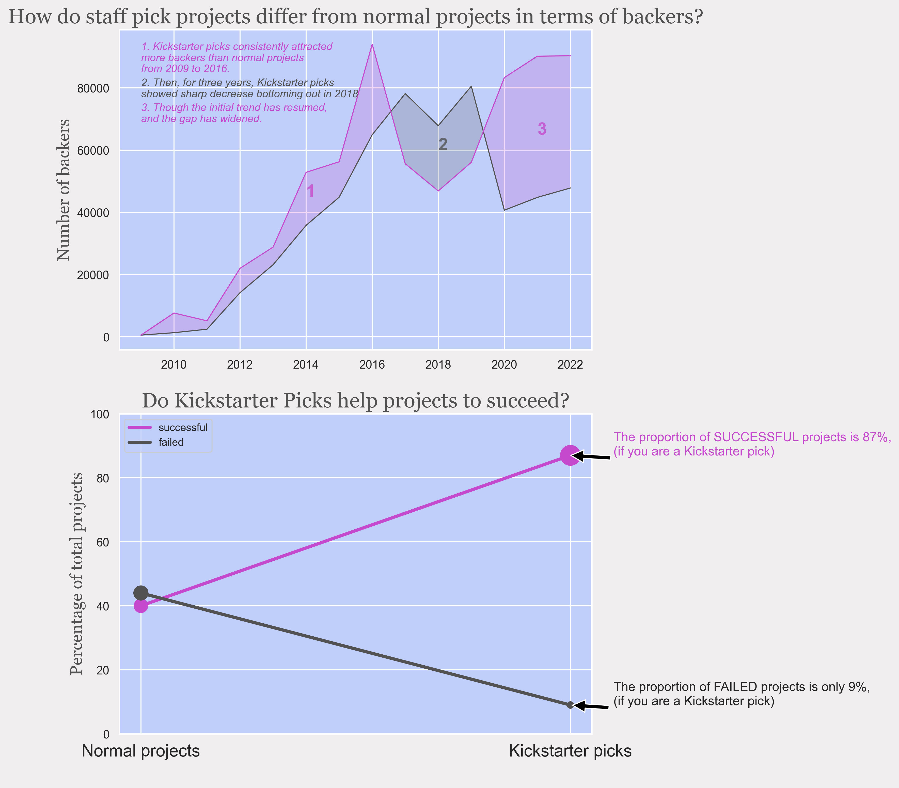

This dataset is taken from the Kickstarter dataset from [Web Robots](https://webrobots.io/kickstarter-datasets/). It contains data about Kickstarter projects, funding and project backers.

The question answered with visual analysis is: 

_How do staff pick projects differ from normal projects in terms of success (backers, amount pledged, timeliness, etc.)?_

