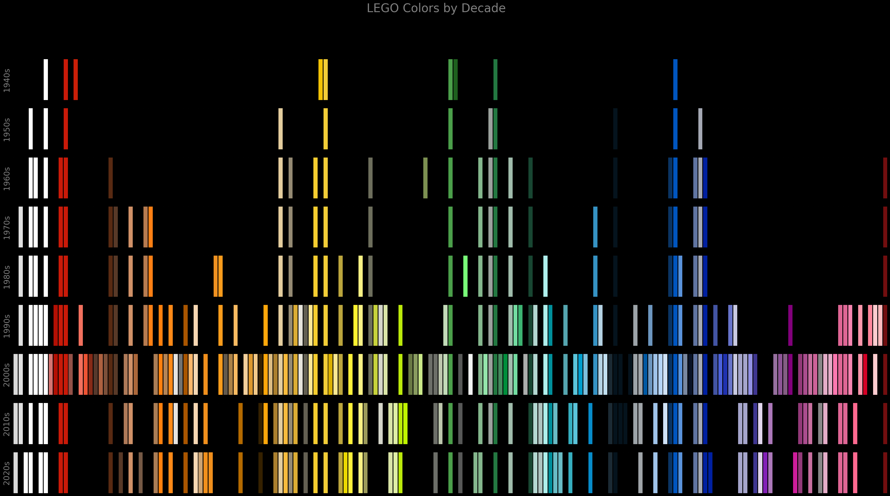

# DATA 605 - Actionable Visualization and Analytics
Introduces deeper tools, skills, and techniques for collecting, manipulating, visualizing, analyzing, and presenting a number of different common types of data. Introduces techniques for visualizing and supporting the interactive analysis and decision making on large complex datasets. Focus on critical thinking and good analysis practices to avoid cognitive biases when designing, thinking, analyzing, and making decisions based on data.

</img> </img> </img>
