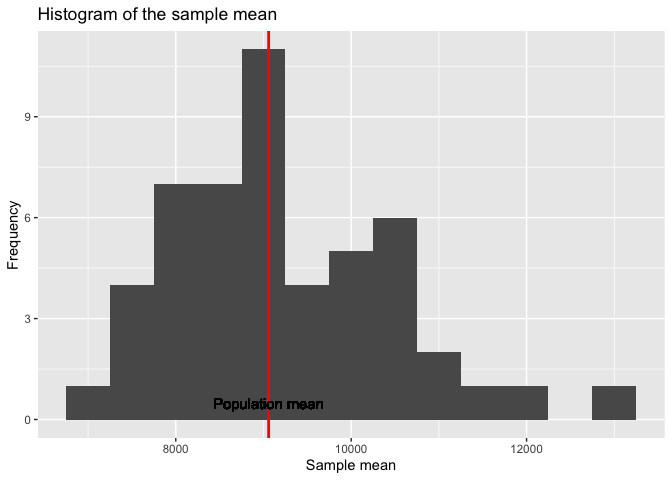

Assignment 1
================
Andrii Voitkiv
January 22th, 2023

-   [Question 1](#question-1)
-   [Question 2](#question-2)
-   [Question 3](#question-3)
-   [Question 4](#question-4)
-   [Question 5](#question-5)

``` r
knitr::opts_chunk$set(fig.path='Figs/')
```

## Question 1
Read the dataset in R. Check the names of the variables and dimension of the dataset. (2pt)

``` r
# Read the dataset
data <- read.csv("ks-projects-201801.csv", header = TRUE, sep = ",")
```

``` r
# Check the dimensions of the dataset and column names
dim(data)
```

    ## [1] 378661     15

``` r
colnames(data)
```

    ##  [1] "ID"               "name"             "category"         "main_category"   
    ##  [5] "currency"         "deadline"         "goal"             "launched"        
    ##  [9] "pledged"          "state"            "backers"          "country"         
    ## [13] "usd.pledged"      "usd_pledged_real" "usd_goal_real"

## Question 2
Suppose you are interested in the variable “usd_pledged_real”. Please use a simple random sample with size 5000 and estimate the population average and its standard deviation. (6pt)

``` r
# Simple random sample of 5000 observations
set.seed(2023)
ix <- sample(1:nrow(data), 5000, replace = FALSE)
srs <- data[ix,]
# Calculate the sample mean and its standard deviation
srs_mean = mean(srs$usd_pledged_real)
srs_sd = sd(srs$usd_pledged_real)
# Print the results
print(paste("The sample mean is", srs_mean))
```

    ## [1] "The sample mean is 8227.900554"

``` r
print(paste("The sample standard deviation is", srs_sd))
```

    ## [1] "The sample standard deviation is 56981.5463384664"

``` r
# Method 1: Estimate the population mean and its standard deviation using survey package
library("survey")
```

``` r
# Simple random sample of 5000 observations
set.seed(2023)
N = nrow(data)
n = 5000
ix <- sample(1:N, n, replace = FALSE)
srs <- data[ix,]
# Add a sampling weight column and finite population correction factor to the sample
srs = data.frame(srs, pw = rep(N/n, n), fpc = rep(N, n))
svy1 = svydesign(id = ~0, strata = NULL, data = srs, weights = ~pw, fpc = ~fpc)
# Estimate the population mean and its standard deviation
srs_mean = svymean(~usd_pledged_real, design = svy1)
# Print the results
srs_mean
```

    ##                    mean    SE
    ## usd_pledged_real 8227.9 800.5

``` r
# Calculate confidence interval for the population mean of usd_pledged_real
confint(srs_mean ,level = 0.95, df=degf(svy1))
```

    ##                     2.5 %   97.5 %
    ## usd_pledged_real 6658.564 9797.237

Conclusion: From the sample taken without replacement the svydesign
function in the survey package estimates the population mean to be 8227
USD and the . We can be 95% confident that the true population mean is
in the range between 6659 USD and 9797 USD.

``` r
# Method 2: Estimate the population mean and its standard deviation using simulation
mean_SD<-function(s, n){  # s denotes how many times you draw the sample, n denotes the sample size
  set.seed(2023)
  sam_mean<-rep(0, s)
  sam_sd <- rep(0, s)
  for (i in 1:s){
    ind = sample(seq(0, N), n, replace=FALSE)
    sam_mean[i] = mean(data$usd_pledged_real[ind])
    sam_sd[i] = sd(data$usd_pledged_real[ind])
  }
  es_mean <- mean(sam_mean)
  es_var <- sam_sd[1]^2/n*(1-n/N)
  es_var2 <- sd(sam_mean)^2
  print(c(es_mean,es_var,es_var2))
  # Plot the histogram of the sample mean using ggplot2
  library(ggplot2)
ggplot(data.frame(sam_mean), aes(x=sam_mean)) +
    geom_histogram(binwidth=500) +
    geom_vline(xintercept=mean(data$usd_pledged_real), color="red", size=1) +
    geom_text(x=mean(data$usd_pledged_real), y=0, label="Population mean", vjust=-1) +
    labs(title="Histogram of the sample mean", x="Sample mean", y="Frequency")
}
# Run the function
mean_SD(50, 5000)
```

    ## [1]    9198.226  689451.448 1527613.599

<!-- --> Conclusion: The method of
simulating simple random sample without replacement estimates the
population mean to be 9198 USD and population variance 689451.448 (with
correction factor) or 1527613 (without correction factor). The histogram
of the sample mean is plotted above. The red line indicates the
population mean.

## Question 3
With the same interested variable as in Q2, please use each “main_category” as the stratum and the proportional allocation principle to get a stratified sample with size around
5000 (round the number of sampled units in each stratum to the nearest integer). Estimate the population average and its standard deviation. (6pt)

``` r
# Calculate proportion of each category and make a data frame
prop = table(data$main_category)/nrow(data)
# Sort the data in data frame order
prop = prop[unique(data$main_category)]
# Create a vector of the proportion of each category
prop = as.vector(prop)
# Calculate the sample size for each strata
strata_size = round(prop * 5000)
# Test if the sum of the sample size equals 5000
print(paste("The sample size is:", sum(strata_size)))
```

    ## [1] "The sample size is: 5001"

``` r
# Print the strata sizes
print(strata_size)
```

    ##  [1] 527 840 686 325 397 116 465 143 301 144 372 142 430  50  63

``` r
library("sampling")
```

``` r
set.seed(2023)
# Sampling strata_size observations from each stratum with simple random sampling
idx = sampling::strata(data, stratanames = "main_category", size = strata_size, method = "srswor")
# Create a new data frame with the sampled observations
strata_srs = getdata(data, idx)
# Add columns for sampling weight and finite population correction factor
strata_srs = data.frame(strata_srs, pw = rep(N/nrow(strata_srs), nrow(strata_srs)), fpc = c(rep(39874,527),rep(63585,840),rep(51918,686), rep(24602, 325), rep(30070, 397), rep(8809, 116), rep(35231, 465), rep(10819, 143), rep(22816, 301), rep(10913, 144), rep(28153, 372), rep(10779, 142), rep(32569, 430), rep(3768, 50), rep(4755, 63)))
# Estimate the population mean and its standard deviation
svy2 = svydesign(id = ~1, strata = ~main_category, data = strata_srs, weights = ~pw, fpc = ~fpc)
me2 = svymean(~usd_pledged_real, svy2)
# Print the results
print(me2)
```

    ##                    mean     SE
    ## usd_pledged_real 9889.4 1541.6

``` r
# Calculate confidence interval for the population mean of usd_pledged_real
confint(me2, level = 0.95, df=degf(svy2))
```

    ##                     2.5 %   97.5 %
    ## usd_pledged_real 6867.116 12911.62

Conclusion: From the stratified sample the svydesign function in the
survey package estimates the population mean to be 9889 USD. We can be
95% confident that the true population mean is in the range between 6867
USD and 12911 USD.

## Question 4
If the clusters are defined by “country”. With the same interested variable as in Q2, please use one-stage cluster sampling to select TWO clusters. Estimate the population average and its standard deviation. (6pt)

``` r
# Calculate the number of unique clusters in the data
n_clusters = length(unique(data$country))
# Print unique values of the country column
print(unique(data$country))
```

    ##  [1] "GB"    "US"    "CA"    "AU"    "NO"    "IT"    "DE"    "IE"    "MX"   
    ## [10] "ES"    "N,0\"" "SE"    "FR"    "NL"    "NZ"    "CH"    "AT"    "DK"   
    ## [19] "BE"    "HK"    "LU"    "SG"    "JP"

``` r
# Print the length of the unique values
print(paste("Number of clusters (countries) in the dataset:", n_clusters))
```

    ## [1] "Number of clusters (countries) in the dataset: 23"

``` r
library("sampling")
library("survey")
# Select two clusters with simple random sampling method using the sampling package
set.seed(2023)
n_choose = 2
idx = sampling::cluster(data, clustername = "country", size = n_choose, method = "srswor")
# Create a new data frame with the sampled observations
cluster_srs = getdata(data, idx)
# Print the clusters (countries) in the sample
print(paste(
    "The clusters (countries) in the sample are:",
    paste(unique(cluster_srs$country), collapse = ", ")
    ))
```

    ## [1] "The clusters (countries) in the sample are: MX, SE"

``` r
# Calculate the sampling weight and finite population correction factor
cluster_srs = data.frame(cluster_srs, pw = rep(n_clusters/n_choose, nrow(cluster_srs)), fpc = rep(n_clusters, nrow(cluster_srs)))
# Estimate the population mean and its standard deviation
svy3 = svydesign(id = ~country, data = cluster_srs, weights = ~pw, fpc = ~fpc)
me3 = svymean(~usd_pledged_real, svy3)
# Print the results
print(me3)
```

    ##                    mean     SE
    ## usd_pledged_real 4515.8 2985.4

``` r
# Calculate confidence interval for the population mean of usd_pledged_real
confint(me3, level = 0.95, df=degf(svy3))
```

    ##                      2.5 %   97.5 %
    ## usd_pledged_real -33417.07 42448.61

Conclusion: From the cluster sample the svydesign function in the survey
package estimates the population mean to be 4516 USD and the standard
deviation 2985.4. We can be 95% confident that the true population mean
is in the range between 0 USD and 42,448 USD.

## Question 5
Suppose you are interested in the ratio between the actual amount of funding pledged and the goal amount of funding. (1) Please use the simple random sample you get from Q2 to estimate this ratio and its standard deviation. (2) Suppose you have three projects to launch and your goal amounts for these projects are 500k,1000k
and 2000k
usd dollars. Please estimate how much you can get on average from the potential backers and give the standard deviation of your estimate. (6pt)

### 1. Use the simple random sample you get from Q2 to estimate the ratio between the actual amount of funding pledged and the goal amount of funding and its standard deviation

``` r
# Calculate the ratio between the actual amount of funding pledged and the goal amount of funding
ratio = svyratio(~usd_pledged_real, ~usd_goal_real, svy1)
# Print the results
print(ratio)
```

    ## Ratio estimator: svyratio.survey.design2(~usd_pledged_real, ~usd_goal_real, svy1)
    ## Ratios=
    ##                  usd_goal_real
    ## usd_pledged_real     0.1717997
    ## SEs=
    ##                  usd_goal_real
    ## usd_pledged_real    0.07391139

### 2. Estimate how much you can get on average based on your goal amounts and give the standard deviation of your estimate

``` r
# Make a vector of goal amounts
goal_amount = c(500000, 1000000, 2000000)
# Predict the average amount of funding pledged based on the goal amount of funding
pred1 = predict(ratio, total = sum(goal_amount))
# Print the results
print(paste("The average amount of funding pledged based on the goal amount of funding of 500000 USD is:", pred1$total / length(goal_amount),
            "with standard deviation", pred1$se / length(goal_amount)))
```

    ## [1] "The average amount of funding pledged based on the goal amount of funding of 500000 USD is: 200432.980162938 with standard deviation 86229.9542232645"
