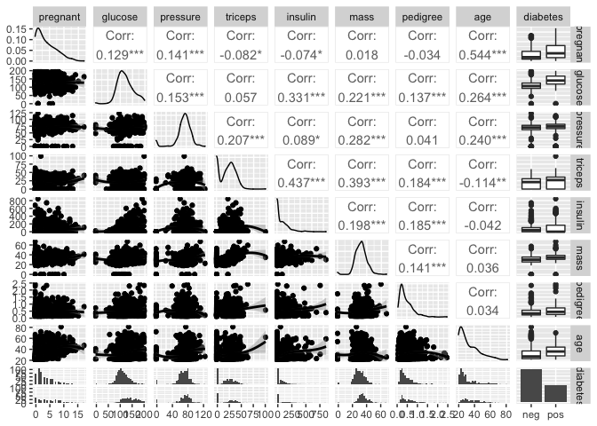
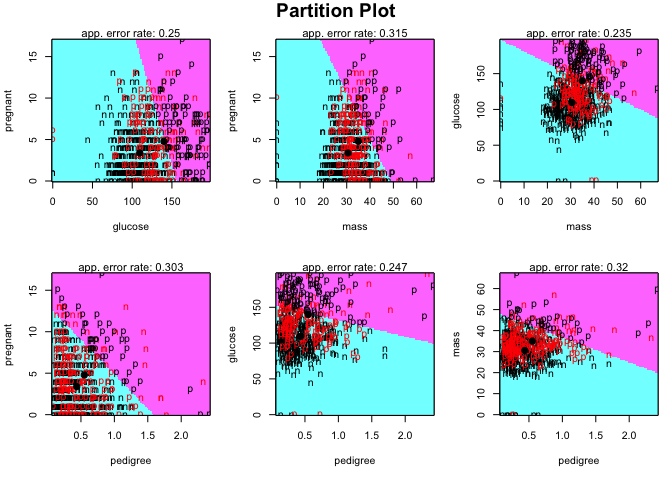
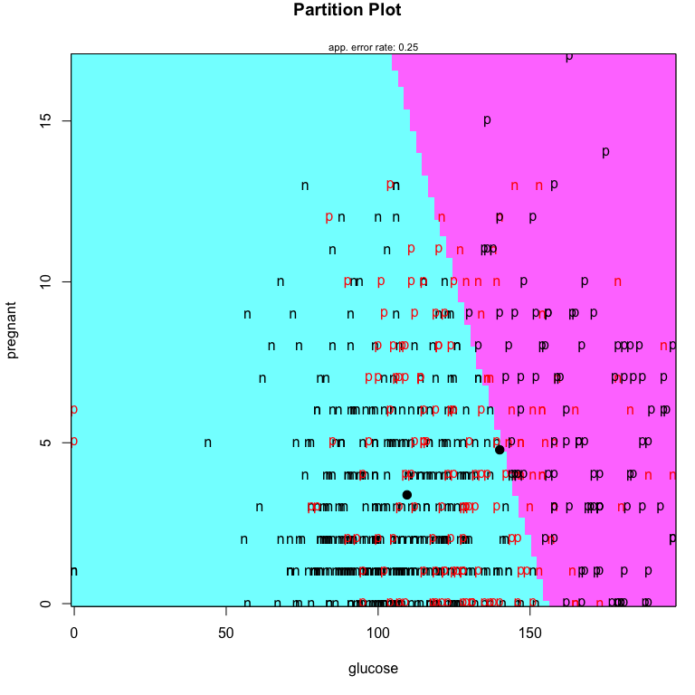
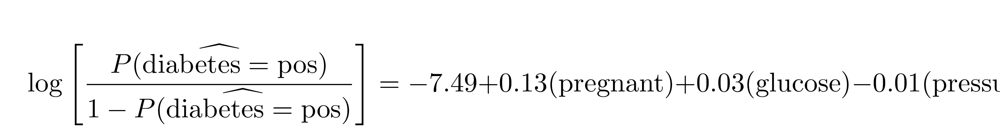

Assignment 2
================
Andrii Voitkiv
Mon, Jan 30, 2023

-   [Question 1](#question-1)
-   [Question 2](#question-2)
-   [Question 3](#question-3)
-   [Question 4](#question-4)
-   [Question 5](#question-5)
-   [Question 6](#question-6)
-   [Question 7](#question-7)

``` r
knitr::opts_chunk$set(fig.path='Figs/')
```

<!-- title: "Assignment 2"
author: "Andrii Voitkiv"
output:
html_document:
toc: true
toc_float: true
number_sections: false
theme: united
highlight: tango
df_print: paged
self_contained: true
keep_md: true
toc_depth: 2 -->

## Question 1

*Read the data “PimaIndiansDiabetes”, check the dimension of the
dataset, the names of variables. Check how many classes there are (the
variable “Diabetes”) and the class sizes. Check how R dummifies the
“diabetes” variable.*

``` r
# Read the data
library('mlbench')
data(PimaIndiansDiabetes)
# Check the dimension of the dataset
dim(PimaIndiansDiabetes)
```

    ## [1] 768   9

``` r
# Check the names of variables
names(PimaIndiansDiabetes)
```

    ## [1] "pregnant" "glucose"  "pressure" "triceps"  "insulin"  "mass"     "pedigree"
    ## [8] "age"      "diabetes"

``` r
# Check how many classes there are (the variable “Diabetes”) and the class sizes
table(PimaIndiansDiabetes$diabetes)
```

    ## 
    ## neg pos 
    ## 500 268

The dataset has 768 observations and 9 variables.The names of variables
are: pregnant, glucose, pressure, triceps, insulin, mass, pedigree, age
and diabetes. There are two classes in the variable diabetes: “neg” and
“pos”. The class sizes are 500 and 268, respectively.

## Question 2

*Split the dataset into two parts – training and test.The training part
contains 400 individuals from the “neg” class and 200 units from the
“pos” class. The test part contains the rest data.*

``` r
# Create vector of indices for "neg" and "pos" classes
neg_ix <- which(PimaIndiansDiabetes$diabetes == "neg")
pos_ix <- which(PimaIndiansDiabetes$diabetes == "pos")
# Randomly select 400 indices from "neg" class and 200 indices from "pos" class
set.seed(10)
train_neg_ix <- sample(neg_ix, 400)
train_pos_ix <- sample(pos_ix, 200)
# Combine the two vectors
train_ix <- c(train_neg_ix, train_pos_ix)
# Select the rest indices as the test indices
test_ix <- setdiff(1:dim(PimaIndiansDiabetes)[1], train_ix)
# Create the training and test datasets
train <- PimaIndiansDiabetes[train_ix,]
test <- PimaIndiansDiabetes[test_ix,]
```

*Let “diabetes” be the response variable, get a logistic regression
model based on the training part using all the explanatory variables,
which variables contribute to the “pos” result in a negative way?*

``` r
# Get a logistic regression model based on the training part using all the explanatory variables
model <- glm(diabetes ~ ., data = train, family = binomial)
# Check the coefficients
summary(model)
```

    ## 
    ## Call:
    ## glm(formula = diabetes ~ ., family = binomial, data = train)
    ## 
    ## Deviance Residuals: 
    ##     Min       1Q   Median       3Q      Max  
    ## -2.4817  -0.7422  -0.4381   0.7974   2.9643  
    ## 
    ## Coefficients:
    ##               Estimate Std. Error z value Pr(>|z|)    
    ## (Intercept) -7.9254236  0.7784421 -10.181  < 2e-16 ***
    ## pregnant     0.1024418  0.0357974   2.862  0.00421 ** 
    ## glucose      0.0347265  0.0042242   8.221  < 2e-16 ***
    ## pressure    -0.0128697  0.0059188  -2.174  0.02968 *  
    ## triceps      0.0003259  0.0076929   0.042  0.96621    
    ## insulin     -0.0010755  0.0009756  -1.102  0.27029    
    ## mass         0.0785796  0.0168270   4.670 3.01e-06 ***
    ## pedigree     0.8907340  0.3289737   2.708  0.00678 ** 
    ## age          0.0140869  0.0105227   1.339  0.18066    
    ## ---
    ## Signif. codes:  0 '***' 0.001 '**' 0.01 '*' 0.05 '.' 0.1 ' ' 1
    ## 
    ## (Dispersion parameter for binomial family taken to be 1)
    ## 
    ##     Null deviance: 763.82  on 599  degrees of freedom
    ## Residual deviance: 577.31  on 591  degrees of freedom
    ## AIC: 595.31
    ## 
    ## Number of Fisher Scoring iterations: 5

``` r
# Check encoding of the variable “diabetes”
contrasts(PimaIndiansDiabetes$diabetes)
```

    ##     pos
    ## neg   0
    ## pos   1

Conclusion: Default encoding of the variable “diabetes” is 1 for “pos”.
There is one statistically *significant* variable that contribute to the
“pos” result in a negative way. And that is “pressure”. From the
non-significant variables, the variable insulin contribute to the “pos”
result in a negative way.

*Check the “variance inflation factor” for each coefficient (e.g., using
“vif” function from the package “car”). Do you detect
multicollinearity?*

``` r
# Plot the correlation matrix with the help of the ggally package
library('GGally')
library('ggplot2')
ggpairs(PimaIndiansDiabetes, lower = list(continuous = "smooth_loess", combo = "facethist", discrete = "facetbar", na = "na"))
```

<!-- -->

``` r
# Check the “variance inflation factor” for each coefficient using imcdiag function from the package "regclass"
library('regclass')
VIF(model)
```

    ## pregnant  glucose pressure  triceps  insulin     mass pedigree      age 
    ## 1.399538 1.247582 1.228911 1.534830 1.474179 1.263079 1.039996 1.500137

The correlation matrix shows that there is no multicollinearity between
the variables. The variance inflation factor is less than 5 for all the
variables, so there is no multicollinearity.

## Question 3

*Apply your fitted logistic regression model to the test set. Suppose a
prediction of “pos” is made if P(Y=pos\|X1,…,Xp)≥0.5 , check the
misclassification rate (the ratio between the number of incorrect
predictions and test size).*

``` r
# Apply the fitted logistic regression model to the test set
pred <- predict(model, test, type = "response")
# Check the misclassification rate
misclass_rate <- sum(ifelse(pred >= 0.5, 'pos', 'neg') != test$diabetes)/dim(test)[1]
# Print the misclassification rate
misclass_rate
```

    ## [1] 0.1964286

## Question 4

*Let the significance level be 0.1, remove the explanatory variables
whose coefficients are NOT significantly different from 0. Re-fit a
logistic regression model and repeat Step 3 to calculate the
misclassification rate. (3pt)*

``` r
# Check the sificance level of the coefficients with the significance level 0.1
summary(model)
```

    ## 
    ## Call:
    ## glm(formula = diabetes ~ ., family = binomial, data = train)
    ## 
    ## Deviance Residuals: 
    ##     Min       1Q   Median       3Q      Max  
    ## -2.4817  -0.7422  -0.4381   0.7974   2.9643  
    ## 
    ## Coefficients:
    ##               Estimate Std. Error z value Pr(>|z|)    
    ## (Intercept) -7.9254236  0.7784421 -10.181  < 2e-16 ***
    ## pregnant     0.1024418  0.0357974   2.862  0.00421 ** 
    ## glucose      0.0347265  0.0042242   8.221  < 2e-16 ***
    ## pressure    -0.0128697  0.0059188  -2.174  0.02968 *  
    ## triceps      0.0003259  0.0076929   0.042  0.96621    
    ## insulin     -0.0010755  0.0009756  -1.102  0.27029    
    ## mass         0.0785796  0.0168270   4.670 3.01e-06 ***
    ## pedigree     0.8907340  0.3289737   2.708  0.00678 ** 
    ## age          0.0140869  0.0105227   1.339  0.18066    
    ## ---
    ## Signif. codes:  0 '***' 0.001 '**' 0.01 '*' 0.05 '.' 0.1 ' ' 1
    ## 
    ## (Dispersion parameter for binomial family taken to be 1)
    ## 
    ##     Null deviance: 763.82  on 599  degrees of freedom
    ## Residual deviance: 577.31  on 591  degrees of freedom
    ## AIC: 595.31
    ## 
    ## Number of Fisher Scoring iterations: 5

With the significance level 0.1, the coefficients of the variables
`pregnant, glucose, pressure, mass and pedigree` are significantly
different from 0. So, we will keep them in the model and will drop the
rest.

``` r
# Re-fit a logistic regression model
model2 <- glm(diabetes ~ pregnant + glucose + pressure + mass + pedigree, data = train, family = binomial)
# Check the coefficients
summary(model2)
```

    ## 
    ## Call:
    ## glm(formula = diabetes ~ pregnant + glucose + pressure + mass + 
    ##     pedigree, family = binomial, data = train)
    ## 
    ## Deviance Residuals: 
    ##     Min       1Q   Median       3Q      Max  
    ## -2.7118  -0.7512  -0.4453   0.7763   2.9898  
    ## 
    ## Coefficients:
    ##              Estimate Std. Error z value Pr(>|z|)    
    ## (Intercept) -7.485866   0.729634 -10.260  < 2e-16 ***
    ## pregnant     0.131482   0.031108   4.227 2.37e-05 ***
    ## glucose      0.034245   0.003841   8.917  < 2e-16 ***
    ## pressure    -0.011636   0.005700  -2.041  0.04120 *  
    ## mass         0.073312   0.015792   4.642 3.45e-06 ***
    ## pedigree     0.854044   0.324404   2.633  0.00847 ** 
    ## ---
    ## Signif. codes:  0 '***' 0.001 '**' 0.01 '*' 0.05 '.' 0.1 ' ' 1
    ## 
    ## (Dispersion parameter for binomial family taken to be 1)
    ## 
    ##     Null deviance: 763.82  on 599  degrees of freedom
    ## Residual deviance: 580.94  on 594  degrees of freedom
    ## AIC: 592.94
    ## 
    ## Number of Fisher Scoring iterations: 5

The valid model’s equation is:

    ## NULL

``` r
# Apply the fitted logistic regression model to the test set
pred2 <- predict(model2, test, type = "response")
# Check the misclassification rate
misclass_rate2 <- sum(ifelse(pred2 >= 0.5, 'pos', 'neg') != test$diabetes)/dim(test)[1]
# Print the misclassification rates
misclass_rate2
```

    ## [1] 0.1904762

If we compare the misclassification rates of the two models, we can see
that the misclassification rate of the second model is slightly lower
than the misclassification rate of the first model. So, the second model
is better than the first one.

## Question 5

*Under the same training and test sets, apply a linear discriminant
analysis (LDA) model to the training set using all the explanatory
variables. Apply this fitted LDA model to the test set, calculate the
misclassification rate based on the LDA-predicted results and the actual
results. (3pt)*

``` r
# Apply a linear discriminant analysis (LDA) model to the training set using all the explanatory variables
library('MASS')
model3 <- lda(diabetes ~ ., data = train)
model3
```

    ## Call:
    ## lda(diabetes ~ ., data = train)
    ## 
    ## Prior probabilities of groups:
    ##       neg       pos 
    ## 0.6666667 0.3333333 
    ## 
    ## Group means:
    ##     pregnant glucose pressure triceps  insulin    mass pedigree    age
    ## neg     3.38 109.525  67.8975  20.455  70.3675 30.5565 0.436995 31.145
    ## pos     4.78 140.015  71.4400  22.410 104.7050 34.9780 0.549300 36.595
    ## 
    ## Coefficients of linear discriminants:
    ##                    LD1
    ## pregnant  0.0806346685
    ## glucose   0.0280827187
    ## pressure -0.0104444396
    ## triceps  -0.0005764231
    ## insulin  -0.0007469886
    ## mass      0.0563375762
    ## pedigree  0.6624106828
    ## age       0.0122455593

``` r
# Apply the fitted LDA model to the test set
pred3 <- predict(model3, test)
# Check the misclassification rate
misclass_rate3 <- sum(pred3$class != test$diabetes)/dim(test)[1]
# Print the misclassification rate
misclass_rate3
```

    ## [1] 0.202381

## Question 6

*Suppose now you only want to use two explanatory variables among
“pregnant”, “glucose”, “mass” and “pedigree” to establish the LDA model.
Which two variables can give you the lowest error rate based on the
training set? After you get the LDA model, apply it to the test set,
what is the misclassification rate? (3pt)*

``` r
# METHOD 1
# Check the misclassification rate for each pair of variables
variables <- c('pregnant', 'glucose', 'mass', 'pedigree')
misclass_result <- list(var1=c(), var2=c(), misclass_rate=c())

for (i in variables) {
  for (j in variables) {
    # Check if the pair is not the same
    # And if the pair is not already in the list
    if (i != j & !((i %in% misclass_result$var2) & (j %in% misclass_result$var1))) {
      pair <- c(i, j)
      model4 <- lda(reformulate(pair,"diabetes"), data = train)
      pred4 <- predict(model4, test)
      # Populate the list
      misclass_result$var1 <- c(misclass_result$var1, i)
      misclass_result$var2 <- c(misclass_result$var2, j)
      misclass_result$misclass_rate <- c(misclass_result$misclass_rate, sum(pred4$class != test$diabetes)/dim(test)[1])
    }
  }
}
# Transform the list to a data frame
misclass_result <- as.data.frame(misclass_result)
# Sort the data frame by the misclassification rate
misclass_result <- misclass_result[order(misclass_result$misclass_rate),]
# Print the data frame
library("knitr")
kable(misclass_result)
```

|     | var1     | var2     | misclass\_rate |
|:----|:---------|:---------|---------------:|
| 1   | pregnant | glucose  |      0.2559524 |
| 4   | glucose  | mass     |      0.2678571 |
| 5   | glucose  | pedigree |      0.2797619 |
| 2   | pregnant | mass     |      0.3095238 |
| 6   | mass     | pedigree |      0.3392857 |
| 3   | pregnant | pedigree |      0.3511905 |

The lowest error rate is 0.2559524. And it is achieved by the pair of
variables pregnant and glucose.

``` r
# METHOD 2
library('klaR')
partimat(diabetes ~ pregnant + glucose + mass + pedigree, data = train, method="lda")
```

<!-- -->

Method 1 (when I plug different pairs of variables into the LDA model)
gives different output than Method 2 (when I use the `partimat`
function). I don’t know why. Method 2 is a black box for me. And from my
best understanding of the problem, I will use Method 1 to answer the
question (because I understand what I’m doing there).

``` r
# Build the LDA model with the pair of variables that gives the lowest error rate
model5 <- lda(diabetes ~ pregnant + glucose, data = train)
# Apply the fitted LDA model to the test set
pred5 <- predict(model5, test)
# Check the misclassification rate
misclass_rate5 <- sum(pred5$class != test$diabetes)/dim(test)[1]
# Print the misclassification rate
misclass_rate5
```

    ## [1] 0.2559524

``` r
# Visualize the LDA model
partimat(diabetes ~ pregnant + glucose, data = train, method="lda")
```

<!-- -->

## Question 7

*Under the same training and test sets, if you switch to the quadratic
discriminant analysis by using all the explanatory variables, does the
misclassification rate get decreased or increased?*

``` r
# Apply a quadratic discriminant analysis (QDA) model to the training set using all the explanatory variables
model6 <- qda(diabetes ~ ., data = train)
model6
```

    ## Call:
    ## qda(diabetes ~ ., data = train)
    ## 
    ## Prior probabilities of groups:
    ##       neg       pos 
    ## 0.6666667 0.3333333 
    ## 
    ## Group means:
    ##     pregnant glucose pressure triceps  insulin    mass pedigree    age
    ## neg     3.38 109.525  67.8975  20.455  70.3675 30.5565 0.436995 31.145
    ## pos     4.78 140.015  71.4400  22.410 104.7050 34.9780 0.549300 36.595

``` r
# Apply the fitted QDA model to the test set
pred6 <- predict(model6, test)
# Check the misclassification rate
misclass_rate6 <- sum(pred6$class != test$diabetes)/dim(test)[1]
# Print the misclassification rate
misclass_rate6
```

    ## [1] 0.2261905

The misclassification rate of the QDA model is slightly higher than the
misclassification rate of the LDA model. So, the LDA model is better
than the QDA model.

Global conclusion: the best model is `model2`, which is a logistic
regression model with significant only predictors. The miscalsification
rate of this model is 0.1904762. And the equation of this model is:

