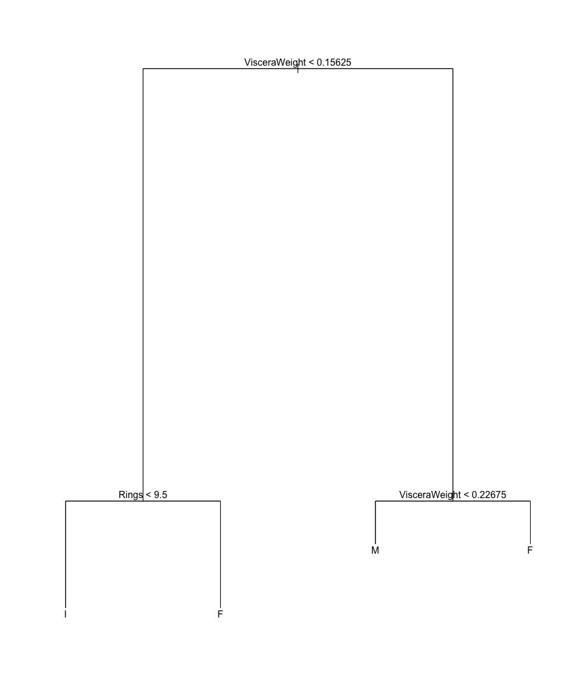

Assignment 3
================
Andrii Voitkiv

Mon, Feb 06, 2023

-   [Regrssion problem](#regrssion-problem)
    -   [Question 1](#question-1)
    -   [Question 2](#question-2)
        -   [2.1 Split the dataset into two
            parts](#21-split-the-dataset-into-two-parts)
        -   [2.2 Fit a regression tree to the
            data](#22-fit-a-regression-tree-to-the-data)
        -   [2.3 Plot the tree](#23-plot-the-tree)
        -   [2.4 Apply the tree to the test
            set](#24-apply-the-tree-to-the-test-set)
    -   [Question 3](#question-3)
        -   [3.1 Select the “best” number of terminal
            nodes](#31-select-the-best-number-of-terminal-nodes)
        -   [3.2 Prune the tree](#32-prune-the-tree)
        -   [3.3 Apply the pruned tree to the test
            set](#33-apply-the-pruned-tree-to-the-test-set)
    -   [Question 4](#question-4)
        -   [4.1 Calculate the cross-validation error for linear
            regression](#41-calculate-the-cross-validation-error-for-linear-regression)
        -   [4.2 Calculate the cross-validation error for regression
            tree](#42-calculate-the-cross-validation-error-for-regression-tree)
        -   [4.3 Compare the cross-validation error for linear
            regression and regression
            tree](#43-compare-the-cross-validation-error-for-linear-regression-and-regression-tree)
-   [Classification problem](#classification-problem)
    -   [Question 5](#question-5)
        -   [5.1 Fit a classification tree to the
            data](#51-fit-a-classification-tree-to-the-data)
        -   [5.2 Plot the tree](#52-plot-the-tree)
        -   [5.3 Apply the tree to the test
            set](#53-apply-the-tree-to-the-test-set)
    -   [Question 6](#question-6)
        -   [6.1 Prune the tree by checking the cross-validation
            errors](#61-prune-the-tree-by-checking-the-cross-validation-errors)
        -   [6.2 Re-calculate the misclassification
            rate](#62-re-calculate-the-misclassification-rate)
    -   [Question 7](#question-7)
        -   [7.1 Create 10 folds](#71-create-10-folds)
        -   [7.2 Calculate the cross-validation error for
            LDA](#72-calculate-the-cross-validation-error-for-lda)
        -   [7.3 Calculate the cross-validation error for classification
            tree](#73-calculate-the-cross-validation-error-for-classification-tree)
        -   [7.4 Compare the cross-validation error for LDA and
            classification
            tree](#74-compare-the-cross-validation-error-for-lda-and-classification-tree)

***Name of the dataset**: “abalone”.* ***Package**:
“AppliedPredictiveModeling”*

# Regrssion problem

***Goal**: Predict the age of abalone from physical measurements. The
age of abalone is determined by cutting the shell through the cone,
staining it, and counting the number of rings through a microscope – a
boring and time-consuming task. Other measurements, which are easier to
obtain, are used to predict the age. Further information, such as
weather patterns and location (hence food availability) may be required
to solve the problem.*

## Question 1

*Read the data from the package, check the names of the variables and
the dimension of the dataset. (1pt)*

``` r
# Load the package
library(AppliedPredictiveModeling)
# Read the data
data(abalone)
# Check the names of the variables
names(abalone)
```

    ## [1] "Type"          "LongestShell"  "Diameter"      "Height"       
    ## [5] "WholeWeight"   "ShuckedWeight" "VisceraWeight" "ShellWeight"  
    ## [9] "Rings"

``` r
# Check the dimension of the dataset
dim(abalone)
```

    ## [1] 4177    9

## Question 2

### 2.1 Split the dataset into two parts

*Split the dataset into two parts, where the training part contains 75%
of the data and the test part contains the rest 25%*

``` r
# Split the dataset into two parts using sample function
set.seed(10)
train_index <- sample(1:nrow(abalone), size = 0.75*nrow(abalone))
train <- abalone[train_index, ]
test <- abalone[-train_index, ]
```

### 2.2 Fit a regression tree to the data

*Fit a regression tree to the data with ‘Rings’ as the response variable
and all the other variables as predictors*

``` r
# Fit a regression tree to the data
library(tree)
tree_model <- tree(Rings ~ ., data = train)
summary(tree_model)
```

    ## 
    ## Regression tree:
    ## tree(formula = Rings ~ ., data = train)
    ## Variables actually used in tree construction:
    ## [1] "ShellWeight"   "Diameter"      "ShuckedWeight"
    ## Number of terminal nodes:  11 
    ## Residual mean deviance:  5.401 = 16860 / 3121 
    ## Distribution of residuals:
    ##    Min. 1st Qu.  Median    Mean 3rd Qu.    Max. 
    ## -8.0940 -1.2540 -0.2536  0.0000  0.9254 16.8400

### 2.3 Plot the tree

*Plot the tree and show which variables are used to construct the tree.*

``` r
# Plot the tree
plot(tree_model)
text(tree_model, pretty = 0)
```


The variables used to construct the tree are ShellWeight, Diameter,
ShuckedWeight.

There are 11 terminal nodes in the tree.

### 2.4 Apply the tree to the test set

*Apply the tree to the test set, calculate the root square of the mean
squared error (RMSE).*

``` r
# Apply the tree to the test set
tree_pred <- predict(tree_model, test)
# Calculate the RMSE
RMSE <- sqrt(mean((tree_pred - test$Rings)^2))
RMSE
```

    ## [1] 2.31622

Compare (plot) the predicted responses and the observed responses in the
test set

``` r
# Plot the predicted responses and the observed responses
plot(tree_pred, test$Rings)
abline(0, 1)
```


## Question 3

### 3.1 Select the “best” number of terminal nodes

*Check the plot between the cross-valiation error and the size of the
tree, select the “best” number of terminal nodes (based on your own
judgement). Prune the tree, plot the pruned tree and re-calculate the
RMSE. (4pt)*

``` r
# Check the plot between the cross-valiation error and the size of the tree
cv.tree_model <- cv.tree(tree_model)
plot(cv.tree_model$size, cv.tree_model$dev, type = "b")
```


The best number of terminal nodes is 10, as it has the lowest
cross-validation error.

### 3.2 Prune the tree

*Prune the tree, plot the pruned tree and re-calculate the RMSE.*

``` r
# Prune the tree
pruned_tree_model <- prune.tree(tree_model, best = 10)
# Plot the pruned tree
plot(pruned_tree_model)
text(pruned_tree_model, pretty = 0)
```


### 3.3 Apply the pruned tree to the test set

*Apply the tree to the test set, calculate the root square of the mean
squared error (RMSE).*

``` r
# Apply the tree to the test set
pruned_tree_pred <- predict(pruned_tree_model, test)
# Calculate the RMSE
RMSE_pruned <- sqrt(mean((pruned_tree_pred - test$Rings)^2))
```

RMSE of the pruned tree is 2.3419748 and the RMSE of the unpruned tree
is 2.3162195. The RMSE of the pruned tree is greater than the RMSE of
the unpruned tree, so the pruned tree is worse.

## Question 4

### 4.1 Calculate the cross-validation error for linear regression

*Suppose you are interested in comparing the performance of linear
regression and regression tree. Please use the following partitioned 10
folds to calculate the cross-validation error for these two methods (the
cross-validation error is defined as the average of the RMSE).*

``` r
# Create 10 folds
library(caret)
folds<-createFolds(abalone$Rings, k=10)
```

``` r
# Calculate the cross-validation error for linear regression
library(MASS)
cv_error_lr <- c()
for (i in 1:10){
    train_lr <- abalone[-folds[[i]], ]
    test_lr <- abalone[folds[[i]], ]
    lr_model <- lm(Rings ~ ., data = train_lr)
    lr_pred <- predict(lr_model, test_lr)
    RMSE <- sqrt(mean((lr_pred - test_lr$Rings)^2))
    cv_error_lr <- c(cv_error_lr, RMSE)
}
cv_error_lr <- mean(cv_error_lr)
```

### 4.2 Calculate the cross-validation error for regression tree

``` r
set.seed(10)
# Calculate the cross-validation error for regression tree
cv_error_tree <- c()
for (i in 1:10){
    train_cv <- abalone[-folds[[i]], ]
    test_cv <- abalone[folds[[i]], ]
    tree_model <- tree(Rings ~ ., data = train_cv)
    tree_pred <- predict(tree_model, test_cv)
    RMSE <- sqrt(mean((tree_pred - test_cv$Rings)^2))
    cv_error_tree <- c(cv_error_tree, RMSE)
}
cv_error_tree <- mean(cv_error_tree)
```

### 4.3 Compare the cross-validation error for linear regression and regression tree

Mean cross-validation error for linear regression is 2.2224895 and mean
cross-validation error for regression tree is 2.4349183. The
cross-validation error for linear regression is *smaller* than the
cross-validation error for regression tree, so the linear regression is
*better*.

# Classification problem

*Suppose now the variable of interest is Type. Please use what you
learned from the classification tree to solve the questions.*

## Question 5

### 5.1 Fit a classification tree to the data

*Under the same training and test parts as Q2 of regression problem, fit
a classification tree to the training set using all the other variables
as predictors.*

``` r
set.seed(10)
# Fit a classification tree to the data
library(tree)
tree_model <- tree(as.factor(Type) ~ ., data = train)
summary(tree_model)
```

    ## 
    ## Classification tree:
    ## tree(formula = as.factor(Type) ~ ., data = train)
    ## Variables actually used in tree construction:
    ## [1] "VisceraWeight" "Rings"        
    ## Number of terminal nodes:  5 
    ## Residual mean deviance:  1.722 = 5385 / 3127 
    ## Misclassification error rate: 0.4483 = 1404 / 3132

### 5.2 Plot the tree

*Plot the fitted tree, which variables are used to construct the tree?*

``` r
# Plot the tree
plot(tree_model)
text(tree_model, pretty = 0)
```


The variables used to construct the tree are VisceraWeight, Rings.

There are 5 terminal nodes in the tree.

The misclassification rate of the tree is 0.4482759.

### 5.3 Apply the tree to the test set

*Set the seed to 10, apply the fitted tree to the test set and calculate
the misclassification rate.*

``` r
set.seed(10)
# Apply the tree to the test set
tree_pred <- predict(tree_model, test, type = "class")
# Calculate the misclassification rate
misclassification_rate <- mean(tree_pred != test$Type)
```

The misclassification rate is 0.477512.

## Question 6

### 6.1 Prune the tree by checking the cross-validation errors

*Prune the tree by checking the cross-validation errors. Plot the pruned
tree and re-calculate the misclassification rate. (4pt)*

``` r
# Prune the tree by checking the cross-validation errors
cv.tree_model <- cv.tree(tree_model, FUN = prune.misclass)
plot(cv.tree_model$size, cv.tree_model$dev, type = "b")
```


The best number of terminal nodes is 5, as it has the lowest
cross-validation error.

``` r
# build the pruned tree
pruned_tree_model <- prune.tree(tree_model, best = 4)
# Plot the pruned tree
plot(pruned_tree_model)
text(pruned_tree_model, pretty = 0)
```



### 6.2 Re-calculate the misclassification rate

``` r
# Re-calculate the misclassification rate
pruned_tree_pred <- predict(pruned_tree_model, test, type = "class")
misclassification_rate_pruned <- mean(pruned_tree_pred != test$Type)
```

The misclassification rate of the pruned tree is 0.477512.

## Question 7

*Suppose you are interested in comparing the performance between the
linear discriminant analysis and the classification tree, please use the
stratified 10 -fold cross-validation to calculate the cross-validation
errors of these two methods (the cross-validation error here is defined
as the average of the misclassification rate). Which method seems to
work better? (6pt)*

### 7.1 Create 10 folds

``` r
# Create 10 folds using 'datasets' package
library(datasets)
folds <- createFolds(abalone$Type, k = 10)
# Check the number of observations in each fold
fold1 <- abalone[folds[[1]], ]
table(fold1$Type)
```

    ## 
    ##   F   I   M 
    ## 130 135 153

### 7.2 Calculate the cross-validation error for LDA

``` r
# Calculate the cross-validation error for LDA
library(MASS)
set.seed(10)
cv_error_lda <- c()
for (i in 1:10){
    train_lda <- abalone[-folds[[i]], ]
    test_lda <- abalone[folds[[i]], ]
    lda_model <- lda(Type ~ ., data = train_lda)
    lda_pred <- predict(lda_model, test_lda)
    misclassification_rate <- mean(lda_pred$class != test_lda$Type)
    cv_error_lda <- c(cv_error_lda, misclassification_rate)
}
cv_error_lda <- mean(cv_error_lda)
```

### 7.3 Calculate the cross-validation error for classification tree

``` r
set.seed(10)
# Calculate the cross-validation error for classification tree
cv_error_tree <- c()
for (i in 1:10){
    train_tree <- abalone[-folds[[i]], ]
    test_tree <- abalone[folds[[i]], ]
    tree_model <- tree(Type ~ ., data = train_tree)
    tree_pred <- predict(tree_model, test_tree, type = "class")
    misclassification_rate <- mean(tree_pred != test_tree$Type)
    cv_error_tree <- c(cv_error_tree, misclassification_rate)
}
cv_error_tree <- mean(cv_error_tree)
```

### 7.4 Compare the cross-validation error for LDA and classification tree

Mean cross-validation error for LDA is 0.4591838 and mean
cross-validation error for classification tree is 0.4697147. The
cross-validation error for LDA is *smaller* than the cross-validation
error for classification tree, so the LDA is *better*.
