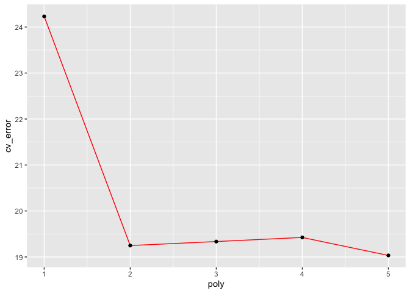
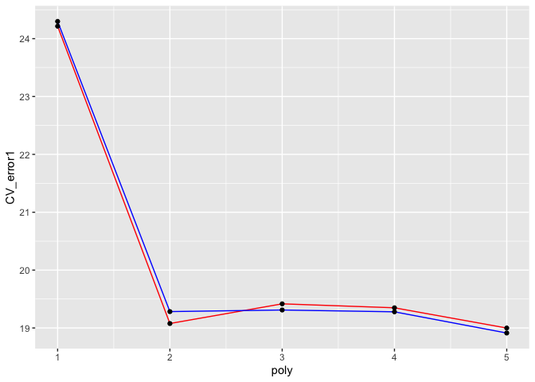

Resampling: cross-validation
================
Wenjun Jiang
January 25th, 2023

-   [In-class exercise questions](#in-class-exercise-questions-1)

``` r
knitr::opts_chunk$set(fig.path='Figs/')
```

### Cross-validation

Cross-validation is an important statistical idea to examine the
appropriateness of a methodology.

:
another name for test set, which is a set used for testing the your
fitted model.

:
a set used to fit your model.

:
In practice, if only partition the dataset into two parts and you fit
the model using one part and test your fitted model using another part,
your results may heavily depend on the partition. By chance, you may end
up with good training set so your fitted model works very well on your
test set. However, this does not tell you the whole story of your model.

:
In practice, the cross-validation can be used to do model selection. You
always choose the model which yields the lowest test error.

In this in-class example, we take a look at “Auto” dataset
(<http://finzi.psych.upenn.edu/library/ISLR/html/Auto.html>). It has 9
variables:

``` r
library(ISLR)
library(ggplot2)
```

``` r
data(Auto)
names(Auto)
```

    ## [1] "mpg"          "cylinders"    "displacement" "horsepower"   "weight"      
    ## [6] "acceleration" "year"         "origin"       "name"

``` r
dim(Auto)
```

    ## [1] 392   9

![\\\\\[0.2in\]](https://latex.codecogs.com/png.image?%5Cdpi%7B110%7D&space;%5Cbg_white&space;%5C%5C%5B0.2in%5D "\\[0.2in]")

#### Validation approach

We begin with the simplest validation approach. We first need to split
the dataset into two parts. For that purpose, we select 196 units into
the training part and the rest units into the validation set.

``` r
set.seed(1)
idx=sample(dim(Auto)[1],196)
Train=Auto[idx,]
Test=Auto[-idx,]
```

Suppose we are interested in the relationship between the variables

and

and we want to use the linear regression.


``` r
lm.fit<-lm(mpg~horsepower, data = Train)
```

Then we compute the mean squared error (MSE) for the test set (for which
the size
).

^2}{n}
")

``` r
mpg.predict<-predict(lm.fit, Test)
mean((Test$mpg-mpg.predict)^2)
```

    ## [1] 23.26601

Now we are interested in polynomial regression, such as quadratic and
cubic regression.


``` r
# quadratic
# here we use the function "poly" to control the degree of polynomial function
lm.fit2<-lm(mpg~poly(horsepower,2),data = Train)
mpg.predict2<-predict(lm.fit2, Test)
mean((Test$mpg-mpg.predict2)^2)
```

    ## [1] 18.71646

``` r
# cubic
lm.fit3<-lm(mpg~poly(horsepower,3),data = Train)
mpg.predict3<-predict(lm.fit3, Test)
mean((Test$mpg-mpg.predict3)^2)
```

    ## [1] 18.79401

If we only compare the linear, quadratic and cubic regression results
based on the validation approach, the quadratic regression gives us the
best fit. However, is it true?

![\\\\\[0.2in\]](https://latex.codecogs.com/png.image?%5Cdpi%7B110%7D&space;%5Cbg_white&space;%5C%5C%5B0.2in%5D "\\[0.2in]")

#### Leave-one-out cross-validation (LOOCV)

Leave-one-out cross-validation is a simple testing idea. Each time you
just choose one unit from the original dataset into the test set (in
other words, the size of the test set is 1) and use the other data to
fit your model. Then you apply your fitted model to your chosen unit and
check the squared error.

As you have in total

possible ways of choosing the unit
(
is the size of your dataset). You will end up with

possible squared errors. The average of these errors is the mean squared
error for LOOCV.

``` r
library(boot)
```

To use LOOCV, we need to use “cv.glm” function from the package “boot”.
Before that, we first need to note that the use of “glm” function is as
same as “lm” function if no family is specified.

``` r
glm.fit<-glm(mpg~horsepower, data = Auto)
coef(glm.fit)
```

    ## (Intercept)  horsepower 
    ##  39.9358610  -0.1578447

``` r
lm.fit<-lm(mpg~horsepower, data = Auto)
coef(lm.fit)
```

    ## (Intercept)  horsepower 
    ##  39.9358610  -0.1578447

Now we want to check the MSE by using LOOCV

``` r
cv.error=cv.glm(Auto, glm.fit)
cv.error$delta[1]
```

    ## [1] 24.23151

``` r
# LOOCV 
cv_error<-rep(0,5)
for (i in 1:5) {
  glm.fit<-glm(mpg~poly(horsepower,i),data = Auto)
  cv_error[i]=cv.glm(Auto, glm.fit)$delta[1]
}
cv_result<-data.frame(cv_error, poly=seq(1,5,by=1))
ggplot()+geom_line(data = cv_result, aes(poly, cv_error), colour='red')+geom_point(data = cv_result, aes(poly, cv_error), colour='black')
```

<!-- --> From the LOOCV results, combing with the
interpretability of the model, I would chooise the quadratic regression
model.

![\\\\\[0.2in\]](https://latex.codecogs.com/png.image?%5Cdpi%7B110%7D&space;%5Cbg_white&space;%5C%5C%5B0.2in%5D "\\[0.2in]")

#### -fold cross-validation

In k-fold cross-validation, you randomly partition the original dataset
into

parts. Each time you use one part for testing purpose and the other
parts for training purpose.

Apparently, if you apply
-fold
cross validation, you should not expect R will always partition the
dataset into k parts in the same way. Below is an example for
.
You will see that with

the MSEs differ a bit.

``` r
# k=10 is the common choice
set.seed(1)
CV_error1<-rep(0,5)
CV_error2<-CV_error1
for(i in 1:5){
  model_fit<-glm(mpg~poly(horsepower,i), data = Auto)
  CV_error1[i]=cv.glm(Auto, model_fit, K=10)$delta[1]
  CV_error2[i]=cv.glm(Auto, model_fit, K=10)$delta[1]
}
CV_result<-data.frame(CV_error1, CV_error2, poly=seq(1,5,by=1))
ggplot()+geom_line(data = CV_result, aes(poly, CV_error1), colour='red')+geom_line(data = CV_result, aes(poly, CV_error2), colour='blue')+geom_point(data = CV_result, aes(poly, CV_error1), colour='black')+geom_point(data = CV_result, aes(poly, CV_error2), colour='black')
```

<!-- -->

The result presented above is consistent with the LOOCV result.

![\\\\\[0.2in\]](https://latex.codecogs.com/png.image?%5Cdpi%7B110%7D&space;%5Cbg_white&space;%5C%5C%5B0.2in%5D "\\[0.2in]")

#### Apply “caret” pakcage

Using “train” function from the package “caret” can do the same thing.
Here are some examples.

``` r
library(caret)
```

    ## Загрузка требуемого пакета: lattice

    ## 
    ## Присоединяю пакет: 'lattice'

    ## Следующий объект скрыт от 'package:boot':
    ## 
    ##     melanoma

``` r
set.seed(1)
model_fit1<-train(mpg~poly(horsepower,1), data=Auto, trControl = trainControl(method = "LOOCV"), method='glm')
model_fit2<-train(mpg~poly(horsepower,2), data=Auto, trControl = trainControl(method = "LOOCV"), method='glm')
model_fit3<-train(mpg~poly(horsepower,3), data=Auto, trControl = trainControl(method = "LOOCV"), method='glm')
```

``` r
print(c(model_fit1$results[2],model_fit2$results[2],model_fit3$results[2]))
```

    ## $RMSE
    ## [1] 4.922552
    ## 
    ## $RMSE
    ## [1] 4.387279
    ## 
    ## $RMSE
    ## [1] 4.397156

``` r
set.seed(1)
model_fit1<-train(mpg~poly(horsepower,1), data=Auto, trControl = trainControl(method = "cv", number=10), method='glm')
model_fit2<-train(mpg~poly(horsepower,2), data=Auto, trControl = trainControl(method = "cv", number=10), method='glm')
model_fit3<-train(mpg~poly(horsepower,3), data=Auto, trControl = trainControl(method = "cv", number=10), method='glm')
```

``` r
print(c(model_fit1$results[2],model_fit2$results[2],model_fit3$results[2]))
```

    ## $RMSE
    ## [1] 4.892631
    ## 
    ## $RMSE
    ## [1] 4.362381
    ## 
    ## $RMSE
    ## [1] 4.346257

This example is for linear regression, check the package manual:
<https://cran.r-project.org/web/packages/caret/caret.pdf> for more
details about the syntax for other statistical learning purpose.

![\\\\\[0.2in\]](https://latex.codecogs.com/png.image?%5Cdpi%7B110%7D&space;%5Cbg_white&space;%5C%5C%5B0.2in%5D "\\[0.2in]")

### In-class exercise questions

For the dataset “Smarket”, suppose you are interested in the prediction
of the market movement (“Up” or “Down”) and want to select the best
combination of the explanatory variables from the following
possibilities:

1.  “Lag1”

2.  “Lag1”+“Lag2”

3.  “Lag1”+“Lag2”+“Lag3”

.
Please apply “LOOCV” to select the best combination and examine your
result using “10-fold cross-validation”.

.
Please compare the performance of two methodoligies: logistic regression
v.s. linear discriminant analysis, when using “Lag1” as the explanatory
variable based on either “LOOCV” or “10-fold cross-validation”.

![\\\\\[0.2in\]](https://latex.codecogs.com/png.image?%5Cdpi%7B110%7D&space;%5Cbg_white&space;%5C%5C%5B0.2in%5D "\\[0.2in]")

### An example of stratified -fold cross-validation

Here I show an example of stratified
-fold
cross-validation.

``` r
library(datasets)
```

``` r
data(iris)
names(iris)
```

    ## [1] "Sepal.Length" "Sepal.Width"  "Petal.Length" "Petal.Width"  "Species"

``` r
dim(iris)
```

    ## [1] 150   5

``` r
table(iris$Species)
```

    ## 
    ##     setosa versicolor  virginica 
    ##         50         50         50

``` r
library(caret)
```

To perform stratified partition, we use function “createFolds” from the
package “caret”.

``` r
folds<-createFolds(factor(iris$Species), k=5)
```

Check the units in each folder.

``` r
folds
```

    ## $Fold1
    ##  [1]   1   8   9  11  19  24  26  38  40  49  51  65  66  78  81  83  85  88  92
    ## [20]  96 103 107 110 113 118 121 138 144 145 148
    ## 
    ## $Fold2
    ##  [1]   3  12  13  25  30  33  36  39  41  43  57  58  63  67  73  74  87  89  90
    ## [20]  93 105 108 117 119 125 132 133 136 140 149
    ## 
    ## $Fold3
    ##  [1]   2   4   5   6  21  28  37  44  45  48  53  55  59  60  72  77  79  86  95
    ## [20]  97 101 106 111 124 126 129 135 141 146 150
    ## 
    ## $Fold4
    ##  [1]  10  14  17  18  20  29  32  34  46  50  52  54  61  64  76  80  82  84  94
    ## [20] 100 102 104 112 120 122 131 134 139 142 143
    ## 
    ## $Fold5
    ##  [1]   7  15  16  22  23  27  31  35  42  47  56  62  68  69  70  71  75  91  98
    ## [20]  99 109 114 115 116 123 127 128 130 137 147

You can check the number of species in each fold.

``` r
fold1<-iris[folds$Fold1,]
table(fold1$Species)
```

    ## 
    ##     setosa versicolor  virginica 
    ##         10         10         10

``` r
fold5<-iris[folds$Fold5,]
table(fold5$Species)
```

    ## 
    ##     setosa versicolor  virginica 
    ##         10         10         10

Here I wrote a function to calculate the misclassification rate.

``` r
library(MASS)

misclassification<-function(idx){
  Train<-iris[-idx,]
  Test<-iris[idx,]
  fit<-lda(Species~Petal.Length+Petal.Width, data=Train)
  pred<-predict(fit,Test)
  return(1-mean(pred$class==Test$Species))
}
```

Next, apply the function “lapply” to pass along a vector of indices to
the function “misclassification”.

``` r
mis_rate=lapply(folds,misclassification)
mis_rate
```

    ## $Fold1
    ## [1] 0.06666667
    ## 
    ## $Fold2
    ## [1] 0
    ## 
    ## $Fold3
    ## [1] 0.03333333
    ## 
    ## $Fold4
    ## [1] 0.06666667
    ## 
    ## $Fold5
    ## [1] 0.03333333

Calculate the average misclassification error.

``` r
mean(as.numeric(mis_rate))
```

    ## [1] 0.04

## In-class exercise questions

``` r
# Explanatory variables: 1. Lag1 2. Lag1+Lag2 3. Lag1+Lag2+Lag3
# Apply LOOCV to select the best combination of the explanatory variables
# Examine the result with 10-fold-cross-calidation
# Compare the performance of logistic regression v.s. linear discriminant analysis
```
